# 服务调用协议

<cite>
**本文引用的文件**
- [main.py](file://img_slicer_tool/main.py)
- [application.py](file://img_slicer_tool/app/application.py)
- [main_window.py](file://img_slicer_tool/app/main_window.py)
- [image_view.py](file://img_slicer_tool/views/image_view.py)
- [slice_side_panel.py](file://img_slicer_tool/views/slice_side_panel.py)
- [overlay_items.py](file://img_slicer_tool/views/overlay_items.py)
- [image_document.py](file://img_slicer_tool/models/image_document.py)
- [slice_layout.py](file://img_slicer_tool/models/slice_layout.py)
- [image_loader.py](file://img_slicer_tool/services/image_loader.py)
- [crop_service.py](file://img_slicer_tool/services/crop_service.py)
- [slice_service.py](file://img_slicer_tool/services/slice_service.py)
- [image_math.py](file://img_slicer_tool/utils/image_math.py)
</cite>

## 目录
1. [引言](#引言)
2. [项目结构](#项目结构)
3. [核心组件](#核心组件)
4. [架构总览](#架构总览)
5. [详细组件分析](#详细组件分析)
6. [依赖关系分析](#依赖关系分析)
7. [性能考量](#性能考量)
8. [故障排查指南](#故障排查指南)
9. [结论](#结论)
10. [附录](#附录)

## 引言
本文件聚焦于 MainWindow 对核心服务模块的调用协议，系统性梳理以下关键流程：
- _on_crop_requested 槽函数如何调用 crop_document_to_new_image 执行图像裁剪，并处理“覆盖原图”与“另存为”的不同路径；
- _on_execute_slice 方法如何通过 slice_document_to_tiles 执行批量切图，包括 SliceLayout 的生成与传递；
- 服务调用过程中的异常处理机制（try-except）与用户反馈（QMessageBox）的集成；
- 服务层与 UI 层之间的依赖注入模式；
- load_image_document 在图像加载时的服务调用链。

同时，提供服务调用时序图，展示从 UI 事件到服务执行再到结果回显的完整流程。

## 项目结构
项目采用分层组织：应用入口、主窗口 UI、视图层、模型层、服务层与工具层。UI 通过信号与槽连接，服务层负责业务逻辑与数据持久化，工具层提供坐标换算等数学能力。

图表来源
- [main.py](file://img_slicer_tool/main.py#L1-L13)
- [application.py](file://img_slicer_tool/app/application.py#L1-L35)
- [main_window.py](file://img_slicer_tool/app/main_window.py#L1-L364)
- [image_view.py](file://img_slicer_tool/views/image_view.py#L1-L542)
- [slice_side_panel.py](file://img_slicer_tool/views/slice_side_panel.py#L1-L174)
- [overlay_items.py](file://img_slicer_tool/views/overlay_items.py#L1-L64)
- [image_document.py](file://img_slicer_tool/models/image_document.py#L1-L18)
- [slice_layout.py](file://img_slicer_tool/models/slice_layout.py#L1-L30)
- [image_loader.py](file://img_slicer_tool/services/image_loader.py#L1-L68)
- [crop_service.py](file://img_slicer_tool/services/crop_service.py#L1-L38)
- [slice_service.py](file://img_slicer_tool/services/slice_service.py#L1-L62)
- [image_math.py](file://img_slicer_tool/utils/image_math.py#L1-L76)

章节来源
- [main.py](file://img_slicer_tool/main.py#L1-L13)
- [application.py](file://img_slicer_tool/app/application.py#L1-L35)
- [main_window.py](file://img_slicer_tool/app/main_window.py#L1-L120)

## 核心组件
- MainWindow：UI 控制器，负责菜单、动作、状态栏、消息框与服务调用；通过信号连接 ImageView 与 SliceSidePanel。
- ImageView：图形视图，负责拖拽、裁剪矩形绘制、切图线管理、坐标换算与信号发射。
- SliceSidePanel：切图侧栏，提供切图方式切换、网格行列设置、工具选择与执行按钮。
- ImageDocument：图像文档数据载体，包含原图尺寸、预览尺寸、缩放比例与预览 QPixmap。
- SliceLayout：切图布局，保存预览坐标系下的水平/垂直切线集合，并提供边界生成与归一化。
- 服务层：
  - image_loader：加载图像为 ImageDocument，计算预览尺寸与缩放比。
  - crop_service：根据预览矩形裁剪并保存新图，返回新的 ImageDocument。
  - slice_service：根据 SliceLayout 生成切片并保存到输出目录。
- 工具层：
  - image_math：预览坐标与原图坐标的双向映射，确保裁剪与切图边界正确。

章节来源
- [main_window.py](file://img_slicer_tool/app/main_window.py#L1-L364)
- [image_view.py](file://img_slicer_tool/views/image_view.py#L1-L542)
- [slice_side_panel.py](file://img_slicer_tool/views/slice_side_panel.py#L1-L174)
- [image_document.py](file://img_slicer_tool/models/image_document.py#L1-L18)
- [slice_layout.py](file://img_slicer_tool/models/slice_layout.py#L1-L30)
- [image_loader.py](file://img_slicer_tool/services/image_loader.py#L1-L68)
- [crop_service.py](file://img_slicer_tool/services/crop_service.py#L1-L38)
- [slice_service.py](file://img_slicer_tool/services/slice_service.py#L1-L62)
- [image_math.py](file://img_slicer_tool/utils/image_math.py#L1-L76)

## 架构总览
UI 通过信号与服务层解耦，服务层只依赖模型与工具层，避免 UI 细节渗透到业务逻辑。MainWindow 作为门面，协调 UI 与服务层交互，并统一处理异常与用户反馈。

图表来源
- [main_window.py](file://img_slicer_tool/app/main_window.py#L80-L120)
- [image_view.py](file://img_slicer_tool/views/image_view.py#L24-L60)
- [slice_side_panel.py](file://img_slicer_tool/views/slice_side_panel.py#L1-L60)
- [image_loader.py](file://img_slicer_tool/services/image_loader.py#L24-L55)
- [crop_service.py](file://img_slicer_tool/services/crop_service.py#L13-L38)
- [slice_service.py](file://img_slicer_tool/services/slice_service.py#L12-L62)
- [image_math.py](file://img_slicer_tool/utils/image_math.py#L17-L76)
- [image_document.py](file://img_slicer_tool/models/image_document.py#L8-L18)
- [slice_layout.py](file://img_slicer_tool/models/slice_layout.py#L7-L30)
- [overlay_items.py](file://img_slicer_tool/views/overlay_items.py#L1-L64)

## 详细组件分析

### 裁剪服务调用协议（_on_crop_requested）
- 触发路径：用户在 ImageView 中拖拽选择裁剪区域，释放鼠标时触发 cropRequested 信号，MainWindow 接收并进入 _on_crop_requested。
- 用户决策：
  - 弹出 QMessageBox 提示是否覆盖原图或另存为；
  - 若选择“覆盖原图”，目标路径为当前文档路径；
  - 若选择“另存为...”，弹出文件对话框选择保存路径。
- 服务调用：
  - 调用 crop_document_to_new_image(doc, preview_rect, target_path)，内部将预览矩形映射到原图坐标，读取原图并裁剪，保存到目标路径，再重新加载为目标文档。
- 结果回显：
  - 更新 MainWindow 当前文档与 ImageView 文档；
  - 状态栏显示新文档尺寸信息。

图表来源
- [main_window.py](file://img_slicer_tool/app/main_window.py#L136-L193)
- [crop_service.py](file://img_slicer_tool/services/crop_service.py#L13-L38)
- [image_math.py](file://img_slicer_tool/utils/image_math.py#L17-L48)
- [image_loader.py](file://img_slicer_tool/services/image_loader.py#L24-L55)

章节来源
- [main_window.py](file://img_slicer_tool/app/main_window.py#L136-L193)
- [crop_service.py](file://img_slicer_tool/services/crop_service.py#L13-L38)
- [image_math.py](file://img_slicer_tool/utils/image_math.py#L17-L48)
- [image_loader.py](file://img_slicer_tool/services/image_loader.py#L24-L55)

### 批量切图服务调用协议（_on_execute_slice）
- 触发路径：用户在切图模式下配置切图线或网格，点击“执行切图”或侧栏触发 executeRequested。
- 布局生成：
  - MainWindow 从 ImageView 获取 SliceLayout（内部遍历 cutLines 并归一化）。
  - 计算切片数量（基于布局边界与预览图尺寸）。
- 用户确认：
  - 若无切图线，询问是否导出整张图为单一切片。
- 服务调用：
  - 调用 slice_document_to_tiles(doc, layout, output_root)。
  - 服务内部将预览切线映射到原图边界，逐块裁剪并保存，返回输出目录。
- 结果回显：
  - 弹出结果对话框，显示切片数量与输出目录；
  - 可直接打开输出文件夹。

图表来源
- [main_window.py](file://img_slicer_tool/app/main_window.py#L230-L262)
- [image_view.py](file://img_slicer_tool/views/image_view.py#L236-L254)
- [slice_service.py](file://img_slicer_tool/services/slice_service.py#L12-L62)
- [image_math.py](file://img_slicer_tool/utils/image_math.py#L50-L76)

章节来源
- [main_window.py](file://img_slicer_tool/app/main_window.py#L230-L262)
- [image_view.py](file://img_slicer_tool/views/image_view.py#L236-L254)
- [slice_service.py](file://img_slicer_tool/services/slice_service.py#L12-L62)
- [image_math.py](file://img_slicer_tool/utils/image_math.py#L50-L76)

### 依赖注入与调用链（图像加载）
- MainWindow.load_image 调用服务 image_loader.load_image_document，将本地文件加载为 ImageDocument；
- 成功后设置 ImageView 文档并更新状态栏；
- 失败时捕获异常并通过 QMessageBox 提示。

图表来源
- [main_window.py](file://img_slicer_tool/app/main_window.py#L114-L135)
- [image_loader.py](file://img_slicer_tool/services/image_loader.py#L24-L55)

章节来源
- [main_window.py](file://img_slicer_tool/app/main_window.py#L114-L135)
- [image_loader.py](file://img_slicer_tool/services/image_loader.py#L24-L55)

### SliceLayout 数据结构与边界生成
- SliceLayout 保存水平/垂直切线列表，normalize 过滤无效值并排序，get_boundaries 返回含边界的坐标列表（包含 0 与宽/高）。
- 该结构在切图服务中被用于生成原图边界坐标。

图表来源
- [slice_layout.py](file://img_slicer_tool/models/slice_layout.py#L7-L30)

章节来源
- [slice_layout.py](file://img_slicer_tool/models/slice_layout.py#L7-L30)

### 坐标映射算法（预览坐标 ↔ 原图坐标）
- 预览矩形到原图 box：将预览坐标乘以 scale_x/scale_y 并四舍五入，约束到原图范围，确保有效裁剪区域。
- 预览线到原图边界：对 xs/ys 分别乘以 scale 并约束到原图范围，去重排序，至少需要两个边界才能形成有效宫格。

图表来源
- [image_math.py](file://img_slicer_tool/utils/image_math.py#L17-L48)

章节来源
- [image_math.py](file://img_slicer_tool/utils/image_math.py#L17-L48)

## 依赖关系分析
- UI 层依赖模型层与视图覆盖项，但不直接依赖服务层；
- 服务层仅依赖模型与工具层，保持纯业务逻辑；
- MainWindow 作为门面，集中处理异常与用户反馈，避免 UI 细节渗透到服务层。

```mermaid
graph LR
MW["MainWindow"] --> IV["ImageView"]
MW --> SP["SliceSidePanel"]
IV --> OI["OverlayItems"]
MW --> ID["ImageDocument"]
IV --> SL["SliceLayout"]
MW --> IL["image_loader"]
MW --> CS["crop_service"]
MW --> SS["slice_service"]
SS --> IM["image_math"]
CS --> IM
IL --> ID
```

图表来源
- [main_window.py](file://img_slicer_tool/app/main_window.py#L1-L120)
- [image_view.py](file://img_slicer_tool/views/image_view.py#L1-L120)
- [slice_side_panel.py](file://img_slicer_tool/views/slice_side_panel.py#L1-L60)
- [overlay_items.py](file://img_slicer_tool/views/overlay_items.py#L1-L64)
- [image_document.py](file://img_slicer_tool/models/image_document.py#L1-L18)
- [slice_layout.py](file://img_slicer_tool/models/slice_layout.py#L1-L30)
- [image_loader.py](file://img_slicer_tool/services/image_loader.py#L1-L68)
- [crop_service.py](file://img_slicer_tool/services/crop_service.py#L1-L38)
- [slice_service.py](file://img_slicer_tool/services/slice_service.py#L1-L62)
- [image_math.py](file://img_slicer_tool/utils/image_math.py#L1-L76)

章节来源
- [main_window.py](file://img_slicer_tool/app/main_window.py#L1-L120)
- [image_view.py](file://img_slicer_tool/views/image_view.py#L1-L120)
- [slice_side_panel.py](file://img_slicer_tool/views/slice_side_panel.py#L1-L60)
- [image_loader.py](file://img_slicer_tool/services/image_loader.py#L1-L68)
- [crop_service.py](file://img_slicer_tool/services/crop_service.py#L1-L38)
- [slice_service.py](file://img_slicer_tool/services/slice_service.py#L1-L62)
- [image_math.py](file://img_slicer_tool/utils/image_math.py#L1-L76)

## 性能考量
- 预览尺寸控制：image_loader 使用最大预览尺寸阈值，避免超大图导致内存压力与渲染卡顿。
- 裁剪与切图：服务层使用 PIL 直接读取与保存，JPEG 采用高质量参数，保证输出质量；切图循环按边界顺序生成，避免重复计算。
- UI 交互：ImageView 仅在需要时重建网格线，减少场景项数量；裁剪矩形与切线高亮通过 QGraphicsItem 实现，避免频繁重绘。

章节来源
- [image_loader.py](file://img_slicer_tool/services/image_loader.py#L11-L22)
- [image_loader.py](file://img_slicer_tool/services/image_loader.py#L24-L55)
- [slice_service.py](file://img_slicer_tool/services/slice_service.py#L33-L61)
- [image_view.py](file://img_slicer_tool/views/image_view.py#L441-L466)

## 故障排查指南
- 加载失败：MainWindow.load_image 捕获异常并通过 QMessageBox 提示具体错误信息。
- 裁剪失败：_on_crop_requested 捕获服务异常并提示，常见原因包括路径不存在、权限不足或文件损坏。
- 切图失败：_on_execute_slice 捕获服务异常并提示，常见原因包括输出目录不可写、布局无效或原图不存在。
- 坐标映射错误：若出现裁剪区域过小或无效，检查预览与原图缩放比是否一致，以及 UI 选择区域是否超出预览范围。

章节来源
- [main_window.py](file://img_slicer_tool/app/main_window.py#L114-L135)
- [main_window.py](file://img_slicer_tool/app/main_window.py#L136-L193)
- [main_window.py](file://img_slicer_tool/app/main_window.py#L230-L262)
- [image_math.py](file://img_slicer_tool/utils/image_math.py#L17-L48)
- [slice_service.py](file://img_slicer_tool/services/slice_service.py#L12-L24)

## 结论
本项目通过清晰的分层与信号驱动，实现了 UI 与服务层的松耦合。MainWindow 作为门面承担了用户交互、异常处理与结果回显职责，服务层专注于业务逻辑与数据持久化。SliceLayout 与 image_math 提供了可靠的坐标映射能力，保障裁剪与切图的准确性。建议在后续迭代中进一步细化日志记录与进度反馈，提升复杂任务的可观测性。

## 附录
- 关键调用路径参考：
  - 裁剪：MainWindow._on_crop_requested → crop_document_to_new_image → image_math.preview_rect_to_original_box → image_loader.load_image_document
  - 切图：MainWindow._on_execute_slice → ImageView.get_slice_layout → slice_document_to_tiles → image_math.preview_lines_to_original_boundaries
- 入口程序：main.py → application.ImageApp → MainWindow.show

章节来源
- [main.py](file://img_slicer_tool/main.py#L1-L13)
- [application.py](file://img_slicer_tool/app/application.py#L12-L35)
- [main_window.py](file://img_slicer_tool/app/main_window.py#L80-L120)
- [image_view.py](file://img_slicer_tool/views/image_view.py#L236-L254)
- [crop_service.py](file://img_slicer_tool/services/crop_service.py#L13-L38)
- [slice_service.py](file://img_slicer_tool/services/slice_service.py#L12-L62)
- [image_math.py](file://img_slicer_tool/utils/image_math.py#L17-L76)
- [image_loader.py](file://img_slicer_tool/services/image_loader.py#L24-L55)