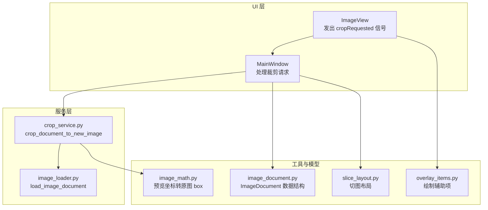
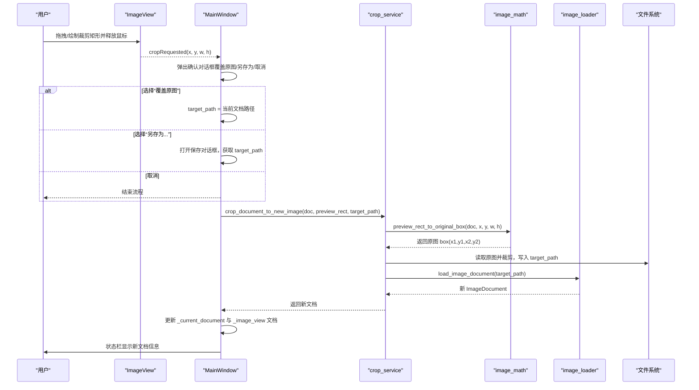
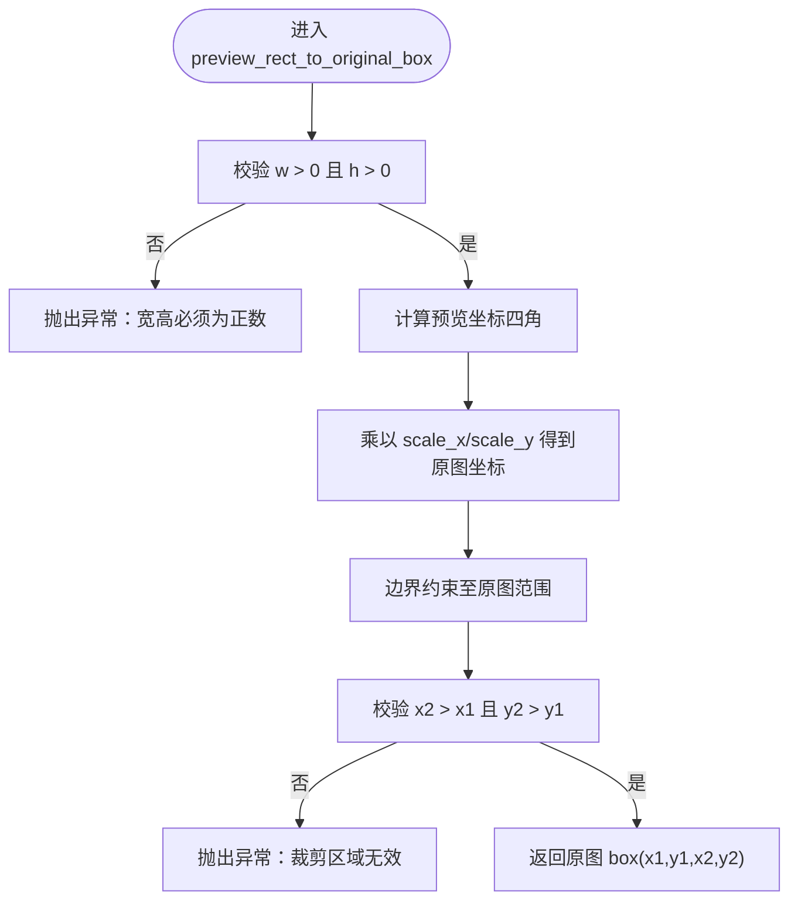
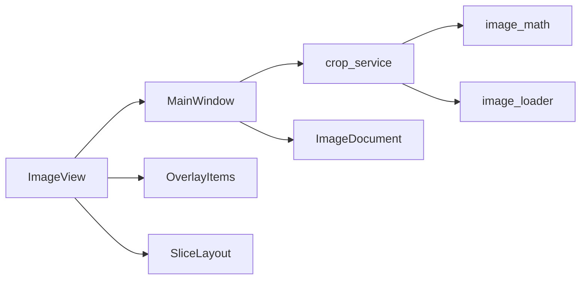

# 裁剪服务调用

<cite>
**本文引用的文件**
- [main_window.py](file://img_slicer_tool/app/main_window.py)
- [image_view.py](file://img_slicer_tool/views/image_view.py)
- [crop_service.py](file://img_slicer_tool/services/crop_service.py)
- [image_math.py](file://img_slicer_tool/utils/image_math.py)
- [image_loader.py](file://img_slicer_tool/services/image_loader.py)
- [image_document.py](file://img_slicer_tool/models/image_document.py)
- [slice_layout.py](file://img_slicer_tool/models/slice_layout.py)
- [overlay_items.py](file://img_slicer_tool/views/overlay_items.py)
</cite>

## 目录
1. [简介](#简介)
2. [项目结构](#项目结构)
3. [核心组件](#核心组件)
4. [架构总览](#架构总览)
5. [详细组件分析](#详细组件分析)
6. [依赖关系分析](#依赖关系分析)
7. [性能考量](#性能考量)
8. [故障排查指南](#故障排查指南)
9. [结论](#结论)

## 简介
本文件围绕 MainWindow 中的 _on_crop_requested 方法，系统性解析从 ImageView 发出 cropRequested 信号，到主窗口弹出“覆盖原图/另存为”选择对话框，再到调用裁剪服务执行具体操作的完整流程。重点包括：
- 预览坐标到原图坐标的转换机制
- target_path 的确定策略
- 服务调用失败时的异常捕获与用户提示
- 裁剪完成后新文档如何更新视图与状态栏信息

## 项目结构
本项目采用分层组织：UI 层（views）、业务逻辑层（services）、数据模型（models）、工具函数（utils），以及应用入口（app）。裁剪流程横跨 UI 与服务层，通过信号与槽连接实现解耦。

图表来源
- [main_window.py](file://img_slicer_tool/app/main_window.py#L87-L101)
- [image_view.py](file://img_slicer_tool/views/image_view.py#L24-L31)
- [crop_service.py](file://img_slicer_tool/services/crop_service.py#L13-L38)
- [image_math.py](file://img_slicer_tool/utils/image_math.py#L17-L48)
- [image_loader.py](file://img_slicer_tool/services/image_loader.py#L24-L55)
- [image_document.py](file://img_slicer_tool/models/image_document.py#L8-L18)
- [slice_layout.py](file://img_slicer_tool/models/slice_layout.py#L7-L30)
- [overlay_items.py](file://img_slicer_tool/views/overlay_items.py#L8-L26)

章节来源
- [main_window.py](file://img_slicer_tool/app/main_window.py#L87-L101)
- [image_view.py](file://img_slicer_tool/views/image_view.py#L24-L31)

## 核心组件
- MainWindow：负责接收裁剪请求、弹窗确认、决定目标路径、调用裁剪服务、更新当前文档与视图、刷新状态栏。
- ImageView：在裁剪模式下绘制可交互的裁剪矩形，鼠标释放时发出 cropRequested(x, y, w, h) 信号。
- crop_service：将预览坐标转换为原图 box，读取原图进行裁剪并保存到目标路径，再重新加载新文档。
- image_math：提供预览坐标到原图坐标的映射函数。
- image_loader：负责加载图片并构建 ImageDocument（包含缩放比例 scale_x/scale_y）。
- ImageDocument：承载原图尺寸、预览尺寸、缩放比例与预览 QPixmap。
- OverlayItems：用于在场景中绘制裁剪矩形与切图线等辅助图形。

章节来源
- [main_window.py](file://img_slicer_tool/app/main_window.py#L136-L193)
- [image_view.py](file://img_slicer_tool/views/image_view.py#L154-L235)
- [crop_service.py](file://img_slicer_tool/services/crop_service.py#L13-L38)
- [image_math.py](file://img_slicer_tool/utils/image_math.py#L17-L48)
- [image_loader.py](file://img_slicer_tool/services/image_loader.py#L24-L55)
- [image_document.py](file://img_slicer_tool/models/image_document.py#L8-L18)
- [overlay_items.py](file://img_slicer_tool/views/overlay_items.py#L8-L26)

## 架构总览
以下序列图展示了从 UI 触发到服务执行再到 UI 更新的端到端流程。

图表来源
- [image_view.py](file://img_slicer_tool/views/image_view.py#L223-L231)
- [main_window.py](file://img_slicer_tool/app/main_window.py#L136-L193)
- [crop_service.py](file://img_slicer_tool/services/crop_service.py#L13-L38)
- [image_math.py](file://img_slicer_tool/utils/image_math.py#L17-L48)
- [image_loader.py](file://img_slicer_tool/services/image_loader.py#L24-L55)

## 详细组件分析

### 1) ImageView 裁剪交互与信号发射
- 在裁剪模式下，鼠标按下记录起始点并创建临时裁剪矩形；鼠标移动更新矩形大小；鼠标释放时若满足最小尺寸则发射 cropRequested(x, y, w, h)。
- 该信号被 MainWindow 的 _connect_signals 绑定到 _on_crop_requested，形成 UI 层与主窗口控制层的交互边界。

章节来源
- [image_view.py](file://img_slicer_tool/views/image_view.py#L154-L235)
- [image_view.py](file://img_slicer_tool/views/image_view.py#L24-L31)
- [main_window.py](file://img_slicer_tool/app/main_window.py#L87-L101)

### 2) MainWindow 接收裁剪请求与路径决策
- _on_crop_requested 接收预览坐标参数，先检查是否存在当前文档，再弹出确认对话框，提供“覆盖原图/另存为/取消”三个选项。
- 路径选择逻辑：
  - 覆盖原图：target_path = 当前文档路径
  - 另存为：通过文件对话框获取目标路径，若未选择则终止
  - 取消：直接返回
- 该方法作为 UI 与服务层的协调者，负责用户交互与参数准备。

章节来源
- [main_window.py](file://img_slicer_tool/app/main_window.py#L136-L193)

### 3) crop_document_to_new_image 服务执行
- 输入：ImageDocument、预览矩形(x, y, w, h)、目标路径 target_path
- 关键步骤：
  - 校验原图路径存在性
  - 调用 preview_rect_to_original_box 将预览坐标转换为原图 box
  - 使用 PIL 打开原图，裁剪并保存到 target_path（针对 JPEG 设置质量参数）
  - 重新加载新文件为 ImageDocument 并返回
- 异常捕获：MainWindow 在调用处以通用异常捕获并提示错误，确保 UI 不崩溃。

章节来源
- [crop_service.py](file://img_slicer_tool/services/crop_service.py#L13-L38)
- [image_math.py](file://img_slicer_tool/utils/image_math.py#L17-L48)

### 4) 预览坐标到原图坐标的转换
- 转换依据：ImageDocument 中的 scale_x 与 scale_y，分别表示原图宽度/高度与预览宽度/高度的比例。
- 转换流程：
  - 将预览矩形的四个角点乘以 scale_x/scale_y 得到原图坐标
  - 对结果进行边界约束，确保落在原图范围内
  - 校验 x2 > x1 且 y2 > y1，否则抛出异常
- 该函数是裁剪准确性的关键保障。

图表来源
- [image_math.py](file://img_slicer_tool/utils/image_math.py#L17-L48)
- [image_loader.py](file://img_slicer_tool/services/image_loader.py#L42-L53)
- [image_document.py](file://img_slicer_tool/models/image_document.py#L8-L18)

### 5) 服务调用失败的异常捕获与用户提示
- MainWindow 在调用 crop_document_to_new_image 处使用 try/except 捕获异常，并弹出错误对话框提示用户。
- 这保证了 UI 的健壮性，避免因底层异常导致程序中断。

章节来源
- [main_window.py](file://img_slicer_tool/app/main_window.py#L177-L181)
- [crop_service.py](file://img_slicer_tool/services/crop_service.py#L20-L21)

### 6) 裁剪后的新文档更新与状态栏提示
- 成功后：MainWindow 将 _current_document 替换为新文档，调用 _image_view.set_document 更新视图，并在状态栏显示新文档的原始尺寸与预览尺寸信息。

章节来源
- [main_window.py](file://img_slicer_tool/app/main_window.py#L183-L192)

## 依赖关系分析
- MainWindow 依赖：
  - ImageView 的 cropRequested 信号
  - crop_service 的 crop_document_to_new_image
  - image_loader 的 load_image_document
  - ImageDocument 的路径与缩放信息
- crop_service 依赖：
  - image_math 的坐标转换
  - image_loader 的文档重建
- ImageView 依赖：
  - OverlayItems 的绘制
  - SliceLayout 的切图布局（在切图模式下）

图表来源
- [main_window.py](file://img_slicer_tool/app/main_window.py#L87-L101)
- [image_view.py](file://img_slicer_tool/views/image_view.py#L24-L31)
- [crop_service.py](file://img_slicer_tool/services/crop_service.py#L13-L38)
- [image_math.py](file://img_slicer_tool/utils/image_math.py#L17-L48)
- [image_loader.py](file://img_slicer_tool/services/image_loader.py#L24-L55)
- [image_document.py](file://img_slicer_tool/models/image_document.py#L8-L18)
- [overlay_items.py](file://img_slicer_tool/views/overlay_items.py#L8-L26)
- [slice_layout.py](file://img_slicer_tool/models/slice_layout.py#L7-L30)

## 性能考量
- 预览尺寸与缩放比：image_loader 在加载时会根据最大预览尺寸计算缩放比，避免在 UI 中加载超大图像，提升交互流畅度。
- 裁剪操作：PIL 裁剪与保存在主线程执行，建议在需要时考虑异步化或后台线程，避免阻塞 UI。
- 文件格式优化：对 JPEG 输出设置了质量与子采样参数，有助于提升保存效率与质量平衡。

章节来源
- [image_loader.py](file://img_slicer_tool/services/image_loader.py#L14-L21)
- [image_loader.py](file://img_slicer_tool/services/image_loader.py#L24-L55)
- [crop_service.py](file://img_slicer_tool/services/crop_service.py#L29-L34)

## 故障排查指南
- 无当前文档：若 _current_document 为空，_on_crop_requested 直接返回，检查是否已加载图片。
- 未选择另存为路径：若用户取消保存对话框，target_path 为空，流程终止，检查文件对话框返回值。
- 坐标转换异常：当预览矩形宽高非正或转换后 box 无效，会抛出异常，检查预览坐标与 scale_x/scale_y 是否合理。
- 原图路径不存在：crop_document_to_new_image 会检测原图路径，若不存在则抛出异常，检查文档路径与文件权限。
- UI 无响应：如裁剪耗时较长，建议将耗时操作移至后台线程，避免阻塞 UI。

章节来源
- [main_window.py](file://img_slicer_tool/app/main_window.py#L136-L193)
- [crop_service.py](file://img_slicer_tool/services/crop_service.py#L20-L21)
- [image_math.py](file://img_slicer_tool/utils/image_math.py#L26-L47)

## 结论
本流程清晰地展示了从 UI 交互到服务执行再到 UI 更新的完整闭环。MainWindow 作为协调者，负责用户交互与参数决策；crop_service 专注于坐标转换与图像裁剪；image_loader 提供文档重建能力。通过合理的异常捕获与状态栏反馈，系统在可用性与稳定性方面表现良好。建议在未来进一步优化耗时操作的异步化与错误日志记录，以提升用户体验与可维护性。