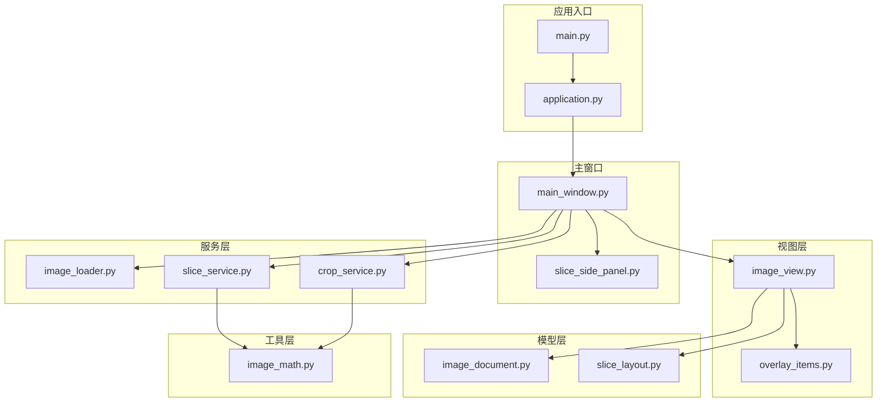
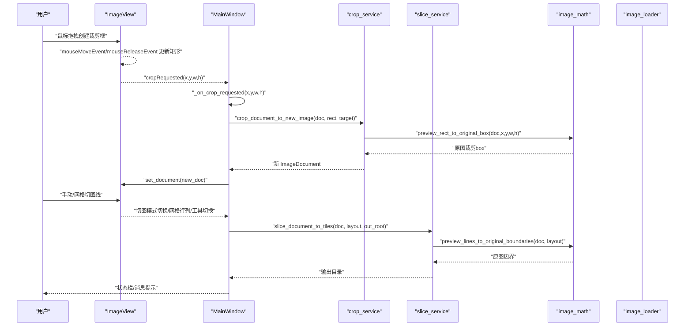
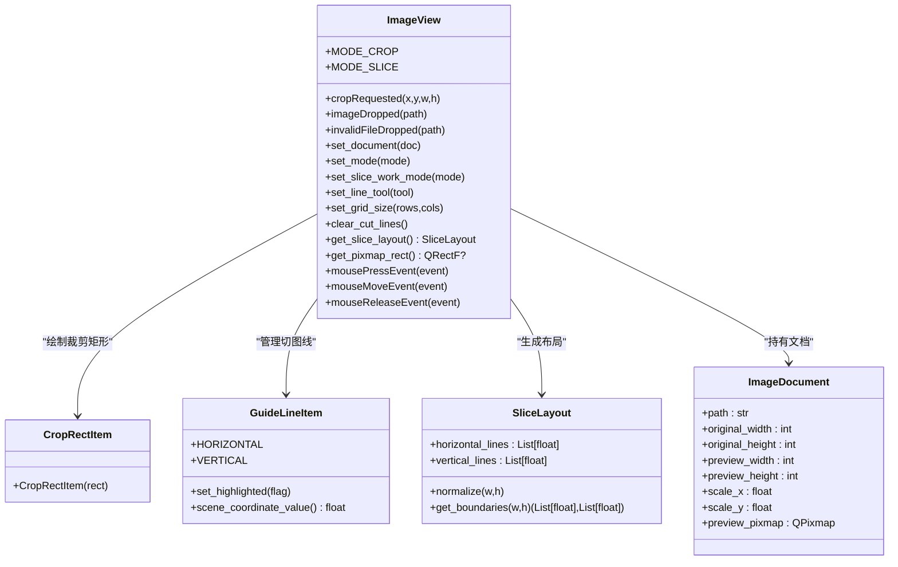
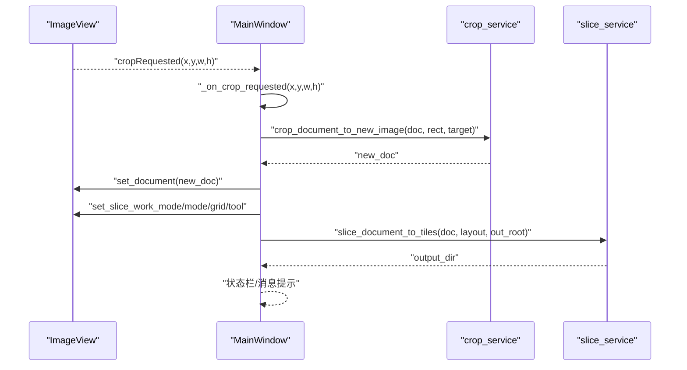
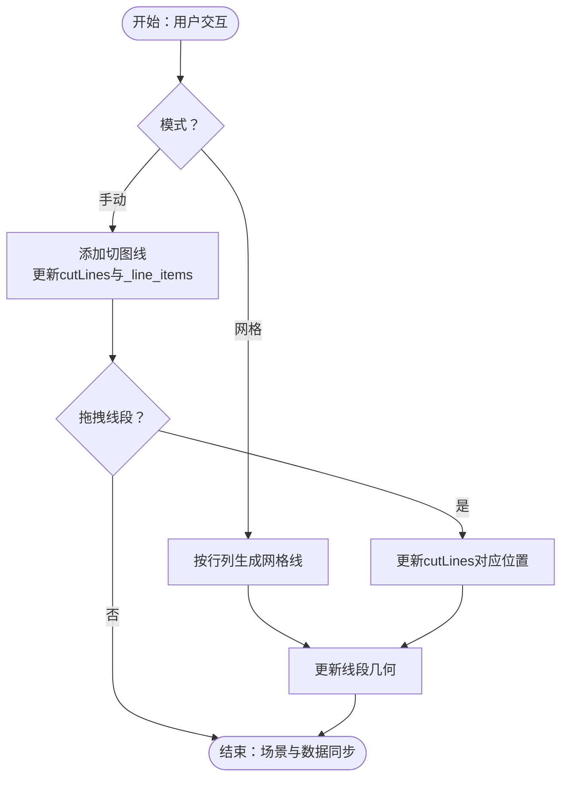
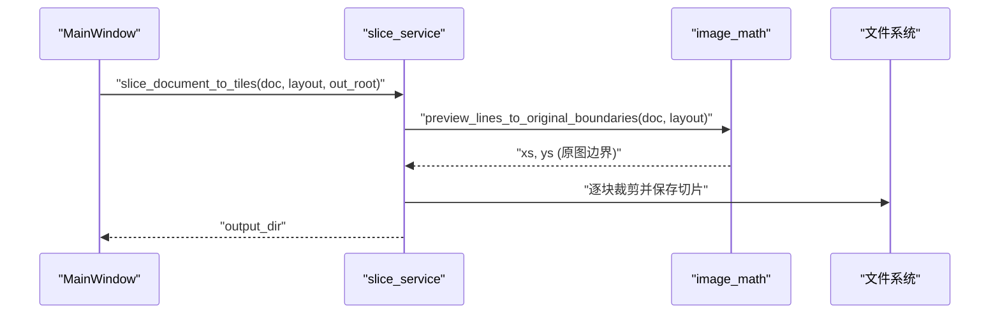
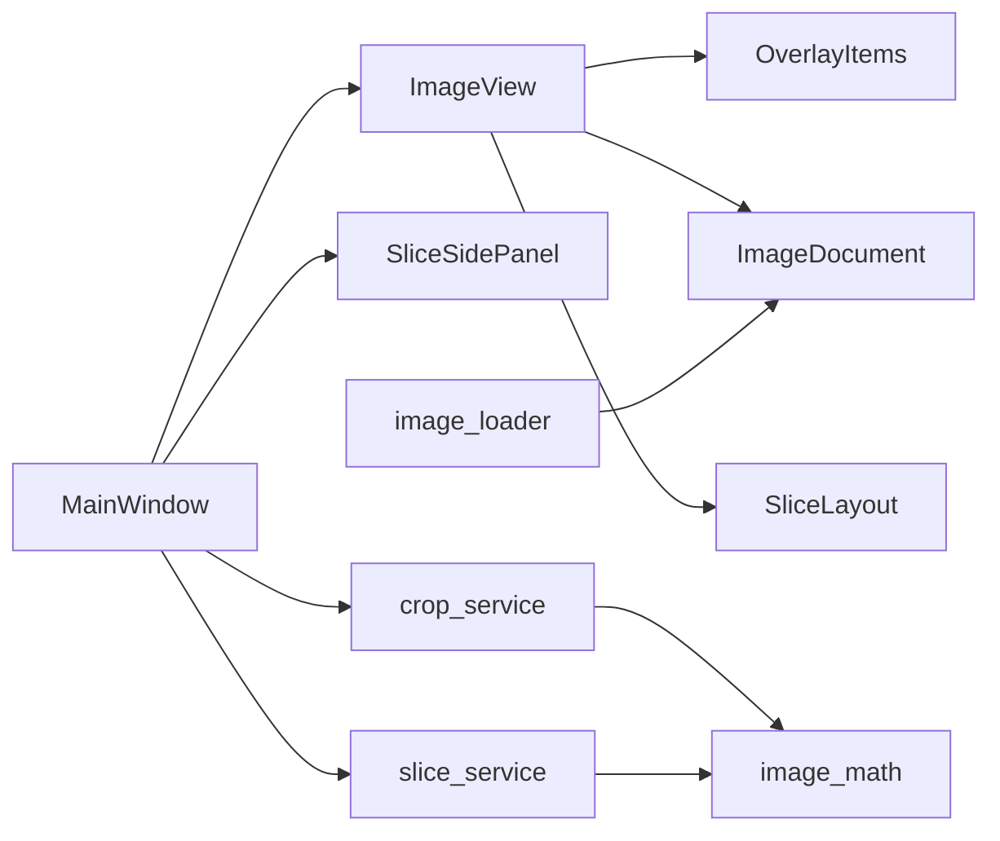

# 模块通信机制

<cite>
**本文引用的文件**
- [main.py](file://img_slicer_tool/main.py)
- [application.py](file://img_slicer_tool/app/application.py)
- [main_window.py](file://img_slicer_tool/app/main_window.py)
- [image_view.py](file://img_slicer_tool/views/image_view.py)
- [overlay_items.py](file://img_slicer_tool/views/overlay_items.py)
- [slice_side_panel.py](file://img_slicer_tool/views/slice_side_panel.py)
- [image_document.py](file://img_slicer_tool/models/image_document.py)
- [slice_layout.py](file://img_slicer_tool/models/slice_layout.py)
- [image_math.py](file://img_slicer_tool/utils/image_math.py)
- [image_loader.py](file://img_slicer_tool/services/image_loader.py)
- [crop_service.py](file://img_slicer_tool/services/crop_service.py)
- [slice_service.py](file://img_slicer_tool/services/slice_service.py)
</cite>

## 目录
1. [引言](#引言)
2. [项目结构](#项目结构)
3. [核心组件](#核心组件)
4. [架构总览](#架构总览)
5. [详细组件分析](#详细组件分析)
6. [依赖关系分析](#依赖关系分析)
7. [性能考量](#性能考量)
8. [故障排查指南](#故障排查指南)
9. [结论](#结论)

## 引言
本文件系统性地文档化 PictureMaster 基于 PySide6 信号与槽的事件驱动通信架构，围绕以下目标展开：
- 解析 ImageView 如何定义 cropRequested 信号，并在用户完成裁剪框拖拽后发射预览坐标
- 说明 MainWindow 在 _connect_signals 中如何连接该信号至 _on_crop_requested 槽函数
- 阐述 GuideLineItem 与 ImageView 之间的交互如何触发切图线布局更新
- 说明服务层（crop_service、slice_service）如何被 MainWindow 调用并返回处理结果
- 分析该解耦设计带来的可测试性与可维护性优势
- 提供组件通信序列图，展示从鼠标事件到服务执行的完整调用链
- 包含信号连接遗漏、跨线程信号传递等典型问题的调试方法

## 项目结构
项目采用“视图-模型-服务-工具”分层组织，核心通信通过 PySide6 的信号与槽实现，UI 逻辑集中在视图层，业务逻辑集中在服务层，数据模型位于模型层，数学映射与工具函数位于 utils 层。

图表来源
- [main.py](file://img_slicer_tool/main.py#L1-L13)
- [application.py](file://img_slicer_tool/app/application.py#L1-L35)
- [main_window.py](file://img_slicer_tool/app/main_window.py#L1-L364)
- [image_view.py](file://img_slicer_tool/views/image_view.py#L1-L542)
- [overlay_items.py](file://img_slicer_tool/views/overlay_items.py#L1-L64)
- [slice_side_panel.py](file://img_slicer_tool/views/slice_side_panel.py#L1-L174)
- [image_document.py](file://img_slicer_tool/models/image_document.py#L1-L18)
- [slice_layout.py](file://img_slicer_tool/models/slice_layout.py#L1-L30)
- [image_loader.py](file://img_slicer_tool/services/image_loader.py#L1-L68)
- [crop_service.py](file://img_slicer_tool/services/crop_service.py#L1-L38)
- [slice_service.py](file://img_slicer_tool/services/slice_service.py#L1-L62)
- [image_math.py](file://img_slicer_tool/utils/image_math.py#L1-L76)

章节来源
- [main.py](file://img_slicer_tool/main.py#L1-L13)
- [application.py](file://img_slicer_tool/app/application.py#L1-L35)

## 核心组件
- MainWindow：应用主控制器，负责菜单、动作、状态栏与侧边面板联动；连接视图信号并调用服务层执行业务。
- ImageView：图形视图，负责鼠标事件、裁剪矩形绘制、切图线管理与 emit 信号；向服务层提供布局信息。
- SliceSidePanel：切图模式侧边栏，提供切图方式、网格参数、工具切换与执行按钮，发出配置变更信号。
- OverlayItems：裁剪矩形与切图线项，用于场景渲染与高亮。
- Services：crop_service、slice_service 封装具体业务逻辑，读取模型与工具函数进行转换与落盘。
- Models：ImageDocument、SliceLayout 描述文档元信息与切图布局。
- Utils：image_math 提供预览坐标与原图坐标的双向映射。

章节来源
- [main_window.py](file://img_slicer_tool/app/main_window.py#L1-L364)
- [image_view.py](file://img_slicer_tool/views/image_view.py#L1-L542)
- [overlay_items.py](file://img_slicer_tool/views/overlay_items.py#L1-L64)
- [slice_side_panel.py](file://img_slicer_tool/views/slice_side_panel.py#L1-L174)
- [image_document.py](file://img_slicer_tool/models/image_document.py#L1-L18)
- [slice_layout.py](file://img_slicer_tool/models/slice_layout.py#L1-L30)
- [image_math.py](file://img_slicer_tool/utils/image_math.py#L1-L76)
- [crop_service.py](file://img_slicer_tool/services/crop_service.py#L1-L38)
- [slice_service.py](file://img_slicer_tool/services/slice_service.py#L1-L62)

## 架构总览
系统采用事件驱动的观察者模式：视图层通过信号向外发布用户操作与状态变化，主窗口作为协调器订阅这些信号并调用服务层执行业务，服务层再通过工具函数完成坐标映射与文件写入，最终由视图层刷新显示或状态栏反馈。

图表来源
- [image_view.py](file://img_slicer_tool/views/image_view.py#L1-L542)
- [main_window.py](file://img_slicer_tool/app/main_window.py#L1-L364)
- [crop_service.py](file://img_slicer_tool/services/crop_service.py#L1-L38)
- [slice_service.py](file://img_slicer_tool/services/slice_service.py#L1-L62)
- [image_math.py](file://img_slicer_tool/utils/image_math.py#L1-L76)
- [image_loader.py](file://img_slicer_tool/services/image_loader.py#L1-L68)

## 详细组件分析

### ImageView：裁剪信号与切图线交互
- 信号定义与发射
  - 在构造阶段定义 cropRequested 信号，类型为浮点四元组（x, y, w, h），表示预览坐标系下的裁剪矩形。
  - 在鼠标释放事件中，当裁剪矩形满足最小尺寸要求时，发射 cropRequested 信号。
- 鼠标事件处理
  - mousePressEvent：根据模式（裁剪/切图）初始化拖拽状态或尝试开始拖拽切图线。
  - mouseMoveEvent：在裁剪模式下动态更新 CropRectItem；在切图模式下拖拽已选中线段。
  - mouseReleaseEvent：结束裁剪拖拽并发射信号；结束切图线拖拽并更新光标。
- 切图线管理
  - 手动模式：通过 lineTool（horizontal/vertical/cross/select）在场景中添加/删除/移动 GuideLineItem，并维护内部 cutLines 列表。
  - 网格模式：根据行/列自动生成等间距横线/竖线，统一更新到场景与内部列表。
  - 选中与高亮：通过 _set_selected_line 与 _update_line_highlight 控制线条高亮与选中状态。
- 坐标与布局
  - get_slice_layout 将内部 cutLines 转换为 SliceLayout，并进行归一化与边界扩展。
  - get_pixmap_rect 返回当前预览图的场景矩形，用于坐标约束与映射。

图表来源
- [image_view.py](file://img_slicer_tool/views/image_view.py#L1-L542)
- [overlay_items.py](file://img_slicer_tool/views/overlay_items.py#L1-L64)
- [slice_layout.py](file://img_slicer_tool/models/slice_layout.py#L1-L30)
- [image_document.py](file://img_slicer_tool/models/image_document.py#L1-L18)

章节来源
- [image_view.py](file://img_slicer_tool/views/image_view.py#L1-L542)
- [overlay_items.py](file://img_slicer_tool/views/overlay_items.py#L1-L64)
- [slice_layout.py](file://img_slicer_tool/models/slice_layout.py#L1-L30)
- [image_document.py](file://img_slicer_tool/models/image_document.py#L1-L18)

### MainWindow：信号连接与服务调用
- 信号连接
  - 在 _connect_signals 中连接 ImageView 的 cropRequested、imageDropped、invalidFileDropped 以及 SliceSidePanel 的模式/网格/工具/执行请求信号。
- 裁剪流程槽函数
  - _on_crop_requested 接收预览坐标，弹窗确认覆盖/另存，调用 crop_service 执行裁剪，更新当前文档并刷新视图。
- 切图流程槽函数
  - _on_execute_slice 收集 ImageView 的 SliceLayout，计算切片数量，调用 slice_service 执行切图，弹窗提示输出目录。
  - _on_slice_work_mode_changed/_on_grid_values_changed/_on_line_tool_changed 同步侧边栏与视图状态。
- 文件拖放
  - _on_image_dropped 加载图片；_on_invalid_drop 给出不支持文件的提示。

图表来源
- [main_window.py](file://img_slicer_tool/app/main_window.py#L1-L364)
- [crop_service.py](file://img_slicer_tool/services/crop_service.py#L1-L38)
- [slice_service.py](file://img_slicer_tool/services/slice_service.py#L1-L62)

章节来源
- [main_window.py](file://img_slicer_tool/app/main_window.py#L1-L364)

### 切图线与布局更新：GuideLineItem 与 ImageView 的交互
- GuideLineItem
  - 以 QGraphicsLineItem 为基础，支持高亮与场景坐标值查询。
- 交互流程
  - 手动模式：点击生成横线/竖线/十字线，GuideLineItem 添加到场景，内部 cutLines 与 _line_items 同步更新。
  - 网格模式：根据 rows/cols 计算等间距线段，批量生成并更新。
  - 拖拽：选中后拖动更新 cutLines 对应位置，随后调用 _update_line_geometry 同步到场景线段。
  - 选中高亮：通过 _set_selected_line 与 _update_line_highlight 控制高亮状态。

图表来源
- [image_view.py](file://img_slicer_tool/views/image_view.py#L1-L542)
- [overlay_items.py](file://img_slicer_tool/views/overlay_items.py#L1-L64)

章节来源
- [image_view.py](file://img_slicer_tool/views/image_view.py#L1-L542)
- [overlay_items.py](file://img_slicer_tool/views/overlay_items.py#L1-L64)

### 服务层调用链：从预览坐标到原图切图
- crop_service
  - 输入：ImageDocument、预览矩形（x,y,w,h）、目标路径
  - 步骤：调用 image_math.preview_rect_to_original_box 将预览矩形映射到原图像素坐标，使用 PIL 裁剪并保存，重新加载新文档
- slice_service
  - 输入：ImageDocument、SliceLayout、输出根目录
  - 步骤：调用 image_math.preview_lines_to_original_boundaries 将预览线映射到原图边界，遍历边界生成切片并保存到输出目录

图表来源
- [slice_service.py](file://img_slicer_tool/services/slice_service.py#L1-L62)
- [image_math.py](file://img_slicer_tool/utils/image_math.py#L1-L76)

章节来源
- [crop_service.py](file://img_slicer_tool/services/crop_service.py#L1-L38)
- [slice_service.py](file://img_slicer_tool/services/slice_service.py#L1-L62)
- [image_math.py](file://img_slicer_tool/utils/image_math.py#L1-L76)

## 依赖关系分析
- 组件耦合
  - MainWindow 依赖 ImageView、SliceSidePanel、服务层与工具层，承担协调职责，耦合度适中。
  - ImageView 依赖 OverlayItems 与模型层，负责 UI 交互与布局生成，耦合度较低。
  - 服务层依赖模型与工具函数，职责单一，内聚性高。
- 外部依赖
  - PySide6：信号与槽、图形场景、对话框、文件对话框等
  - Pillow：图像读取、裁剪、保存
- 可能的循环依赖
  - 当前结构未发现循环导入；各层单向依赖清晰。

图表来源
- [main_window.py](file://img_slicer_tool/app/main_window.py#L1-L364)
- [image_view.py](file://img_slicer_tool/views/image_view.py#L1-L542)
- [overlay_items.py](file://img_slicer_tool/views/overlay_items.py#L1-L64)
- [image_document.py](file://img_slicer_tool/models/image_document.py#L1-L18)
- [slice_layout.py](file://img_slicer_tool/models/slice_layout.py#L1-L30)
- [image_loader.py](file://img_slicer_tool/services/image_loader.py#L1-L68)
- [crop_service.py](file://img_slicer_tool/services/crop_service.py#L1-L38)
- [slice_service.py](file://img_slicer_tool/services/slice_service.py#L1-L62)
- [image_math.py](file://img_slicer_tool/utils/image_math.py#L1-L76)

章节来源
- [main_window.py](file://img_slicer_tool/app/main_window.py#L1-L364)
- [image_view.py](file://img_slicer_tool/views/image_view.py#L1-L542)

## 性能考量
- 预览缩放与坐标映射
  - 通过 ImageDocument 的 scale_x/scale_y 将预览坐标映射到原图，避免重复计算，提升裁剪与切图精度与效率。
- 场景更新策略
  - 使用 SmartViewportUpdate 与按需更新切图线几何，减少不必要的重绘。
- I/O 优化
  - 切图时批量裁剪与保存，JPEG 保存时设置质量参数，兼顾体积与速度。
- 可扩展性
  - 服务层与工具层分离，便于替换算法或引入缓存策略。

## 故障排查指南
- 信号连接遗漏
  - 症状：裁剪框拖拽完成后无响应、切图按钮无反应。
  - 排查：检查 MainWindow._connect_signals 是否包含对应 connect 调用；确保信号名称与槽签名一致。
  - 参考路径
    - [main_window.py](file://img_slicer_tool/app/main_window.py#L87-L101)
- 跨线程信号传递
  - 症状：后台任务（如切图）完成后 UI 未更新。
  - 排查：PySide6 的信号默认在同一线程传递；若使用多线程，请使用 Qt 的线程间信号或 moveToThread；确认服务层未阻塞 UI 线程。
  - 参考路径
    - [main_window.py](file://img_slicer_tool/app/main_window.py#L136-L193)
    - [slice_service.py](file://img_slicer_tool/services/slice_service.py#L1-L62)
- 坐标映射异常
  - 症状：裁剪或切图结果与预期不符。
  - 排查：核对 ImageView.get_pixmap_rect 与 SliceLayout.normalize 的边界；检查 image_math 的映射函数输入范围与截断逻辑。
  - 参考路径
    - [image_view.py](file://img_slicer_tool/views/image_view.py#L236-L253)
    - [slice_layout.py](file://img_slicer_tool/models/slice_layout.py#L14-L30)
    - [image_math.py](file://img_slicer_tool/utils/image_math.py#L17-L76)
- 文件路径错误
  - 症状：裁剪/切图失败或找不到文件。
  - 排查：确认 doc.path 存在；检查输出目录权限与路径有效性。
  - 参考路径
    - [crop_service.py](file://img_slicer_tool/services/crop_service.py#L20-L38)
    - [slice_service.py](file://img_slicer_tool/services/slice_service.py#L19-L31)
- UI 不一致
  - 症状：网格线未更新或高亮状态异常。
  - 排查：确认 set_slice_work_mode/set_grid_size 与 set_line_tool 的调用顺序；检查 _update_line_geometry 与 _set_selected_line 的调用。
  - 参考路径
    - [image_view.py](file://img_slicer_tool/views/image_view.py#L265-L304)
    - [image_view.py](file://img_slicer_tool/views/image_view.py#L441-L466)
    - [image_view.py](file://img_slicer_tool/views/image_view.py#L367-L389)

## 结论
PictureMaster 通过 PySide6 信号与槽实现了清晰的事件驱动通信：视图层专注交互与布局，主窗口承担协调与业务编排，服务层封装具体算法与 I/O。该解耦设计提升了可测试性（可通过模拟信号与服务函数验证流程）、可维护性（职责分离、依赖方向明确），并为未来扩展（多线程、缓存、插件化服务）提供了良好基础。建议在新增功能时遵循现有分层与信号命名规范，确保通信链路清晰、可追踪。