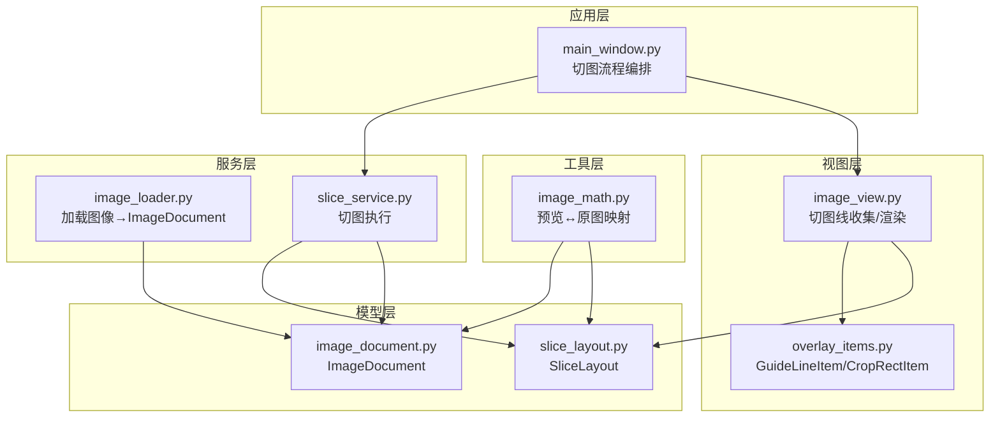
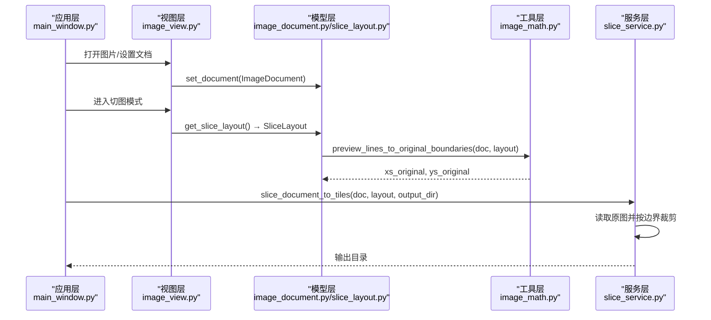
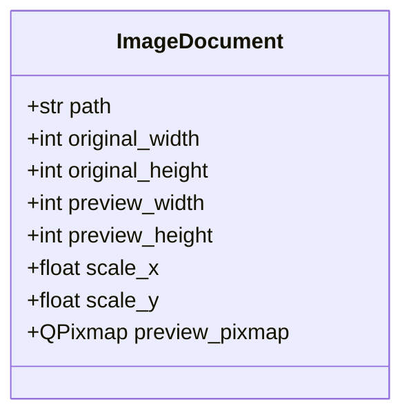
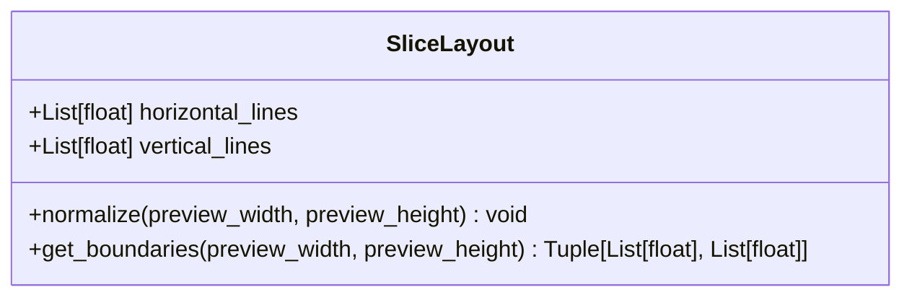
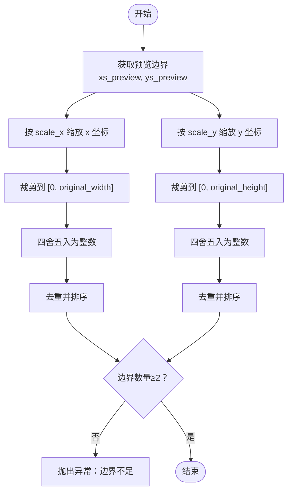
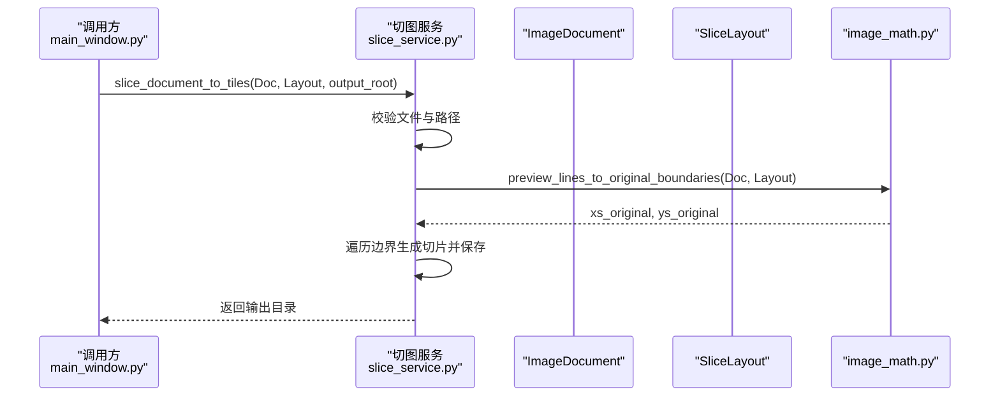
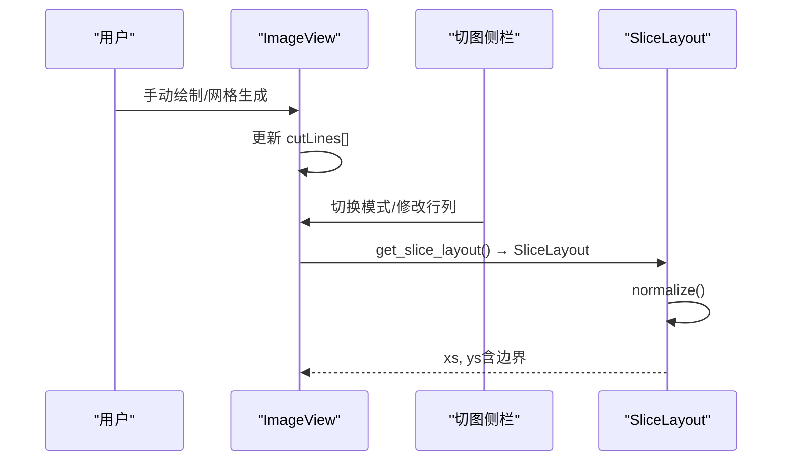
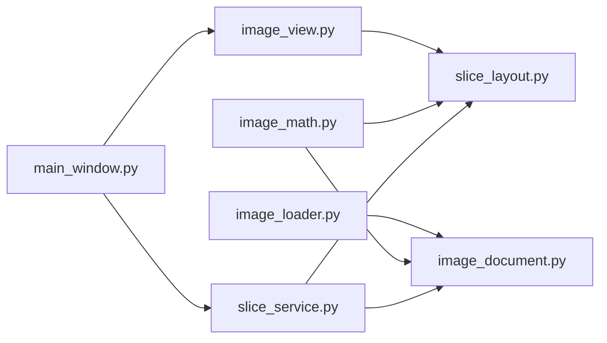

# 数据模型设计

<cite>
**本文引用的文件**
- [img_slicer_tool/models/image_document.py](file://img_slicer_tool/models/image_document.py)
- [img_slicer_tool/models/slice_layout.py](file://img_slicer_tool/models/slice_layout.py)
- [img_slicer_tool/utils/image_math.py](file://img_slicer_tool/utils/image_math.py)
- [img_slicer_tool/services/image_loader.py](file://img_slicer_tool/services/image_loader.py)
- [img_slicer_tool/services/slice_service.py](file://img_slicer_tool/services/slice_service.py)
- [img_slicer_tool/views/image_view.py](file://img_slicer_tool/views/image_view.py)
- [img_slicer_tool/views/overlay_items.py](file://img_slicer_tool/views/overlay_items.py)
- [img_slicer_tool/app/main_window.py](file://img_slicer_tool/app/main_window.py)
</cite>

## 目录
1. [简介](#简介)
2. [项目结构](#项目结构)
3. [核心组件](#核心组件)
4. [架构总览](#架构总览)
5. [详细组件分析](#详细组件分析)
6. [依赖关系分析](#依赖关系分析)
7. [性能考量](#性能考量)
8. [故障排查指南](#故障排查指南)
9. [结论](#结论)
10. [附录](#附录)

## 简介
本文件聚焦 PictureMaster 中两个核心数据模型：ImageDocument 与 SliceLayout 的设计与实现。前者以不可变的数据类封装图像路径、原始尺寸、预览尺寸与缩放比例，以及预览图的 QPixmap，是图像加载与显示流程的载体；后者以归一化坐标（0~1 对应预览图宽高的像素值）管理水平线与垂直线列表，提供边界扩展、去重与排序能力，并通过工具函数将预览坐标映射到原图坐标，支撑切图服务的执行。文档同时给出类图、字段说明表与典型切图模式下的数据组织示例，帮助读者快速理解两者的协作机制。

## 项目结构
围绕数据模型的关键文件分布如下：
- 模型层：models/image_document.py、models/slice_layout.py
- 工具层：utils/image_math.py（坐标映射与边界计算）
- 服务层：services/image_loader.py（加载与生成 ImageDocument）、services/slice_service.py（执行切图）
- 视图层：views/image_view.py（切图线收集与预览）、views/overlay_items.py（切图线渲染）
- 应用层：app/main_window.py（切图流程编排）

图表来源
- [img_slicer_tool/models/image_document.py](file://img_slicer_tool/models/image_document.py#L1-L18)
- [img_slicer_tool/models/slice_layout.py](file://img_slicer_tool/models/slice_layout.py#L1-L30)
- [img_slicer_tool/utils/image_math.py](file://img_slicer_tool/utils/image_math.py#L1-L76)
- [img_slicer_tool/services/image_loader.py](file://img_slicer_tool/services/image_loader.py#L1-L68)
- [img_slicer_tool/services/slice_service.py](file://img_slicer_tool/services/slice_service.py#L1-L62)
- [img_slicer_tool/views/image_view.py](file://img_slicer_tool/views/image_view.py#L1-L542)
- [img_slicer_tool/views/overlay_items.py](file://img_slicer_tool/views/overlay_items.py#L1-L64)
- [img_slicer_tool/app/main_window.py](file://img_slicer_tool/app/main_window.py#L1-L364)

章节来源
- [img_slicer_tool/models/image_document.py](file://img_slicer_tool/models/image_document.py#L1-L18)
- [img_slicer_tool/models/slice_layout.py](file://img_slicer_tool/models/slice_layout.py#L1-L30)
- [img_slicer_tool/utils/image_math.py](file://img_slicer_tool/utils/image_math.py#L1-L76)
- [img_slicer_tool/services/image_loader.py](file://img_slicer_tool/services/image_loader.py#L1-L68)
- [img_slicer_tool/services/slice_service.py](file://img_slicer_tool/services/slice_service.py#L1-L62)
- [img_slicer_tool/views/image_view.py](file://img_slicer_tool/views/image_view.py#L1-L542)
- [img_slicer_tool/views/overlay_items.py](file://img_slicer_tool/views/overlay_items.py#L1-L64)
- [img_slicer_tool/app/main_window.py](file://img_slicer_tool/app/main_window.py#L1-L364)

## 核心组件
- ImageDocument：不可变数据类，承载图像路径、原始宽高、预览宽高、缩放比例与预览图 QPixmap。用于统一跨模块传递图像元信息与预览资源。
- SliceLayout：不可变数据类，保存预览坐标系下的水平线与垂直线集合，提供去重、边界扩展与排序能力，保证后续切图边界的一致性与合法性。

章节来源
- [img_slicer_tool/models/image_document.py](file://img_slicer_tool/models/image_document.py#L1-L18)
- [img_slicer_tool/models/slice_layout.py](file://img_slicer_tool/models/slice_layout.py#L1-L30)

## 架构总览
从“加载—编辑—切图”的视角看，数据流如下：
- 图像加载：image_loader.load_image_document 将原图读取为 ImageDocument，并生成预览图 QPixmap。
- 切图编辑：ImageView 收集用户绘制的切图线，转换为 SliceLayout（归一化坐标），并进行边界扩展与排序。
- 切图执行：slice_service.slice_document_to_tiles 读取原图，按 SliceLayout 的边界生成切片并保存。

图表来源
- [img_slicer_tool/app/main_window.py](file://img_slicer_tool/app/main_window.py#L1-L364)
- [img_slicer_tool/views/image_view.py](file://img_slicer_tool/views/image_view.py#L1-L542)
- [img_slicer_tool/models/image_document.py](file://img_slicer_tool/models/image_document.py#L1-L18)
- [img_slicer_tool/models/slice_layout.py](file://img_slicer_tool/models/slice_layout.py#L1-L30)
- [img_slicer_tool/utils/image_math.py](file://img_slicer_tool/utils/image_math.py#L1-L76)
- [img_slicer_tool/services/slice_service.py](file://img_slicer_tool/services/slice_service.py#L1-L62)

## 详细组件分析

### ImageDocument 数据模型
- 设计要点
  - 使用 dataclass(slots=True) 以获得不可变语义与紧凑内存布局，减少字段拼写错误与运行时开销。
  - 字段涵盖：路径、原始宽高、预览宽高、缩放比例、预览图 QPixmap。
  - 与 Qt 集成：预览图以 QPixmap 存储，便于视图层直接渲染。
- 关键职责
  - 统一承载图像元信息，贯穿加载、显示、切图与裁剪流程。
  - 提供 scale_x/scale_y 将预览坐标映射到原图坐标，保障切图边界一致性。
- 复杂度与性能
  - 字段访问为 O(1)，无额外计算成本。
  - slots=True 减少实例字典大小，提升内存效率。

图表来源
- [img_slicer_tool/models/image_document.py](file://img_slicer_tool/models/image_document.py#L1-L18)

章节来源
- [img_slicer_tool/models/image_document.py](file://img_slicer_tool/models/image_document.py#L1-L18)
- [img_slicer_tool/services/image_loader.py](file://img_slicer_tool/services/image_loader.py#L1-L68)

### SliceLayout 数据模型
- 设计要点
  - 使用 dataclass（默认不可变语义）保存水平线与垂直线列表，均采用预览坐标系的归一化数值（像素值，范围与预览图一致）。
  - 提供 normalize() 去重与边界过滤，确保只保留有效且在预览图范围内的线条。
  - 提供 get_boundaries() 返回含边界的坐标列表，自动在首尾追加 0 与宽/高，形成闭区间边界。
- 关键职责
  - 作为切图线的标准化表示，屏蔽用户交互与网格生成的差异，统一后续边界计算。
  - 通过边界扩展与排序，保证切图区域的连续性与合法性。
- 复杂度与性能
  - normalize() 内部使用集合去重与排序，时间复杂度近似 O(n log n)。
  - get_boundaries() 为 O(n) 拼接与常量扩展。

图表来源
- [img_slicer_tool/models/slice_layout.py](file://img_slicer_tool/models/slice_layout.py#L1-L30)

章节来源
- [img_slicer_tool/models/slice_layout.py](file://img_slicer_tool/models/slice_layout.py#L1-L30)

### 预览坐标到原图坐标的映射
- 作用：将 SliceLayout 的预览坐标转换为原图像素边界，用于切图服务的精确裁剪。
- 关键逻辑
  - 先对预览线进行边界扩展与去重，得到 xs_preview、ys_preview。
  - 乘以 scale_x/scale_y 并四舍五入，再裁剪到原图有效范围，最后去重与排序。
  - 最终校验边界数量，确保至少能生成一个宫格。

图表来源
- [img_slicer_tool/utils/image_math.py](file://img_slicer_tool/utils/image_math.py#L1-L76)
- [img_slicer_tool/models/image_document.py](file://img_slicer_tool/models/image_document.py#L1-L18)

章节来源
- [img_slicer_tool/utils/image_math.py](file://img_slicer_tool/utils/image_math.py#L1-L76)

### 切图服务执行流程
- 输入：ImageDocument、SliceLayout、输出根目录
- 步骤
  - 校验原图存在与输出目录非空。
  - 生成输出子目录（以原图名命名）。
  - 调用映射函数将预览边界转换为原图边界。
  - 打开原图并遍历边界生成切片，按行列命名保存。

图表来源
- [img_slicer_tool/services/slice_service.py](file://img_slicer_tool/services/slice_service.py#L1-L62)
- [img_slicer_tool/utils/image_math.py](file://img_slicer_tool/utils/image_math.py#L1-L76)
- [img_slicer_tool/app/main_window.py](file://img_slicer_tool/app/main_window.py#L1-L364)

章节来源
- [img_slicer_tool/services/slice_service.py](file://img_slicer_tool/services/slice_service.py#L1-L62)
- [img_slicer_tool/app/main_window.py](file://img_slicer_tool/app/main_window.py#L1-L364)

### 切图线的收集与渲染（ImageView）
- 手动模式：用户在预览图上绘制水平/垂直线，存储为切图线集合，随后转换为 SliceLayout 并进行 normalize()。
- 网格模式：根据行数与列数自动生成等间距的水平/垂直线，同样转换为 SliceLayout。
- 渲染：GuideLineItem 以 QGraphicsLineItem 渲染，支持高亮与选中状态。

图表来源
- [img_slicer_tool/views/image_view.py](file://img_slicer_tool/views/image_view.py#L1-L542)
- [img_slicer_tool/views/overlay_items.py](file://img_slicer_tool/views/overlay_items.py#L1-L64)
- [img_slicer_tool/models/slice_layout.py](file://img_slicer_tool/models/slice_layout.py#L1-L30)

章节来源
- [img_slicer_tool/views/image_view.py](file://img_slicer_tool/views/image_view.py#L1-L542)
- [img_slicer_tool/views/overlay_items.py](file://img_slicer_tool/views/overlay_items.py#L1-L64)
- [img_slicer_tool/models/slice_layout.py](file://img_slicer_tool/models/slice_layout.py#L1-L30)

### 字段说明表
- ImageDocument
  - path：字符串，原图绝对路径
  - original_width/original_height：整数，原图像素宽高
  - preview_width/preview_height：整数，预览图像素宽高
  - scale_x/scale_y：浮点数，预览到原图的缩放因子
  - preview_pixmap：QPixmap，预览图资源
- SliceLayout
  - horizontal_lines：浮点数列表，预览坐标系下的水平线位置
  - vertical_lines：浮点数列表，预览坐标系下的垂直线位置

章节来源
- [img_slicer_tool/models/image_document.py](file://img_slicer_tool/models/image_document.py#L1-L18)
- [img_slicer_tool/models/slice_layout.py](file://img_slicer_tool/models/slice_layout.py#L1-L30)

### 切图模式下的数据组织示例
- 手动线模式
  - 用户在预览图上绘制多条水平/垂直线，最终形成若干条水平线与若干条垂直线。
  - normalize() 去重并过滤越界值，get_boundaries() 在首尾追加 0 与宽/高，得到闭区间边界。
- 行列宫格模式
  - 根据行数与列数等分预览图，生成等间距的水平/垂直线。
  - 与手动模式一样，最终通过 normalize() 与 get_boundaries() 形成原图边界。

章节来源
- [img_slicer_tool/views/image_view.py](file://img_slicer_tool/views/image_view.py#L1-L542)
- [img_slicer_tool/models/slice_layout.py](file://img_slicer_tool/models/slice_layout.py#L1-L30)

## 依赖关系分析
- 模块耦合
  - image_loader 与 ImageDocument：加载器负责生成 ImageDocument。
  - image_view 与 SliceLayout：视图层负责收集切图线并转换为 SliceLayout。
  - image_math 与 ImageDocument/SliceLayout：提供预览坐标到原图坐标的映射。
  - slice_service 与 ImageDocument/SliceLayout：执行切图并将边界应用于原图。
  - main_window 串联上述组件，驱动切图流程。
- 外部依赖
  - PySide6（Qt）：用于 GUI 与图像显示。
  - Pillow：用于图像读取、缩放与格式转换。
  - numpy/pyvips：预留用于后续大图优化（本仓库未直接使用）。

图表来源
- [img_slicer_tool/services/image_loader.py](file://img_slicer_tool/services/image_loader.py#L1-L68)
- [img_slicer_tool/models/image_document.py](file://img_slicer_tool/models/image_document.py#L1-L18)
- [img_slicer_tool/views/image_view.py](file://img_slicer_tool/views/image_view.py#L1-L542)
- [img_slicer_tool/models/slice_layout.py](file://img_slicer_tool/models/slice_layout.py#L1-L30)
- [img_slicer_tool/utils/image_math.py](file://img_slicer_tool/utils/image_math.py#L1-L76)
- [img_slicer_tool/services/slice_service.py](file://img_slicer_tool/services/slice_service.py#L1-L62)
- [img_slicer_tool/app/main_window.py](file://img_slicer_tool/app/main_window.py#L1-L364)

章节来源
- [img_slicer_tool/services/image_loader.py](file://img_slicer_tool/services/image_loader.py#L1-L68)
- [img_slicer_tool/views/image_view.py](file://img_slicer_tool/views/image_view.py#L1-L542)
- [img_slicer_tool/utils/image_math.py](file://img_slicer_tool/utils/image_math.py#L1-L76)
- [img_slicer_tool/services/slice_service.py](file://img_slicer_tool/services/slice_service.py#L1-L62)
- [img_slicer_tool/app/main_window.py](file://img_slicer_tool/app/main_window.py#L1-L364)

## 性能考量
- 数据类不可变性
  - dataclass(slots=True) 降低实例内存占用，提升字段访问速度，适合频繁传递与比较的轻量数据对象。
- 坐标映射
  - 预览坐标到原图坐标的映射为 O(n)（n 为边界数量），整体开销较小。
- 切图执行
  - 切图过程主要受 I/O 与 PIL 裁剪影响，边界计算成本低。
- 建议
  - 对于超大图，可考虑引入 pyvips/numpy 以优化缩放与裁剪性能（本仓库已预留依赖）。

## 故障排查指南
- 切图边界不足
  - 现象：执行切图时报错“边界不足，无法生成宫格”。
  - 原因：SliceLayout 中水平/垂直线数量不足或被过滤掉。
  - 排查：确认 ImageView 是否正确收集切图线，或网格模式的行列参数是否合理。
- 预览坐标越界
  - 现象：切图线未生效或被过滤。
  - 原因：normalize() 会过滤超出预览图范围的线。
  - 排查：检查用户绘制位置是否在预览图矩形内。
- 原图路径不存在
  - 现象：切图时报错“原始图片不存在”。
  - 排查：确认 ImageDocument.path 是否正确，文件是否存在。
- 输出目录为空
  - 现象：切图时报错“输出根路径不能为空”。
  - 排查：在主窗口设置切图保存根目录后再执行切图。

章节来源
- [img_slicer_tool/utils/image_math.py](file://img_slicer_tool/utils/image_math.py#L1-L76)
- [img_slicer_tool/services/slice_service.py](file://img_slicer_tool/services/slice_service.py#L1-L62)
- [img_slicer_tool/views/image_view.py](file://img_slicer_tool/views/image_view.py#L1-L542)
- [img_slicer_tool/app/main_window.py](file://img_slicer_tool/app/main_window.py#L1-L364)

## 结论
ImageDocument 与 SliceLayout 通过清晰的职责划分与不可变数据类的优势，实现了图像元信息与切图线布局的稳定传递。配合 image_math 的坐标映射与 slice_service 的切图执行，系统在“加载—编辑—切图”的全链路中保持了良好的一致性与可维护性。未来可进一步利用 pyvips/numpy 优化大图处理性能。

## 附录
- 相关实现路径
  - ImageDocument 定义：[img_slicer_tool/models/image_document.py](file://img_slicer_tool/models/image_document.py#L1-L18)
  - SliceLayout 定义与方法：[img_slicer_tool/models/slice_layout.py](file://img_slicer_tool/models/slice_layout.py#L1-L30)
  - 预览↔原图映射：[img_slicer_tool/utils/image_math.py](file://img_slicer_tool/utils/image_math.py#L1-L76)
  - 图像加载与预览生成：[img_slicer_tool/services/image_loader.py](file://img_slicer_tool/services/image_loader.py#L1-L68)
  - 切图执行：[img_slicer_tool/services/slice_service.py](file://img_slicer_tool/services/slice_service.py#L1-L62)
  - 切图线收集与渲染：[img_slicer_tool/views/image_view.py](file://img_slicer_tool/views/image_view.py#L1-L542), [img_slicer_tool/views/overlay_items.py](file://img_slicer_tool/views/overlay_items.py#L1-L64)
  - 切图流程编排：[img_slicer_tool/app/main_window.py](file://img_slicer_tool/app/main_window.py#L1-L364)