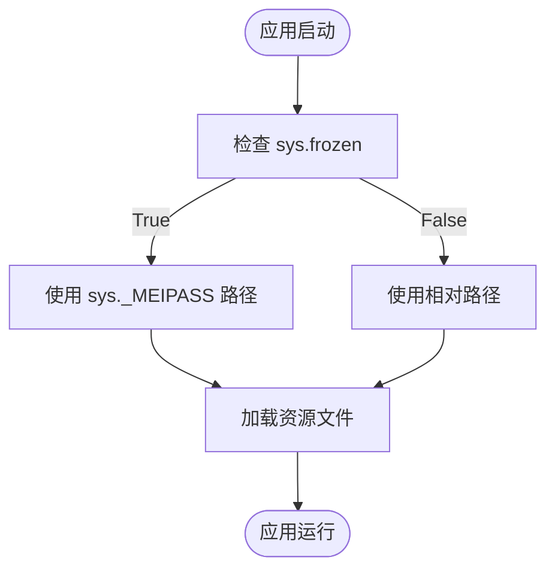

# 应用打包与分发流程

<cite>
**本文档引用的文件**  
- [main.py](file://img_slicer_tool/main.py)
- [application.py](file://img_slicer_tool/app/application.py)
- [img_slicer.spec](file://img_slicer_tool/build/img_slicer.spec)
- [requirements.txt](file://img_slicer_tool/requirements.txt)
- [style.qss](file://img_slicer_tool/resources/qss/style.qss)
- [image_loader.py](file://img_slicer_tool/services/image_loader.py)
</cite>

## 目录
1. [项目概述](#项目概述)
2. [依赖管理与虚拟环境配置](#依赖管理与虚拟环境配置)
3. [PyInstaller spec文件结构解析](#pyinstaller-spec文件结构解析)
4. [资源文件集成策略](#资源文件集成策略)
5. [第三方库打包注意事项](#第三方库打包注意事项)
6. [完整打包命令流程](#完整打包命令流程)
7. [常见问题与解决方案](#常见问题与解决方案)
8. [分发建议与文件组织](#分发建议与文件组织)

## 项目概述

`PictureMaster`是一个基于PySide6、Pillow和pyvips的大图裁剪与宫格切图工具，支持加载大尺寸图像并以缩略图形式预览，提供缩放、平移、裁剪和切图功能。项目采用模块化设计，包含应用层、模型层、服务层和视图层，通过`main.py`作为入口点启动应用程序。

项目使用PyInstaller进行打包，目标是生成独立的可执行文件，便于在没有Python环境的Windows系统上运行。打包过程需要正确处理GUI资源、样式表、图标以及第三方库的依赖关系。

**本节来源**  
- [main.py](file://img_slicer_tool/main.py#L1-L13)
- [README.md](file://img_slicer_tool/README.md#L1-L9)

## 依赖管理与虚拟环境配置

为确保打包环境的纯净和可重现性，建议使用虚拟环境进行依赖管理。项目依赖定义在`requirements.txt`文件中，包含GUI框架、图像处理库、打包工具和日志组件。

依赖项包括：
- **PySide6==6.7.2**：Qt for Python的官方绑定，用于构建GUI界面
- **Pillow==10.2.0**：Python图像处理库，用于图像加载和操作
- **pyvips==2.2.1**：高性能图像处理库，支持大图处理
- **numpy==1.26.4**：科学计算基础库，被图像处理库依赖
- **pyinstaller==6.3.0**：应用打包工具
- **loguru==0.7.2**：现代化日志库，简化日志记录

创建虚拟环境并安装依赖的标准流程如下：
1. 创建虚拟环境：`python -m venv venv`
2. 激活虚拟环境：`venv\Scripts\activate`（Windows）或 `source venv/bin/activate`（Linux/macOS）
3. 安装依赖：`pip install -r requirements.txt`

此流程确保了所有依赖项在隔离环境中安装，避免了系统级Python包冲突，为后续打包提供了稳定的基础。

**本节来源**  
- [requirements.txt](file://img_slicer_tool/requirements.txt#L1-L14)

## PyInstaller spec文件结构解析

`img_slicer.spec`是PyInstaller的配置文件，定义了打包过程的各个阶段。虽然当前文件为空，但根据项目结构和打包需求，应包含以下关键部分：

### Analysis阶段：源码与依赖收集

`Analysis`阶段负责扫描Python脚本，收集所有导入的模块和依赖文件。它会递归分析`main.py`及其所有导入，包括`app.application`、`models.image_document`等模块，构建完整的依赖图谱。

该阶段会自动包含项目内的所有Python文件，并尝试识别第三方库的依赖。对于隐式导入（如插件系统或动态导入），可能需要通过`hiddenimports`参数显式指定。

### PYZ归档生成

`PYZ`对象将所有Python脚本打包成一个压缩的归档文件（.pyz），包含字节码而非源码，提高了加载效率并提供了一定程度的代码保护。这是可执行文件的核心部分，包含了应用程序的全部逻辑。

### EXE可执行体配置

`EXE`阶段配置最终的可执行文件，关键参数包括：
- `console=True/False`：控制是否显示控制台窗口
- `icon`：指定应用程序图标文件路径
- `runtime_hooks`：指定运行时钩子脚本，用于解决特定库的加载问题
- `exclude_modules`：排除不需要的模块以减小体积

### COLLECT阶段：资源文件集成

`COLLECT`阶段将所有非Python文件（如QSS样式表、图标、配置文件）打包到输出目录。需要显式指定资源文件路径，确保`resources/qss/style.qss`等文件被正确包含。

一个完整的spec文件应能正确处理这些阶段，确保所有必要组件都被包含在最终的可执行文件中。

**本节来源**  
- [img_slicer.spec](file://img_slicer_tool/build/img_slicer.spec#L1-L2)
- [main.py](file://img_slicer_tool/main.py#L1-L13)

## 资源文件集成策略

项目中的静态资源文件（如样式表和图标）需要在打包时显式包含，因为PyInstaller无法自动识别这些非Python文件的引用。

### QSS样式表集成

`application.py`中通过相对路径加载`style.qss`文件：
```python
qss_path = os.path.join(base_dir, "..", "resources", "qss", "style.qss")
```

在`img_slicer.spec`中，必须通过`datas`参数将此文件包含到打包目录：
```python
datas=[('img_slicer_tool/resources/qss/style.qss', 'resources/qss')]
```

### 图标文件集成

应用图标通过以下代码加载：
```python
icon_path = os.path.join(base_dir, "..", "resources", "icons", "app_icon.png")
```

同样需要在spec文件中添加：
```python
datas=[('img_slicer_tool/resources/icons/app_icon.png', 'resources/icons')]
```

### 运行时路径处理

在打包后的可执行文件中，资源文件位于`sys._MEIPASS`目录下。应用程序需要能够区分开发环境和打包环境，通常通过检查`sys.frozen`标志来实现路径的动态调整。



**本节来源**  
- [application.py](file://img_slicer_tool/app/application.py#L18-L31)
- [style.qss](file://img_slicer_tool/resources/qss/style.qss#L1-L2)

## 第三方库打包注意事项

正确打包第三方库是确保可执行文件正常运行的关键。不同库有特定的打包要求。

### PySide6打包

PySide6作为Qt绑定，包含大量动态链接库（DLL）和插件。PyInstaller通常能自动处理大部分依赖，但可能需要额外配置：
- 确保`PySide6.QtCore`、`PySide6.QtGui`等模块被正确包含
- 处理Qt插件（如图像格式插件）的路径问题
- 可能需要添加`--add-binary`参数包含特定DLL

### Pillow与图像后端

Pillow依赖底层图像解码库，在打包时可能出现图像格式支持不全的问题：
- 确保`PIL.Image`模块被正确包含
- 可能需要手动包含`PIL._imaging`等C扩展
- 对于特定格式支持，可能需要包含相应的DLL

### loguru日志库

loguru是一个纯Python库，通常能被PyInstaller自动处理。但需要注意：
- 日志输出路径在打包后可能需要调整
- 确保日志格式化功能正常工作

### 隐式导入处理

某些库使用动态导入机制，PyInstaller无法静态分析。对于此类情况，需要在spec文件中通过`hiddenimports`参数显式添加：
```python
hiddenimports=['module1', 'module2']
```

这可以避免运行时`ModuleNotFoundError`错误。

**本节来源**  
- [requirements.txt](file://img_slicer_tool/requirements.txt#L2-L14)
- [image_loader.py](file://img_slicer_tool/services/image_loader.py#L6-L8)

## 完整打包命令流程

以下是将`PictureMaster`项目打包为独立可执行文件的完整流程：

### 1. 环境准备
```bash
# 创建并激活虚拟环境
python -m venv venv
venv\Scripts\activate

# 安装依赖
pip install -r img_slicer_tool/requirements.txt
```

### 2. 生成基础spec文件
```bash
# 生成初始spec文件
pyinstaller --onefile --windowed --icon=img_slicer_tool/resources/icons/app_icon.png img_slicer_tool/main.py
```

### 3. 修改spec文件
编辑生成的`img_slicer.spec`，添加资源文件和特殊配置：
```python
# -*- mode: python ; coding: utf-8 -*-

block_cipher = None

a = Analysis(
    ['img_slicer_tool/main.py'],
    pathex=[],
    binaries=[],
    datas=[
        ('img_slicer_tool/resources/qss/style.qss', 'resources/qss'),
        ('img_slicer_tool/resources/icons/app_icon.png', 'resources/icons')
    ],
    hiddenimports=[],
    hookspath=[],
    hooksconfig={},
    runtime_hooks=[],
    excludes=[],
    win_no_prefer_redirects=False,
    win_private_assemblies=False,
    cipher=block_cipher,
    noarchive=False,
)

pyz = PYZ(a.pure, a.zipped_data, cipher=block_cipher)

exe = EXE(
    pyz,
    a.scripts,
    a.binaries,
    a.zipfiles,
    a.datas,
    [],
    name='PictureMaster',
    debug=False,
    bootloader_ignore_signals=False,
    strip=False,
    upx=True,
    upx_exclude=[],
    runtime_tmpdir=None,
    console=False,
    disable_windowed_traceback=False,
    argv_emulation=False,
    target_arch=None,
    codesign_identity=None,
    entitlements_file=None,
    icon='img_slicer_tool/resources/icons/app_icon.png',
)
```

### 4. 执行打包
```bash
# 使用修改后的spec文件打包
pyinstaller img_slicer_tool/build/img_slicer.spec
```

### 5. 验证输出
打包完成后，检查`dist`目录中的可执行文件，并测试其功能完整性。

**本节来源**  
- [img_slicer.spec](file://img_slicer_tool/build/img_slicer.spec#L1-L2)
- [main.py](file://img_slicer_tool/main.py#L1-L13)

## 常见问题与解决方案

### 缺失vcruntime140.dll

**问题描述**：运行可执行文件时提示缺少`vcruntime140.dll`。

**解决方案**：
1. 确保系统安装了Microsoft Visual C++ Redistributable
2. 在打包时包含运行时库：
   ```bash
   pyinstaller --add-binary "C:/path/to/vcruntime140.dll;." ...
   ```
3. 或使用`--runtime-tmpdir`参数指定临时目录

### 图像后端加载失败

**问题描述**：Pillow无法加载特定格式的图像，提示"decoder jpeg not available"。

**解决方案**：
1. 确保Pillow的C扩展被正确包含
2. 在spec文件中添加隐式导入：
   ```python
   hiddenimports=['PIL._imaging', 'PIL._imagingtk']
   ```
3. 手动包含图像解码DLL文件

### 大图处理性能下降

**问题描述**：打包后的应用处理大图时性能显著低于开发环境。

**解决方案**：
1. 检查是否启用了UPX压缩，可能影响解压性能
2. 确保pyvips库被正确包含且版本匹配
3. 调整`MAX_PREVIEW_SIZE`参数以平衡内存使用和性能
4. 在`Analysis`阶段排除不必要的模块以减小体积

### ModuleNotFoundError

**问题描述**：运行时提示找不到特定模块。

**解决方案**：
1. 检查`hiddenimports`是否包含所有动态导入的模块
2. 验证`datas`参数是否正确包含所有资源文件
3. 使用`--debug`模式运行可执行文件以获取详细错误信息
4. 检查第三方库的hook文件是否存在并正确配置

**本节来源**  
- [image_loader.py](file://img_slicer_tool/services/image_loader.py#L11-L21)
- [application.py](file://img_slicer_tool/app/application.py#L22-L31)

## 分发建议与文件组织

为确保用户能够顺利使用打包后的应用，建议采用以下分发策略和文件组织方式：

### 输出目录结构
```
PictureMaster/
├── PictureMaster.exe
├── resources/
│   ├── qss/
│   │   └── style.qss
│   └── icons/
│       └── app_icon.png
├── vcruntime140.dll (if needed)
└── README.txt
```

### 分发包内容
- 主可执行文件：`PictureMaster.exe`
- 必需的资源文件：样式表、图标
- 运行时依赖：如vcruntime140.dll
- 简要说明文档：包含系统要求和使用提示

### 用户体验优化
1. **图标一致性**：确保可执行文件图标与应用内图标一致
2. **启动性能**：避免过度压缩以保证启动速度
3. **错误处理**：提供友好的错误提示而非技术性异常
4. **更新机制**：考虑未来版本的更新策略

通过合理的文件组织和完整的依赖包含，可以确保`PictureMaster`在目标系统上稳定运行，为用户提供无缝的使用体验。

**本节来源**  
- [resources/qss/style.qss](file://img_slicer_tool/resources/qss/style.qss#L1-L2)
- [application.py](file://img_slicer_tool/app/application.py#L22-L31)