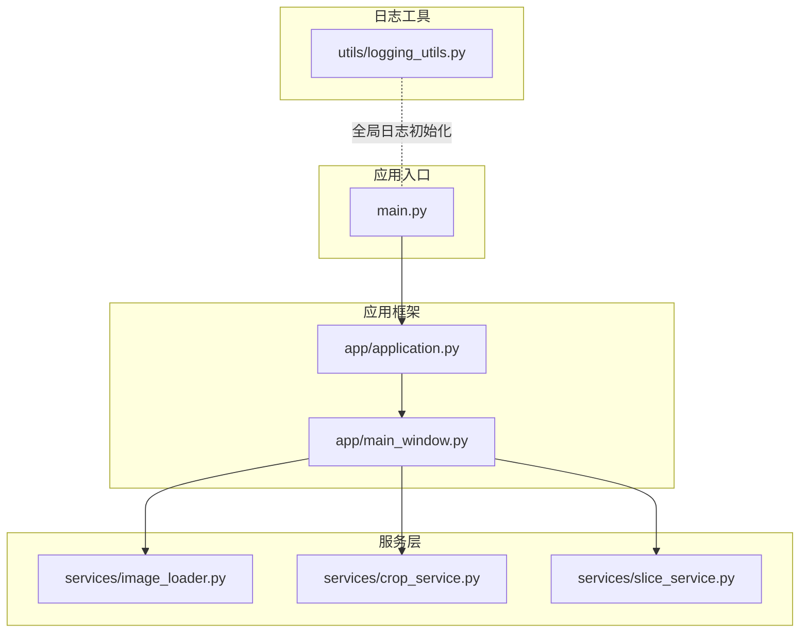
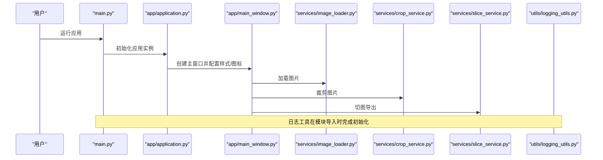
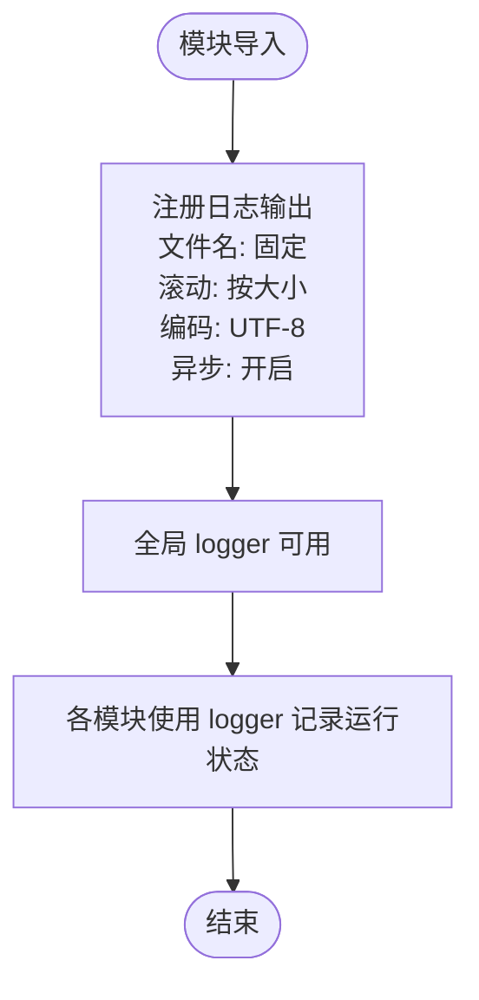
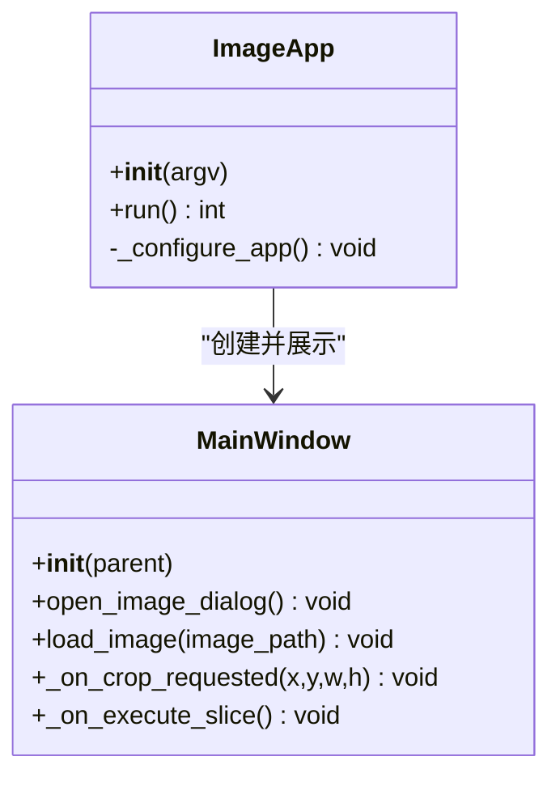
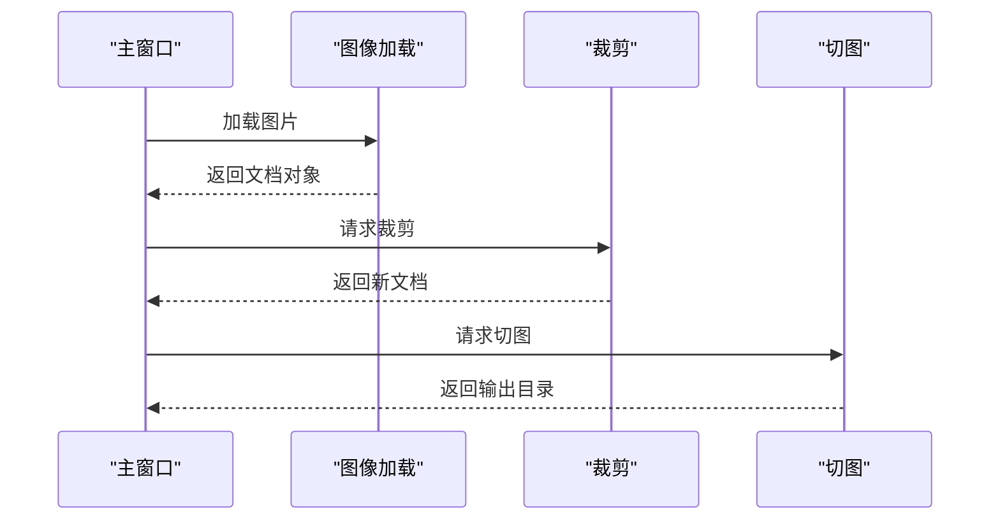
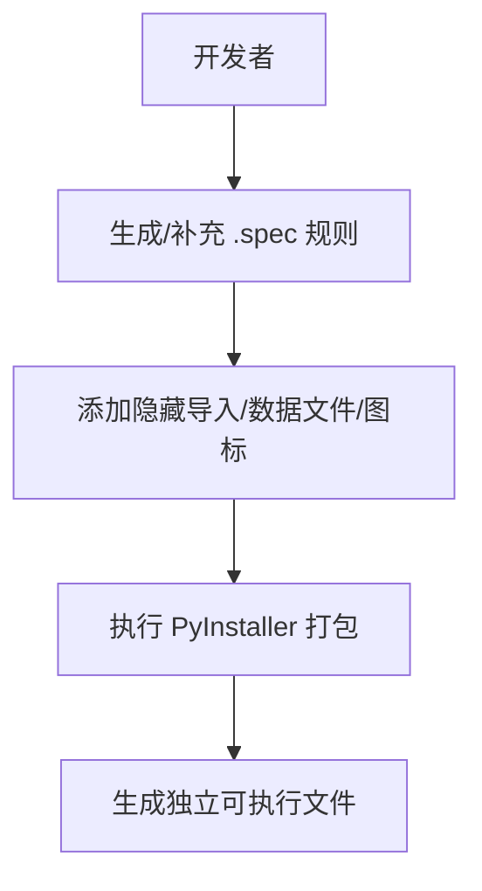
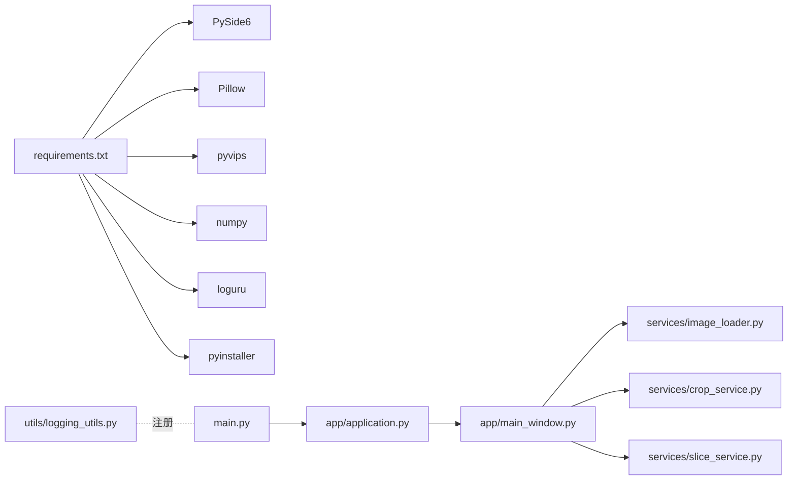

# 日志与打包分发

<cite>
**本文引用的文件**
- [img_slicer_tool/utils/logging_utils.py](file://img_slicer_tool/utils/logging_utils.py)
- [img_slicer_tool/main.py](file://img_slicer_tool/main.py)
- [img_slicer_tool/app/application.py](file://img_slicer_tool/app/application.py)
- [img_slicer_tool/app/main_window.py](file://img_slicer_tool/app/main_window.py)
- [img_slicer_tool/services/image_loader.py](file://img_slicer_tool/services/image_loader.py)
- [img_slicer_tool/services/slice_service.py](file://img_slicer_tool/services/slice_service.py)
- [img_slicer_tool/services/crop_service.py](file://img_slicer_tool/services/crop_service.py)
- [img_slicer_tool/build/img_slicer.spec](file://img_slicer_tool/build/img_slicer.spec)
- [img_slicer_tool/requirements.txt](file://img_slicer_tool/requirements.txt)
- [img_slicer_tool/README.md](file://img_slicer_tool/README.md)
</cite>

## 目录
1. [简介](#简介)
2. [项目结构](#项目结构)
3. [核心组件](#核心组件)
4. [架构总览](#架构总览)
5. [详细组件分析](#详细组件分析)
6. [依赖关系分析](#依赖关系分析)
7. [性能与日志特性](#性能与日志特性)
8. [故障排查指南](#故障排查指南)
9. [结论](#结论)
10. [附录：打包与分发流程](#附录打包与分发流程)

## 简介
本文件面向“日志系统”与“应用打包分发”的配置与使用，重点说明以下内容：
- 如何通过日志工具对运行时进行追踪与诊断；
- 如何在各模块中调用日志工具；
- 如何使用 PyInstaller 对应用进行打包，包含 Pillow、PySide6 等依赖；
- 从虚拟环境创建、依赖安装到执行打包命令的完整流程；
- 常见打包问题与解决方案。

## 项目结构
项目采用功能域划分的组织方式，核心入口位于主程序，日志工具位于工具模块，业务逻辑分布在服务层，UI 层由 Qt 组件构成。

图表来源
- [img_slicer_tool/main.py](file://img_slicer_tool/main.py#L1-L13)
- [img_slicer_tool/app/application.py](file://img_slicer_tool/app/application.py#L1-L35)
- [img_slicer_tool/app/main_window.py](file://img_slicer_tool/app/main_window.py#L1-L364)
- [img_slicer_tool/utils/logging_utils.py](file://img_slicer_tool/utils/logging_utils.py#L1-L6)
- [img_slicer_tool/services/image_loader.py](file://img_slicer_tool/services/image_loader.py#L1-L68)
- [img_slicer_tool/services/crop_service.py](file://img_slicer_tool/services/crop_service.py#L1-L38)
- [img_slicer_tool/services/slice_service.py](file://img_slicer_tool/services/slice_service.py#L1-L62)

章节来源
- [img_slicer_tool/README.md](file://img_slicer_tool/README.md#L1-L9)
- [img_slicer_tool/main.py](file://img_slicer_tool/main.py#L1-L13)

## 核心组件
- 日志工具模块：负责全局日志初始化与落盘策略，确保应用运行期有统一的输出通道。
- 应用入口与框架：负责应用生命周期管理、窗口展示与事件循环。
- 服务层：图像加载、裁剪、切图等业务逻辑，是日志记录的主要场景。
- 打包配置：PyInstaller 规则占位文件，用于生成最终可执行文件。

章节来源
- [img_slicer_tool/utils/logging_utils.py](file://img_slicer_tool/utils/logging_utils.py#L1-L6)
- [img_slicer_tool/main.py](file://img_slicer_tool/main.py#L1-L13)
- [img_slicer_tool/app/application.py](file://img_slicer_tool/app/application.py#L1-L35)
- [img_slicer_tool/app/main_window.py](file://img_slicer_tool/app/main_window.py#L1-L364)
- [img_slicer_tool/services/image_loader.py](file://img_slicer_tool/services/image_loader.py#L1-L68)
- [img_slicer_tool/services/crop_service.py](file://img_slicer_tool/services/crop_service.py#L1-L38)
- [img_slicer_tool/services/slice_service.py](file://img_slicer_tool/services/slice_service.py#L1-L62)
- [img_slicer_tool/build/img_slicer.spec](file://img_slicer_tool/build/img_slicer.spec#L1-L2)

## 架构总览
下图展示了从入口到服务层的调用链路，以及日志工具作为全局组件的注入位置。

图表来源
- [img_slicer_tool/main.py](file://img_slicer_tool/main.py#L1-L13)
- [img_slicer_tool/app/application.py](file://img_slicer_tool/app/application.py#L1-L35)
- [img_slicer_tool/app/main_window.py](file://img_slicer_tool/app/main_window.py#L1-L364)
- [img_slicer_tool/services/image_loader.py](file://img_slicer_tool/services/image_loader.py#L1-L68)
- [img_slicer_tool/services/crop_service.py](file://img_slicer_tool/services/crop_service.py#L1-L38)
- [img_slicer_tool/services/slice_service.py](file://img_slicer_tool/services/slice_service.py#L1-L62)
- [img_slicer_tool/utils/logging_utils.py](file://img_slicer_tool/utils/logging_utils.py#L1-L6)

## 详细组件分析

### 日志系统：loguru 封装与全局初始化
- 初始化位置：日志工具模块在导入时即注册文件输出，采用固定文件名、按大小滚动与 UTF-8 编码，启用异步队列以避免阻塞主线程。
- 输出目标：默认写入应用同目录下的日志文件，便于运行期收集与问题定位。
- 使用建议：在各模块中直接使用全局 logger 记录关键事件、异常堆栈与性能指标，避免重复初始化。

图表来源
- [img_slicer_tool/utils/logging_utils.py](file://img_slicer_tool/utils/logging_utils.py#L1-L6)

章节来源
- [img_slicer_tool/utils/logging_utils.py](file://img_slicer_tool/utils/logging_utils.py#L1-L6)

### 应用入口与框架
- 入口函数：负责创建应用实例并启动事件循环，是日志工具初始化后的首个调用点。
- 应用配置：设置应用名称、组织名、窗口图标与样式表，确保 UI 正常加载资源。
- 主窗口：承载菜单、工具栏与视图，处理用户交互并调用服务层执行业务操作。

图表来源
- [img_slicer_tool/app/application.py](file://img_slicer_tool/app/application.py#L1-L35)
- [img_slicer_tool/app/main_window.py](file://img_slicer_tool/app/main_window.py#L1-L364)

章节来源
- [img_slicer_tool/main.py](file://img_slicer_tool/main.py#L1-L13)
- [img_slicer_tool/app/application.py](file://img_slicer_tool/app/application.py#L1-L35)
- [img_slicer_tool/app/main_window.py](file://img_slicer_tool/app/main_window.py#L1-L364)

### 服务层：图像加载、裁剪与切图
- 图像加载：读取原图、计算预览尺寸、转换为 Qt 显示所需的图像对象，异常时抛出明确错误。
- 裁剪：根据预览坐标换算到原图坐标，执行裁剪并保存新图，随后重新加载结果。
- 切图：根据布局边界生成切片，按行列编号命名并导出，返回输出目录。

图表来源
- [img_slicer_tool/services/image_loader.py](file://img_slicer_tool/services/image_loader.py#L1-L68)
- [img_slicer_tool/services/crop_service.py](file://img_slicer_tool/services/crop_service.py#L1-L38)
- [img_slicer_tool/services/slice_service.py](file://img_slicer_tool/services/slice_service.py#L1-L62)

章节来源
- [img_slicer_tool/services/image_loader.py](file://img_slicer_tool/services/image_loader.py#L1-L68)
- [img_slicer_tool/services/crop_service.py](file://img_slicer_tool/services/crop_service.py#L1-L38)
- [img_slicer_tool/services/slice_service.py](file://img_slicer_tool/services/slice_service.py#L1-L62)

### 打包配置：PyInstaller 规则与依赖
- 当前规则文件为占位文件，实际规则由 PyInstaller 在构建时生成或补充。
- 依赖清单包含 GUI、图像处理与打包工具，确保打包产物包含 Pillow、PySide6 等必要库。
- 建议在生成规则后补充隐藏导入、数据文件与图标等配置，以避免运行时缺失模块或资源。

图表来源
- [img_slicer_tool/build/img_slicer.spec](file://img_slicer_tool/build/img_slicer.spec#L1-L2)
- [img_slicer_tool/requirements.txt](file://img_slicer_tool/requirements.txt#L1-L14)

章节来源
- [img_slicer_tool/build/img_slicer.spec](file://img_slicer_tool/build/img_slicer.spec#L1-L2)
- [img_slicer_tool/requirements.txt](file://img_slicer_tool/requirements.txt#L1-L14)

## 依赖关系分析
- 运行时依赖：PySide6、Pillow、pyvips、numpy、loguru。
- 打包工具：pyinstaller。
- 模块耦合：日志工具为低耦合全局组件，被各模块按需使用；UI 与服务层通过清晰的接口交互。

图表来源
- [img_slicer_tool/requirements.txt](file://img_slicer_tool/requirements.txt#L1-L14)
- [img_slicer_tool/main.py](file://img_slicer_tool/main.py#L1-L13)
- [img_slicer_tool/app/application.py](file://img_slicer_tool/app/application.py#L1-L35)
- [img_slicer_tool/app/main_window.py](file://img_slicer_tool/app/main_window.py#L1-L364)
- [img_slicer_tool/services/image_loader.py](file://img_slicer_tool/services/image_loader.py#L1-L68)
- [img_slicer_tool/services/crop_service.py](file://img_slicer_tool/services/crop_service.py#L1-L38)
- [img_slicer_tool/services/slice_service.py](file://img_slicer_tool/services/slice_service.py#L1-L62)
- [img_slicer_tool/utils/logging_utils.py](file://img_slicer_tool/utils/logging_utils.py#L1-L6)

章节来源
- [img_slicer_tool/requirements.txt](file://img_slicer_tool/requirements.txt#L1-L14)

## 性能与日志特性
- 日志滚动：按大小滚动，避免单文件无限增长。
- 异步写入：启用队列，降低 IO 对 UI 与业务线程的影响。
- 字符集：UTF-8 编码，保证多语言日志可读性。
- 建议：在高频事件（如切图导出）中记录关键耗时与计数，便于性能分析。

章节来源
- [img_slicer_tool/utils/logging_utils.py](file://img_slicer_tool/utils/logging_utils.py#L1-L6)

## 故障排查指南
- 缺失模块
  - 现象：运行时报错找不到模块。
  - 排查：确认 .spec 中已添加隐藏导入；PyInstaller 是否正确识别第三方库。
  - 参考：依赖清单包含 Pillow、PySide6、pyvips、numpy、loguru。
- 图标丢失
  - 现象：应用图标未显示或样式表加载失败。
  - 排查：确认图标与样式文件路径存在；打包时将资源文件一并收集。
  - 参考：应用配置中设置了图标与样式表路径。
- 切图导出失败
  - 现象：切图过程抛出异常。
  - 排查：检查输出目录权限、磁盘空间与文件扩展名；查看日志文件定位具体环节。
- 打包后运行缓慢或崩溃
  - 现象：首次启动卡顿或闪退。
  - 排查：确认 .spec 已包含隐藏导入与数据文件；减少初始资源加载量或延迟加载。

章节来源
- [img_slicer_tool/requirements.txt](file://img_slicer_tool/requirements.txt#L1-L14)
- [img_slicer_tool/app/application.py](file://img_slicer_tool/app/application.py#L1-L35)
- [img_slicer_tool/services/slice_service.py](file://img_slicer_tool/services/slice_service.py#L1-L62)

## 结论
- 日志系统通过全局初始化提供一致的输出通道，建议在关键业务节点与异常处记录日志。
- 服务层是日志记录的最佳实践场景，便于问题定位与性能优化。
- 打包阶段应补齐 .spec 的隐藏导入、资源与图标配置，确保产物可独立运行。

## 附录：打包与分发流程
- 创建虚拟环境并激活
  - 使用 Python 提供的 venv 或 conda 创建隔离环境。
  - 激活环境后安装依赖：pip install -r requirements.txt。
- 生成/补充 .spec 规则
  - 使用 PyInstaller 生成基础规则文件，随后在 build 目录下补充隐藏导入、数据文件与图标路径。
- 执行打包
  - 使用 PyInstaller 命令生成独立可执行文件，验证运行效果。
- 常见问题与修复
  - 缺失模块：在 .spec 中显式添加隐藏导入。
  - 图标丢失：将图标与样式表加入收集列表，并修正相对路径。
  - 权限不足：确保输出目录可写，且磁盘空间充足。

章节来源
- [img_slicer_tool/requirements.txt](file://img_slicer_tool/requirements.txt#L1-L14)
- [img_slicer_tool/build/img_slicer.spec](file://img_slicer_tool/build/img_slicer.spec#L1-L2)
- [img_slicer_tool/app/application.py](file://img_slicer_tool/app/application.py#L1-L35)