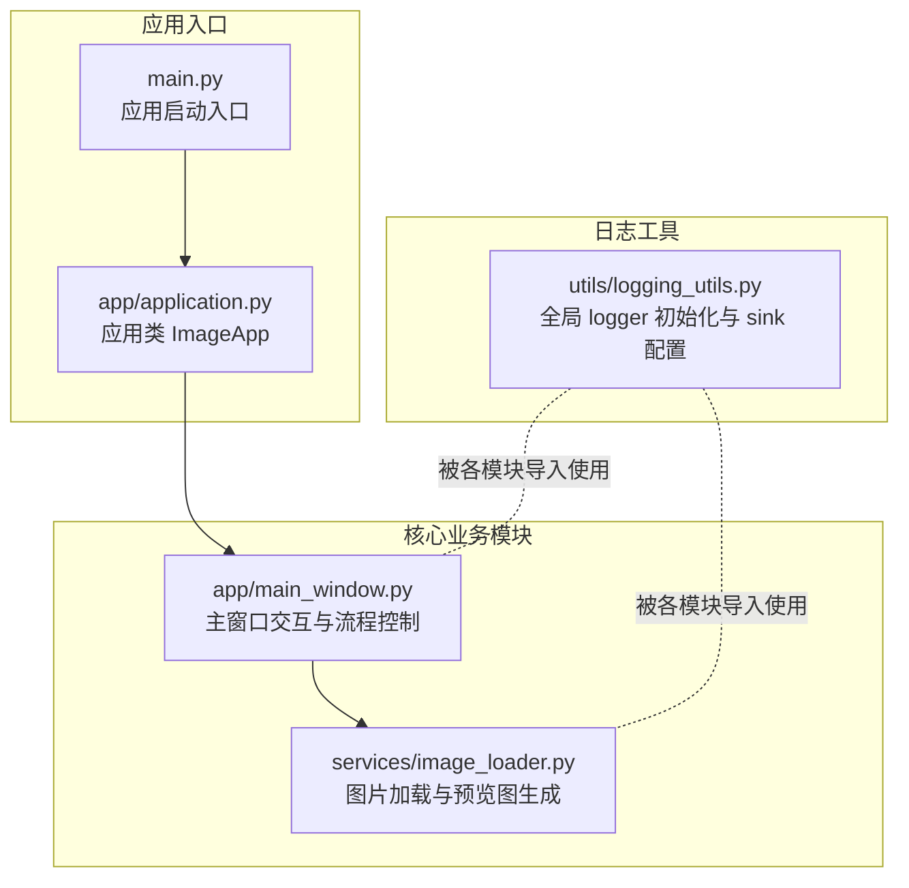
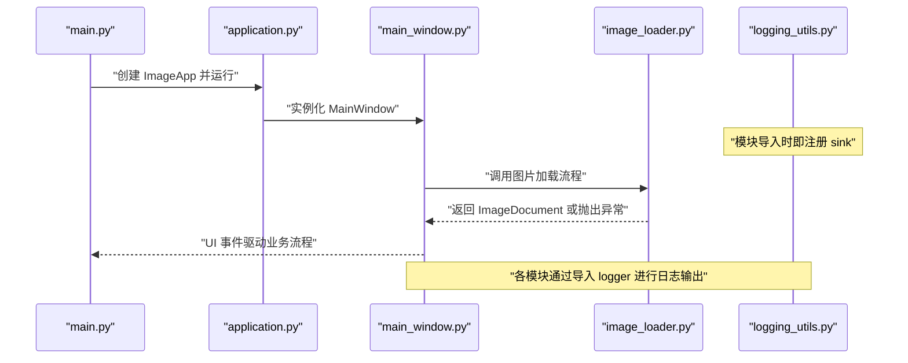
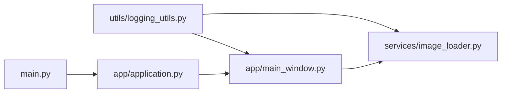

# 日志系统设计与使用

<cite>
**本文引用的文件列表**
- [img_slicer_tool/utils/logging_utils.py](file://img_slicer_tool/utils/logging_utils.py)
- [img_slicer_tool/main.py](file://img_slicer_tool/main.py)
- [img_slicer_tool/app/application.py](file://img_slicer_tool/app/application.py)
- [img_slicer_tool/app/main_window.py](file://img_slicer_tool/app/main_window.py)
- [img_slicer_tool/services/image_loader.py](file://img_slicer_tool/services/image_loader.py)
- [img_slicer_tool/requirements.txt](file://img_slicer_tool/requirements.txt)
</cite>

## 目录
1. [简介](#简介)
2. [项目结构](#项目结构)
3. [核心组件](#核心组件)
4. [架构总览](#架构总览)
5. [详细组件分析](#详细组件分析)
6. [依赖关系分析](#依赖关系分析)
7. [性能考量](#性能考量)
8. [故障排查指南](#故障排查指南)
9. [结论](#结论)

## 简介
本文件围绕 img_slicer_tool 工程中的日志系统展开，重点说明如何通过 loguru 构建全局统一的日志记录机制。当前实现位于 utils/logging_utils.py 中，采用“模块级导入 + 全局 sink 添加”的方式，为应用提供结构化、异步写入、自动轮转的统一日志能力。本文将从模块初始化、日志配置、调用方式、文件路径与保留策略、性能与优化等方面进行系统性阐述，并给出在核心模块（如 main_window.py、image_loader.py）中的使用建议与示例路径。

## 项目结构
日志系统的核心文件与相关模块如下所示：

图表来源
- [img_slicer_tool/utils/logging_utils.py](file://img_slicer_tool/utils/logging_utils.py#L1-L6)
- [img_slicer_tool/main.py](file://img_slicer_tool/main.py#L1-L13)
- [img_slicer_tool/app/application.py](file://img_slicer_tool/app/application.py#L1-L35)
- [img_slicer_tool/app/main_window.py](file://img_slicer_tool/app/main_window.py#L1-L364)
- [img_slicer_tool/services/image_loader.py](file://img_slicer_tool/services/image_loader.py#L1-L68)

章节来源
- [img_slicer_tool/utils/logging_utils.py](file://img_slicer_tool/utils/logging_utils.py#L1-L6)
- [img_slicer_tool/main.py](file://img_slicer_tool/main.py#L1-L13)
- [img_slicer_tool/app/application.py](file://img_slicer_tool/app/application.py#L1-L35)

## 核心组件
- 日志工具模块：在 utils/logging_utils.py 中引入 loguru 的 logger，并添加一个文件 sink，配置为每文件大小达到 5 MB 自动轮转，UTF-8 编码，以及启用异步队列 enqueue=True，确保主线程不受阻塞。
- 应用入口：main.py 启动应用；application.py 创建并显示主窗口；main_window.py 实现用户交互与业务流程；image_loader.py 负责图片加载与预览图生成。
- 依赖声明：requirements.txt 明确包含 loguru 作为可选但推荐的依赖项。

章节来源
- [img_slicer_tool/utils/logging_utils.py](file://img_slicer_tool/utils/logging_utils.py#L1-L6)
- [img_slicer_tool/requirements.txt](file://img_slicer_tool/requirements.txt#L1-L14)

## 架构总览
下图展示了日志系统在应用生命周期中的位置与调用关系：

图表来源
- [img_slicer_tool/main.py](file://img_slicer_tool/main.py#L1-L13)
- [img_slicer_tool/app/application.py](file://img_slicer_tool/app/application.py#L1-L35)
- [img_slicer_tool/app/main_window.py](file://img_slicer_tool/app/main_window.py#L1-L364)
- [img_slicer_tool/services/image_loader.py](file://img_slicer_tool/services/image_loader.py#L1-L68)
- [img_slicer_tool/utils/logging_utils.py](file://img_slicer_tool/utils/logging_utils.py#L1-L6)

## 详细组件分析

### 日志工具模块（logging_utils.py）
- 初始化与 sink 配置
  - 引入 loguru 的 logger。
  - 通过 logger.add 添加文件 sink，目标文件为 img_slicer.log（相对路径），配置包含：
    - rotation="5 MB"：单文件大小达到 5MB 自动轮转。
    - encoding="utf-8"：统一编码。
    - enqueue=True：启用异步队列，避免阻塞调用线程。
- 结构化输出
  - 当前未显式设置自定义格式器，loguru 默认会输出时间、级别、消息等字段，便于快速定位问题。
- 双端输出
  - 当前仅配置了文件 sink。若需同时输出到控制台，可在 logger.add 中追加标准输出 sink。
- 日志级别
  - 当前未设置全局级别过滤。可通过 logger.remove() 后重新 add 并指定 level 参数来控制输出级别（例如 INFO/DEBUG/WARNING/ERROR）。
- 文件轮转与保留策略
  - 采用基于大小的轮转策略，未配置保留天数或数量上限。建议结合项目需求增加保留策略（如保留最近 N 份轮转文件）。

章节来源
- [img_slicer_tool/utils/logging_utils.py](file://img_slicer_tool/utils/logging_utils.py#L1-L6)

### 应用入口与主窗口（main.py、application.py、main_window.py）
- 入口与应用类
  - main.py 调用 ImageApp.run() 启动 Qt 应用。
  - application.py 创建 QApplication 与 MainWindow，并负责应用图标与样式表的配置。
- 主窗口交互
  - main_window.py 处理菜单、工具栏、状态栏与拖拽等交互，内部调用服务层（如图片加载、切图）。
  - 在异常处理中使用 QMessageBox 提示用户，但未见直接的日志输出。建议在关键路径中加入 logger 记录，以便后续排查。

章节来源
- [img_slicer_tool/main.py](file://img_slicer_tool/main.py#L1-L13)
- [img_slicer_tool/app/application.py](file://img_slicer_tool/app/application.py#L1-L35)
- [img_slicer_tool/app/main_window.py](file://img_slicer_tool/app/main_window.py#L1-L364)

### 图片加载服务（image_loader.py）
- 功能概述
  - 读取本地图片，计算预览尺寸与缩放比例，生成 ImageDocument 对象。
  - 内部可能抛出 FileNotFoundError 等异常。
- 日志建议
  - 在 load_image_document 开始与结束处记录 INFO 级别日志，包含输入路径与关键参数。
  - 在异常发生时记录 ERROR 级别日志，附带异常类型与信息，便于定位问题。
  - 可在 _calc_preview_size 与 _pil_image_to_qimage 等关键步骤记录 DEBUG 级别日志，帮助分析性能瓶颈。

章节来源
- [img_slicer_tool/services/image_loader.py](file://img_slicer_tool/services/image_loader.py#L1-L68)

### 日志调用方式与示例路径
以下为在各模块中调用日志的示例路径（不直接展示代码内容）：
- 在 main_window.py 中的关键流程（如打开图片、执行切图、裁剪）前后添加日志记录，示例路径：
  - [img_slicer_tool/app/main_window.py](file://img_slicer_tool/app/main_window.py#L114-L135)
  - [img_slicer_tool/app/main_window.py](file://img_slicer_tool/app/main_window.py#L230-L262)
  - [img_slicer_tool/app/main_window.py](file://img_slicer_tool/app/main_window.py#L136-L192)
- 在 image_loader.py 中的关键流程（如 load_image_document、_calc_preview_size、_pil_image_to_qimage）前后添加日志记录，示例路径：
  - [img_slicer_tool/services/image_loader.py](file://img_slicer_tool/services/image_loader.py#L24-L55)
  - [img_slicer_tool/services/image_loader.py](file://img_slicer_tool/services/image_loader.py#L14-L22)
  - [img_slicer_tool/services/image_loader.py](file://img_slicer_tool/services/image_loader.py#L57-L68)

章节来源
- [img_slicer_tool/app/main_window.py](file://img_slicer_tool/app/main_window.py#L114-L192)
- [img_slicer_tool/app/main_window.py](file://img_slicer_tool/app/main_window.py#L230-L262)
- [img_slicer_tool/services/image_loader.py](file://img_slicer_tool/services/image_loader.py#L14-L68)

## 依赖关系分析
- 模块耦合
  - logging_utils.py 作为全局日志工具，被各业务模块以“导入 logger”的方式间接使用，耦合度低、复用性强。
- 直接与间接依赖
  - main.py 依赖 application.py；application.py 依赖 main_window.py；main_window.py 依赖 services/image_loader.py。
  - logging_utils.py 与上述模块无直接 import 关系，但通过模块导入触发全局 sink 注册。
- 外部依赖
  - requirements.txt 明确 loguru 依赖版本，保证日志库可用。

图表来源
- [img_slicer_tool/utils/logging_utils.py](file://img_slicer_tool/utils/logging_utils.py#L1-L6)
- [img_slicer_tool/main.py](file://img_slicer_tool/main.py#L1-L13)
- [img_slicer_tool/app/application.py](file://img_slicer_tool/app/application.py#L1-L35)
- [img_slicer_tool/app/main_window.py](file://img_slicer_tool/app/main_window.py#L1-L364)
- [img_slicer_tool/services/image_loader.py](file://img_slicer_tool/services/image_loader.py#L1-L68)

章节来源
- [img_slicer_tool/requirements.txt](file://img_slicer_tool/requirements.txt#L1-L14)

## 性能考量
- 异步写入
  - enqueue=True 已开启异步队列，降低 I/O 对主线程的影响，适合 GUI 应用场景。
- 日志级别与输出量
  - 建议在开发阶段使用 DEBUG/INFO，发布阶段提升至 INFO/ WARNING/ ERROR，减少冗余输出。
- 文件轮转
  - 当前采用 5 MB 轮转，建议结合磁盘空间与日志体量评估是否需要调整阈值或增加保留策略。
- 控制台输出
  - 若需同时输出到终端，可在 logger.add 中追加标准输出 sink，便于调试。

[本节为通用性能建议，无需特定文件来源]

## 故障排查指南
- 日志文件位置
  - 默认文件名为 img_slicer.log，位于当前工作目录（通常为应用根目录）。若需自定义路径，可在 logging_utils.py 中修改 logger.add 的路径参数。
- 查找与分析
  - 使用文本编辑器或命令行工具（如 tail/less）查看日志文件，结合时间戳与级别定位问题。
  - 在关键业务流程（打开图片、切图、裁剪）前后添加日志，有助于还原用户操作链路。
- 常见问题
  - 权限不足导致无法写入：检查当前目录写权限。
  - 日志过大占用空间：调整轮转阈值或增加保留策略。
  - 未看到日志：确认模块导入了 logger，且未被上层屏蔽级别。

章节来源
- [img_slicer_tool/utils/logging_utils.py](file://img_slicer_tool/utils/logging_utils.py#L1-L6)

## 结论
当前工程通过 utils/logging_utils.py 将 loguru 的全局 logger 注册为文件 sink，实现了统一、异步、可轮转的日志能力。建议在核心模块（如 main_window.py、image_loader.py）中按业务流程添加结构化日志，明确记录输入、关键中间态与异常信息；同时根据部署环境调整日志级别、轮转阈值与保留策略，以平衡可观测性与资源占用。