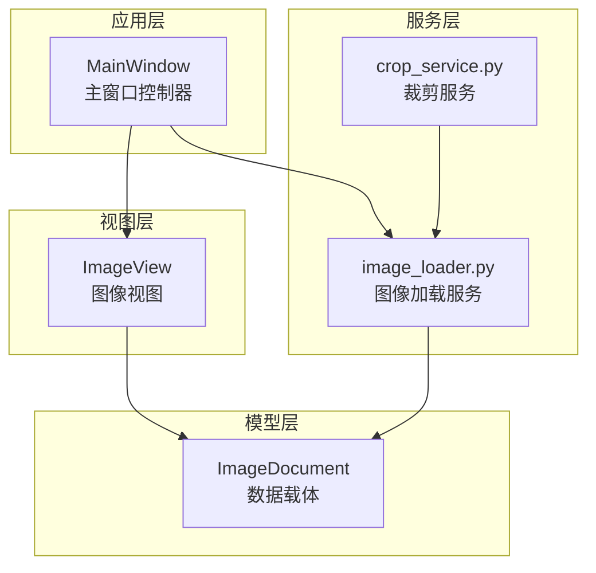
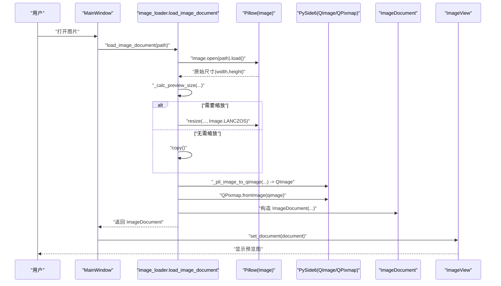
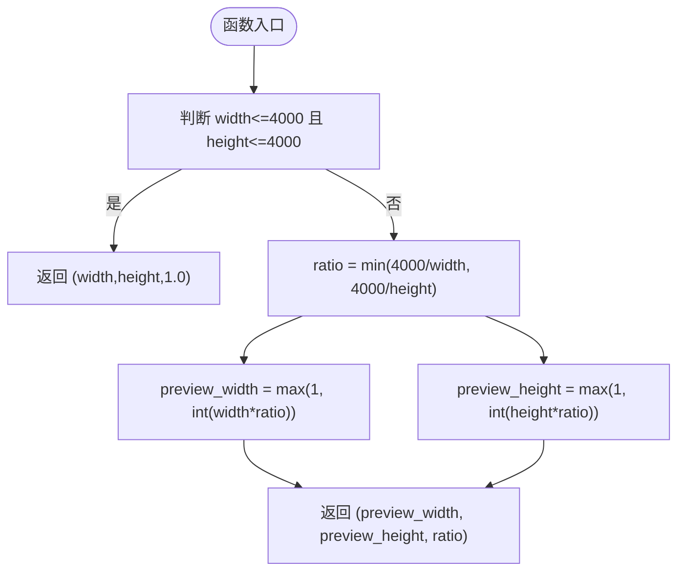
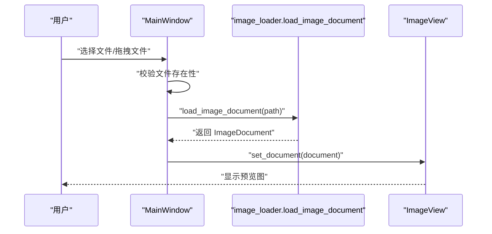
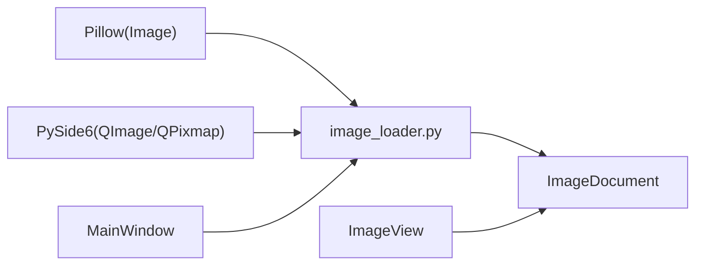

# 图像加载服务

<cite>
**本文引用的文件**
- [img_slicer_tool/services/image_loader.py](file://img_slicer_tool/services/image_loader.py)
- [img_slicer_tool/models/image_document.py](file://img_slicer_tool/models/image_document.py)
- [img_slicer_tool/app/main_window.py](file://img_slicer_tool/app/main_window.py)
- [img_slicer_tool/views/image_view.py](file://img_slicer_tool/views/image_view.py)
- [img_slicer_tool/services/crop_service.py](file://img_slicer_tool/services/crop_service.py)
</cite>

## 目录
1. [简介](#简介)
2. [项目结构](#项目结构)
3. [核心组件](#核心组件)
4. [架构总览](#架构总览)
5. [详细组件分析](#详细组件分析)
6. [依赖关系分析](#依赖关系分析)
7. [性能考量](#性能考量)
8. [故障排查指南](#故障排查指南)
9. [结论](#结论)

## 简介
本文件深入解析图像加载服务中的核心函数 load_image_document 的技术实现，涵盖：
- 通过 Pillow 安全加载多种图像格式（PNG/JPG/BMP/GIF/TIFF），并进行预览尺寸计算（最长边不超过 4000px）。
- RGB/RGBA 模式转换与 QImage 生成流程，最终封装为包含原始尺寸、预览尺寸、缩放比和 QPixmap 的 ImageDocument 对象。
- 异常处理机制（文件不存在、格式损坏等）。
- 与主窗口 MainWindow 的集成方式及在 MVC 架构中的角色定位。
- 提供调用示例：doc = load_image_document('test.jpg')。

## 项目结构
本项目采用分层组织：应用层（app）、视图层（views）、模型层（models）、服务层（services）与工具层（utils）。图像加载服务位于服务层，负责将底层图像数据转换为 UI 可直接使用的预览资源。

图表来源
- [img_slicer_tool/app/main_window.py](file://img_slicer_tool/app/main_window.py#L1-L140)
- [img_slicer_tool/views/image_view.py](file://img_slicer_tool/views/image_view.py#L60-L90)
- [img_slicer_tool/services/image_loader.py](file://img_slicer_tool/services/image_loader.py#L1-L68)
- [img_slicer_tool/models/image_document.py](file://img_slicer_tool/models/image_document.py#L1-L18)
- [img_slicer_tool/services/crop_service.py](file://img_slicer_tool/services/crop_service.py#L1-L37)

章节来源
- [img_slicer_tool/app/main_window.py](file://img_slicer_tool/app/main_window.py#L1-L140)
- [img_slicer_tool/views/image_view.py](file://img_slicer_tool/views/image_view.py#L60-L90)
- [img_slicer_tool/services/image_loader.py](file://img_slicer_tool/services/image_loader.py#L1-L68)
- [img_slicer_tool/models/image_document.py](file://img_slicer_tool/models/image_document.py#L1-L18)
- [img_slicer_tool/services/crop_service.py](file://img_slicer_tool/services/crop_service.py#L1-L37)

## 核心组件
- 图像加载服务：提供 load_image_document(path) 将磁盘图像转换为包含预览图的 ImageDocument。
- 数据模型：ImageDocument 以数据类形式承载路径、原始尺寸、预览尺寸、缩放比与预览 QPixmap。
- 主窗口控制器：负责触发加载、捕获异常并向视图展示结果。
- 视图组件：接收 ImageDocument 并渲染预览图，支持缩放、平移与交互。

章节来源
- [img_slicer_tool/services/image_loader.py](file://img_slicer_tool/services/image_loader.py#L1-L68)
- [img_slicer_tool/models/image_document.py](file://img_slicer_tool/models/image_document.py#L1-L18)
- [img_slicer_tool/app/main_window.py](file://img_slicer_tool/app/main_window.py#L100-L140)
- [img_slicer_tool/views/image_view.py](file://img_slicer_tool/views/image_view.py#L60-L90)

## 架构总览
图像加载服务在 MVC 中承担“服务层”职责，向上游提供统一的数据结构（ImageDocument），向下游（视图层）提供可直接渲染的预览资源。主窗口作为控制器协调用户交互与业务流程。

图表来源
- [img_slicer_tool/app/main_window.py](file://img_slicer_tool/app/main_window.py#L100-L140)
- [img_slicer_tool/services/image_loader.py](file://img_slicer_tool/services/image_loader.py#L24-L55)
- [img_slicer_tool/models/image_document.py](file://img_slicer_tool/models/image_document.py#L8-L18)
- [img_slicer_tool/views/image_view.py](file://img_slicer_tool/views/image_view.py#L60-L90)

## 详细组件分析

### 函数：load_image_document(path)
- 功能概述
  - 校验文件存在性，使用 Pillow 打开图像并加载像素数据。
  - 计算预览尺寸（最长边不超过 4000px），必要时进行高质量重采样。
  - 将预览图像转换为 QImage/QPixmap，构建 ImageDocument 并返回。
- 关键步骤
  - 文件存在性检查：若不存在则抛出 FileNotFoundError。
  - Pillow 打开与加载：确保像素数据已就绪。
  - 预览尺寸计算：调用 _calc_preview_size(width,height)。
  - 条件缩放：ratio != 1.0 时使用 LANCZOS 重采样；否则复制原图。
  - QImage/QPixmap 转换：调用 _pil_image_to_qimage，再由 QPixmap.fromImage 包装。
  - 缩放比计算：scale_x = original_width / preview_width；scale_y 同理。
  - 返回 ImageDocument：包含 path、原始尺寸、预览尺寸、缩放比与预览 QPixmap。
- 异常处理
  - 文件不存在：抛出 FileNotFoundError，由调用方（如 MainWindow）捕获并提示用户。
  - Pillow 打开失败或格式损坏：由 Pillow 抛出异常，调用方捕获并提示错误。
- 复杂度与性能
  - 时间复杂度：O(W×H)（读取与可能的缩放），W/H 为预览尺寸。
  - 空间复杂度：O(W×H)（预览图像像素缓冲）。
  - 使用 LANCZOS 重采样保证缩放质量，但会增加计算成本。
- 调用示例
  - doc = load_image_document('test.jpg')
  - 返回值 doc 即可直接传入视图层进行渲染。

章节来源
- [img_slicer_tool/services/image_loader.py](file://img_slicer_tool/services/image_loader.py#L24-L55)

#### 预览尺寸计算：_calc_preview_size(width,height)
- 输入：原始宽度与高度。
- 输出：预览宽度、预览高度与缩放比例 ratio。
- 算法要点
  - 若原始尺寸均不超过阈值（4000），直接返回原尺寸与 ratio=1.0。
  - 否则按较短边方向计算缩放比例 ratio=min(4000/width, 4000/height)，并向下取整至整像素，同时保证最小为 1。
- 流程图

图表来源
- [img_slicer_tool/services/image_loader.py](file://img_slicer_tool/services/image_loader.py#L14-L22)

章节来源
- [img_slicer_tool/services/image_loader.py](file://img_slicer_tool/services/image_loader.py#L14-L22)

#### RGB/RGBA 模式转换：_pil_image_to_qimage(pil_image)
- 输入：Pillow Image 对象（任意模式）。
- 输出：QImage 对象。
- 处理策略
  - 若模式为 "RGB"：直接以 "RGB" 格式打包字节并创建 QImage.Format_RGB888。
  - 若模式为 "RGBA"：直接以 "RGBA" 格式打包字节并创建 QImage.Format_RGBA8888。
  - 其他模式：先 convert("RGBA")，再以 "RGBA" 格式打包字节并创建 QImage.Format_RGBA8888。
- 注意事项
  - tobytes("raw","RGB"/"RGBA") 保证了与 Qt 像素布局一致。
  - 通过 QImage 构造函数指定宽高与格式，确保后续 QPixmap.fromImage 正确解析。

章节来源
- [img_slicer_tool/services/image_loader.py](file://img_slicer_tool/services/image_loader.py#L57-L68)

### 数据模型：ImageDocument
- 字段
  - path：图像路径。
  - original_width/original_height：原始宽高。
  - preview_width/preview_height：预览宽高。
  - scale_x/scale_y：原图与预览的缩放比。
  - preview_pixmap：预览图的 QPixmap。
- 作用
  - 作为服务层与视图层之间的契约数据结构，承载所有必要的渲染与坐标映射信息。

章节来源
- [img_slicer_tool/models/image_document.py](file://img_slicer_tool/models/image_document.py#L8-L18)

### 与主窗口的集成与 MVC 角色
- 触发点
  - 用户通过菜单或拖拽触发 MainWindow.load_image(image_path)。
- 控制器职责
  - 调用 load_image_document 加载图像，捕获异常并弹窗提示。
  - 将返回的 ImageDocument 传递给 ImageView.set_document，更新状态栏显示。
- 视图层职责
  - 接收 ImageDocument，使用 preview_pixmap 渲染预览，支持缩放与平移。
- 裁剪服务协作
  - crop_service 在需要时调用 load_image_document 重新加载裁剪后的结果，保持数据一致性。

图表来源
- [img_slicer_tool/app/main_window.py](file://img_slicer_tool/app/main_window.py#L100-L140)
- [img_slicer_tool/views/image_view.py](file://img_slicer_tool/views/image_view.py#L60-L90)
- [img_slicer_tool/services/image_loader.py](file://img_slicer_tool/services/image_loader.py#L24-L55)

章节来源
- [img_slicer_tool/app/main_window.py](file://img_slicer_tool/app/main_window.py#L100-L140)
- [img_slicer_tool/views/image_view.py](file://img_slicer_tool/views/image_view.py#L60-L90)
- [img_slicer_tool/services/crop_service.py](file://img_slicer_tool/services/crop_service.py#L1-L37)

## 依赖关系分析
- 组件耦合
  - image_loader 依赖 Pillow（PIL）进行图像读取与重采样，依赖 PySide6（QImage/QPixmap）进行 Qt 图像桥接。
  - image_loader 与 models.image_document 强耦合，后者作为契约数据结构被前者构造并返回。
  - main_window 依赖 image_loader 与 views.image_view，形成典型的 MVC 控制器-视图关系。
- 外部依赖
  - Pillow 支持 PNG/JPG/BMP/GIF/TIFF 等常见格式，满足多格式兼容需求。
  - Qt 的 QImage/QPixmap 提供跨平台图像表示与渲染能力。

图表来源
- [img_slicer_tool/services/image_loader.py](file://img_slicer_tool/services/image_loader.py#L1-L68)
- [img_slicer_tool/models/image_document.py](file://img_slicer_tool/models/image_document.py#L1-L18)
- [img_slicer_tool/app/main_window.py](file://img_slicer_tool/app/main_window.py#L1-L140)
- [img_slicer_tool/views/image_view.py](file://img_slicer_tool/views/image_view.py#L60-L90)

章节来源
- [img_slicer_tool/services/image_loader.py](file://img_slicer_tool/services/image_loader.py#L1-L68)
- [img_slicer_tool/models/image_document.py](file://img_slicer_tool/models/image_document.py#L1-L18)
- [img_slicer_tool/app/main_window.py](file://img_slicer_tool/app/main_window.py#L1-L140)
- [img_slicer_tool/views/image_view.py](file://img_slicer_tool/views/image_view.py#L60-L90)

## 性能考量
- 预览尺寸上限
  - 最长边限制为 4000px，避免超大图像导致内存与渲染压力过大。
- 重采样算法
  - 使用 LANCZOS 重采样保证缩放质量，但计算成本较高；对于超大图建议异步加载或分块处理。
- 内存占用
  - 预览图像像素缓冲 O(W×H)，需关注超大图的内存峰值。
- I/O 与解码
  - Pillow 打开与 load() 已确保像素数据就绪，减少后续访问延迟。
- 建议
  - 对于极高分辨率图像，可在 UI 层引入懒加载与缓存策略，避免一次性加载全部金字塔层级。

## 故障排查指南
- 常见异常
  - 文件不存在：抛出 FileNotFoundError，由 MainWindow 捕获并提示“文件不存在”。
  - 格式损坏或不受支持：Pillow 打开时抛出异常，MainWindow 捕获并提示“加载图片出错”。
- 排查步骤
  - 确认路径正确且文件存在。
  - 检查图像格式是否受 Pillow 支持（PNG/JPG/BMP/GIF/TIFF）。
  - 查看状态栏提示与错误对话框，定位具体问题。
- 与裁剪服务的联动
  - crop_service 在裁剪后会重新调用 load_image_document 以刷新文档，若出现异常，同样由调用方捕获并提示。

章节来源
- [img_slicer_tool/app/main_window.py](file://img_slicer_tool/app/main_window.py#L115-L135)
- [img_slicer_tool/services/crop_service.py](file://img_slicer_tool/services/crop_service.py#L1-L37)

## 结论
- load_image_document 通过 Pillow 安全加载图像并生成高质量预览，结合 Qt 图像桥接，为视图层提供稳定的渲染基础。
- ImageDocument 作为契约数据结构，清晰承载原始尺寸、预览尺寸、缩放比与预览图资源，便于后续裁剪与切图流程复用。
- 在 MVC 架构中，服务层专注于数据准备，控制器负责流程编排，视图层专注渲染与交互，三者职责清晰、耦合合理。
- 针对超大图像，建议在现有基础上引入异步加载与缓存策略，进一步提升用户体验与系统稳定性。