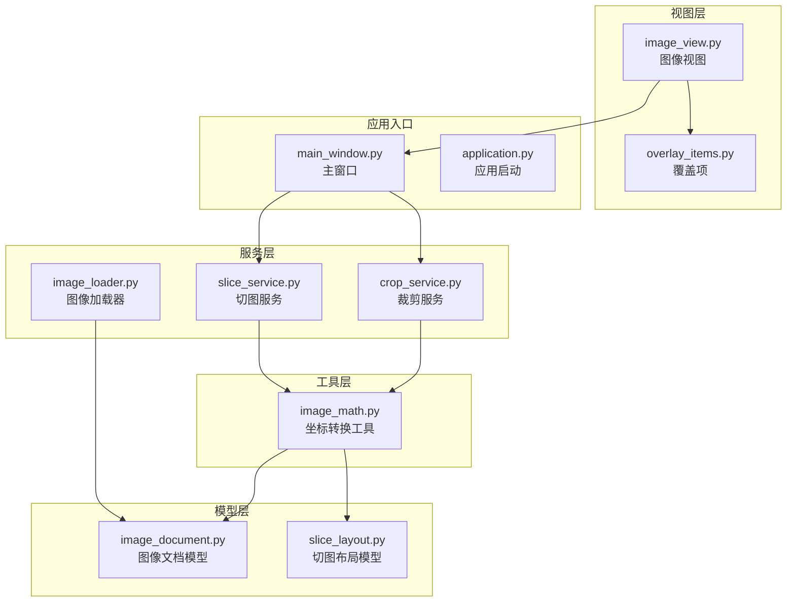
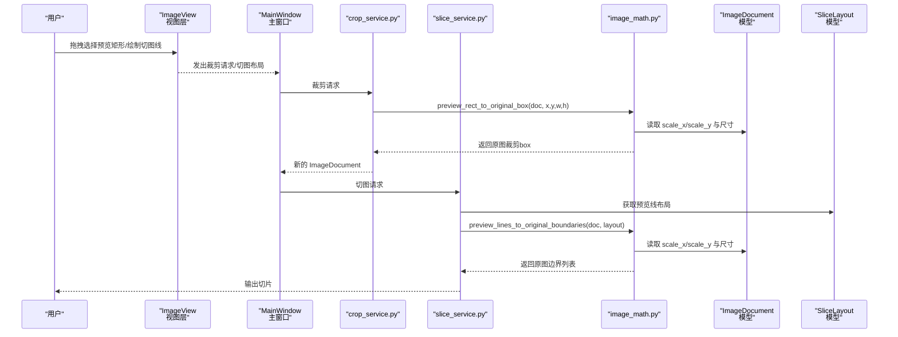
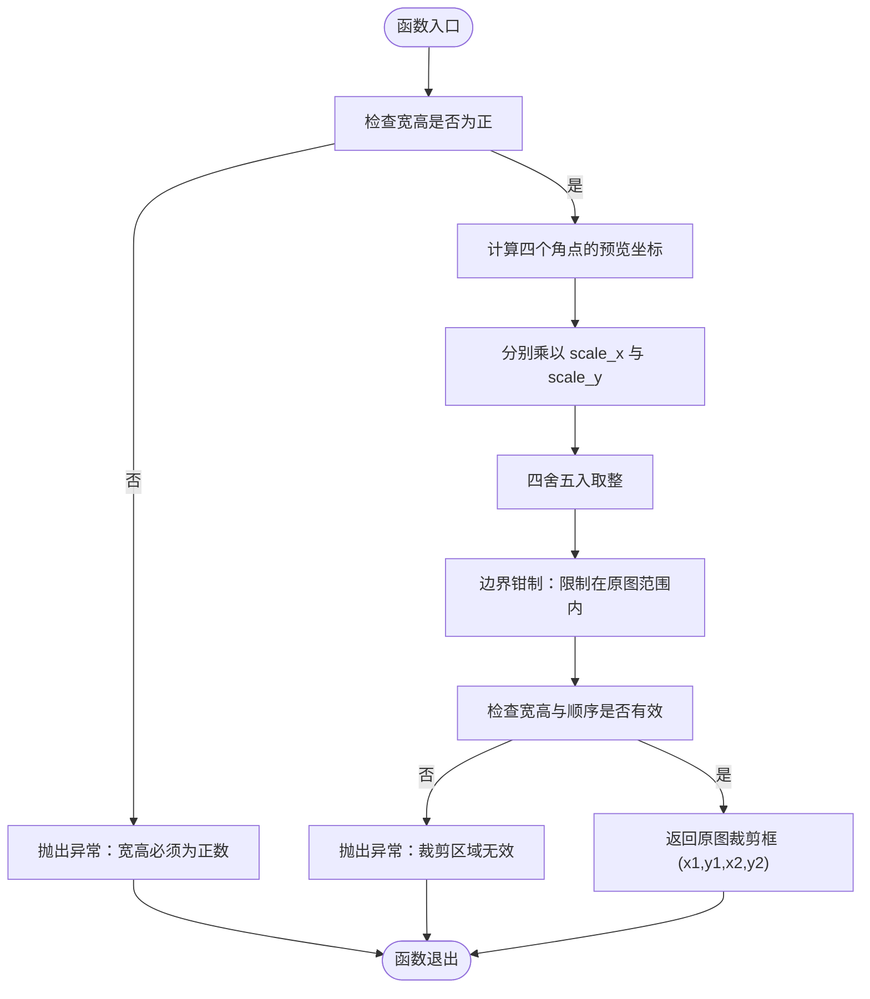
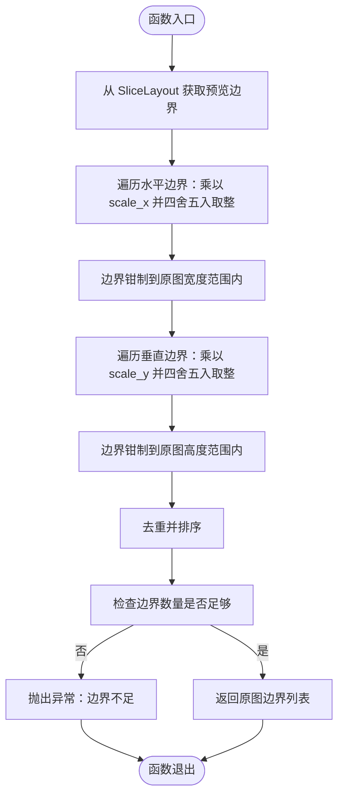
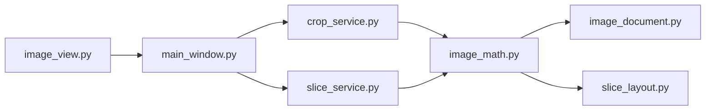

# 图像数学工具

<cite>
**本文引用的文件**
- [img_slicer_tool/utils/image_math.py](file://img_slicer_tool/utils/image_math.py)
- [img_slicer_tool/models/image_document.py](file://img_slicer_tool/models/image_document.py)
- [img_slicer_tool/models/slice_layout.py](file://img_slicer_tool/models/slice_layout.py)
- [img_slicer_tool/services/crop_service.py](file://img_slicer_tool/services/crop_service.py)
- [img_slicer_tool/services/slice_service.py](file://img_slicer_tool/services/slice_service.py)
- [img_slicer_tool/services/image_loader.py](file://img_slicer_tool/services/image_loader.py)
- [img_slicer_tool/views/image_view.py](file://img_slicer_tool/views/image_view.py)
- [img_slicer_tool/app/main_window.py](file://img_slicer_tool/app/main_window.py)
- [img_slicer_tool/views/overlay_items.py](file://img_slicer_tool/views/overlay_items.py)
- [img_slicer_tool/app/application.py](file://img_slicer_tool/app/application.py)
- [img_slicer_tool/README.md](file://img_slicer_tool/README.md)
</cite>

## 目录
1. [简介](#简介)
2. [项目结构](#项目结构)
3. [核心组件](#核心组件)
4. [架构总览](#架构总览)
5. [详细组件分析](#详细组件分析)
6. [依赖关系分析](#依赖关系分析)
7. [性能考量](#性能考量)
8. [故障排查指南](#故障排查指南)
9. [结论](#结论)

## 简介
本文件系统性地文档化图像数学工具模块，聚焦于坐标转换函数的数学原理与实现细节，特别是如何将“预览图坐标”（视口坐标）精确映射回“原图像素坐标”，从而保证裁剪与切图的准确性。内容涵盖：
- 预览坐标到原图坐标的映射原理与实现
- 辅助函数的向量计算逻辑与边界校验机制
- 浮点坐标舍入策略与整数精度保持方法
- 非等比缩放下坐标转换的正确性保障
- 作为服务层基础支撑的关键作用

## 项目结构
该模块位于工具层，服务于视图层与服务层：
- 工具层：提供数学工具函数（坐标转换、边界计算）
- 视图层：负责用户交互与预览图渲染
- 服务层：负责业务流程（裁剪、切图）与调用工具层进行坐标转换

图表来源
- [img_slicer_tool/utils/image_math.py](file://img_slicer_tool/utils/image_math.py#L1-L76)
- [img_slicer_tool/models/image_document.py](file://img_slicer_tool/models/image_document.py#L1-L18)
- [img_slicer_tool/models/slice_layout.py](file://img_slicer_tool/models/slice_layout.py#L1-L30)
- [img_slicer_tool/services/crop_service.py](file://img_slicer_tool/services/crop_service.py#L1-L38)
- [img_slicer_tool/services/slice_service.py](file://img_slicer_tool/services/slice_service.py#L1-L62)
- [img_slicer_tool/services/image_loader.py](file://img_slicer_tool/services/image_loader.py#L1-L68)
- [img_slicer_tool/views/image_view.py](file://img_slicer_tool/views/image_view.py#L1-L542)
- [img_slicer_tool/views/overlay_items.py](file://img_slicer_tool/views/overlay_items.py#L1-L64)
- [img_slicer_tool/app/main_window.py](file://img_slicer_tool/app/main_window.py#L1-L364)
- [img_slicer_tool/app/application.py](file://img_slicer_tool/app/application.py#L1-L35)

章节来源
- [img_slicer_tool/README.md](file://img_slicer_tool/README.md#L1-L9)

## 核心组件
- 预览矩形到原图裁剪框映射：将预览图中的矩形区域映射到原图像素坐标，并进行边界校验与有效性检查。
- 预览线到原图边界映射：将预览图中的切图线转换为原图中的边界坐标集合，用于生成宫格切图。

章节来源
- [img_slicer_tool/utils/image_math.py](file://img_slicer_tool/utils/image_math.py#L17-L76)

## 架构总览
下图展示从用户交互到最终裁剪/切图的端到端流程，突出工具层在坐标转换中的关键作用。

图表来源
- [img_slicer_tool/views/image_view.py](file://img_slicer_tool/views/image_view.py#L154-L235)
- [img_slicer_tool/app/main_window.py](file://img_slicer_tool/app/main_window.py#L136-L193)
- [img_slicer_tool/services/crop_service.py](file://img_slicer_tool/services/crop_service.py#L13-L38)
- [img_slicer_tool/services/slice_service.py](file://img_slicer_tool/services/slice_service.py#L12-L62)
- [img_slicer_tool/utils/image_math.py](file://img_slicer_tool/utils/image_math.py#L17-L76)
- [img_slicer_tool/models/image_document.py](file://img_slicer_tool/models/image_document.py#L8-L18)
- [img_slicer_tool/models/slice_layout.py](file://img_slicer_tool/models/slice_layout.py#L19-L30)

## 详细组件分析

### 组件一：预览矩形到原图裁剪框映射（preview_rect_to_original_box）
- 数学原理
  - 预览图与原图之间存在缩放关系，缩放因子由模型中的 scale_x 与 scale_y 决定。将预览矩形的四个角点分别乘以对应缩放因子，即可得到原图坐标。
  - 由于浮点运算可能引入微小误差，采用“四舍五入取整”的策略，确保像素坐标为整数。
  - 为避免越界，对映射后的坐标进行边界钳制，使其落入原图有效范围内。
  - 最终对映射结果进行有效性检查，确保生成的裁剪框宽高为正且顺序合理。
- 实现要点
  - 输入参数：预览矩形的左上角与宽高（x, y, w, h），以及 ImageDocument。
  - 计算步骤：将四个角点坐标乘以 scale_x/scale_y 并四舍五入取整；对每个坐标进行边界钳制；再次检查宽高与顺序的有效性。
  - 输出：原图坐标系下的裁剪框（x1, y1, x2, y2）。
- 错误处理
  - 当宽或高非正时抛出异常。
  - 当映射后宽高或顺序无效时抛出异常。
- 性能特征
  - 时间复杂度：O(1)，常数次算术与比较操作。
  - 空间复杂度：O(1)，只使用少量临时变量。
- 正确性保障（非等比缩放）
  - 即使 scale_x 与 scale_y 不相等，仍可分别对 x 与 y 方向进行映射，保证各方向的坐标独立正确。
  - 四舍五入与边界钳制共同确保像素对齐与不越界。
- 使用示例（路径引用）
  - 调用入口：[crop_service.py](file://img_slicer_tool/services/crop_service.py#L23-L33)
  - 函数定义：[image_math.py](file://img_slicer_tool/utils/image_math.py#L17-L48)

图表来源
- [img_slicer_tool/utils/image_math.py](file://img_slicer_tool/utils/image_math.py#L17-L48)
- [img_slicer_tool/models/image_document.py](file://img_slicer_tool/models/image_document.py#L8-L18)

章节来源
- [img_slicer_tool/utils/image_math.py](file://img_slicer_tool/utils/image_math.py#L17-L48)
- [img_slicer_tool/services/crop_service.py](file://img_slicer_tool/services/crop_service.py#L13-L38)
- [img_slicer_tool/models/image_document.py](file://img_slicer_tool/models/image_document.py#L8-L18)

### 组件二：预览线到原图边界映射（preview_lines_to_original_boundaries）
- 数学原理
  - 预览图中的切图线（水平/垂直）通过 SliceLayout 在预览尺寸下生成边界列表。将这些边界值分别乘以 scale_x 或 scale_y 并四舍五入取整，得到原图中的边界坐标。
  - 对每个边界值进行边界钳制，确保不超过原图范围。
  - 去重并排序，形成可用于切图的边界序列。
- 实现要点
  - 输入参数：ImageDocument 与 SliceLayout。
  - 计算步骤：先从布局获取预览边界，再对每个边界值乘以对应缩放因子并四舍五入取整，随后进行去重、排序与有效性检查。
  - 输出：原图中的水平与垂直边界列表。
- 错误处理
  - 当边界数量不足时抛出异常，无法生成有效宫格。
- 性能特征
  - 时间复杂度：O(n log n)，主要由排序决定；n 为预览边界数量。
  - 空间复杂度：O(n)，存储边界列表。
- 使用示例（路径引用）
  - 调用入口：[slice_service.py](file://img_slicer_tool/services/slice_service.py#L33-L40)
  - 函数定义：[image_math.py](file://img_slicer_tool/utils/image_math.py#L50-L76)

图表来源
- [img_slicer_tool/utils/image_math.py](file://img_slicer_tool/utils/image_math.py#L50-L76)
- [img_slicer_tool/models/slice_layout.py](file://img_slicer_tool/models/slice_layout.py#L19-L30)
- [img_slicer_tool/models/image_document.py](file://img_slicer_tool/models/image_document.py#L8-L18)

章节来源
- [img_slicer_tool/utils/image_math.py](file://img_slicer_tool/utils/image_math.py#L50-L76)
- [img_slicer_tool/services/slice_service.py](file://img_slicer_tool/services/slice_service.py#L12-L62)
- [img_slicer_tool/models/slice_layout.py](file://img_slicer_tool/models/slice_layout.py#L19-L30)
- [img_slicer_tool/models/image_document.py](file://img_slicer_tool/models/image_document.py#L8-L18)

### 组件三：辅助函数与边界校验机制
- 辅助函数
  - 本模块未直接提供“点到原图坐标”的单点映射函数，但可通过矩形映射间接实现：将点扩展为极小矩形，再调用预览矩形映射函数。
  - 另一种思路是在调用方处对单点坐标进行同样的缩放与舍入处理，但需注意边界钳制与有效性检查。
- 边界校验
  - 对每个映射后的坐标进行边界钳制，确保落在原图有效范围内。
  - 对矩形映射后的宽高与顺序进行二次检查，防止无效裁剪框。
- 浮点舍入策略
  - 使用“四舍五入取整”策略，保证像素对齐，避免亚像素偏移导致的裁剪偏差。
- 整数精度保持
  - 将浮点中间结果转换为整数后再参与后续比较与计算，避免浮点误差累积。

章节来源
- [img_slicer_tool/utils/image_math.py](file://img_slicer_tool/utils/image_math.py#L29-L47)
- [img_slicer_tool/utils/image_math.py](file://img_slicer_tool/utils/image_math.py#L57-L71)

### 组件四：非等比缩放下的正确性保障
- 缩放因子独立映射
  - x 与 y 方向分别乘以不同的缩放因子，确保在任意纵横比下都能准确映射。
- 边界钳制与有效性检查
  - 通过边界钳制与宽高/顺序检查，消除越界与无效区域的风险。
- 浮点舍入
  - 四舍五入取整确保像素对齐，避免因舍入方向不同造成的裁剪偏差。

章节来源
- [img_slicer_tool/utils/image_math.py](file://img_slicer_tool/utils/image_math.py#L34-L47)
- [img_slicer_tool/utils/image_math.py](file://img_slicer_tool/utils/image_math.py#L57-L71)
- [img_slicer_tool/services/image_loader.py](file://img_slicer_tool/services/image_loader.py#L42-L43)

### 组件五：作为服务层基础支撑的关键作用
- 裁剪服务
  - 通过预览矩形映射得到原图裁剪框，直接传递给 PIL 的 crop 接口，保证裁剪精度。
- 切图服务
  - 通过预览线映射得到原图边界，驱动切图循环，确保每一片都落在原图有效区域内。
- 与视图层的协作
  - 视图层负责收集用户在预览图上的交互（矩形选择、切图线绘制），工具层将其转换为原图坐标，服务层据此执行业务操作。

章节来源
- [img_slicer_tool/services/crop_service.py](file://img_slicer_tool/services/crop_service.py#L13-L38)
- [img_slicer_tool/services/slice_service.py](file://img_slicer_tool/services/slice_service.py#L12-L62)
- [img_slicer_tool/views/image_view.py](file://img_slicer_tool/views/image_view.py#L154-L235)
- [img_slicer_tool/app/main_window.py](file://img_slicer_tool/app/main_window.py#L136-L193)

## 依赖关系分析
- 工具层依赖模型层
  - image_math.py 依赖 ImageDocument 提供的缩放因子与尺寸信息。
  - image_math.py 依赖 SliceLayout 提供的预览边界。
- 服务层依赖工具层
  - crop_service 与 slice_service 分别调用 image_math 中的映射函数。
- 视图层依赖服务层
  - 主窗口在用户触发裁剪/切图后，调用服务层并进一步依赖工具层完成坐标转换。

图表来源
- [img_slicer_tool/utils/image_math.py](file://img_slicer_tool/utils/image_math.py#L1-L76)
- [img_slicer_tool/models/image_document.py](file://img_slicer_tool/models/image_document.py#L8-L18)
- [img_slicer_tool/models/slice_layout.py](file://img_slicer_tool/models/slice_layout.py#L19-L30)
- [img_slicer_tool/services/crop_service.py](file://img_slicer_tool/services/crop_service.py#L13-L38)
- [img_slicer_tool/services/slice_service.py](file://img_slicer_tool/services/slice_service.py#L12-L62)
- [img_slicer_tool/views/image_view.py](file://img_slicer_tool/views/image_view.py#L154-L235)
- [img_slicer_tool/app/main_window.py](file://img_slicer_tool/app/main_window.py#L136-L193)

## 性能考量
- 时间复杂度
  - 预览矩形映射：O(1)
  - 预览线映射：O(n log n)，n 为预览边界数量（排序主导）
- 空间复杂度
  - O(1)（矩形映射）与 O(n)（线映射）
- 优化建议
  - 若预览边界数量较大，可在布局阶段减少冗余线条，降低排序成本。
  - 在批量切图时，尽量复用已计算的边界列表，避免重复映射。

## 故障排查指南
- 常见问题与定位
  - “裁剪宽高必须为正数”：检查调用方传入的预览矩形宽高是否合法。
  - “裁剪区域过小或无效”：检查映射后的宽高与顺序，确认边界钳制是否导致退化。
  - “切图边界不足，无法生成宫格”：检查 SliceLayout 是否包含足够的预览边界，或是否被过滤掉。
- 定位方法
  - 在调用前打印预览尺寸与缩放因子，核对映射过程。
  - 在映射后打印原图边界与裁剪框，确认是否越界或退化。
- 相关实现参考
  - 异常抛出与边界检查：[image_math.py](file://img_slicer_tool/utils/image_math.py#L26-L47)
  - 切图边界不足检查：[image_math.py](file://img_slicer_tool/utils/image_math.py#L72-L74)

章节来源
- [img_slicer_tool/utils/image_math.py](file://img_slicer_tool/utils/image_math.py#L26-L47)
- [img_slicer_tool/utils/image_math.py](file://img_slicer_tool/utils/image_math.py#L72-L74)

## 结论
- image_math.py 提供了两类关键的坐标转换能力：预览矩形到原图裁剪框、预览线到原图边界。
- 通过 scale_x/scale_y 的独立映射、四舍五入取整与边界钳制，确保在任意纵横比下都能实现像素级精确映射。
- 该模块作为服务层的基础支撑，为裁剪与切图提供了可靠、稳定的数学基石，保障了最终输出的准确性与一致性。