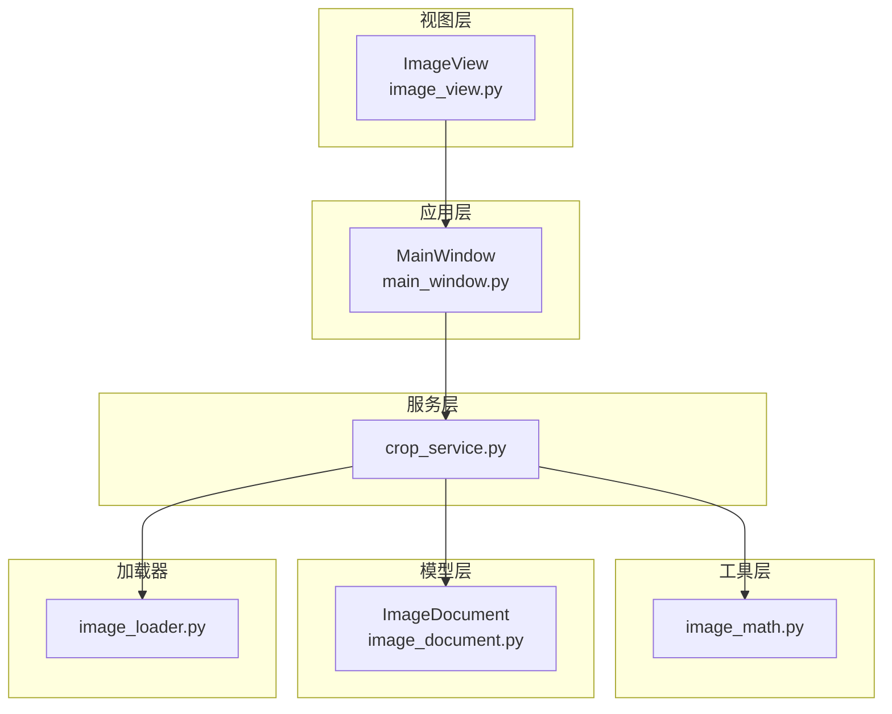
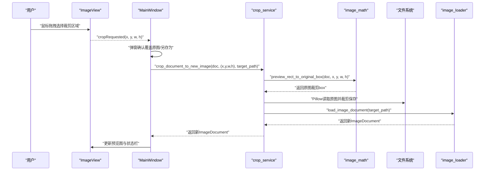
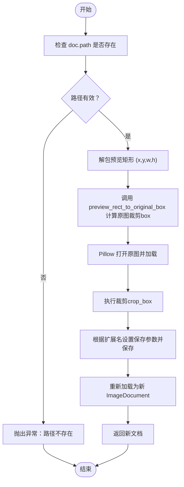
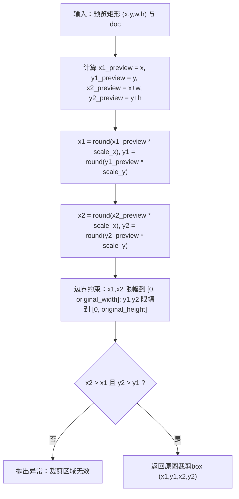
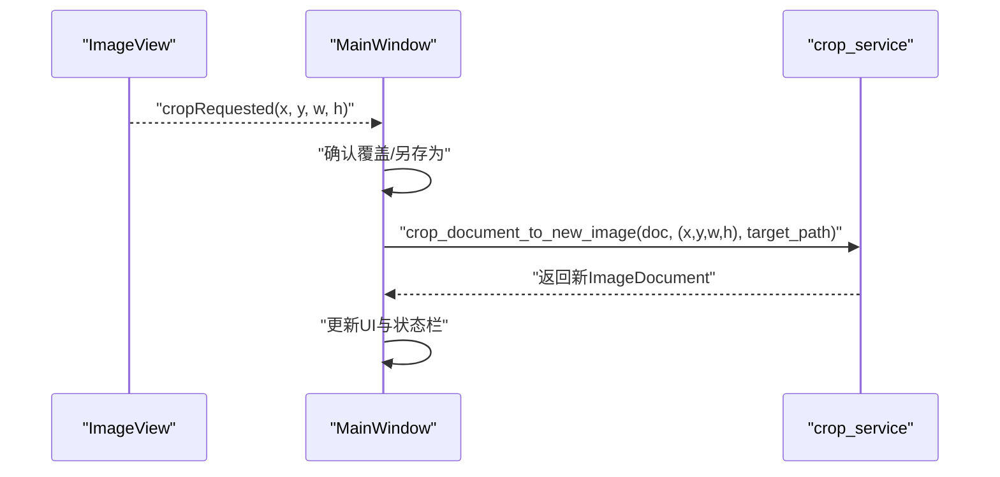
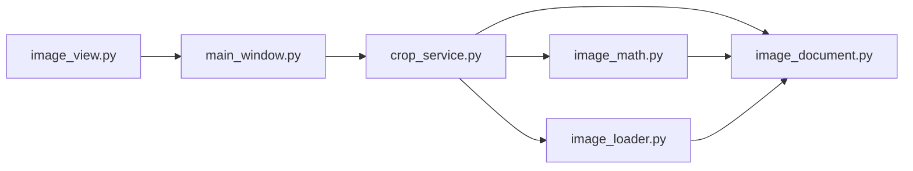

# 图像裁剪服务

<cite>
**本文引用的文件**
- [crop_service.py](file://img_slicer_tool/services/crop_service.py)
- [image_math.py](file://img_slicer_tool/utils/image_math.py)
- [image_document.py](file://img_slicer_tool/models/image_document.py)
- [image_loader.py](file://img_slicer_tool/services/image_loader.py)
- [image_view.py](file://img_slicer_tool/views/image_view.py)
- [main_window.py](file://img_slicer_tool/app/main_window.py)
</cite>

## 目录
1. [简介](#简介)
2. [项目结构](#项目结构)
3. [核心组件](#核心组件)
4. [架构总览](#架构总览)
5. [详细组件分析](#详细组件分析)
6. [依赖关系分析](#依赖关系分析)
7. [性能考量](#性能考量)
8. [故障排查指南](#故障排查指南)
9. [结论](#结论)

## 简介
本文件围绕 `crop_service.py` 中的 `crop_document_to_new_image` 函数，系统阐述其工作流程与关键实现要点。该函数负责：
- 接收一个包含预览信息的图像文档对象与预览坐标矩形；
- 通过 `image_math.py` 的坐标映射函数将预览坐标转换为原图裁剪 box；
- 使用 Pillow 在原图上执行精确裁剪；
- 将裁剪结果保存到目标路径；
- 重新加载为新的图像文档对象并返回。

同时，本文将重点解析 `scale_x` 和 `scale_y` 在坐标转换中的作用，说明为何裁剪后需要重新加载为新 `ImageDocument`，并给出输入参数验证、文件覆盖策略与常见错误处理（如路径无效、磁盘空间不足等）的实现细节。最后，结合代码示例展示从 `ImageView` 发出 `cropRequested` 信号到服务执行的完整调用链。

## 项目结构
本项目采用“视图-服务-模型-工具”分层组织，裁剪功能涉及以下关键文件：
- 视图层：`views/image_view.py` 提供用户交互与信号发射；
- 应用层：`app/main_window.py` 负责业务协调与对话框交互；
- 服务层：`services/crop_service.py` 实现裁剪逻辑；
- 工具层：`utils/image_math.py` 提供坐标映射；
- 模型层：`models/image_document.py` 描述图像文档数据结构；
- 加载器：`services/image_loader.py` 用于重新加载裁剪结果为新文档。

图表来源
- [image_view.py](file://img_slicer_tool/views/image_view.py#L24-L31)
- [main_window.py](file://img_slicer_tool/app/main_window.py#L87-L101)
- [crop_service.py](file://img_slicer_tool/services/crop_service.py#L13-L37)
- [image_math.py](file://img_slicer_tool/utils/image_math.py#L17-L48)
- [image_document.py](file://img_slicer_tool/models/image_document.py#L8-L17)
- [image_loader.py](file://img_slicer_tool/services/image_loader.py#L24-L54)

章节来源
- [image_view.py](file://img_slicer_tool/views/image_view.py#L24-L31)
- [main_window.py](file://img_slicer_tool/app/main_window.py#L87-L101)
- [crop_service.py](file://img_slicer_tool/services/crop_service.py#L13-L37)
- [image_math.py](file://img_slicer_tool/utils/image_math.py#L17-L48)
- [image_document.py](file://img_slicer_tool/models/image_document.py#L8-L17)
- [image_loader.py](file://img_slicer_tool/services/image_loader.py#L24-L54)

## 核心组件
- ImageDocument：承载原图路径、原图宽高、预览宽高、预览图 QPixmap 以及坐标映射比例 `scale_x`、`scale_y`。
- crop_document_to_new_image：核心裁剪服务函数，负责参数校验、坐标转换、裁剪与保存、重新加载新文档。
- preview_rect_to_original_box：将预览坐标矩形映射到原图裁剪 box 的工具函数。
- load_image_document：将磁盘上的图像文件重新加载为新的 ImageDocument。

章节来源
- [image_document.py](file://img_slicer_tool/models/image_document.py#L8-L17)
- [crop_service.py](file://img_slicer_tool/services/crop_service.py#L13-L37)
- [image_math.py](file://img_slicer_tool/utils/image_math.py#L17-L48)
- [image_loader.py](file://img_slicer_tool/services/image_loader.py#L24-L54)

## 架构总览
从用户在 `ImageView` 上框选裁剪区域，到 `MainWindow` 处理并调用 `crop_service`，再到 `image_math` 进行坐标转换、Pillow 执行裁剪与保存，最终由 `image_loader` 重新加载为新文档返回，形成清晰的调用链。

图表来源
- [image_view.py](file://img_slicer_tool/views/image_view.py#L24-L31)
- [image_view.py](file://img_slicer_tool/views/image_view.py#L223-L231)
- [main_window.py](file://img_slicer_tool/app/main_window.py#L136-L193)
- [crop_service.py](file://img_slicer_tool/services/crop_service.py#L13-L37)
- [image_math.py](file://img_slicer_tool/utils/image_math.py#L17-L48)
- [image_loader.py](file://img_slicer_tool/services/image_loader.py#L24-L54)

## 详细组件分析

### crop_document_to_new_image 函数工作流程
- 输入参数与职责
  - doc：包含原图路径、原图宽高、预览宽高、预览图与坐标映射比例的图像文档对象。
  - preview_rect：预览坐标矩形 (x, y, w, h)，单位为预览图像素。
  - target_path：裁剪结果保存的目标路径。
- 参数校验
  - 若 doc.path 为空或不存在，抛出异常，避免对无效路径进行操作。
- 坐标转换
  - 解包 (x, y, w, h)，调用 `preview_rect_to_original_box(doc, x, y, w, h)` 得到原图裁剪 box。
- 原图裁剪与保存
  - 使用 Pillow 打开原图并执行精确裁剪。
  - 根据目标路径扩展名自动设置 JPEG 保存参数（质量与子采样），确保高质量输出。
- 重新加载为新文档
  - 调用 `load_image_document(target_path)` 将裁剪结果重新加载为新的 ImageDocument 并返回，以便后续 UI 更新与业务使用。

图表来源
- [crop_service.py](file://img_slicer_tool/services/crop_service.py#L13-L37)
- [image_math.py](file://img_slicer_tool/utils/image_math.py#L17-L48)
- [image_loader.py](file://img_slicer_tool/services/image_loader.py#L24-L54)

章节来源
- [crop_service.py](file://img_slicer_tool/services/crop_service.py#L13-L37)

### 坐标映射：scale_x 与 scale_y 的作用
- ImageDocument 中的 `scale_x` 与 `scale_y` 是预览图与原图之间的缩放比例：
  - `scale_x = original_width / preview_width`
  - `scale_y = original_height / preview_height`
- 在 `preview_rect_to_original_box` 中，预览坐标 (x, y) 与 (x+w, y+h) 分别乘以 `scale_x`、`scale_y` 并四舍五入，得到原图坐标 (x1, y1) 与 (x2, y2)。
- 为保证裁剪 box 不越界，映射后的坐标会限制在 [0, original_width] 与 [0, original_height] 范围内。
- 最终校验 x2 > x1 且 y2 > y1，确保裁剪区域有效。

图表来源
- [image_math.py](file://img_slicer_tool/utils/image_math.py#L17-L48)
- [image_document.py](file://img_slicer_tool/models/image_document.py#L8-L17)

章节来源
- [image_math.py](file://img_slicer_tool/utils/image_math.py#L17-L48)
- [image_document.py](file://img_slicer_tool/models/image_document.py#L8-L17)

### 重新加载为新 ImageDocument 的必要性
- 裁剪后的新图像可能具有不同的尺寸、像素格式或元数据，直接复用旧文档会导致 UI 与业务状态不一致。
- 通过 `load_image_document(target_path)` 重新加载，可以：
  - 计算新的预览图尺寸与缩放比例；
  - 生成新的预览图 QPixmap；
  - 保持 UI 与业务层对文档对象的一致性与可维护性。

章节来源
- [image_loader.py](file://img_slicer_tool/services/image_loader.py#L24-L54)
- [crop_service.py](file://img_slicer_tool/services/crop_service.py#L36-L37)

### 输入参数验证与错误处理
- 路径有效性
  - 对 `doc.path` 进行存在性检查，若不存在则抛出异常，避免后续 IO 失败。
- 裁剪区域有效性
  - 在 `preview_rect_to_original_box` 中：
    - 宽高必须为正数；
    - 映射后的 box 必须满足 x2 > x1 且 y2 > y1；
    - 越界坐标会被限幅，但若映射后仍无效则抛出异常。
- 文件覆盖策略
  - 在 `MainWindow` 中，用户可通过对话框选择“覆盖原图”或“另存为”，分别将目标路径设为原图路径或新路径。
  - 若用户取消，则终止裁剪流程。
- 常见错误与建议
  - 路径无效：检查 `doc.path` 与目标路径是否存在；确认文件未被占用。
  - 磁盘空间不足：保存时若磁盘空间不足，Pillow 会在写入阶段抛出异常；建议在保存前检查可用空间或捕获异常并提示用户。
  - 权限不足：确保目标路径所在目录有写权限。
  - 图像损坏：若原图损坏，Pillow 打开时会抛出异常；建议在 UI 层提示用户并回退到上一个有效文档。

章节来源
- [crop_service.py](file://img_slicer_tool/services/crop_service.py#L20-L21)
- [image_math.py](file://img_slicer_tool/utils/image_math.py#L26-L28)
- [image_math.py](file://img_slicer_tool/utils/image_math.py#L44-L46)
- [main_window.py](file://img_slicer_tool/app/main_window.py#L136-L193)

### 从 ImageView 到服务执行的完整调用链
- 用户在 `ImageView` 中拖拽选择裁剪区域，当矩形达到最小尺寸要求时，发射 `cropRequested(x, y, w, h)` 信号。
- `MainWindow` 订阅该信号，弹出确认对话框，依据用户选择决定目标路径（覆盖原图或另存为）。
- 调用 `crop_document_to_new_image(doc, preview_rect, target_path)` 执行裁剪与保存。
- 成功后更新当前文档并刷新预览图与状态栏。

图表来源
- [image_view.py](file://img_slicer_tool/views/image_view.py#L24-L31)
- [image_view.py](file://img_slicer_tool/views/image_view.py#L223-L231)
- [main_window.py](file://img_slicer_tool/app/main_window.py#L136-L193)
- [crop_service.py](file://img_slicer_tool/services/crop_service.py#L13-L37)

章节来源
- [image_view.py](file://img_slicer_tool/views/image_view.py#L24-L31)
- [image_view.py](file://img_slicer_tool/views/image_view.py#L223-L231)
- [main_window.py](file://img_slicer_tool/app/main_window.py#L136-L193)
- [crop_service.py](file://img_slicer_tool/services/crop_service.py#L13-L37)

## 依赖关系分析
- crop_service.py 依赖：
  - models.image_document：使用 ImageDocument 的字段（path、original_width、original_height、scale_x、scale_y、preview_pixmap）。
  - services.image_loader：用于重新加载裁剪结果为新文档。
  - utils.image_math：用于坐标映射。
- image_math.py 依赖：
  - models.image_document：读取 scale_x、scale_y 与尺寸信息。
- image_loader.py 依赖：
  - models.image_document：构造新文档。
- image_view.py 依赖：
  - models.image_document：作为预览图数据源。
- main_window.py 依赖：
  - services.crop_service：执行裁剪；
  - views.image_view：接收信号并展示 UI。

图表来源
- [crop_service.py](file://img_slicer_tool/services/crop_service.py#L8-L11)
- [image_math.py](file://img_slicer_tool/utils/image_math.py#L17-L23)
- [image_loader.py](file://img_slicer_tool/services/image_loader.py#L24-L54)
- [image_document.py](file://img_slicer_tool/models/image_document.py#L8-L17)
- [main_window.py](file://img_slicer_tool/app/main_window.py#L19-L24)
- [image_view.py](file://img_slicer_tool/views/image_view.py#L16-L18)

章节来源
- [crop_service.py](file://img_slicer_tool/services/crop_service.py#L8-L11)
- [image_math.py](file://img_slicer_tool/utils/image_math.py#L17-L23)
- [image_loader.py](file://img_slicer_tool/services/image_loader.py#L24-L54)
- [image_document.py](file://img_slicer_tool/models/image_document.py#L8-L17)
- [main_window.py](file://img_slicer_tool/app/main_window.py#L19-L24)
- [image_view.py](file://img_slicer_tool/views/image_view.py#L16-L18)

## 性能考量
- 预览尺寸与缩放比：`image_loader.py` 会将原图缩放到最大边不超过阈值的预览图，从而降低 UI 渲染与交互成本；裁剪时始终在原图上执行，避免多次缩放带来的精度损失。
- JPEG 保存参数：针对 JPEG 输出设置高质量参数，兼顾体积与画质。
- I/O 与内存：Pillow 在裁剪前会加载原图，注意大图裁剪时的内存占用；如需进一步优化，可在后续引入流式处理或分块裁剪策略（当前实现为一次性加载）。

[本节为通用性能建议，不直接分析具体文件]

## 故障排查指南
- 路径无效
  - 现象：调用前即抛出“原始图片路径不存在”异常。
  - 处理：确认 `doc.path` 存在且可访问；检查文件是否被其他进程占用。
- 裁剪区域无效
  - 现象：映射后 x2 <= x1 或 y2 <= y1，或宽高非正数。
  - 处理：确保预览矩形宽高为正，且框选区域足够大。
- 磁盘空间不足
  - 现象：保存阶段抛出异常。
  - 处理：清理磁盘空间或选择其他存储位置；UI 层应提示用户并允许重试。
- 权限不足
  - 现象：无法写入目标路径。
  - 处理：修改目标路径权限或选择有写权限的目录。
- 图像损坏
  - 现象：Pillow 打开原图时报错。
  - 处理：确认原图完整性；必要时回退到上一个有效文档。

章节来源
- [crop_service.py](file://img_slicer_tool/services/crop_service.py#L20-L21)
- [image_math.py](file://img_slicer_tool/utils/image_math.py#L26-L28)
- [image_math.py](file://img_slicer_tool/utils/image_math.py#L44-L46)
- [main_window.py](file://img_slicer_tool/app/main_window.py#L177-L181)

## 结论
`crop_document_to_new_image` 通过严格的参数校验、基于 `scale_x`/`scale_y` 的精确坐标映射、Pillow 的原图裁剪与高质量保存，以及重新加载为新文档的统一化处理，实现了从用户交互到最终产出的闭环流程。配合 `ImageView` 的信号机制与 `MainWindow` 的对话框交互，形成了清晰、稳健的裁剪体验。未来可在大图场景引入更高效的 I/O 与内存管理策略，以进一步提升性能与稳定性。