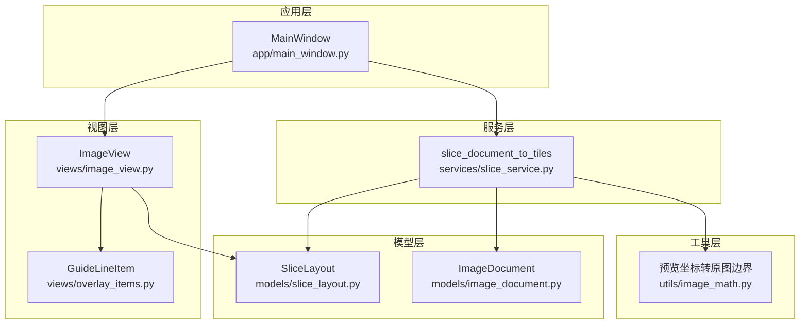
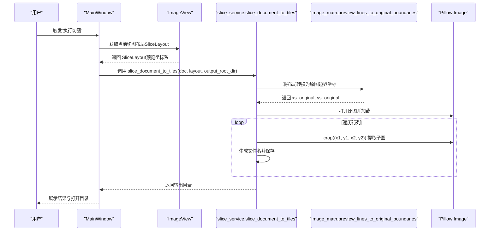
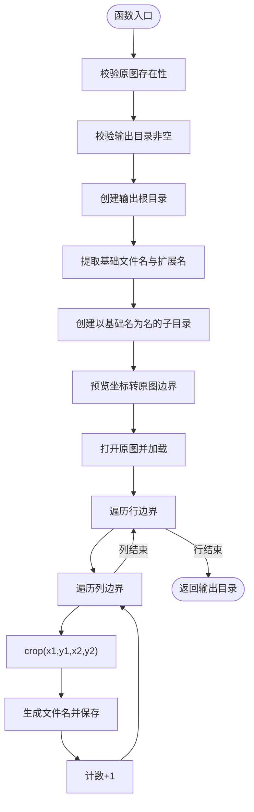
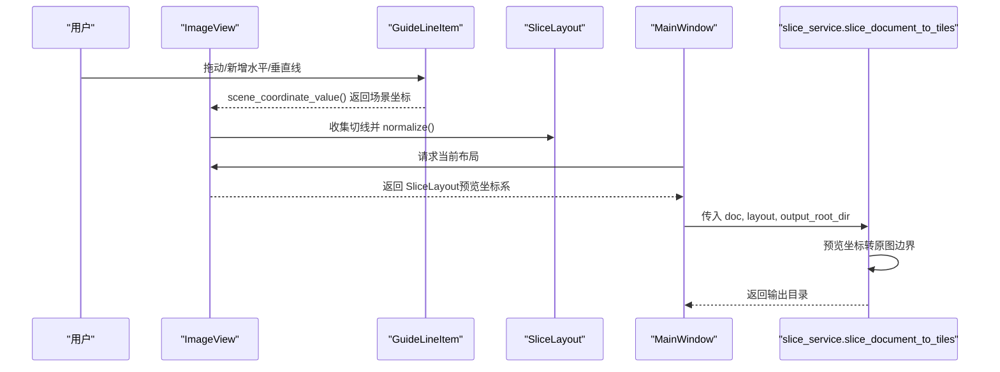
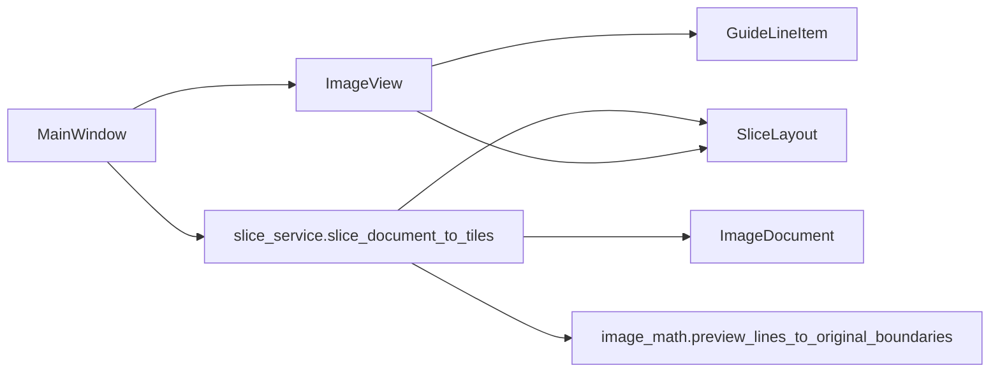

# 宫格切图服务

<cite>
**本文引用的文件**
- [slice_service.py](file://img_slicer_tool/services/slice_service.py)
- [slice_layout.py](file://img_slicer_tool/models/slice_layout.py)
- [image_math.py](file://img_slicer_tool/utils/image_math.py)
- [image_view.py](file://img_slicer_tool/views/image_view.py)
- [overlay_items.py](file://img_slicer_tool/views/overlay_items.py)
- [main_window.py](file://img_slicer_tool/app/main_window.py)
- [image_document.py](file://img_slicer_tool/models/image_document.py)
- [README.md](file://img_slicer_tool/README.md)
</cite>

## 目录
1. [简介](#简介)
2. [项目结构](#项目结构)
3. [核心组件](#核心组件)
4. [架构总览](#架构总览)
5. [详细组件分析](#详细组件分析)
6. [依赖关系分析](#依赖关系分析)
7. [性能考量](#性能考量)
8. [故障排查指南](#故障排查指南)
9. [结论](#结论)
10. [附录](#附录)

## 简介
本文件围绕 img_slicer_tool 中的“宫格切图服务”，系统性解析 slice_service.py 的 slice_document_to_tiles 函数实现原理，阐明其如何基于 SliceLayout 定义的水平线与垂直线集合，计算所有切片区域的边界框，遍历并调用 Pillow 从原图提取每个子图像；同时说明切片命名规则、输出目录管理与批量导出的性能优化策略；解释 SliceLayout 中归一化坐标的存储优势及其对非均匀切格与边缘边界情况的应对；最后给出 API 调用示例，并分析该服务与 GuideLineItem 交互的数据流，包括用户拖动切线后布局更新的同步机制。

## 项目结构
- 服务层：services/slice_service.py 提供切图主流程
- 模型层：models/slice_layout.py 定义切图布局数据结构与归一化
- 视图层：views/image_view.py 负责切线绘制、选择与拖动；views/overlay_items.py 定义 GuideLineItem
- 工具层：utils/image_math.py 提供预览坐标到原图坐标的转换
- 应用层：app/main_window.py 连接 UI 与服务，触发切图执行
- 数据模型：models/image_document.py 描述图像文档元信息

图表来源
- [main_window.py](file://img_slicer_tool/app/main_window.py#L204-L261)
- [image_view.py](file://img_slicer_tool/views/image_view.py#L236-L253)
- [overlay_items.py](file://img_slicer_tool/views/overlay_items.py#L27-L64)
- [slice_service.py](file://img_slicer_tool/services/slice_service.py#L12-L62)
- [slice_layout.py](file://img_slicer_tool/models/slice_layout.py#L7-L30)
- [image_math.py](file://img_slicer_tool/utils/image_math.py#L50-L76)
- [image_document.py](file://img_slicer_tool/models/image_document.py#L8-L18)

章节来源
- [README.md](file://img_slicer_tool/README.md#L1-L9)

## 核心组件
- SliceLayout：在预览坐标系下保存水平线与垂直线，提供 normalize 与 get_boundaries，用于生成带边界的坐标序列
- ImageDocument：封装原图尺寸、预览尺寸与缩放比例等信息
- GuideLineItem：在场景中绘制可高亮的切线，提供 scene_coordinate_value 获取场景坐标
- ImageView：收集场景中的 GuideLineItem，生成 SliceLayout 并进行归一化
- slice_document_to_tiles：执行切图，负责输出目录管理、命名规则、批量导出与性能优化
- image_math.preview_lines_to_original_boundaries：将预览坐标系的边界映射到原图像素坐标

章节来源
- [slice_layout.py](file://img_slicer_tool/models/slice_layout.py#L7-L30)
- [image_document.py](file://img_slicer_tool/models/image_document.py#L8-L18)
- [overlay_items.py](file://img_slicer_tool/views/overlay_items.py#L27-L64)
- [image_view.py](file://img_slicer_tool/views/image_view.py#L236-L253)
- [slice_service.py](file://img_slicer_tool/services/slice_service.py#L12-L62)
- [image_math.py](file://img_slicer_tool/utils/image_math.py#L50-L76)

## 架构总览
从 UI 到切图服务的整体流程如下：

图表来源
- [main_window.py](file://img_slicer_tool/app/main_window.py#L230-L261)
- [image_view.py](file://img_slicer_tool/views/image_view.py#L236-L253)
- [slice_service.py](file://img_slicer_tool/services/slice_service.py#L12-L62)
- [image_math.py](file://img_slicer_tool/utils/image_math.py#L50-L76)

## 详细组件分析

### slice_document_to_tiles 函数实现原理
- 输入参数
  - doc: ImageDocument，包含原图路径、预览尺寸与缩放比例
  - layout: SliceLayout，预览坐标系下的水平线与垂直线
  - output_root_dir: 输出根目录字符串
- 主要流程
  - 参数校验：检查原图存在性与输出目录非空
  - 输出目录创建：以原图文件名为子目录，确保存在
  - 预览坐标到原图边界的转换：调用 preview_lines_to_original_boundaries
  - 打开原图并加载：使用 Pillow Image.open 并显式加载
  - 遍历边界生成切片：外层按行、内层按列，逐个 crop 并保存
  - 文件命名与格式：基于 basename_row0_col0.png，JPG/JPEG 使用高质量参数
  - 返回输出目录

图表来源
- [slice_service.py](file://img_slicer_tool/services/slice_service.py#L12-L62)
- [image_math.py](file://img_slicer_tool/utils/image_math.py#L50-L76)

章节来源
- [slice_service.py](file://img_slicer_tool/services/slice_service.py#L12-L62)

### 切片命名规则与输出目录管理
- 命名规则
  - 基于原图文件名，后缀为 “_r{row:02d}_c{col:02d}.ext”
  - 行列索引从 1 开始，两位零填充
- 输出目录
  - 输出根目录由调用方提供；若为空则回退到原图所在目录
  - 以原图文件名为子目录，确保输出隔离
- 扩展名与质量
  - 若目标扩展名为 .jpg/.jpeg，保存时设置高质量参数（如 quality 与 subsampling）

章节来源
- [slice_service.py](file://img_slicer_tool/services/slice_service.py#L27-L31)
- [slice_service.py](file://img_slicer_tool/services/slice_service.py#L49-L60)

### 性能优化策略（批量导出）
- 单次打开原图并加载：减少 IO 与解码开销
- 遍历顺序：先行后列，顺序访问相邻内存块，有利于缓存友好
- 条件跳过无效区域：当 x2<=x1 或 y2<=y1 时跳过，避免无效 crop
- JPEG 专用参数：对 JPG/JPEG 使用高质量参数，提升视觉质量与压缩效率
- 输出目录提前创建：避免多次 IO 创建目录

章节来源
- [slice_service.py](file://img_slicer_tool/services/slice_service.py#L33-L60)

### SliceLayout 的归一化坐标存储优势与边界处理
- 存储优势
  - 在预览坐标系下存储水平线与垂直线，便于 UI 交互与一致性维护
  - normalize 对坐标进行去重、排序与范围过滤，保证边界序列有序且有效
- 边界生成
  - get_boundaries 在两端追加 0 与宽/高，形成闭区间边界序列
- 非均匀切格与边缘边界
  - 通过 normalize 过滤无效值，避免越界与重复
  - 通过 get_boundaries 保证首尾边界始终包含原图上下左右边界
  - 在转换阶段对原图边界做 clamp 与去重，确保最终边界合法

章节来源
- [slice_layout.py](file://img_slicer_tool/models/slice_layout.py#L14-L30)
- [image_math.py](file://img_slicer_tool/utils/image_math.py#L50-L76)

### 与 GuideLineItem 的数据流与布局同步
- 数据来源
  - 用户在 ImageView 中绘制/拖动 GuideLineItem，场景坐标通过 GuideLineItem.scene_coordinate_value 获取
  - ImageView.get_slice_layout 从场景中收集切线，限制在图片范围内，再调用 SliceLayout.normalize 完成归一化
- 同步机制
  - 手动模式下，用户拖动切线会更新 cutLines 中的 pos 值，进而影响后续切图布局
  - 网格模式下，ImageView._regenerate_grid_lines 会重新生成等间距切线，覆盖之前的布局
  - 切图前，MainWindow 从 ImageView 获取 SliceLayout，确保 UI 与服务一致

图表来源
- [overlay_items.py](file://img_slicer_tool/views/overlay_items.py#L55-L64)
- [image_view.py](file://img_slicer_tool/views/image_view.py#L236-L253)
- [main_window.py](file://img_slicer_tool/app/main_window.py#L230-L261)
- [slice_service.py](file://img_slicer_tool/services/slice_service.py#L12-L62)

章节来源
- [overlay_items.py](file://img_slicer_tool/views/overlay_items.py#L27-L64)
- [image_view.py](file://img_slicer_tool/views/image_view.py#L236-L253)
- [main_window.py](file://img_slicer_tool/app/main_window.py#L230-L261)

## 依赖关系分析
- slice_service.slice_document_to_tiles 依赖
  - models.image_document.ImageDocument：提供缩放比例与尺寸
  - models.slice_layout.SliceLayout：提供归一化与边界生成
  - utils.image_math.preview_lines_to_original_boundaries：坐标转换
  - Pillow Image：图像读取与裁剪
- UI 侧依赖
  - views.image_view.ImageView：提供当前布局与场景交互
  - views.overlay_items.GuideLineItem：提供场景坐标
  - app.main_window.MainWindow：协调 UI 与服务

图表来源
- [slice_service.py](file://img_slicer_tool/services/slice_service.py#L12-L62)
- [image_math.py](file://img_slicer_tool/utils/image_math.py#L50-L76)
- [image_view.py](file://img_slicer_tool/views/image_view.py#L236-L253)
- [overlay_items.py](file://img_slicer_tool/views/overlay_items.py#L27-L64)
- [main_window.py](file://img_slicer_tool/app/main_window.py#L230-L261)

章节来源
- [slice_service.py](file://img_slicer_tool/services/slice_service.py#L12-L62)
- [image_math.py](file://img_slicer_tool/utils/image_math.py#L50-L76)
- [image_view.py](file://img_slicer_tool/views/image_view.py#L236-L253)
- [overlay_items.py](file://img_slicer_tool/views/overlay_items.py#L27-L64)
- [main_window.py](file://img_slicer_tool/app/main_window.py#L230-L261)

## 性能考量
- IO 与解码
  - 原图仅打开一次并加载，避免重复解码
- 访问局部性
  - 先行后列的遍历顺序，有助于 CPU 缓存命中
- 边界合法性检查
  - 在生成切片前跳过无效区域，减少不必要的 crop
- JPEG 保存参数
  - 对 JPG/JPEG 设置高质量参数，兼顾体积与质量
- 目录与文件名
  - 输出目录提前创建，避免运行时频繁 IO

章节来源
- [slice_service.py](file://img_slicer_tool/services/slice_service.py#L33-L60)

## 故障排查指南
- 常见错误与处理
  - 原图不存在：抛出 FileNotFoundError，需检查路径
  - 输出根路径为空：抛出 ValueError，需设置有效路径
  - 切图边界不足：转换后 xs_original 或 ys_original 数量不足，抛出 ValueError
  - 预览坐标越界：normalize 会过滤无效值，确保边界在 [0, width/height] 内
- UI 同步问题
  - 若网格模式与手动模式切换导致布局丢失，确认 ImageView 的 set_slice_work_mode 与 _regenerate_grid_lines 是否被正确调用
  - 手动拖动切线后未生效：检查 _drag_selected_line 与 _update_line_geometry 是否更新了 cutLines 的 pos

章节来源
- [slice_service.py](file://img_slicer_tool/services/slice_service.py#L19-L24)
- [image_math.py](file://img_slicer_tool/utils/image_math.py#L72-L76)
- [image_view.py](file://img_slicer_tool/views/image_view.py#L441-L466)
- [image_view.py](file://img_slicer_tool/views/image_view.py#L478-L487)

## 结论
slice_document_to_tiles 通过“预览坐标系布局 + 原图边界转换”的设计，实现了高效、稳定的宫格切图能力。SliceLayout 的归一化与边界生成保障了布局的一致性与鲁棒性；ImageView 与 GuideLineItem 的协作提供了直观的交互体验；服务层在性能上采取了必要的优化措施。整体架构清晰、职责分离明确，适合进一步扩展更多切图模式与导出选项。

## 附录

### API 调用示例（步骤说明）
- 步骤 1：准备 ImageDocument 与 SliceLayout
  - 从 ImageView 获取当前布局：调用 get_slice_layout
- 步骤 2：调用切图服务
  - 调用 slice_document_to_tiles(doc, layout, output_root_dir)
- 步骤 3：展示结果
  - MainWindow 接收输出目录并提示用户打开文件夹

章节来源
- [main_window.py](file://img_slicer_tool/app/main_window.py#L230-L261)
- [image_view.py](file://img_slicer_tool/views/image_view.py#L236-L253)
- [slice_service.py](file://img_slicer_tool/services/slice_service.py#L12-L62)