# 服务模块技术设计

<cite>
**本文引用的文件**
- [img_slicer_tool/services/image_loader.py](file://img_slicer_tool/services/image_loader.py)
- [img_slicer_tool/services/crop_service.py](file://img_slicer_tool/services/crop_service.py)
- [img_slicer_tool/services/slice_service.py](file://img_slicer_tool/services/slice_service.py)
- [img_slicer_tool/utils/image_math.py](file://img_slicer_tool/utils/image_math.py)
- [img_slicer_tool/models/slice_layout.py](file://img_slicer_tool/models/slice_layout.py)
- [img_slicer_tool/models/image_document.py](file://img_slicer_tool/models/image_document.py)
- [img_slicer_tool/views/image_view.py](file://img_slicer_tool/views/image_view.py)
- [img_slicer_tool/app/main_window.py](file://img_slicer_tool/app/main_window.py)
- [img_slicer_tool/views/slice_side_panel.py](file://img_slicer_tool/views/slice_side_panel.py)
- [img_slicer_tool/utils/logging_utils.py](file://img_slicer_tool/utils/logging_utils.py)
</cite>

## 目录
1. [简介](#简介)
2. [项目结构](#项目结构)
3. [核心组件](#核心组件)
4. [架构总览](#架构总览)
5. [详细组件分析](#详细组件分析)
6. [依赖关系分析](#依赖关系分析)
7. [性能考量](#性能考量)
8. [故障排查指南](#故障排查指南)
9. [结论](#结论)
10. [附录](#附录)

## 简介
本文件聚焦于图片切片工具中三个核心服务模块的技术实现细节：图像加载器、裁剪服务与切片服务。文档将深入解释以下要点：
- image_loader 如何安全加载图像并处理异常格式，生成适配显示区域的预览图；
- crop_service 如何调用 image_math 的坐标转换工具，将视口坐标映射回原图像素坐标，并使用 Pillow 执行裁剪；
- slice_service 如何遍历 SliceLayout 定义的切线区间，计算每个切片区域并批量导出为独立文件；
- 强调 image_math 中 map_point_to_original 等函数在坐标系统一中的关键作用；
- 提供服务调用时序图，说明输入参数、返回值类型及错误处理策略。

## 项目结构
项目采用“模型-视图-服务-工具”分层组织，服务层负责业务逻辑，工具层提供数学与图像辅助能力，视图层负责用户交互与坐标采集，应用入口负责协调流程与错误提示。

图表来源
- [img_slicer_tool/app/main_window.py](file://img_slicer_tool/app/main_window.py#L1-L364)
- [img_slicer_tool/views/image_view.py](file://img_slicer_tool/views/image_view.py#L1-L542)
- [img_slicer_tool/views/slice_side_panel.py](file://img_slicer_tool/views/slice_side_panel.py#L1-L174)
- [img_slicer_tool/services/image_loader.py](file://img_slicer_tool/services/image_loader.py#L1-L68)
- [img_slicer_tool/services/crop_service.py](file://img_slicer_tool/services/crop_service.py#L1-L38)
- [img_slicer_tool/services/slice_service.py](file://img_slicer_tool/services/slice_service.py#L1-L62)
- [img_slicer_tool/utils/image_math.py](file://img_slicer_tool/utils/image_math.py#L1-L76)
- [img_slicer_tool/models/image_document.py](file://img_slicer_tool/models/image_document.py#L1-L18)
- [img_slicer_tool/models/slice_layout.py](file://img_slicer_tool/models/slice_layout.py#L1-L30)

章节来源
- [img_slicer_tool/app/main_window.py](file://img_slicer_tool/app/main_window.py#L1-L364)
- [img_slicer_tool/views/image_view.py](file://img_slicer_tool/views/image_view.py#L1-L542)
- [img_slicer_tool/views/slice_side_panel.py](file://img_slicer_tool/views/slice_side_panel.py#L1-L174)
- [img_slicer_tool/services/image_loader.py](file://img_slicer_tool/services/image_loader.py#L1-L68)
- [img_slicer_tool/services/crop_service.py](file://img_slicer_tool/services/crop_service.py#L1-L38)
- [img_slicer_tool/services/slice_service.py](file://img_slicer_tool/services/slice_service.py#L1-L62)
- [img_slicer_tool/utils/image_math.py](file://img_slicer_tool/utils/image_math.py#L1-L76)
- [img_slicer_tool/models/image_document.py](file://img_slicer_tool/models/image_document.py#L1-L18)
- [img_slicer_tool/models/slice_layout.py](file://img_slicer_tool/models/slice_layout.py#L1-L30)

## 核心组件
- ImageDocument：封装图像路径、原始尺寸、预览尺寸与缩放比例，以及预览 QPixmap，用于跨模块传递图像元信息。
- SliceLayout：保存预览坐标系下的切线集合，提供标准化与边界生成方法，作为切片布局的输入。
- image_loader：读取图像、生成预览图、计算缩放比，构建 ImageDocument。
- crop_service：接收预览矩形，映射到原图坐标，执行裁剪并返回新 ImageDocument。
- slice_service：根据 SliceLayout 计算原图边界，批量裁剪并导出切片。
- image_math：提供预览坐标到原图坐标的映射工具，确保不同缩放下的坐标一致性。

章节来源
- [img_slicer_tool/models/image_document.py](file://img_slicer_tool/models/image_document.py#L1-L18)
- [img_slicer_tool/models/slice_layout.py](file://img_slicer_tool/models/slice_layout.py#L1-L30)
- [img_slicer_tool/services/image_loader.py](file://img_slicer_tool/services/image_loader.py#L1-L68)
- [img_slicer_tool/services/crop_service.py](file://img_slicer_tool/services/crop_service.py#L1-L38)
- [img_slicer_tool/services/slice_service.py](file://img_slicer_tool/services/slice_service.py#L1-L62)
- [img_slicer_tool/utils/image_math.py](file://img_slicer_tool/utils/image_math.py#L1-L76)

## 架构总览
下图展示从用户交互到服务执行再到结果输出的整体流程，包括错误处理与日志记录。

```mermaid
sequenceDiagram
participant U as "用户"
participant MW as "MainWindow"
participant IV as "ImageView"
participant CS as "crop_service"
participant SS as "slice_service"
participant IM as "image_math"
participant IL as "image_loader"
participant FS as "文件系统"
U->>IV : 拖拽/选择图片
IV-->>MW : imageDropped/path
MW->>IL : load_image_document(path)
IL-->>MW : ImageDocument
MW->>IV : set_document(ImageDocument)
U->>IV : 在预览图上绘制裁剪框/切线
IV-->>MW : cropRequested(x,y,w,h)
MW->>CS : crop_document_to_new_image(doc, (x,y,w,h), target_path)
CS->>IM : preview_rect_to_original_box(doc, x,y,w,h)
IM-->>CS : (x1,y1,x2,y2)
CS->>FS : 读取原图并裁剪保存
CS->>IL : load_image_document(target_path)
IL-->>CS : 新 ImageDocument
CS-->>MW : 新 ImageDocument
MW->>IV : set_document(新 ImageDocument)
U->>IV : 设置切图方式/网格/手动线
IV-->>MW : executeRequested
MW->>SS : slice_document_to_tiles(doc, layout, output_root)
SS->>IM : preview_lines_to_original_boundaries(doc, layout)
IM-->>SS : (xs, ys)
SS->>FS : 遍历网格裁剪并保存
SS-->>MW : 输出目录
MW-->>U : 展示切图结果
```

图表来源
- [img_slicer_tool/app/main_window.py](file://img_slicer_tool/app/main_window.py#L1-L364)
- [img_slicer_tool/views/image_view.py](file://img_slicer_tool/views/image_view.py#L1-L542)
- [img_slicer_tool/services/crop_service.py](file://img_slicer_tool/services/crop_service.py#L1-L38)
- [img_slicer_tool/services/slice_service.py](file://img_slicer_tool/services/slice_service.py#L1-L62)
- [img_slicer_tool/utils/image_math.py](file://img_slicer_tool/utils/image_math.py#L1-L76)
- [img_slicer_tool/services/image_loader.py](file://img_slicer_tool/services/image_loader.py#L1-L68)

## 详细组件分析

### 图像加载器（image_loader）
职责与流程
- 输入：图像文件路径
- 处理：检查路径存在性；使用 Pillow 打开并加载图像；根据最大预览尺寸计算预览尺寸与缩放比；必要时进行缩放；转换为 QImage/QPixmap；构造 ImageDocument 返回
- 异常：路径不存在抛出 FileNotFoundError
- 输出：ImageDocument（包含原始尺寸、预览尺寸、缩放比与预览 QPixmap）

关键点
- 预览尺寸上限控制，避免超大图像导致内存与渲染压力
- 模式转换：优先保持 RGB/RGBA，否则转 RGBA，保证 QImage 能正确构造
- 缩放比用于后续坐标映射，确保预览与原图坐标一致

图表来源
- [img_slicer_tool/services/image_loader.py](file://img_slicer_tool/services/image_loader.py#L1-L68)

章节来源
- [img_slicer_tool/services/image_loader.py](file://img_slicer_tool/services/image_loader.py#L1-L68)

### 裁剪服务（crop_service）
职责与流程
- 输入：ImageDocument、预览矩形 (x, y, w, h)、目标路径
- 处理：校验原图路径存在性；调用 image_math 将预览矩形映射到原图像素坐标；使用 Pillow 打开原图并裁剪；针对 JPEG 设置高质量参数；保存到目标路径；重新加载生成新的 ImageDocument
- 异常：原图路径不存在抛出 FileNotFoundError；非法裁剪参数抛出 ValueError
- 输出：新的 ImageDocument

图表来源
- [img_slicer_tool/services/crop_service.py](file://img_slicer_tool/services/crop_service.py#L1-L38)
- [img_slicer_tool/utils/image_math.py](file://img_slicer_tool/utils/image_math.py#L1-L76)
- [img_slicer_tool/services/image_loader.py](file://img_slicer_tool/services/image_loader.py#L1-L68)

章节来源
- [img_slicer_tool/services/crop_service.py](file://img_slicer_tool/services/crop_service.py#L1-L38)
- [img_slicer_tool/utils/image_math.py](file://img_slicer_tool/utils/image_math.py#L1-L76)
- [img_slicer_tool/services/image_loader.py](file://img_slicer_tool/services/image_loader.py#L1-L68)

### 切片服务（slice_service）
职责与流程
- 输入：ImageDocument、SliceLayout、输出根目录
- 处理：校验原图存在性与输出目录；生成以原图为名的子目录；调用 image_math 将预览切线映射到原图边界；遍历网格，对每个单元格执行裁剪并保存；根据扩展名设置 JPEG 质量参数；返回输出目录
- 异常：原图不存在或输出目录为空抛出 FileNotFoundError/ValueError；边界不足抛出 ValueError
- 输出：输出目录路径

图表来源
- [img_slicer_tool/services/slice_service.py](file://img_slicer_tool/services/slice_service.py#L1-L62)
- [img_slicer_tool/utils/image_math.py](file://img_slicer_tool/utils/image_math.py#L1-L76)
- [img_slicer_tool/models/slice_layout.py](file://img_slicer_tool/models/slice_layout.py#L1-L30)

章节来源
- [img_slicer_tool/services/slice_service.py](file://img_slicer_tool/services/slice_service.py#L1-L62)
- [img_slicer_tool/utils/image_math.py](file://img_slicer_tool/utils/image_math.py#L1-L76)
- [img_slicer_tool/models/slice_layout.py](file://img_slicer_tool/models/slice_layout.py#L1-L30)

### 坐标映射工具（image_math）
关键函数与职责
- preview_rect_to_original_box：将预览矩形映射到原图像素坐标，进行有效性校验与边界钳制，返回整型裁剪 box
- preview_lines_to_original_boundaries：将 SliceLayout 的预览线转换为原图边界列表，排序去重并钳制到有效范围，确保至少形成一个有效网格

图表来源
- [img_slicer_tool/utils/image_math.py](file://img_slicer_tool/utils/image_math.py#L1-L76)
- [img_slicer_tool/models/image_document.py](file://img_slicer_tool/models/image_document.py#L1-L18)
- [img_slicer_tool/models/slice_layout.py](file://img_slicer_tool/models/slice_layout.py#L1-L30)

章节来源
- [img_slicer_tool/utils/image_math.py](file://img_slicer_tool/utils/image_math.py#L1-L76)
- [img_slicer_tool/models/image_document.py](file://img_slicer_tool/models/image_document.py#L1-L18)
- [img_slicer_tool/models/slice_layout.py](file://img_slicer_tool/models/slice_layout.py#L1-L30)

## 依赖关系分析
- 低耦合高内聚：服务层仅依赖工具层与模型层，不直接依赖 UI 组件，便于测试与复用
- 关键依赖链：
  - crop_service 依赖 image_math 与 image_loader
  - slice_service 依赖 image_math 与 slice_layout
  - image_view 通过信号向 MainWindow 传递事件，再由 MainWindow 调用服务层
- 可能的循环依赖：未发现模块间循环导入

图表来源
- [img_slicer_tool/views/image_view.py](file://img_slicer_tool/views/image_view.py#L1-L542)
- [img_slicer_tool/app/main_window.py](file://img_slicer_tool/app/main_window.py#L1-L364)
- [img_slicer_tool/services/crop_service.py](file://img_slicer_tool/services/crop_service.py#L1-L38)
- [img_slicer_tool/services/slice_service.py](file://img_slicer_tool/services/slice_service.py#L1-L62)
- [img_slicer_tool/utils/image_math.py](file://img_slicer_tool/utils/image_math.py#L1-L76)
- [img_slicer_tool/services/image_loader.py](file://img_slicer_tool/services/image_loader.py#L1-L68)
- [img_slicer_tool/models/slice_layout.py](file://img_slicer_tool/models/slice_layout.py#L1-L30)
- [img_slicer_tool/models/image_document.py](file://img_slicer_tool/models/image_document.py#L1-L18)

章节来源
- [img_slicer_tool/views/image_view.py](file://img_slicer_tool/views/image_view.py#L1-L542)
- [img_slicer_tool/app/main_window.py](file://img_slicer_tool/app/main_window.py#L1-L364)
- [img_slicer_tool/services/crop_service.py](file://img_slicer_tool/services/crop_service.py#L1-L38)
- [img_slicer_tool/services/slice_service.py](file://img_slicer_tool/services/slice_service.py#L1-L62)
- [img_slicer_tool/utils/image_math.py](file://img_slicer_tool/utils/image_math.py#L1-L76)
- [img_slicer_tool/services/image_loader.py](file://img_slicer_tool/services/image_loader.py#L1-L68)
- [img_slicer_tool/models/slice_layout.py](file://img_slicer_tool/models/slice_layout.py#L1-L30)
- [img_slicer_tool/models/image_document.py](file://img_slicer_tool/models/image_document.py#L1-L18)

## 性能考量
- 预览尺寸上限：通过 MAX_PREVIEW_SIZE 控制预览图大小，降低 UI 渲染与内存占用
- 缩放比复用：ImageDocument 中 scale_x/scale_y 一次性计算，避免重复计算
- 批量导出：slice_service 使用迭代裁剪，逐切片保存，避免一次性加载全图
- 图像格式优化：对 JPEG 设置高质量参数，兼顾体积与质量
- I/O 顺序：先映射坐标，再打开原图进行裁剪，减少不必要的 I/O

[本节为通用建议，无需列出具体文件来源]

## 故障排查指南
常见问题与处理
- 加载失败：确认文件路径存在且为受支持格式；查看 MainWindow 的错误提示与日志
- 裁剪区域无效：预览矩形宽高需为正数；映射后需满足 x2>x1 且 y2>y1
- 切片边界不足：至少需要两条水平线与两条垂直线；若无切线则默认导出整图
- 输出目录为空：需先设置切图保存根目录
- 日志定位：启用日志工具，查看 img_slicer.log 中的错误堆栈

章节来源
- [img_slicer_tool/app/main_window.py](file://img_slicer_tool/app/main_window.py#L1-L364)
- [img_slicer_tool/utils/logging_utils.py](file://img_slicer_tool/utils/logging_utils.py#L1-L6)

## 结论
该服务模块围绕“预览坐标到原图坐标的统一映射”展开，通过 image_math 提供稳定的坐标转换能力，配合 image_loader 与 slice/crop 服务实现从用户交互到批量导出的完整闭环。模块职责清晰、依赖关系简单，具备良好的可维护性与扩展性。

[本节为总结性内容，无需列出具体文件来源]

## 附录

### API 定义与返回值类型
- image_loader.load_image_document(path: str) -> ImageDocument
- crop_service.crop_document_to_new_image(doc: ImageDocument, preview_rect: (float,float,float,float), target_path: str) -> ImageDocument
- slice_service.slice_document_to_tiles(doc: ImageDocument, layout: SliceLayout, output_root_dir: str) -> str
- image_math.preview_rect_to_original_box(doc: ImageDocument, x: float, y: float, w: float, h: float) -> (int,int,int,int)
- image_math.preview_lines_to_original_boundaries(doc: ImageDocument, layout: SliceLayout) -> (List[int], List[int])

章节来源
- [img_slicer_tool/services/image_loader.py](file://img_slicer_tool/services/image_loader.py#L1-L68)
- [img_slicer_tool/services/crop_service.py](file://img_slicer_tool/services/crop_service.py#L1-L38)
- [img_slicer_tool/services/slice_service.py](file://img_slicer_tool/services/slice_service.py#L1-L62)
- [img_slicer_tool/utils/image_math.py](file://img_slicer_tool/utils/image_math.py#L1-L76)