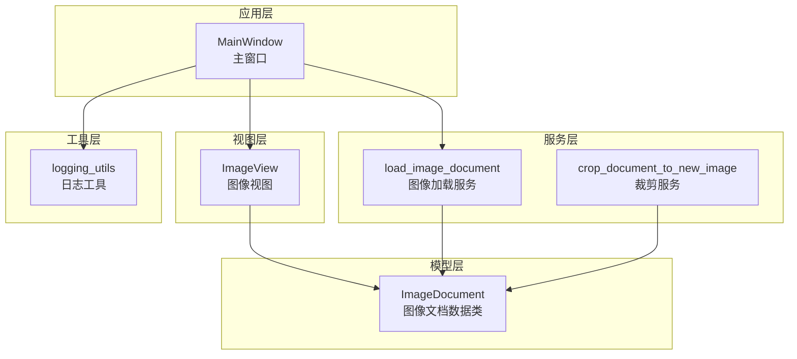
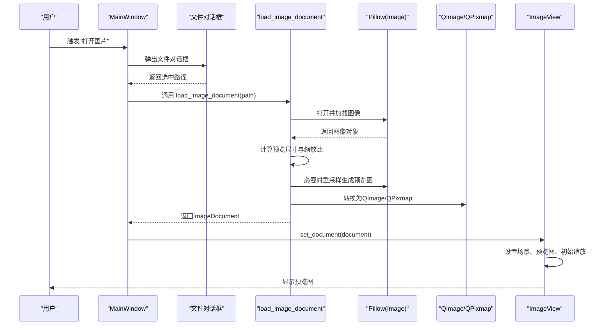
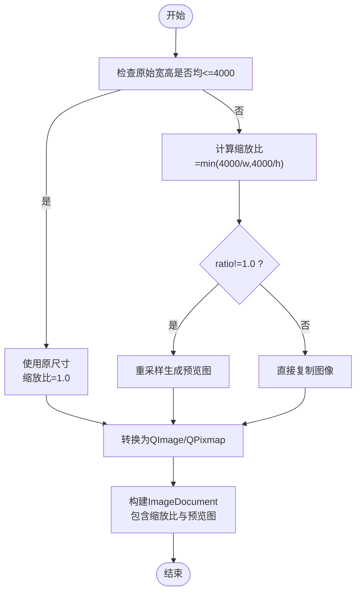
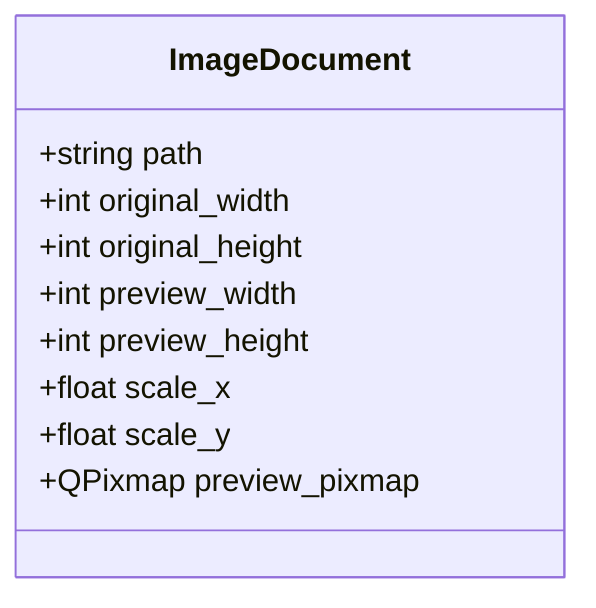
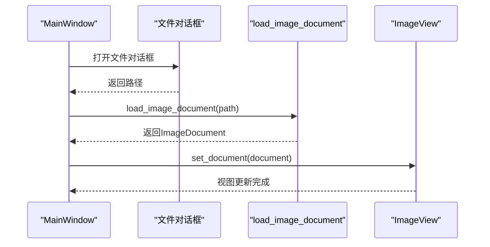
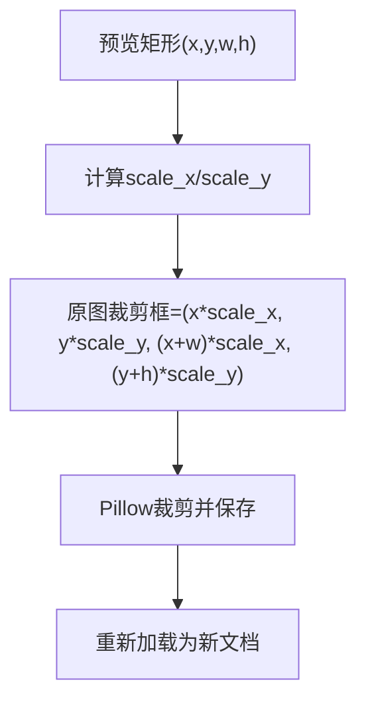
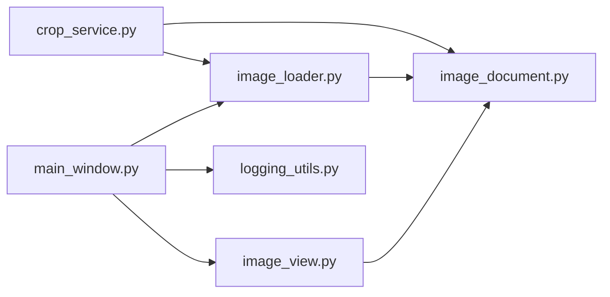

# 图像加载与预览

<cite>
**本文引用的文件列表**
- [image_loader.py](file://img_slicer_tool/services/image_loader.py)
- [image_document.py](file://img_slicer_tool/models/image_document.py)
- [main_window.py](file://img_slicer_tool/app/main_window.py)
- [image_view.py](file://img_slicer_tool/views/image_view.py)
- [crop_service.py](file://img_slicer_tool/services/crop_service.py)
- [logging_utils.py](file://img_slicer_tool/utils/logging_utils.py)
- [sizecutting_task_card.md](file://task/sizecutting_task_card.md)
</cite>

## 目录
1. [简介](#简介)
2. [项目结构](#项目结构)
3. [核心组件](#核心组件)
4. [架构总览](#架构总览)
5. [详细组件分析](#详细组件分析)
6. [依赖关系分析](#依赖关系分析)
7. [性能考量](#性能考量)
8. [故障排查指南](#故障排查指南)
9. [结论](#结论)
10. [附录](#附录)

## 简介
本文件围绕图像加载与预览功能展开，重点解析以下方面：
- 如何使用 Pillow 加载图像并生成最大边不超过 4000 像素的预览图，以保证大图在界面中的流畅显示；
- ImageDocument 数据类如何封装原始尺寸、预览尺寸、缩放比以及预览图；
- load_image_document 函数的执行流程，包括图像打开、尺寸计算、缩放比例确定与 QPixmap 转换；
- 结合主窗口 load_image 方法，说明从文件选择对话框到视图更新的完整调用链；
- 提供预览图生成逻辑与坐标映射关系（scale_x/scale_y）的分析；
- 性能瓶颈（如超大图内存占用）与未来引入 pyvips 的优化可能性；
- 典型使用场景、常见加载错误（文件损坏、格式不支持）的处理方式与调试建议。

## 项目结构
本项目采用分层组织：应用层（主窗口）、视图层（图像视图）、服务层（图像加载、裁剪、切图）、模型层（图像文档）、工具层（日志、数学工具）。

图表来源
- [main_window.py](file://img_slicer_tool/app/main_window.py#L1-L140)
- [image_view.py](file://img_slicer_tool/views/image_view.py#L60-L90)
- [image_loader.py](file://img_slicer_tool/services/image_loader.py#L1-L68)
- [image_document.py](file://img_slicer_tool/models/image_document.py#L1-L18)
- [crop_service.py](file://img_slicer_tool/services/crop_service.py#L1-L37)
- [logging_utils.py](file://img_slicer_tool/utils/logging_utils.py#L1-L6)

章节来源
- [main_window.py](file://img_slicer_tool/app/main_window.py#L1-L140)
- [image_view.py](file://img_slicer_tool/views/image_view.py#L60-L90)
- [image_loader.py](file://img_slicer_tool/services/image_loader.py#L1-L68)
- [image_document.py](file://img_slicer_tool/models/image_document.py#L1-L18)
- [crop_service.py](file://img_slicer_tool/services/crop_service.py#L1-L37)
- [logging_utils.py](file://img_slicer_tool/utils/logging_utils.py#L1-L6)

## 核心组件
- 图像加载服务（image_loader.py）
  - 负责读取图像、计算预览尺寸、生成预览图、转换为 QPixmap，并构造 ImageDocument。
- 图像文档数据类（image_document.py）
  - 封装路径、原始宽高、预览宽高、缩放比、预览图对象等元信息。
- 主窗口（main_window.py）
  - 提供打开图片菜单项与对话框，调用图像加载服务并更新视图。
- 图像视图（image_view.py）
  - 接收 ImageDocument，设置场景与预览图，处理缩放、平移、拖拽等交互。
- 裁剪服务（crop_service.py）
  - 基于预览矩形计算原图裁剪框，执行裁剪并重新加载新文档。
- 日志工具（logging_utils.py）
  - 初始化日志记录器，便于后续接入错误日志。

章节来源
- [image_loader.py](file://img_slicer_tool/services/image_loader.py#L1-L68)
- [image_document.py](file://img_slicer_tool/models/image_document.py#L1-L18)
- [main_window.py](file://img_slicer_tool/app/main_window.py#L100-L140)
- [image_view.py](file://img_slicer_tool/views/image_view.py#L60-L90)
- [crop_service.py](file://img_slicer_tool/services/crop_service.py#L1-L37)
- [logging_utils.py](file://img_slicer_tool/utils/logging_utils.py#L1-L6)

## 架构总览
从用户选择图片到界面显示的端到端流程如下：

图表来源
- [main_window.py](file://img_slicer_tool/app/main_window.py#L100-L140)
- [image_loader.py](file://img_slicer_tool/services/image_loader.py#L24-L54)
- [image_view.py](file://img_slicer_tool/views/image_view.py#L65-L82)

章节来源
- [main_window.py](file://img_slicer_tool/app/main_window.py#L100-L140)
- [image_loader.py](file://img_slicer_tool/services/image_loader.py#L24-L54)
- [image_view.py](file://img_slicer_tool/views/image_view.py#L65-L82)

## 详细组件分析

### 组件A：图像加载与预览（image_loader.py）
- 预览尺寸计算
  - 若原始宽高均不超过 4000，则直接使用原尺寸，缩放比为 1.0；
  - 否则按最大边 4000 进行等比缩放，得到预览宽高与缩放比。
- 预览图生成
  - 当需要缩放时，使用高质量重采样算法生成预览图；
  - 当无需缩放时，直接复制图像以避免不必要的重采样。
- 转换为 Qt 对象
  - 将 Pillow 图像转换为 QImage（根据模式选择 RGB888 或 RGBA8888）；
  - 再由 QImage 构造 QPixmap，供视图层直接使用。
- ImageDocument 构造
  - 保存路径、原始宽高、预览宽高、缩放比与预览图对象。

图表来源
- [image_loader.py](file://img_slicer_tool/services/image_loader.py#L14-L54)

章节来源
- [image_loader.py](file://img_slicer_tool/services/image_loader.py#L1-L68)

### 组件B：数据类封装（image_document.py）
- 字段说明
  - path：图像文件路径
  - original_width/original_height：原始宽高
  - preview_width/preview_height：预览宽高
  - scale_x/scale_y：预览与原图的缩放比
  - preview_pixmap：预览图的 QPixmap 对象
- 作用
  - 作为跨模块传递的统一数据载体，承载所有与图像显示与变换相关的元信息。

图表来源
- [image_document.py](file://img_slicer_tool/models/image_document.py#L8-L18)

章节来源
- [image_document.py](file://img_slicer_tool/models/image_document.py#L1-L18)

### 组件C：主窗口加载流程（main_window.py）
- 文件对话框
  - 限定图片类型过滤器，支持常见格式；
  - 获取选中路径后调用 load_image。
- 加载与错误处理
  - 调用 load_image_document 并捕获异常，弹出友好提示；
  - 成功后设置 ImageView 文档并更新状态栏。
- 与视图联动
  - 将 ImageDocument 传给 ImageView.set_document，触发场景重建与初始缩放。

图表来源
- [main_window.py](file://img_slicer_tool/app/main_window.py#L100-L140)
- [image_view.py](file://img_slicer_tool/views/image_view.py#L65-L82)

章节来源
- [main_window.py](file://img_slicer_tool/app/main_window.py#L100-L140)
- [image_view.py](file://img_slicer_tool/views/image_view.py#L65-L82)

### 组件D：视图渲染与交互（image_view.py）
- 场景与预览图
  - 清理旧场景、重置变换、设置预览图并自适应窗口大小；
  - fitInView 使预览图完整可见，初始缩放设为 1.0。
- 缩放与平移
  - Ctrl+滚轮进行缩放，空格+拖拽进行平移；
  - 通过 QGraphicsView 的变换锚点与视口更新策略提升交互体验。
- 模式与切图线
  - 支持裁剪与切图两种模式，网格/手动切图线的生成与管理。

章节来源
- [image_view.py](file://img_slicer_tool/views/image_view.py#L60-L90)
- [image_view.py](file://img_slicer_tool/views/image_view.py#L86-L116)
- [image_view.py](file://img_slicer_tool/views/image_view.py#L236-L260)

### 组件E：坐标映射与裁剪（crop_service.py + 预期 image_math）
- 预览坐标到原图坐标的映射
  - 依据 scale_x 与 scale_y，将预览矩形 (x, y, w, h) 转换为原图裁剪框 (x1, y1, x2, y2)。
- 裁剪流程
  - 读取原图，按计算出的裁剪框执行裁剪；
  - 根据目标路径后缀设置保存参数（如 JPEG 质量与子采样）；
  - 保存后重新加载为新的 ImageDocument 返回。

图表来源
- [crop_service.py](file://img_slicer_tool/services/crop_service.py#L13-L37)
- [image_loader.py](file://img_slicer_tool/services/image_loader.py#L42-L44)

章节来源
- [crop_service.py](file://img_slicer_tool/services/crop_service.py#L1-L37)
- [image_loader.py](file://img_slicer_tool/services/image_loader.py#L42-L44)

## 依赖关系分析
- 模块耦合
  - main_window.py 依赖 image_loader.py 与 image_view.py；
  - image_view.py 依赖 image_document.py；
  - crop_service.py 依赖 image_loader.py 与 image_document.py；
  - logging_utils.py 为可选日志接入点。
- 关键依赖链
  - main_window -> image_loader -> image_document
  - main_window -> image_view
  - crop_service -> image_loader -> image_document

图表来源
- [main_window.py](file://img_slicer_tool/app/main_window.py#L1-L140)
- [image_loader.py](file://img_slicer_tool/services/image_loader.py#L1-L68)
- [image_document.py](file://img_slicer_tool/models/image_document.py#L1-L18)
- [image_view.py](file://img_slicer_tool/views/image_view.py#L60-L90)
- [crop_service.py](file://img_slicer_tool/services/crop_service.py#L1-L37)
- [logging_utils.py](file://img_slicer_tool/utils/logging_utils.py#L1-L6)

章节来源
- [main_window.py](file://img_slicer_tool/app/main_window.py#L1-L140)
- [image_loader.py](file://img_slicer_tool/services/image_loader.py#L1-L68)
- [image_document.py](file://img_slicer_tool/models/image_document.py#L1-L18)
- [image_view.py](file://img_slicer_tool/views/image_view.py#L60-L90)
- [crop_service.py](file://img_slicer_tool/services/crop_service.py#L1-L37)
- [logging_utils.py](file://img_slicer_tool/utils/logging_utils.py#L1-L6)

## 性能考量
- 预览图策略
  - 最大边限制为 4000 像素，有效降低内存占用与渲染压力，保证大图在界面中的流畅显示。
- 重采样质量
  - 在需要缩放时使用高质量重采样算法，兼顾清晰度与性能。
- 内存与 I/O
  - 预览图仅用于界面显示，避免对原图进行重复解码；
  - 裁剪与切图时按需打开原图，减少不必要的内存驻留。
- 未来优化方向（pyvips）
  - 任务卡片中明确预留 pyvips 与 numpy，用于后续大图处理优化（如超大图的快速读取与裁剪）。
  - 引入 pyvips 可显著降低超大图的内存峰值与 I/O 延迟，适合批量切图与流式处理场景。

章节来源
- [image_loader.py](file://img_slicer_tool/services/image_loader.py#L11-L21)
- [sizecutting_task_card.md](file://task/sizecutting_task_card.md#L177-L191)

## 故障排查指南
- 常见错误类型
  - 文件不存在：主窗口在调用加载前会做存在性检查，若仍出现异常，应检查路径权限与磁盘状态。
  - 图像格式不支持：文件对话框与视图层均有限定的图片类型过滤器，确保选择受支持的格式。
  - 图像损坏：Pillow 打开时可能抛出异常，应在主窗口捕获并提示用户。
- 错误处理流程
  - 主窗口 load_image 中捕获异常并弹出错误提示；
  - 建议后续接入日志工具，记录异常堆栈以便定位问题。
- 调试建议
  - 在 image_loader.py 中增加日志记录，打印原始尺寸、预览尺寸与缩放比；
  - 在 crop_service.py 中记录裁剪框坐标与保存路径，核对预览坐标到原图坐标的映射是否正确；
  - 使用小图验证流程，逐步扩大到大图，观察内存与性能变化。

章节来源
- [main_window.py](file://img_slicer_tool/app/main_window.py#L114-L140)
- [image_view.py](file://img_slicer_tool/views/image_view.py#L20-L25)
- [logging_utils.py](file://img_slicer_tool/utils/logging_utils.py#L1-L6)

## 结论
本项目通过“预览图 + 缩放比”的设计，实现了对超大图的高效加载与流畅预览。ImageDocument 将原始与预览信息统一封装，配合主窗口与视图层的协作，形成清晰的调用链。未来可借助 pyvips 进一步优化大图处理性能，同时建议完善日志体系与错误处理，提升稳定性与可观测性。

## 附录
- 典型使用场景
  - 打开本地图片文件，自动生成预览图并显示；
  - 在预览图上进行缩放与平移，查看细节；
  - 基于预览矩形进行裁剪，生成新的图像文档。
- 坐标映射要点
  - scale_x = original_width / preview_width
  - scale_y = original_height / preview_height
  - 预览矩形 (x, y, w, h) 对应原图裁剪框 (x*scale_x, y*scale_y, (x+w)*scale_x, (y+h)*scale_y)