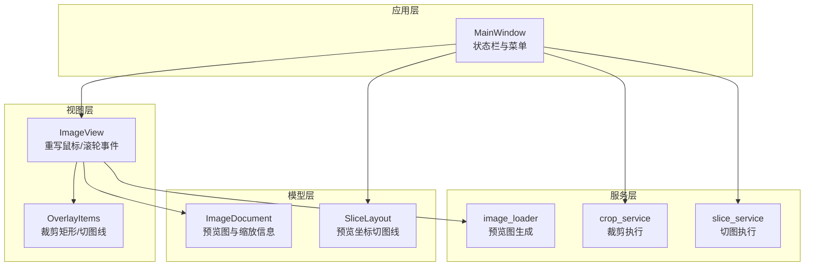
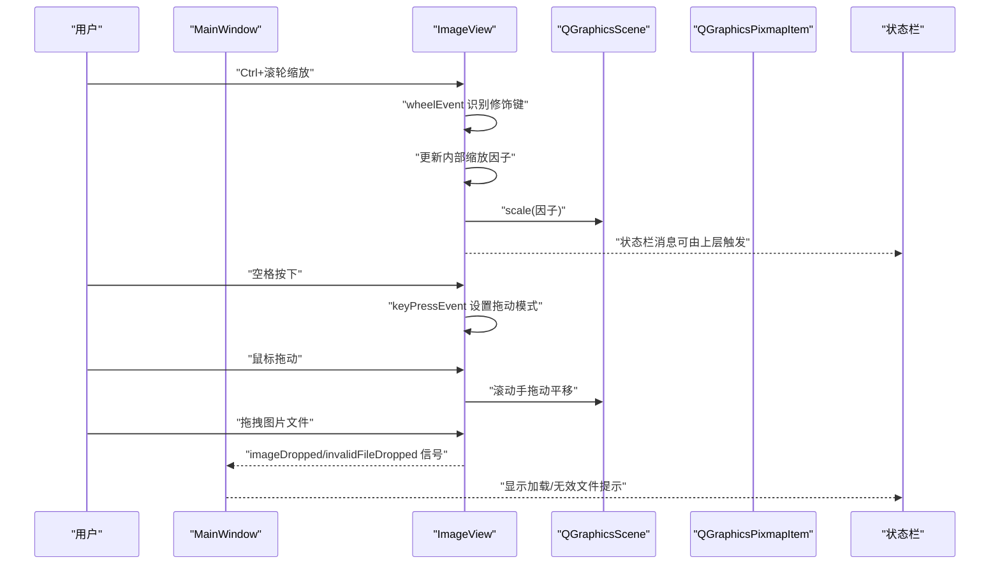
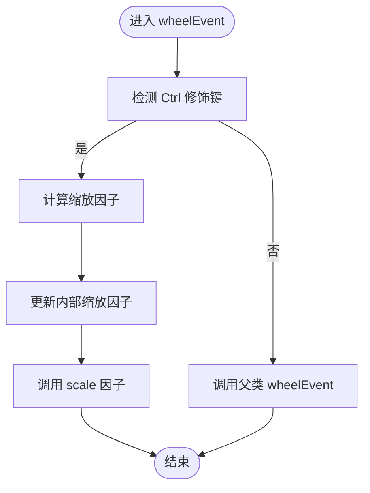
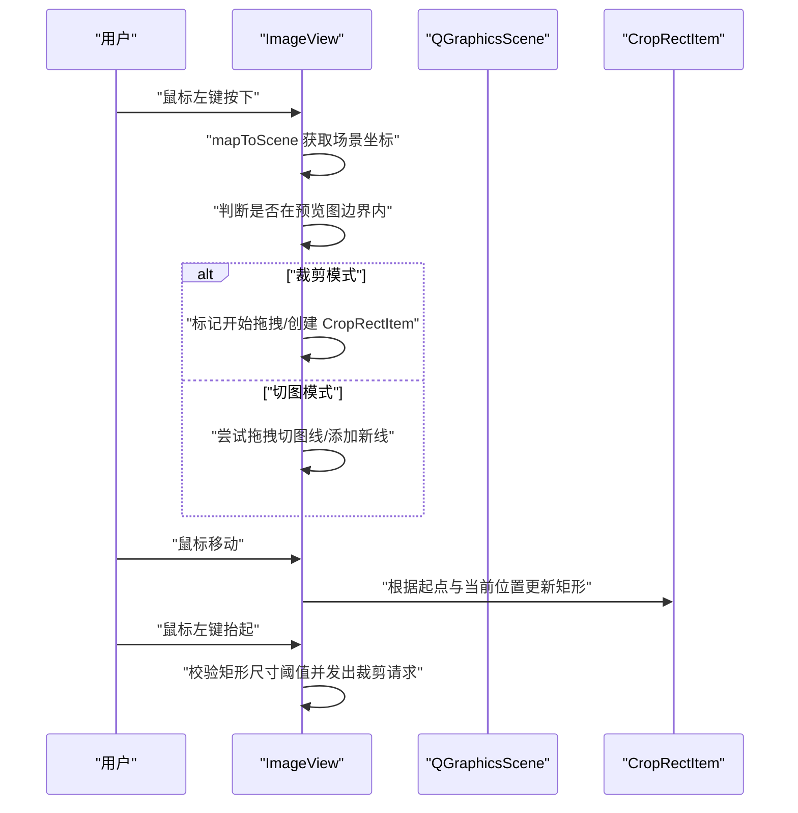
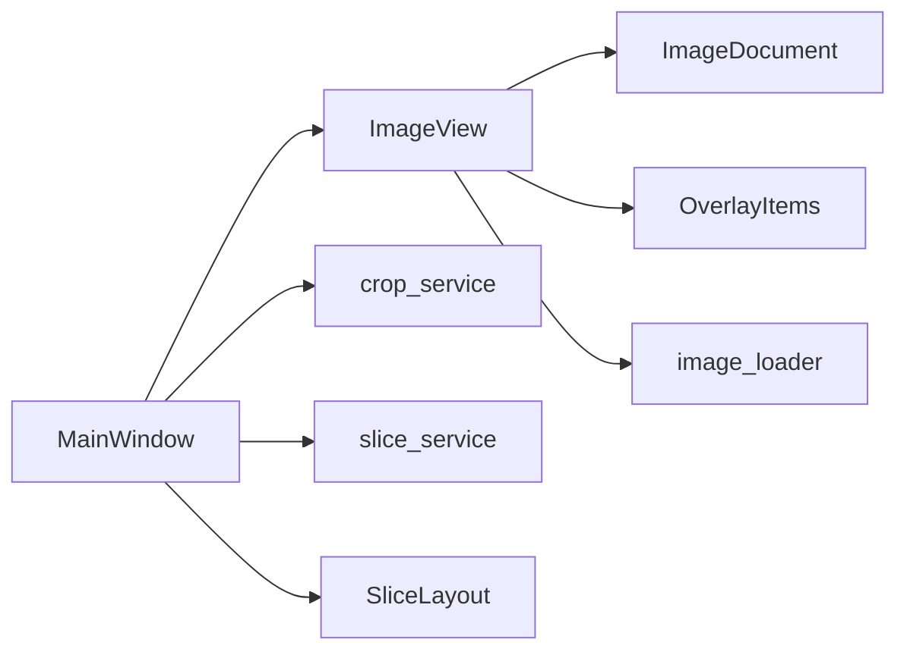

# 图像浏览操作

<cite>
**本文引用的文件**
- [img_slicer_tool/views/image_view.py](file://img_slicer_tool/views/image_view.py)
- [img_slicer_tool/app/main_window.py](file://img_slicer_tool/app/main_window.py)
- [img_slicer_tool/models/image_document.py](file://img_slicer_tool/models/image_document.py)
- [img_slicer_tool/services/image_loader.py](file://img_slicer_tool/services/image_loader.py)
- [img_slicer_tool/views/overlay_items.py](file://img_slicer_tool/views/overlay_items.py)
- [img_slicer_tool/models/slice_layout.py](file://img_slicer_tool/models/slice_layout.py)
- [img_slicer_tool/services/crop_service.py](file://img_slicer_tool/services/crop_service.py)
- [img_slicer_tool/services/slice_service.py](file://img_slicer_tool/services/slice_service.py)
</cite>

## 目录
1. [简介](#简介)
2. [项目结构](#项目结构)
3. [核心组件](#核心组件)
4. [架构总览](#架构总览)
5. [详细组件分析](#详细组件分析)
6. [依赖关系分析](#依赖关系分析)
7. [性能考量](#性能考量)
8. [故障排查指南](#故障排查指南)
9. [结论](#结论)
10. [附录](#附录)

## 简介
本文件面向“图像浏览交互”的技术实现进行系统化解析，重点说明以下内容：
- ImageView 类如何通过重写鼠标与滚轮事件实现 Ctrl+滚轮缩放与空格+拖动平移；
- setDragMode 与 setTransformationAnchor 在视图控制中的作用；
- 缩放限制（最小0.1倍，最大10倍）的实现逻辑与边界判断机制；
- 结合主窗口状态栏消息提示，说明用户操作反馈设计；
- 提供事件过滤器或重写 mousePressEvent/mouseMoveEvent 的实现思路与示例路径；
- 分析视图坐标系与场景坐标系的转换关系；
- 提供操作指南、常见问题排查方法与性能优化建议（如 OpenGL 加速或纹理缓存）。

## 项目结构
本项目采用分层与功能模块化组织：
- 视图层：ImageView（图形视图）、OverlayItems（覆盖元素）
- 模型层：ImageDocument（图像文档元数据）、SliceLayout（切图布局）
- 服务层：image_loader（图像加载与预览图生成）、crop_service（裁剪）、slice_service（切图）
- 应用层：MainWindow（主窗口，负责菜单、状态栏与信号连接）

图表来源
- [img_slicer_tool/app/main_window.py](file://img_slicer_tool/app/main_window.py#L1-L120)
- [img_slicer_tool/views/image_view.py](file://img_slicer_tool/views/image_view.py#L1-L120)
- [img_slicer_tool/models/image_document.py](file://img_slicer_tool/models/image_document.py#L1-L18)
- [img_slicer_tool/models/slice_layout.py](file://img_slicer_tool/models/slice_layout.py#L1-L30)
- [img_slicer_tool/services/image_loader.py](file://img_slicer_tool/services/image_loader.py#L1-L68)
- [img_slicer_tool/services/crop_service.py](file://img_slicer_tool/services/crop_service.py#L1-L38)
- [img_slicer_tool/services/slice_service.py](file://img_slicer_tool/services/slice_service.py#L1-L62)

章节来源
- [img_slicer_tool/app/main_window.py](file://img_slicer_tool/app/main_window.py#L1-L120)
- [img_slicer_tool/views/image_view.py](file://img_slicer_tool/views/image_view.py#L1-L120)

## 核心组件
- ImageView：继承自 QGraphicsView，负责图像显示、交互事件处理（滚轮缩放、空格拖动、鼠标绘制裁剪矩形/切图线）、场景与视图坐标系转换、拖拽与锚点设置等。
- OverlayItems：提供 CropRectItem（半透明填充+虚线边框）与 GuideLineItem（红/橙色线条，支持高亮），用于可视化裁剪区域与切图线。
- ImageDocument：封装预览图与缩放比例信息，用于预览坐标与原图坐标的换算。
- SliceLayout：保存预览坐标系下的切图线集合，并提供标准化与边界扩展能力。
- 服务层：image_loader 生成预览图；crop_service/slice_service 执行裁剪与切图。

章节来源
- [img_slicer_tool/views/image_view.py](file://img_slicer_tool/views/image_view.py#L1-L120)
- [img_slicer_tool/views/overlay_items.py](file://img_slicer_tool/views/overlay_items.py#L1-L64)
- [img_slicer_tool/models/image_document.py](file://img_slicer_tool/models/image_document.py#L1-L18)
- [img_slicer_tool/models/slice_layout.py](file://img_slicer_tool/models/slice_layout.py#L1-L30)
- [img_slicer_tool/services/image_loader.py](file://img_slicer_tool/services/image_loader.py#L1-L68)
- [img_slicer_tool/services/crop_service.py](file://img_slicer_tool/services/crop_service.py#L1-L38)
- [img_slicer_tool/services/slice_service.py](file://img_slicer_tool/services/slice_service.py#L1-L62)

## 架构总览
下图展示了从用户交互到状态栏反馈的整体流程，以及各组件之间的调用关系。

图表来源
- [img_slicer_tool/views/image_view.py](file://img_slicer_tool/views/image_view.py#L86-L116)
- [img_slicer_tool/app/main_window.py](file://img_slicer_tool/app/main_window.py#L120-L192)

## 详细组件分析

### ImageView：交互事件与视图控制
- 鼠标滚轮缩放（Ctrl+滚轮）
  - 通过重写 wheelEvent 实现：当检测到 Ctrl 修饰键时，根据滚轮方向计算缩放因子（增大或减小），更新内部缩放因子并调用 scale 进行视图缩放。
  - 示例路径：[wheelEvent 实现](file://img_slicer_tool/views/image_view.py#L86-L93)
- 空格+拖动平移
  - 通过重写 keyPressEvent/keyReleaseEvent 控制拖动模式：按下空格时启用 ScrollHandDrag，释放空格时恢复 NoDrag，从而实现平移。
  - 示例路径：[keyPressEvent/keyReleaseEvent 实现](file://img_slicer_tool/views/image_view.py#L94-L116)
- 鼠标绘制裁剪矩形
  - 通过重写 mousePressEvent/mouseMoveEvent/mouseReleaseEvent 实现：在裁剪模式下，记录起始点与当前点，约束在预览图边界内，动态更新 CropRectItem 的矩形。
  - 示例路径：
    - [mousePressEvent 开始绘制](file://img_slicer_tool/views/image_view.py#L154-L184)
    - [mouseMoveEvent 动态更新](file://img_slicer_tool/views/image_view.py#L185-L208)
    - [mouseReleaseEvent 发出裁剪请求](file://img_slicer_tool/views/image_view.py#L209-L235)
- 切图线交互（手动模式）
  - 支持十字、水平、垂直、选择工具，通过 lineTool 与 sliceMode 控制；拖拽切图线时在预览坐标系内钳制到图像边界。
  - 示例路径：
    - [lineTool/sliceMode 切换](file://img_slicer_tool/views/image_view.py#L283-L304)
    - [拖拽切图线更新](file://img_slicer_tool/views/image_view.py#L478-L487)
    - [钳制位置到边界](file://img_slicer_tool/views/image_view.py#L433-L440)
- 锚点与拖拽模式
  - 初始化时设置 setDragMode(QGraphicsView.NoDrag)、setTransformationAnchor(QGraphicsView.AnchorUnderMouse)、setResizeAnchor(QGraphicsView.AnchorUnderMouse)，确保缩放以鼠标指针为中心，避免平移时的跳变。
  - 示例路径：[初始化视图参数](file://img_slicer_tool/views/image_view.py#L58-L64)
- 坐标系转换
  - 使用 mapToScene 将视口坐标转换为场景坐标，再与预览图 boundingRect 对比，确保交互仅在图像范围内生效。
  - 示例路径：[mapToScene 使用](file://img_slicer_tool/views/image_view.py#L159-L165)

图表来源
- [img_slicer_tool/views/image_view.py](file://img_slicer_tool/views/image_view.py#L86-L93)

图表来源
- [img_slicer_tool/views/image_view.py](file://img_slicer_tool/views/image_view.py#L154-L235)
- [img_slicer_tool/views/overlay_items.py](file://img_slicer_tool/views/overlay_items.py#L8-L26)

章节来源
- [img_slicer_tool/views/image_view.py](file://img_slicer_tool/views/image_view.py#L58-L116)
- [img_slicer_tool/views/image_view.py](file://img_slicer_tool/views/image_view.py#L154-L235)
- [img_slicer_tool/views/overlay_items.py](file://img_slicer_tool/views/overlay_items.py#L8-L26)

### setDragMode 与 setTransformationAnchor 的作用
- setDragMode：控制视图的拖动模式。在空格按下时切换为 ScrollHandDrag，使用户可以通过鼠标拖动平移视图；释放空格时恢复 NoDrag，避免误触拖动。
- setTransformationAnchor：设置变换锚点为鼠标指针下方，保证缩放以指针为中心，提升交互直观性与一致性。
- setResizeAnchor：与缩放/调整大小相关的锚点设置，配合 AnchorUnderMouse 保持一致的视觉中心。

章节来源
- [img_slicer_tool/views/image_view.py](file://img_slicer_tool/views/image_view.py#L58-L64)
- [img_slicer_tool/views/image_view.py](file://img_slicer_tool/views/image_view.py#L94-L116)

### 缩放限制与边界判断机制
- 当前实现未显式设置最小/最大缩放范围，但可通过在 wheelEvent 中对内部缩放因子进行钳制实现限制（例如最小0.1倍、最大10倍）。
- 边界判断逻辑：
  - 在裁剪模式下，拖动矩形时会将场景坐标钳制到预览图边界内，防止超出图像范围。
  - 在切图模式下，拖拽切图线时也会将位置钳制到图像边界内。
- 建议实现方式（在 wheelEvent 中增加钳制）：
  - 在更新内部缩放因子后，若超出范围则回退到边界值，并可考虑禁用进一步缩放或给出提示。

章节来源
- [img_slicer_tool/views/image_view.py](file://img_slicer_tool/views/image_view.py#L192-L206)
- [img_slicer_tool/views/image_view.py](file://img_slicer_tool/views/image_view.py#L433-L440)

### 用户操作反馈（状态栏消息）
- 主窗口在关键操作后通过状态栏显示提示，包括：
  - 加载图片成功：显示原始尺寸与预览尺寸；
  - 裁剪完成：显示新文档信息；
  - 切图模式切换：提示进入/退出切图模式；
  - 宫格线生成：显示行列数；
  - 切图结果：显示切片数量与输出目录。
- 示例路径：
  - [加载图片后的状态栏消息](file://img_slicer_tool/app/main_window.py#L127-L134)
  - [裁剪完成后的状态栏消息](file://img_slicer_tool/app/main_window.py#L185-L192)
  - [切图模式切换提示](file://img_slicer_tool/app/main_window.py#L194-L203)
  - [宫格线生成提示](file://img_slicer_tool/app/main_window.py#L223-L229)
  - [切图结果提示](file://img_slicer_tool/app/main_window.py#L355-L359)

章节来源
- [img_slicer_tool/app/main_window.py](file://img_slicer_tool/app/main_window.py#L127-L192)
- [img_slicer_tool/app/main_window.py](file://img_slicer_tool/app/main_window.py#L194-L203)
- [img_slicer_tool/app/main_window.py](file://img_slicer_tool/app/main_window.py#L223-L229)
- [img_slicer_tool/app/main_window.py](file://img_slicer_tool/app/main_window.py#L355-L359)

### 视图坐标系与场景坐标系的转换关系
- 使用 mapToScene 将视口坐标转换为场景坐标，再与预览图 boundingRect 比较，确保交互仅在图像范围内有效。
- 在裁剪模式下，动态更新 CropRectItem 的矩形时，同样使用 mapToScene 获取当前鼠标位置并钳制到图像边界。
- 在切图模式下，拖拽切图线时也使用 mapToScene 获取当前坐标并钳制到边界。

章节来源
- [img_slicer_tool/views/image_view.py](file://img_slicer_tool/views/image_view.py#L159-L165)
- [img_slicer_tool/views/image_view.py](file://img_slicer_tool/views/image_view.py#L198-L206)
- [img_slicer_tool/views/image_view.py](file://img_slicer_tool/views/image_view.py#L478-L487)

### 事件过滤器或重写 mousePressEvent/mouseMoveEvent 的实现思路
- 重写方式已在 ImageView 中实现：通过重写 wheelEvent、keyPressEvent/keyReleaseEvent、mousePressEvent/mouseMoveEvent/mouseReleaseEvent 来接管交互。
- 若需使用事件过滤器，可在 MainWindow 或外部控制器中安装事件过滤器，捕获来自 ImageView 的事件并转发给 ImageView 的处理逻辑，但当前实现直接重写更简洁清晰。
- 示例路径：
  - [wheelEvent 重写](file://img_slicer_tool/views/image_view.py#L86-L93)
  - [keyPressEvent/keyReleaseEvent 重写](file://img_slicer_tool/views/image_view.py#L94-L116)
  - [mousePressEvent/mouseMoveEvent/mouseReleaseEvent 重写](file://img_slicer_tool/views/image_view.py#L154-L235)

章节来源
- [img_slicer_tool/views/image_view.py](file://img_slicer_tool/views/image_view.py#L86-L116)
- [img_slicer_tool/views/image_view.py](file://img_slicer_tool/views/image_view.py#L154-L235)

## 依赖关系分析
- ImageView 依赖：
  - 模型：ImageDocument（预览图与缩放信息）
  - 视图：OverlayItems（裁剪矩形、切图线）
  - 服务：image_loader（预览图生成）
- MainWindow 依赖：
  - 信号连接：cropRequested、imageDropped、invalidFileDropped
  - 状态栏反馈：加载、裁剪、切图模式切换、结果提示
- SliceLayout 与服务层：
  - SliceLayout 用于标准化与边界扩展，slice_service 基于预览坐标转换到原图坐标执行切图。

图表来源
- [img_slicer_tool/app/main_window.py](file://img_slicer_tool/app/main_window.py#L87-L101)
- [img_slicer_tool/views/image_view.py](file://img_slicer_tool/views/image_view.py#L65-L85)
- [img_slicer_tool/models/slice_layout.py](file://img_slicer_tool/models/slice_layout.py#L1-L30)

章节来源
- [img_slicer_tool/app/main_window.py](file://img_slicer_tool/app/main_window.py#L87-L101)
- [img_slicer_tool/views/image_view.py](file://img_slicer_tool/views/image_view.py#L65-L85)
- [img_slicer_tool/models/slice_layout.py](file://img_slicer_tool/models/slice_layout.py#L1-L30)

## 性能考量
- 渲染与视口更新
  - 已设置 SmartViewportUpdate，有助于减少不必要的重绘。
  - 可考虑开启 OpenGL 加速（如 QOpenGLWidget）以提升大图缩放与平移性能。
- 纹理缓存
  - 预览图已缓存在 ImageDocument.preview_pixmap，避免重复解码与缩放。
  - 对于频繁缩放场景，可考虑在 ImageView 层缓存中间缩放结果，降低重复 scale 操作开销。
- 事件处理
  - 尽量避免在事件回调中进行重计算；将复杂逻辑延迟到 idle 或批处理队列。
- 大图加载
  - image_loader 已限制最大预览尺寸，避免超大图导致内存压力；可进一步引入分块加载或金字塔缓存策略。

[本节为通用性能建议，不直接分析具体文件]

## 故障排查指南
- 无法拖动（空格无效）
  - 检查 keyPressEvent/keyReleaseEvent 是否被父类或其他控件拦截；确认 setDragMode 在空格按下时被正确设置为 ScrollHandDrag。
  - 示例路径：[空格拖动模式切换](file://img_slicer_tool/views/image_view.py#L94-L116)
- 缩放卡顿
  - 检查是否有大量重绘或频繁 scale 调用；确认 SmartViewportUpdate 已启用；必要时开启 OpenGL 加速。
  - 示例路径：[视口更新模式设置](file://img_slicer_tool/views/image_view.py#L63-L63)
- 裁剪矩形不生效或越界
  - 检查 mouseMoveEvent 中对场景坐标的钳制逻辑与预览图边界比较；确认 mapToScene 使用正确。
  - 示例路径：[裁剪矩形钳制与更新](file://img_slicer_tool/views/image_view.py#L198-L206)
- 切图线拖拽异常
  - 检查 _drag_selected_line 中对位置的钳制与 _update_line_geometry 的几何更新。
  - 示例路径：[拖拽切图线更新](file://img_slicer_tool/views/image_view.py#L478-L487)
- 状态栏无提示
  - 检查 MainWindow 是否正确连接 ImageView 的信号并在关键节点调用 statusBar().showMessage。
  - 示例路径：[状态栏消息显示](file://img_slicer_tool/app/main_window.py#L127-L134)

章节来源
- [img_slicer_tool/views/image_view.py](file://img_slicer_tool/views/image_view.py#L94-L116)
- [img_slicer_tool/views/image_view.py](file://img_slicer_tool/views/image_view.py#L198-L206)
- [img_slicer_tool/views/image_view.py](file://img_slicer_tool/views/image_view.py#L478-L487)
- [img_slicer_tool/app/main_window.py](file://img_slicer_tool/app/main_window.py#L127-L134)

## 结论
本实现通过重写 QGraphicsView 的关键事件，提供了直观的 Ctrl+滚轮缩放与空格+拖动平移体验，并在裁剪与切图模式下分别实现了可视化交互与边界钳制。通过 setDragMode 与 setTransformationAnchor 的合理配置，确保了缩放与平移的一致性与自然感。状态栏消息为用户提供了即时反馈。为进一步提升性能，建议引入 OpenGL 加速与纹理缓存策略，并在 wheelEvent 中加入最小/最大缩放限制以改善极端缩放下的可用性。

[本节为总结性内容，不直接分析具体文件]

## 附录

### 操作指南
- Ctrl+滚轮：在当前视图中心进行缩放；
- 空格+鼠标拖动：平移视图；
- 裁剪模式：鼠标左键拖动绘制矩形，松开后触发裁剪请求；
- 切图模式：
  - 手动模式：选择工具（十字/水平/垂直/选择），点击生成/拖拽切图线；
  - 宫格模式：设置行列数自动生成网格线。

[本节为操作说明，不直接分析具体文件]