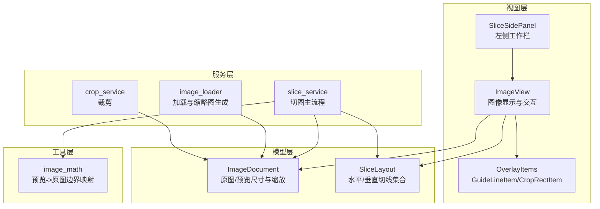
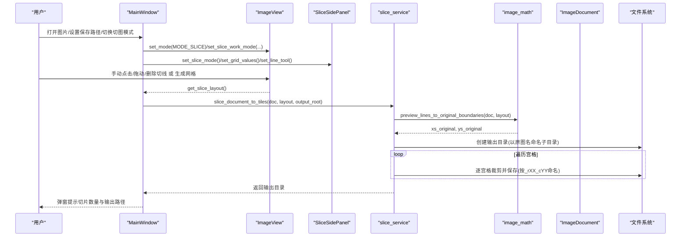
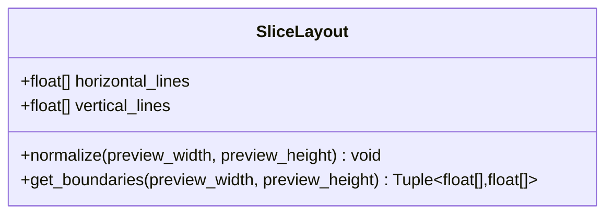
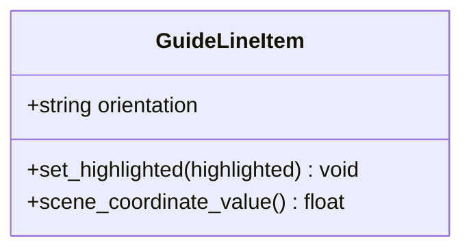
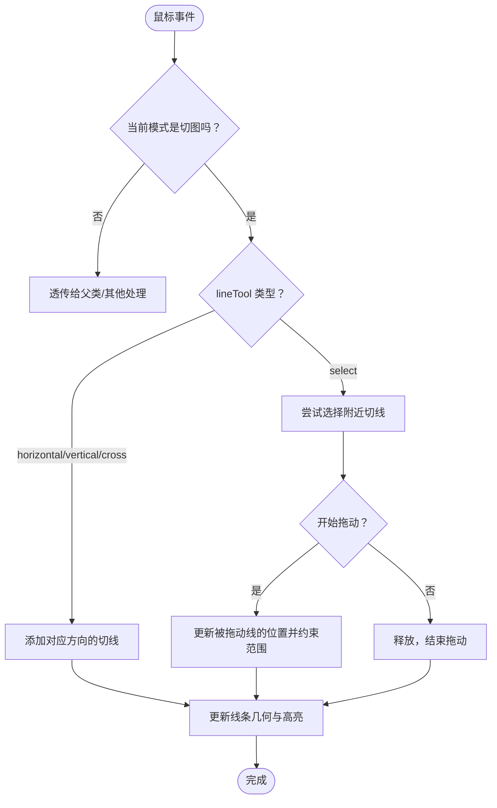
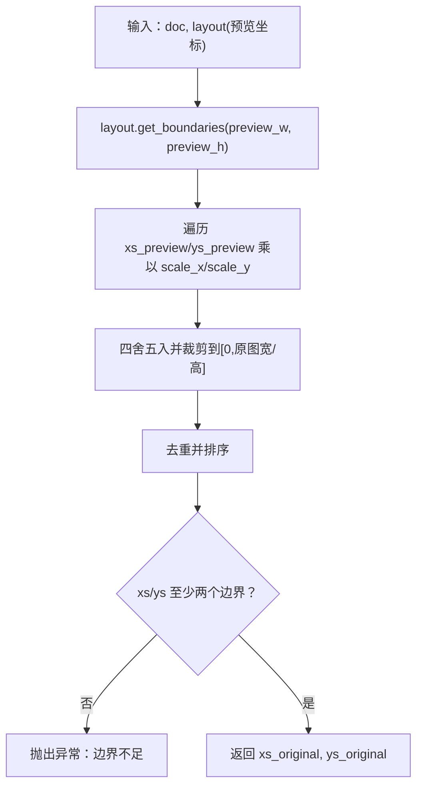
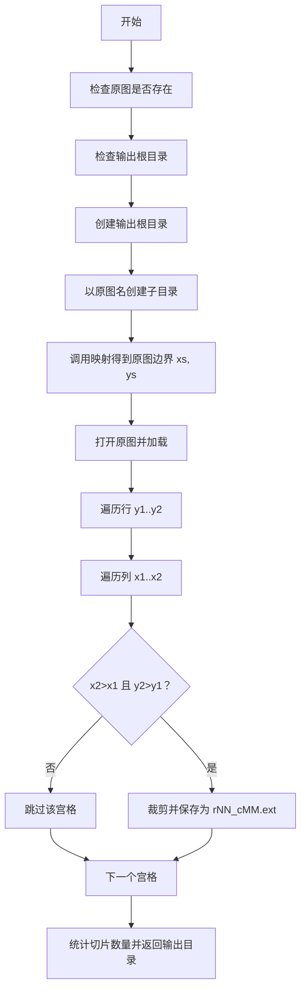
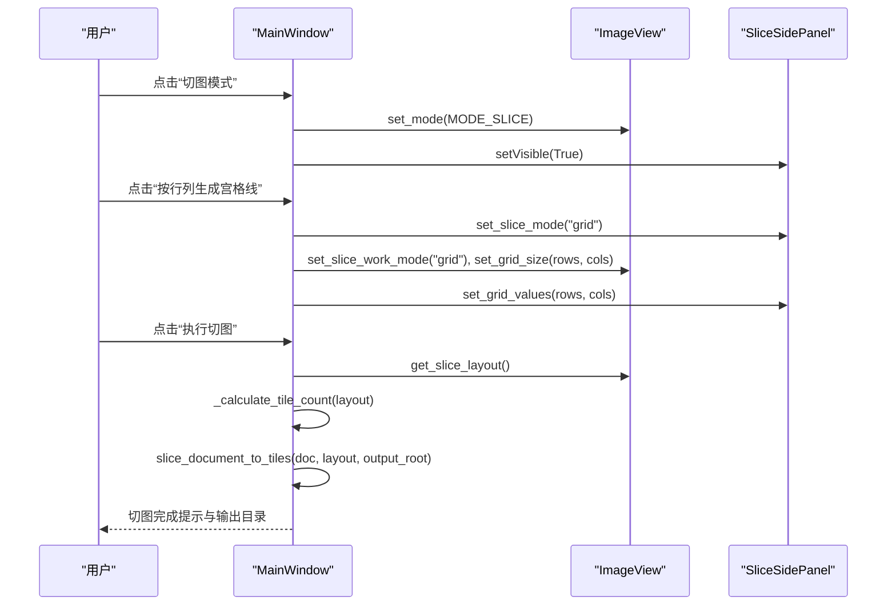
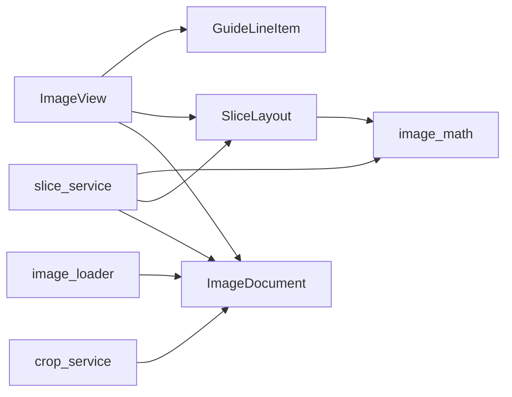

# 宫格切图功能

<cite>
**本文引用的文件**
- [main_window.py](file://img_slicer_tool/app/main_window.py)
- [image_view.py](file://img_slicer_tool/views/image_view.py)
- [overlay_items.py](file://img_slicer_tool/views/overlay_items.py)
- [slice_layout.py](file://img_slicer_tool/models/slice_layout.py)
- [image_math.py](file://img_slicer_tool/utils/image_math.py)
- [slice_service.py](file://img_slicer_tool/services/slice_service.py)
- [image_document.py](file://img_slicer_tool/models/image_document.py)
- [image_loader.py](file://img_slicer_tool/services/image_loader.py)
- [crop_service.py](file://img_slicer_tool/services/crop_service.py)
- [slice_side_panel.py](file://img_slicer_tool/views/slice_side_panel.py)
</cite>

## 目录
1. [简介](#简介)
2. [项目结构](#项目结构)
3. [核心组件](#核心组件)
4. [架构总览](#架构总览)
5. [详细组件分析](#详细组件分析)
6. [依赖关系分析](#依赖关系分析)
7. [性能考量](#性能考量)
8. [故障排查指南](#故障排查指南)
9. [结论](#结论)
10. [附录](#附录)

## 简介
本文件系统性阐述“宫格切图”功能的架构与实现细节，围绕以下目标展开：
- 解释 SliceLayout 如何管理预览坐标系下的水平与垂直切线，并进行去重、过滤与边界归一化。
- 描述 GuideLineItem 在 ImageView 上的绘制、拖动与删除交互逻辑。
- 解析 slice_service.py 中 slice_document_to_tiles 如何依据切线位置调用 preview_lines_to_original_boundaries 进行边界映射，批量裁剪并按命名规则（如_r01_c02）保存切片。
- 结合 main_window.py 的菜单项与信号连接，说明切图模式切换、宫格生成（按行列）、保存路径设置及执行切图的完整工作流。
- 提供代码示例路径以展示切片算法核心循环，分析输出目录结构（按原图名创建子目录）与文件格式处理策略。
- 讨论多切线场景下的性能表现与优化空间。

## 项目结构
该功能由“视图层（UI）—模型层（数据）—服务层（业务）—工具层（数学映射）”分层组织，核心文件如下：
- 视图层：ImageView（图像显示与交互）、OverlayItems（绘制切线与裁剪框）、SliceSidePanel（左侧工作栏）
- 模型层：ImageDocument（图像文档信息）、SliceLayout（切线布局）
- 工具层：image_math（预览坐标到原图坐标的映射）
- 服务层：slice_service（切图主流程）、image_loader（加载与缩略图生成）、crop_service（裁剪）

图表来源
- [image_view.py](file://img_slicer_tool/views/image_view.py#L1-L542)
- [overlay_items.py](file://img_slicer_tool/views/overlay_items.py#L1-L64)
- [slice_side_panel.py](file://img_slicer_tool/views/slice_side_panel.py#L1-L174)
- [image_document.py](file://img_slicer_tool/models/image_document.py#L1-L18)
- [slice_layout.py](file://img_slicer_tool/models/slice_layout.py#L1-L30)
- [image_math.py](file://img_slicer_tool/utils/image_math.py#L1-L76)
- [slice_service.py](file://img_slicer_tool/services/slice_service.py#L1-L62)
- [image_loader.py](file://img_slicer_tool/services/image_loader.py#L1-L68)
- [crop_service.py](file://img_slicer_tool/services/crop_service.py#L1-L38)

章节来源
- [main_window.py](file://img_slicer_tool/app/main_window.py#L1-L364)
- [image_view.py](file://img_slicer_tool/views/image_view.py#L1-L542)
- [overlay_items.py](file://img_slicer_tool/views/overlay_items.py#L1-L64)
- [slice_side_panel.py](file://img_slicer_tool/views/slice_side_panel.py#L1-L174)
- [image_document.py](file://img_slicer_tool/models/image_document.py#L1-L18)
- [slice_layout.py](file://img_slicer_tool/models/slice_layout.py#L1-L30)
- [image_math.py](file://img_slicer_tool/utils/image_math.py#L1-L76)
- [slice_service.py](file://img_slicer_tool/services/slice_service.py#L1-L62)
- [image_loader.py](file://img_slicer_tool/services/image_loader.py#L1-L68)
- [crop_service.py](file://img_slicer_tool/services/crop_service.py#L1-L38)

## 核心组件
- SliceLayout：维护水平与垂直切线列表，提供 normalize 去重与过滤、get_boundaries 返回含边界的坐标序列（包含0与宽/高的端点）。
- GuideLineItem：在 QGraphicsScene 中绘制水平/垂直线，支持高亮与自定义笔刷样式，不参与场景级拖拽。
- ImageView：承载图像与切线，负责切图模式切换、网格生成、手动添加/拖动/删除切线、收集切线为 SliceLayout 并进行预览坐标约束。
- image_math.preview_lines_to_original_boundaries：将预览坐标系的切线边界映射到原图像素坐标，保证去重、排序与边界安全。
- slice_service.slice_document_to_tiles：读取原图，按映射后的边界批量裁剪，按命名规则保存到以原图名为子目录的输出目录。
- ImageDocument：封装原图尺寸、预览尺寸与缩放因子，用于坐标映射。
- image_loader：加载原图，生成预览图与缩放比例。
- crop_service：基于预览矩形裁剪并保存新图。

章节来源
- [slice_layout.py](file://img_slicer_tool/models/slice_layout.py#L1-L30)
- [overlay_items.py](file://img_slicer_tool/views/overlay_items.py#L1-L64)
- [image_view.py](file://img_slicer_tool/views/image_view.py#L1-L542)
- [image_math.py](file://img_slicer_tool/utils/image_math.py#L1-L76)
- [slice_service.py](file://img_slicer_tool/services/slice_service.py#L1-L62)
- [image_document.py](file://img_slicer_tool/models/image_document.py#L1-L18)
- [image_loader.py](file://img_slicer_tool/services/image_loader.py#L1-L68)
- [crop_service.py](file://img_slicer_tool/services/crop_service.py#L1-L38)

## 架构总览
从用户操作到切图结果的端到端流程如下：

图表来源
- [main_window.py](file://img_slicer_tool/app/main_window.py#L1-L364)
- [image_view.py](file://img_slicer_tool/views/image_view.py#L1-L542)
- [slice_side_panel.py](file://img_slicer_tool/views/slice_side_panel.py#L1-L174)
- [slice_service.py](file://img_slicer_tool/services/slice_service.py#L1-L62)
- [image_math.py](file://img_slicer_tool/utils/image_math.py#L1-L76)
- [image_document.py](file://img_slicer_tool/models/image_document.py#L1-L18)

## 详细组件分析

### SliceLayout：切线布局与边界归一化
- 数据结构：水平/垂直两条切线列表，类型为浮点坐标。
- normalize：对切线进行去重、排序，并过滤掉超出预览范围的无效值，确保只保留(0, preview_height)或(0, preview_width)内的有效线。
- get_boundaries：在 normalize 后，自动拼接 [0, xs, preview_width] 与 [0, ys, preview_height]，形成闭区间边界序列，便于后续宫格划分。

图表来源
- [slice_layout.py](file://img_slicer_tool/models/slice_layout.py#L1-L30)

章节来源
- [slice_layout.py](file://img_slicer_tool/models/slice_layout.py#L1-L30)

### GuideLineItem：切线绘制与高亮
- 绘制：继承 QGraphicsLineItem，支持水平/垂直两种方向，通过 setLine 设置起止点。
- 高亮：通过笔刷宽度、样式与颜色区分普通与高亮状态，不启用场景级可选/可拖动标志位。
- 场景坐标：提供 scene_coordinate_value 获取线条在场景中的中心坐标，用于与鼠标命中检测配合。

图表来源
- [overlay_items.py](file://img_slicer_tool/views/overlay_items.py#L1-L64)

章节来源
- [overlay_items.py](file://img_slicer_tool/views/overlay_items.py#L1-L64)

### ImageView：切线交互与布局收集
- 模式与工具：MODE_SLICE/MODE_CROP，sliceMode(grid/manual)，lineTool(horizontal/vertical/cross/select)。
- 添加/删除/拖动切线：
  - 手动模式下，根据 lineTool 在点击处添加水平/垂直/十字线。
  - 支持鼠标靠近选择与拖动，拖动时限制在线条所在轴向范围内，防止越界。
  - Delete 键删除选中线。
- 网格生成：当 sliceMode 为 grid 且 rows/cols 更新时，按等间距生成水平/垂直线。
- 收集布局：get_slice_layout 将内部 cutLines 转换为 SliceLayout，并调用 normalize 进行预览坐标约束。

图表来源
- [image_view.py](file://img_slicer_tool/views/image_view.py#L1-L542)
- [overlay_items.py](file://img_slicer_tool/views/overlay_items.py#L1-L64)

章节来源
- [image_view.py](file://img_slicer_tool/views/image_view.py#L1-L542)
- [overlay_items.py](file://img_slicer_tool/views/overlay_items.py#L1-L64)

### image_math：预览坐标到原图坐标的映射
- preview_lines_to_original_boundaries：
  - 输入：ImageDocument 与 SliceLayout（预览坐标系）。
  - 步骤：先通过 layout.get_boundaries 得到预览坐标下的边界序列，再乘以 scale_x/scale_y 转换为原图像素坐标，四舍五入并裁剪到有效范围，最后去重、排序，确保至少两段边界。
  - 输出：xs_original, ys_original（严格递增的像素边界列表）。

图表来源
- [image_math.py](file://img_slicer_tool/utils/image_math.py#L1-L76)
- [slice_layout.py](file://img_slicer_tool/models/slice_layout.py#L1-L30)
- [image_document.py](file://img_slicer_tool/models/image_document.py#L1-L18)

章节来源
- [image_math.py](file://img_slicer_tool/utils/image_math.py#L1-L76)
- [slice_layout.py](file://img_slicer_tool/models/slice_layout.py#L1-L30)
- [image_document.py](file://img_slicer_tool/models/image_document.py#L1-L18)

### slice_service：切图主流程与命名规则
- 输入：ImageDocument、SliceLayout、输出根目录。
- 步骤：
  - 校验原图存在与输出路径非空。
  - 创建输出根目录。
  - 以原图名作为子目录名，避免与原图同名冲突。
  - 调用 preview_lines_to_original_boundaries 得到原图边界。
  - 使用 PIL 打开原图并逐宫格裁剪，跳过无效区域（x2<=x1 或 y2<=y1）。
  - 文件命名规则：_r{行号:02d}_c{列号:02d}，扩展名沿用原图（若无则默认 png）。
  - 对于 jpg/jpg，设置高质量参数保存。
  - 返回输出目录路径。

图表来源
- [slice_service.py](file://img_slicer_tool/services/slice_service.py#L1-L62)
- [image_math.py](file://img_slicer_tool/utils/image_math.py#L1-L76)

章节来源
- [slice_service.py](file://img_slicer_tool/services/slice_service.py#L1-L62)

### 主窗口工作流：菜单与信号连接
- 菜单与动作：
  - 打开图片、退出、切图模式开关、按行列生成宫格线、执行切图、设置切图保存路径。
- 信号连接：
  - 打开图片/拖拽图片加载、切图模式切换、生成网格、执行切图、设置输出目录、工作栏模式/网格/工具变更。
- 关键流程：
  - 切图模式开启时显示左侧工作栏，切换模式会提示并清空当前网格线。
  - 生成网格：弹窗输入行/列，设置工作栏与 ImageView 的网格大小，自动生成等间距切线。
  - 执行切图：收集当前布局，计算预估切片数量，调用 slice_document_to_tiles，弹窗提示结果并可直接打开输出目录。

图表来源
- [main_window.py](file://img_slicer_tool/app/main_window.py#L1-L364)
- [image_view.py](file://img_slicer_tool/views/image_view.py#L1-L542)
- [slice_side_panel.py](file://img_slicer_tool/views/slice_side_panel.py#L1-L174)

章节来源
- [main_window.py](file://img_slicer_tool/app/main_window.py#L1-L364)
- [slice_side_panel.py](file://img_slicer_tool/views/slice_side_panel.py#L1-L174)

## 依赖关系分析
- SliceLayout 依赖预览尺寸与切线集合，用于归一化与边界生成。
- ImageView 依赖 OverlayItems（GuideLineItem）进行绘制与交互，依赖 SliceLayout 收集布局。
- image_math 依赖 ImageDocument 的 scale_x/scale_y 实现坐标映射。
- slice_service 依赖 image_math 的边界映射、ImageDocument 的原图路径与尺寸。
- image_loader 为 ImageView 提供预览图与缩放比例。
- crop_service 与切图流程并行存在，用于普通裁剪。

图表来源
- [slice_layout.py](file://img_slicer_tool/models/slice_layout.py#L1-L30)
- [image_math.py](file://img_slicer_tool/utils/image_math.py#L1-L76)
- [image_view.py](file://img_slicer_tool/views/image_view.py#L1-L542)
- [overlay_items.py](file://img_slicer_tool/views/overlay_items.py#L1-L64)
- [slice_service.py](file://img_slicer_tool/services/slice_service.py#L1-L62)
- [image_document.py](file://img_slicer_tool/models/image_document.py#L1-L18)
- [image_loader.py](file://img_slicer_tool/services/image_loader.py#L1-L68)
- [crop_service.py](file://img_slicer_tool/services/crop_service.py#L1-L38)

章节来源
- [image_view.py](file://img_slicer_tool/views/image_view.py#L1-L542)
- [overlay_items.py](file://img_slicer_tool/views/overlay_items.py#L1-L64)
- [slice_layout.py](file://img_slicer_tool/models/slice_layout.py#L1-L30)
- [image_math.py](file://img_slicer_tool/utils/image_math.py#L1-L76)
- [slice_service.py](file://img_slicer_tool/services/slice_service.py#L1-L62)
- [image_document.py](file://img_slicer_tool/models/image_document.py#L1-L18)
- [image_loader.py](file://img_slicer_tool/services/image_loader.py#L1-L68)
- [crop_service.py](file://img_slicer_tool/services/crop_service.py#L1-L38)

## 性能考量
- 预览到原图映射复杂度：O(n+m)，n/m 分别为水平/垂直线数量，主要消耗在乘以 scale_x/scale_y 与去重排序。
- 切图主循环复杂度：O(R*C)，R 为行数，C 为列数，每轮裁剪与保存为常数时间。
- 多切线场景优化建议：
  - 预先对切线进行更严格的去重与排序，减少重复边界导致的无效宫格。
  - 在 UI 层限制最大网格规模，避免生成过多切线造成内存与渲染压力。
  - 对大图采用延迟加载与分块保存策略，减少一次性内存占用。
  - 对 JPEG 保存参数进行缓存与复用，避免重复构造字典。
  - 在批量保存前进行一次有效性检查（如最小尺寸阈值），提前失败以节省 IO。

[本节为通用性能讨论，无需具体文件引用]

## 故障排查指南
- 切图失败：检查原图是否存在、输出路径是否为空、边界是否足够（至少两个边界）。
- 无切线导出整图：执行切图前会弹窗确认，若无切线仅导出整图，请确认是否需要添加切线。
- 保存路径未设置：若未设置保存根目录，默认使用原图所在目录。
- 切线越界或无效：ImageView 会在拖动时将切线位置钳制在预览图范围内；若出现异常，检查预览图尺寸与缩放比例。
- 文件格式问题：JPEG 保存时会设置质量与子采样参数；若需 PNG，请确保扩展名为 .png 或未指定扩展名时默认为 .png。

章节来源
- [main_window.py](file://img_slicer_tool/app/main_window.py#L204-L261)
- [slice_service.py](file://img_slicer_tool/services/slice_service.py#L1-L62)
- [image_math.py](file://img_slicer_tool/utils/image_math.py#L50-L76)
- [image_view.py](file://img_slicer_tool/views/image_view.py#L333-L381)

## 结论
本功能通过清晰的分层设计实现了从 UI 交互到原图切分的完整闭环：ImageView 负责切线的可视化与交互，SliceLayout 负责布局的归一化与边界生成，image_math 负责预览到原图的精确映射，slice_service 负责批量裁剪与命名保存。配合 MainWindow 的菜单与信号机制，用户可以灵活地在网格与手动模式间切换，并一键执行切图。针对多切线场景，建议在 UI 层面限制规模并在服务层进行边界去重与有效性检查，以获得更好的性能与稳定性。

[本节为总结性内容，无需具体文件引用]

## 附录

### 输出目录结构与命名规则
- 输出根目录：由用户设置或默认使用原图所在目录。
- 子目录：以原图文件名（不含扩展名）创建子目录。
- 切片文件：按 _r{行号:02d}_c{列号:02d} 命名，扩展名沿用原图；若原图无扩展名则默认 .png。
- 示例：输出根目录为 out/，原图为 foo.png，则输出为 out/foo/，文件名形如 foo_r01_c02.png。

章节来源
- [slice_service.py](file://img_slicer_tool/services/slice_service.py#L27-L61)

### 切片算法核心循环（示例路径）
- 遍历行与列的双重循环，逐宫格裁剪并保存：
  - 参考路径：[slice_service.py](file://img_slicer_tool/services/slice_service.py#L38-L60)

章节来源
- [slice_service.py](file://img_slicer_tool/services/slice_service.py#L38-L60)