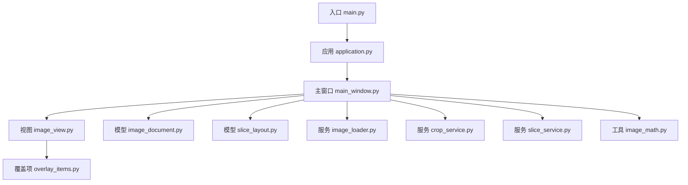
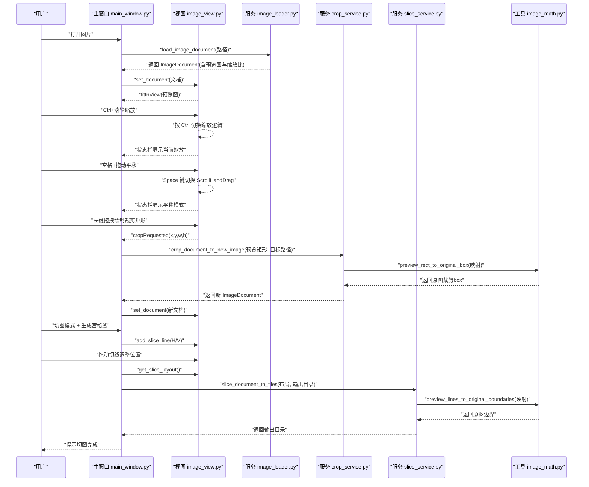
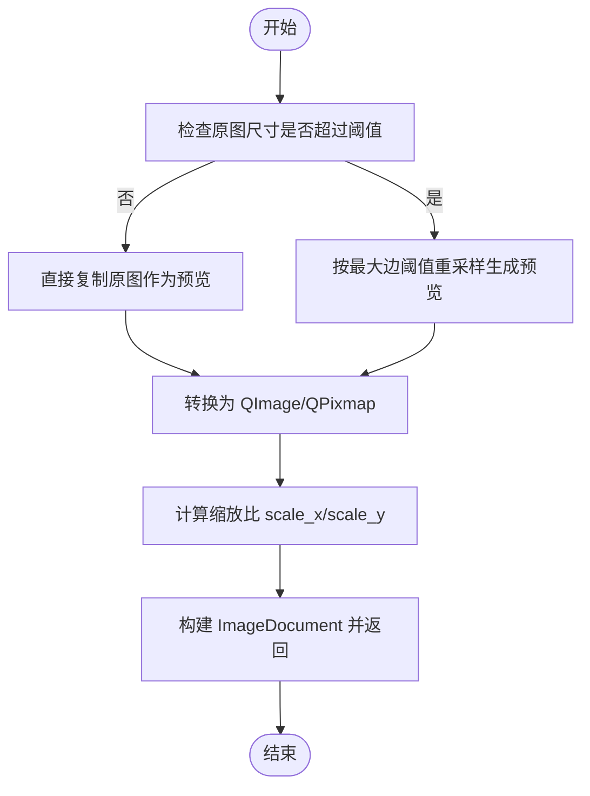
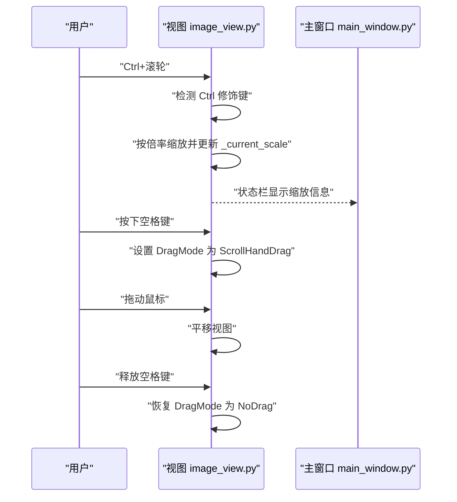
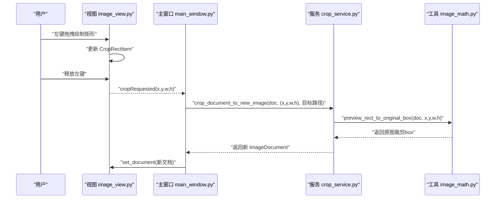
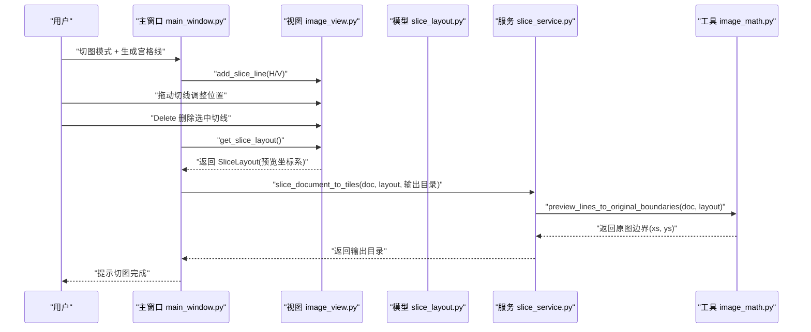
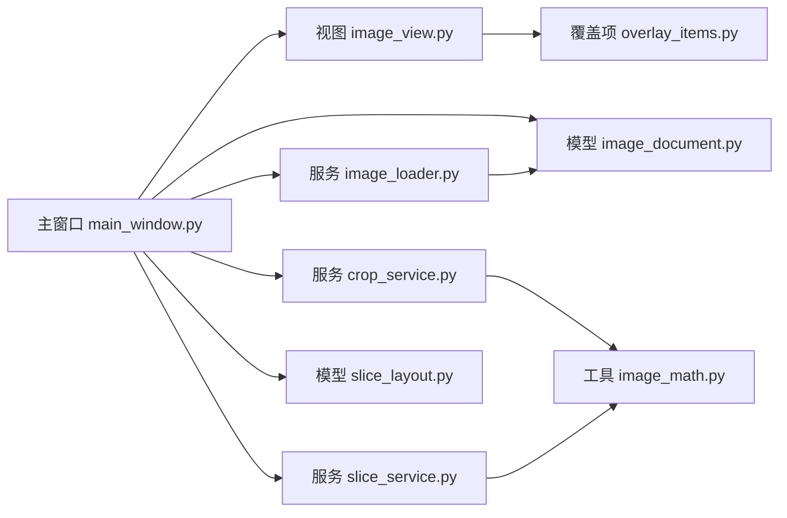

# 核心功能详解

<cite>
**本文引用的文件**
- [main.py](file://img_slicer_tool/main.py)
- [application.py](file://img_slicer_tool/app/application.py)
- [main_window.py](file://img_slicer_tool/app/main_window.py)
- [image_view.py](file://img_slicer_tool/views/image_view.py)
- [overlay_items.py](file://img_slicer_tool/views/overlay_items.py)
- [image_document.py](file://img_slicer_tool/models/image_document.py)
- [slice_layout.py](file://img_slicer_tool/models/slice_layout.py)
- [image_loader.py](file://img_slicer_tool/services/image_loader.py)
- [crop_service.py](file://img_slicer_tool/services/crop_service.py)
- [slice_service.py](file://img_slicer_tool/services/slice_service.py)
- [image_math.py](file://img_slicer_tool/utils/image_math.py)
- [requirements.txt](file://img_slicer_tool/requirements.txt)
- [README.md](file://img_slicer_tool/README.md)
</cite>

## 目录
1. [简介](#简介)
2. [项目结构](#项目结构)
3. [核心组件](#核心组件)
4. [架构总览](#架构总览)
5. [详细组件分析](#详细组件分析)
6. [依赖关系分析](#依赖关系分析)
7. [性能考量](#性能考量)
8. [故障排查指南](#故障排查指南)
9. [结论](#结论)
10. [附录](#附录)

## 简介
本文件围绕 PictureMaster 的核心功能展开，重点覆盖以下四个模块：
- 图像加载：利用 Pillow 加载图像并生成最大边不超过 4000px 的预览图，同时维护预览与原图的缩放比例。
- 缩放平移浏览：通过 Ctrl+滚轮实现缩放，空格键按下时启用“手拖”模式进行平移。
- 区域裁剪：在预览坐标系下绘制选择矩形，经由坐标映射到原图后执行精确裁剪。
- 宫格切图：在预览坐标系下添加横/竖/十字切线，拖动调整位置，最终批量导出切片图像。

文档将结合代码路径说明各模块的实现要点、数据流与交互流程，并提供典型使用场景的操作流程图与性能优化建议。

## 项目结构
项目采用分层组织：入口程序负责启动应用；主窗口负责菜单与信号槽绑定；视图层承载图像显示、交互与覆盖元素；模型层封装文档与布局；服务层提供图像加载、裁剪与切图业务逻辑；工具层提供坐标映射等数学工具。

图表来源
- [main.py](file://img_slicer_tool/main.py#L1-L13)
- [application.py](file://img_slicer_tool/app/application.py#L1-L35)
- [main_window.py](file://img_slicer_tool/app/main_window.py#L1-L262)
- [image_view.py](file://img_slicer_tool/views/image_view.py#L1-L218)
- [overlay_items.py](file://img_slicer_tool/views/overlay_items.py#L1-L57)
- [image_document.py](file://img_slicer_tool/models/image_document.py#L1-L18)
- [slice_layout.py](file://img_slicer_tool/models/slice_layout.py#L1-L30)
- [image_loader.py](file://img_slicer_tool/services/image_loader.py#L1-L68)
- [crop_service.py](file://img_slicer_tool/services/crop_service.py#L1-L38)
- [slice_service.py](file://img_slicer_tool/services/slice_service.py#L1-L62)
- [image_math.py](file://img_slicer_tool/utils/image_math.py#L1-L76)

章节来源
- [main.py](file://img_slicer_tool/main.py#L1-L13)
- [application.py](file://img_slicer_tool/app/application.py#L1-L35)
- [requirements.txt](file://img_slicer_tool/requirements.txt#L1-L14)
- [README.md](file://img_slicer_tool/README.md#L1-L10)

## 核心组件
- 应用入口与启动：创建 QApplication 与 MainWindow 并运行事件循环。
- 主窗口：负责菜单项创建、动作绑定、状态栏提示、与服务层交互。
- 视图层：承载 QGraphicsScene/QGraphicsView，处理鼠标/键盘事件，渲染预览图与覆盖元素。
- 模型层：ImageDocument 描述图像元信息；SliceLayout 描述预览坐标系下的切线布局。
- 服务层：image_loader 负责预览图生成与缩放比；crop_service 执行裁剪；slice_service 执行切图导出。
- 工具层：image_math 提供预览坐标到原图坐标的映射。

章节来源
- [main.py](file://img_slicer_tool/main.py#L1-L13)
- [application.py](file://img_slicer_tool/app/application.py#L1-L35)
- [main_window.py](file://img_slicer_tool/app/main_window.py#L1-L262)
- [image_view.py](file://img_slicer_tool/views/image_view.py#L1-L218)
- [image_document.py](file://img_slicer_tool/models/image_document.py#L1-L18)
- [slice_layout.py](file://img_slicer_tool/models/slice_layout.py#L1-L30)
- [image_loader.py](file://img_slicer_tool/services/image_loader.py#L1-L68)
- [crop_service.py](file://img_slicer_tool/services/crop_service.py#L1-L38)
- [slice_service.py](file://img_slicer_tool/services/slice_service.py#L1-L62)
- [image_math.py](file://img_slicer_tool/utils/image_math.py#L1-L76)

## 架构总览
下图展示了从用户操作到服务层处理再到文件落盘的整体流程。

图表来源
- [main_window.py](file://img_slicer_tool/app/main_window.py#L1-L262)
- [image_view.py](file://img_slicer_tool/views/image_view.py#L1-L218)
- [image_loader.py](file://img_slicer_tool/services/image_loader.py#L1-L68)
- [crop_service.py](file://img_slicer_tool/services/crop_service.py#L1-L38)
- [slice_service.py](file://img_slicer_tool/services/slice_service.py#L1-L62)
- [image_math.py](file://img_slicer_tool/utils/image_math.py#L1-L76)

## 详细组件分析

### 图像加载与预览生成
- 功能目标：加载原图，生成最大边不超过 4000px 的预览图，并计算预览与原图的缩放比，以便后续坐标映射。
- 关键实现点：
  - 使用 Pillow 打开图像并读取尺寸，计算预览尺寸与缩放比。
  - 当原图超过阈值时，使用高质量重采样生成预览；否则直接复制。
  - 将预览图转为 QImage/QPixmap，封装到 ImageDocument。
- 数据结构与复杂度：
  - 预览尺寸计算为 O(1)，图像重采样为 O(W×H)。
  - ImageDocument 字段包含路径、原图宽高、预览宽高、缩放比与预览图对象，便于后续快速访问。
- 性能注意：
  - 对超大图仅生成预览，避免 UI 卡顿。
  - 重采样使用高质量滤波器，保证缩略图质量。

图表来源
- [image_loader.py](file://img_slicer_tool/services/image_loader.py#L1-L68)
- [image_document.py](file://img_slicer_tool/models/image_document.py#L1-L18)

章节来源
- [image_loader.py](file://img_slicer_tool/services/image_loader.py#L1-L68)
- [image_document.py](file://img_slicer_tool/models/image_document.py#L1-L18)

### 缩放与平移交互机制
- 缩放：当用户按下 Ctrl 并滚动鼠标滚轮时，视图按固定倍率放大/缩小，同时更新当前缩放系数。
- 平移：当用户按下空格键时，启用“手拖”模式，允许通过鼠标拖动平移视图；释放空格键恢复默认模式。
- 状态栏反馈：在切换模式或执行操作时，向用户展示当前状态。

图表来源
- [image_view.py](file://img_slicer_tool/views/image_view.py#L1-L218)
- [main_window.py](file://img_slicer_tool/app/main_window.py#L1-L262)

章节来源
- [image_view.py](file://img_slicer_tool/views/image_view.py#L1-L218)
- [main_window.py](file://img_slicer_tool/app/main_window.py#L1-L262)

### 区域裁剪：绘制、坐标捕获与精确裁剪
- 绘制逻辑：在裁剪模式下，用户左键按下并拖动，实时绘制半透明带虚线边框的选择矩形。
- 坐标捕获：当释放鼠标时，若矩形尺寸满足最小值要求，则发出裁剪请求信号，携带预览坐标系下的矩形参数。
- 坐标映射与裁剪：主窗口接收信号后，调用裁剪服务。服务通过工具函数将预览矩形映射到原图坐标，再使用 Pillow 执行精确裁剪，并保存到目标路径，最后重新加载生成的新文档。

图表来源
- [image_view.py](file://img_slicer_tool/views/image_view.py#L1-L218)
- [main_window.py](file://img_slicer_tool/app/main_window.py#L1-L262)
- [crop_service.py](file://img_slicer_tool/services/crop_service.py#L1-L38)
- [image_math.py](file://img_slicer_tool/utils/image_math.py#L1-L76)

章节来源
- [image_view.py](file://img_slicer_tool/views/image_view.py#L1-L218)
- [overlay_items.py](file://img_slicer_tool/views/overlay_items.py#L1-L57)
- [main_window.py](file://img_slicer_tool/app/main_window.py#L1-L262)
- [crop_service.py](file://img_slicer_tool/services/crop_service.py#L1-L38)
- [image_math.py](file://img_slicer_tool/utils/image_math.py#L1-L76)

### 宫格切图：切线添加、拖动与批量导出
- 切线添加：进入切图模式后，单击会在当前位置添加一条或多条切线（默认十字线，Shift=横线，Ctrl=竖线），并将其加入场景。
- 拖动与删除：切线可被选中并拖动调整位置；按下 Delete 可删除选中的切线。
- 布局收集与映射：主窗口从视图收集所有切线，形成 SliceLayout（预览坐标系），并通过工具函数映射到原图边界。
- 批量导出：服务层遍历边界生成的网格，逐个裁剪并保存为命名规范的切片文件，返回输出目录。

图表来源
- [main_window.py](file://img_slicer_tool/app/main_window.py#L1-L262)
- [image_view.py](file://img_slicer_tool/views/image_view.py#L1-L218)
- [slice_layout.py](file://img_slicer_tool/models/slice_layout.py#L1-L30)
- [slice_service.py](file://img_slicer_tool/services/slice_service.py#L1-L62)
- [image_math.py](file://img_slicer_tool/utils/image_math.py#L1-L76)

章节来源
- [main_window.py](file://img_slicer_tool/app/main_window.py#L1-L262)
- [image_view.py](file://img_slicer_tool/views/image_view.py#L1-L218)
- [slice_layout.py](file://img_slicer_tool/models/slice_layout.py#L1-L30)
- [slice_service.py](file://img_slicer_tool/services/slice_service.py#L1-L62)
- [image_math.py](file://img_slicer_tool/utils/image_math.py#L1-L76)

### 菜单绑定与信号槽连接
- 打开图片：绑定“打开图片”动作到打开对话框，选择文件后调用图像加载服务并设置到视图。
- 退出：绑定“退出”动作到关闭窗口。
- 切图模式：切换动作切换视图模式，改变状态栏提示。
- 生成宫格线：弹出行/列输入框，按预览图尺寸等间距生成横/竖线。
- 执行切图：收集布局并调用切图服务，保存到指定目录。
- 删除切线：Delete 键删除选中切线。
- 裁剪确认：视图发出裁剪请求信号，主窗口弹出确认对话框并执行裁剪。

章节来源
- [main_window.py](file://img_slicer_tool/app/main_window.py#L1-L262)
- [image_view.py](file://img_slicer_tool/views/image_view.py#L1-L218)

## 依赖关系分析
- 组件耦合：
  - 主窗口与视图强耦合（信号槽、状态栏、菜单控制）。
  - 视图与覆盖项弱耦合（通过 QGraphicsItem 接口交互）。
  - 服务层与工具层松耦合（通过函数接口传递模型对象）。
- 外部依赖：
  - GUI：PySide6（Qt 框架）
  - 图像处理：Pillow（图像读写与重采样）
  - 打包：PyInstaller（可选）

图表来源
- [main_window.py](file://img_slicer_tool/app/main_window.py#L1-L262)
- [image_view.py](file://img_slicer_tool/views/image_view.py#L1-L218)
- [overlay_items.py](file://img_slicer_tool/views/overlay_items.py#L1-L57)
- [image_document.py](file://img_slicer_tool/models/image_document.py#L1-L18)
- [slice_layout.py](file://img_slicer_tool/models/slice_layout.py#L1-L30)
- [image_loader.py](file://img_slicer_tool/services/image_loader.py#L1-L68)
- [crop_service.py](file://img_slicer_tool/services/crop_service.py#L1-L38)
- [slice_service.py](file://img_slicer_tool/services/slice_service.py#L1-L62)
- [image_math.py](file://img_slicer_tool/utils/image_math.py#L1-L76)

章节来源
- [requirements.txt](file://img_slicer_tool/requirements.txt#L1-L14)

## 性能考量
- 预览图策略：通过最大边阈值限制预览图尺寸，避免 UI 渲染与内存占用过高，提升交互流畅性。
- 缩放与平移：仅在预览图上进行，避免对原图进行频繁重采样；缩放与平移通过变换矩阵实现，成本低。
- 裁剪与切图：实际裁剪与保存发生在原图上，使用高质量重采样与合理的编码参数（如 JPEG 的质量与子采样）平衡体积与质量。
- 事件处理：视图层对 Ctrl/空格/Delete 等按键与鼠标事件进行短路处理，减少无关分支开销。
- I/O 优化：批量导出时按网格顺序裁剪并保存，避免重复打开文件句柄；输出目录按原图名建立子目录，便于管理。

[本节为通用性能讨论，不直接分析具体文件]

## 故障排查指南
- 打不开图片：检查文件是否存在与可读；查看加载异常提示；确认图像格式支持。
- 裁剪无效：确认选择矩形尺寸大于最小阈值；检查预览坐标是否落在预览图范围内。
- 切图无输出：确认已添加至少一条横线或竖线；检查输出目录权限；查看返回的输出目录路径。
- 缩放/平移异常：确认未误触其他修饰键；确保视图处于正确模式；检查状态栏提示。
- 键盘快捷键冲突：确认未与其他系统或应用快捷键冲突；必要时更换组合键。

章节来源
- [main_window.py](file://img_slicer_tool/app/main_window.py#L1-L262)
- [image_view.py](file://img_slicer_tool/views/image_view.py#L1-L218)

## 结论
PictureMaster 通过清晰的分层设计与职责分离，实现了从图像加载、交互浏览到精确裁剪与批量切图的完整工作流。预览图策略与 Qt 的变换机制保证了大图场景下的良好体验；坐标映射工具确保了预览与原图之间的准确一致性；服务层将业务逻辑与 UI 解耦，便于扩展与维护。未来可在切线编辑、撤销/重做、更多导出格式等方面进一步增强。

[本节为总结性内容，不直接分析具体文件]

## 附录
- 典型使用场景操作流程（以文字描述）：
  - 图像加载：打开图片 → 预览图显示 → 查看原图与预览尺寸 → 可进行缩放与平移。
  - 区域裁剪：进入裁剪模式 → 拖拽绘制矩形 → 释放鼠标触发裁剪 → 选择覆盖原图或另存为 → 新文档生效。
  - 宫格切图：进入切图模式 → 输入行/列数 → 自动生成宫格线 → 拖动微调 → 执行切图 → 查看输出目录。
- 代码路径参考（用于定位实现细节）：
  - 图像加载与预览：[image_loader.py](file://img_slicer_tool/services/image_loader.py#L1-L68)
  - 缩放与平移：[image_view.py](file://img_slicer_tool/views/image_view.py#L1-L218)
  - 裁剪流程：[main_window.py](file://img_slicer_tool/app/main_window.py#L1-L262)、[crop_service.py](file://img_slicer_tool/services/crop_service.py#L1-L38)、[image_math.py](file://img_slicer_tool/utils/image_math.py#L1-L76)
  - 宫格切图：[main_window.py](file://img_slicer_tool/app/main_window.py#L1-L262)、[image_view.py](file://img_slicer_tool/views/image_view.py#L1-L218)、[slice_service.py](file://img_slicer_tool/services/slice_service.py#L1-L62)、[slice_layout.py](file://img_slicer_tool/models/slice_layout.py#L1-L30)