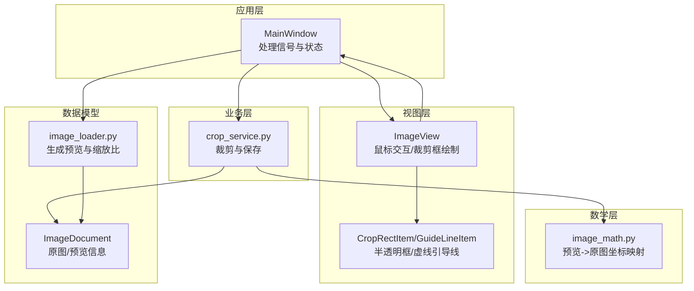
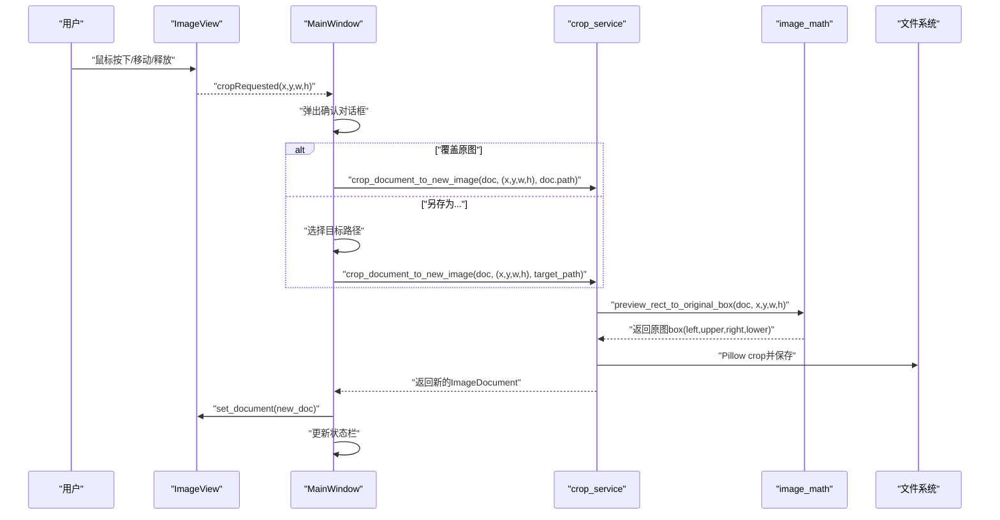
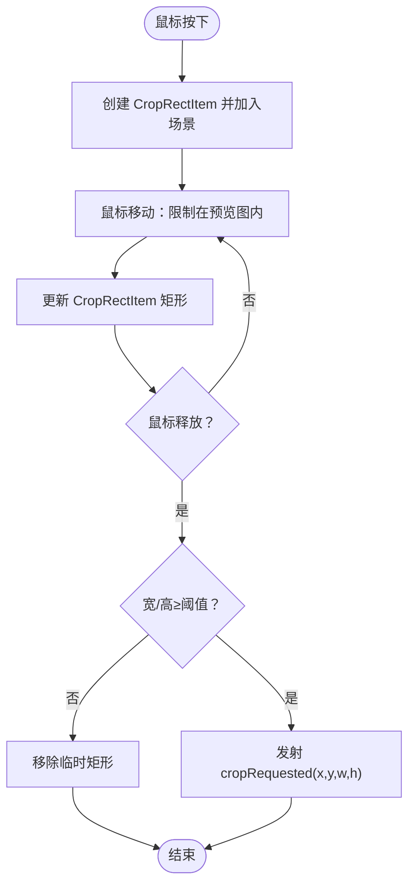
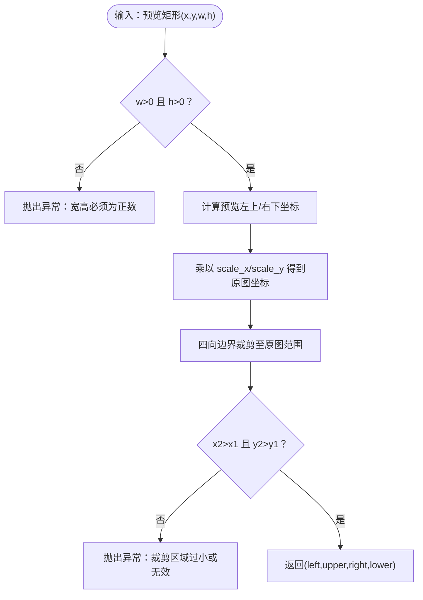
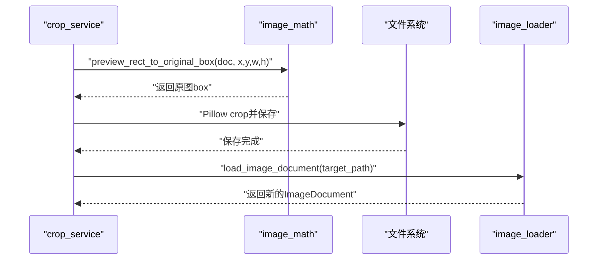
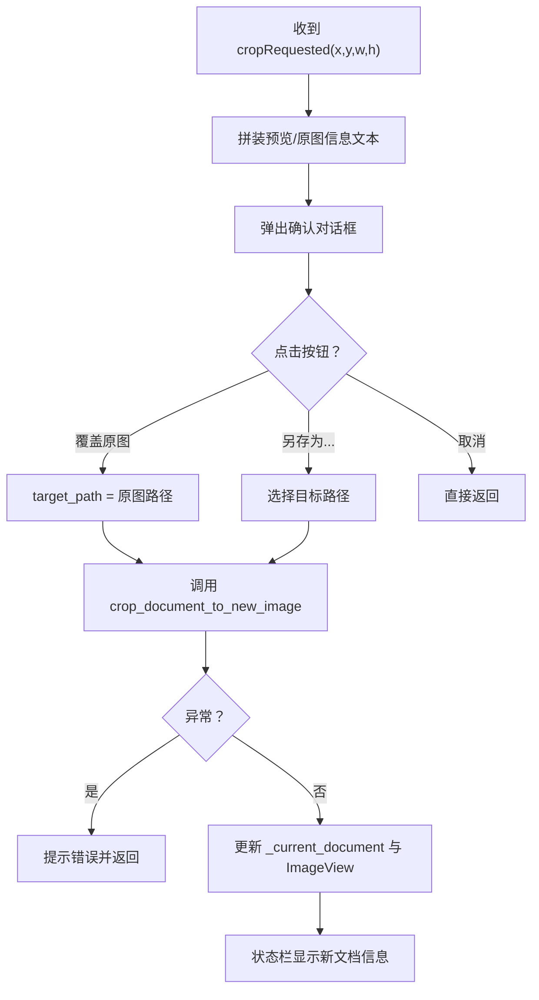
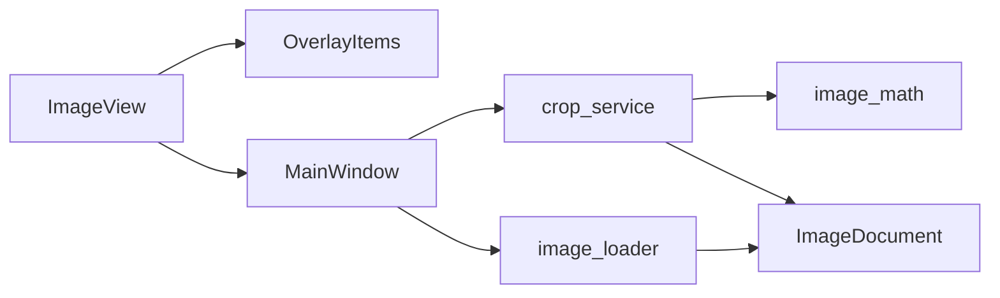

# 裁剪功能

<cite>
**本文引用的文件**
- [img_slicer_tool/views/overlay_items.py](file://img_slicer_tool/views/overlay_items.py)
- [img_slicer_tool/views/image_view.py](file://img_slicer_tool/views/image_view.py)
- [img_slicer_tool/utils/image_math.py](file://img_slicer_tool/utils/image_math.py)
- [img_slicer_tool/services/crop_service.py](file://img_slicer_tool/services/crop_service.py)
- [img_slicer_tool/app/main_window.py](file://img_slicer_tool/app/main_window.py)
- [img_slicer_tool/models/image_document.py](file://img_slicer_tool/models/image_document.py)
- [img_slicer_tool/services/image_loader.py](file://img_slicer_tool/services/image_loader.py)
</cite>

## 目录
1. [简介](#简介)
2. [项目结构](#项目结构)
3. [核心组件](#核心组件)
4. [架构总览](#架构总览)
5. [详细组件分析](#详细组件分析)
6. [依赖关系分析](#依赖关系分析)
7. [性能考量](#性能考量)
8. [故障排查指南](#故障排查指南)
9. [结论](#结论)
10. [附录](#附录)

## 简介
本文围绕“区域裁剪”功能的全流程实现进行系统化解析，重点说明：
- 在 ImageView 上如何绘制半透明裁剪框并响应鼠标拖拽；
- image_math.py 中坐标映射函数如何将预览图上的矩形区域（x,y,w,h）通过 scale_x/scale_y 转换为原图精确坐标；
- crop_service.py 中 crop_document_to_new_image 的实现细节，包括 Pillow 的 crop 操作、文件保存格式处理（如 JPG 质量设置）及异常捕获；
- 结合 main_window.py 中 _on_crop_requested 的信号处理，描述确认对话框构建、覆盖原图与另存为的逻辑分支及状态更新流程；
- 提供典型使用示例、裁剪精度误差来源分析以及大图裁剪时的性能优化建议。

## 项目结构
裁剪功能由多个层次协同完成：
- 视图层：负责交互与可视化（ImageView、OverlayItems）
- 数学层：负责坐标映射（image_math.py）
- 业务层：负责裁剪与文件保存（crop_service.py）
- 应用层：负责 UI 事件与状态管理（main_window.py）
- 数据模型：承载图像元数据与预览图（image_document.py、image_loader.py）

图表来源
- [img_slicer_tool/app/main_window.py](file://img_slicer_tool/app/main_window.py#L136-L192)
- [img_slicer_tool/views/image_view.py](file://img_slicer_tool/views/image_view.py#L154-L234)
- [img_slicer_tool/views/overlay_items.py](file://img_slicer_tool/views/overlay_items.py#L8-L25)
- [img_slicer_tool/utils/image_math.py](file://img_slicer_tool/utils/image_math.py#L17-L48)
- [img_slicer_tool/services/crop_service.py](file://img_slicer_tool/services/crop_service.py#L13-L37)
- [img_slicer_tool/models/image_document.py](file://img_slicer_tool/models/image_document.py#L8-L18)
- [img_slicer_tool/services/image_loader.py](file://img_slicer_tool/services/image_loader.py#L24-L55)

章节来源
- [img_slicer_tool/app/main_window.py](file://img_slicer_tool/app/main_window.py#L136-L192)
- [img_slicer_tool/views/image_view.py](file://img_slicer_tool/views/image_view.py#L154-L234)
- [img_slicer_tool/views/overlay_items.py](file://img_slicer_tool/views/overlay_items.py#L8-L25)
- [img_slicer_tool/utils/image_math.py](file://img_slicer_tool/utils/image_math.py#L17-L48)
- [img_slicer_tool/services/crop_service.py](file://img_slicer_tool/services/crop_service.py#L13-L37)
- [img_slicer_tool/models/image_document.py](file://img_slicer_tool/models/image_document.py#L8-L18)
- [img_slicer_tool/services/image_loader.py](file://img_slicer_tool/services/image_loader.py#L24-L55)

## 核心组件
- CropRectItem：在 QGraphicsScene 上绘制半透明填充、虚线边框的矩形，用于直观展示裁剪区域。
- ImageView：负责鼠标事件处理，拖拽绘制 CropRectItem，并在释放时发出 cropRequested 信号。
- image_math.preview_rect_to_original_box：将预览坐标（x,y,w,h）映射为原图坐标（left,upper,right,lower），并做边界裁剪与有效性校验。
- crop_service.crop_document_to_new_image：读取原图，执行 Pillow crop，按目标格式设置参数（如 JPG quality/subsampling），保存并重新加载为新的 ImageDocument。
- MainWindow：接收 cropRequested 信号，弹出确认对话框，分支覆盖原图或另存为，捕获异常并更新状态栏与视图。

章节来源
- [img_slicer_tool/views/overlay_items.py](file://img_slicer_tool/views/overlay_items.py#L8-L25)
- [img_slicer_tool/views/image_view.py](file://img_slicer_tool/views/image_view.py#L154-L234)
- [img_slicer_tool/utils/image_math.py](file://img_slicer_tool/utils/image_math.py#L17-L48)
- [img_slicer_tool/services/crop_service.py](file://img_slicer_tool/services/crop_service.py#L13-L37)
- [img_slicer_tool/app/main_window.py](file://img_slicer_tool/app/main_window.py#L136-L192)

## 架构总览
裁剪流程从用户在 ImageView 上拖拽矩形开始，经由坐标映射到原图，再由服务层执行裁剪与保存，最后由应用层更新界面状态。

图表来源
- [img_slicer_tool/views/image_view.py](file://img_slicer_tool/views/image_view.py#L223-L231)
- [img_slicer_tool/app/main_window.py](file://img_slicer_tool/app/main_window.py#L136-L192)
- [img_slicer_tool/utils/image_math.py](file://img_slicer_tool/utils/image_math.py#L17-L48)
- [img_slicer_tool/services/crop_service.py](file://img_slicer_tool/services/crop_service.py#L13-L37)

## 详细组件分析

### 组件A：CropRectItem 与 ImageView 的交互
- CropRectItem：构造时设置半透明填充与虚线边框，Z 值高于其他覆盖物，禁用选择/拖动标志，确保其仅作为视觉指示器。
- ImageView：
  - 鼠标按下：记录起始点，创建 CropRectItem 并加入场景。
  - 鼠标移动：将当前位置限制在预览图范围内，计算归一化矩形并更新 CropRectItem。
  - 鼠标释放：若宽度/高度满足最小阈值，则发射 cropRequested(x,y,w,h) 信号。

图表来源
- [img_slicer_tool/views/overlay_items.py](file://img_slicer_tool/views/overlay_items.py#L8-L25)
- [img_slicer_tool/views/image_view.py](file://img_slicer_tool/views/image_view.py#L154-L234)

章节来源
- [img_slicer_tool/views/overlay_items.py](file://img_slicer_tool/views/overlay_items.py#L8-L25)
- [img_slicer_tool/views/image_view.py](file://img_slicer_tool/views/image_view.py#L154-L234)

### 组件B：坐标映射与裁剪 box 计算
- 预览坐标系与原图坐标系的关系由 ImageDocument 的 scale_x/scale_y 决定。
- preview_rect_to_original_box：
  - 输入预览矩形 (x, y, w, h)，计算左上/右下坐标；
  - 乘以 scale_x/scale_y 得到原图坐标；
  - 四向边界裁剪至 [0, 原图宽/高]；
  - 校验 x2>x1 且 y2>y1，否则抛出异常；
  - 返回原图 box(left, upper, right, lower)。

图表来源
- [img_slicer_tool/utils/image_math.py](file://img_slicer_tool/utils/image_math.py#L17-L48)
- [img_slicer_tool/models/image_document.py](file://img_slicer_tool/models/image_document.py#L8-L18)

章节来源
- [img_slicer_tool/utils/image_math.py](file://img_slicer_tool/utils/image_math.py#L17-L48)
- [img_slicer_tool/models/image_document.py](file://img_slicer_tool/models/image_document.py#L8-L18)

### 组件C：裁剪服务与文件保存
- crop_document_to_new_image：
  - 校验原图路径存在；
  - 调用 preview_rect_to_original_box 获取原图 box；
  - 使用 Pillow 打开原图，执行 crop；
  - 对 JPG/JPEG 设置 quality 与 subsampling；
  - 保存到目标路径；
  - 重新加载为目标路径的 ImageDocument 并返回。

图表来源
- [img_slicer_tool/services/crop_service.py](file://img_slicer_tool/services/crop_service.py#L13-L37)
- [img_slicer_tool/utils/image_math.py](file://img_slicer_tool/utils/image_math.py#L17-L48)
- [img_slicer_tool/services/image_loader.py](file://img_slicer_tool/services/image_loader.py#L24-L55)

章节来源
- [img_slicer_tool/services/crop_service.py](file://img_slicer_tool/services/crop_service.py#L13-L37)
- [img_slicer_tool/services/image_loader.py](file://img_slicer_tool/services/image_loader.py#L24-L55)

### 组件D：确认对话框与状态更新
- MainWindow._on_crop_requested：
  - 弹出确认对话框，提供“覆盖原图”“另存为…”“取消”三个选项；
  - 若选择覆盖原图，target_path 为原图路径；
  - 若选择另存为，弹出文件对话框选择目标路径；
  - 调用 crop_document_to_new_image 执行裁剪；
  - 捕获异常并提示；
  - 更新当前文档与 ImageView，并在状态栏显示新文档信息。

图表来源
- [img_slicer_tool/app/main_window.py](file://img_slicer_tool/app/main_window.py#L136-L192)
- [img_slicer_tool/services/crop_service.py](file://img_slicer_tool/services/crop_service.py#L13-L37)

章节来源
- [img_slicer_tool/app/main_window.py](file://img_slicer_tool/app/main_window.py#L136-L192)

## 依赖关系分析
- ImageView 依赖 OverlayItems（CropRectItem/GuideLineItem）进行可视化；
- crop_service 依赖 image_math 进行坐标映射，依赖 image_loader 重新加载裁剪后的文件；
- MainWindow 依赖 ImageView 的 cropRequested 信号，依赖 crop_service 执行裁剪；
- ImageDocument 由 image_loader 生成，包含 scale_x/scale_y 与预览图。

图表来源
- [img_slicer_tool/views/image_view.py](file://img_slicer_tool/views/image_view.py#L154-L234)
- [img_slicer_tool/views/overlay_items.py](file://img_slicer_tool/views/overlay_items.py#L8-L25)
- [img_slicer_tool/app/main_window.py](file://img_slicer_tool/app/main_window.py#L136-L192)
- [img_slicer_tool/services/crop_service.py](file://img_slicer_tool/services/crop_service.py#L13-L37)
- [img_slicer_tool/utils/image_math.py](file://img_slicer_tool/utils/image_math.py#L17-L48)
- [img_slicer_tool/services/image_loader.py](file://img_slicer_tool/services/image_loader.py#L24-L55)
- [img_slicer_tool/models/image_document.py](file://img_slicer_tool/models/image_document.py#L8-L18)

章节来源
- [img_slicer_tool/views/image_view.py](file://img_slicer_tool/views/image_view.py#L154-L234)
- [img_slicer_tool/app/main_window.py](file://img_slicer_tool/app/main_window.py#L136-L192)
- [img_slicer_tool/services/crop_service.py](file://img_slicer_tool/services/crop_service.py#L13-L37)
- [img_slicer_tool/utils/image_math.py](file://img_slicer_tool/utils/image_math.py#L17-L48)
- [img_slicer_tool/services/image_loader.py](file://img_slicer_tool/services/image_loader.py#L24-L55)
- [img_slicer_tool/models/image_document.py](file://img_slicer_tool/models/image_document.py#L8-L18)

## 性能考量
- 预览尺寸与缩放比：
  - image_loader 在加载时根据 MAX_PREVIEW_SIZE 计算预览尺寸与缩放比，避免在大图上直接渲染导致内存与渲染压力过大。
- Pillow crop 的性能：
  - crop 操作在原图上进行，对于超大图（如 20000×20000）应考虑分块或使用更高效的库（如 pyvips）替代 Pillow，以减少内存峰值与 CPU 占用。
- UI 响应性：
  - ImageView 的鼠标事件处理在主线程中执行，拖拽裁剪框时应避免阻塞；若后续引入大图裁剪，可在后台线程执行裁剪与保存，UI 仅负责进度反馈。
- 文件格式优化：
  - 对于 JPEG，设置高质量参数可提升视觉质量；但需权衡文件体积与编码时间。

章节来源
- [img_slicer_tool/services/image_loader.py](file://img_slicer_tool/services/image_loader.py#L14-L21)
- [img_slicer_tool/services/image_loader.py](file://img_slicer_tool/services/image_loader.py#L24-L55)
- [img_slicer_tool/services/crop_service.py](file://img_slicer_tool/services/crop_service.py#L26-L34)

## 故障排查指南
- 预览坐标无效：
  - 若 w≤0 或 h≤0，preview_rect_to_original_box 抛出异常；请检查用户拖拽的矩形尺寸。
- 裁剪区域过小：
  - 当映射后的 x2≤x1 或 y2≤y1 时抛出异常；请扩大拖拽范围。
- 原图路径不存在：
  - crop_document_to_new_image 对原图路径进行存在性检查，不存在则抛出异常；请确认文件未被删除或移动。
- 裁剪失败：
  - MainWindow 捕获异常并提示错误；请检查磁盘空间、权限与目标路径格式是否受支持。
- 状态栏信息未更新：
  - 确认裁剪成功后 MainWindow 会更新当前文档与 ImageView，并显示新文档信息；若未更新，检查信号连接与异常分支。

章节来源
- [img_slicer_tool/utils/image_math.py](file://img_slicer_tool/utils/image_math.py#L26-L47)
- [img_slicer_tool/services/crop_service.py](file://img_slicer_tool/services/crop_service.py#L20-L21)
- [img_slicer_tool/app/main_window.py](file://img_slicer_tool/app/main_window.py#L177-L181)

## 结论
该裁剪功能通过“预览坐标→原图坐标”的映射，实现了对超大图的精确裁剪；UI 层提供直观的拖拽体验，业务层负责稳健的裁剪与保存，应用层统一处理用户交互与状态更新。整体设计清晰、职责分离明确，具备良好的可扩展性与可维护性。

## 附录

### 典型使用示例
- 在 ImageView 上按住左键从起点拖动到终点，释放后出现裁剪框；
- 点击“确认裁剪”，弹出确认对话框；
- 选择“覆盖原图”或“另存为…”；
- 成功后状态栏显示新文档信息，ImageView 更新为裁剪后的图像。

章节来源
- [img_slicer_tool/views/image_view.py](file://img_slicer_tool/views/image_view.py#L154-L234)
- [img_slicer_tool/app/main_window.py](file://img_slicer_tool/app/main_window.py#L136-L192)

### 裁剪精度误差来源
- 浮点到整数的舍入：preview_rect_to_original_box 对坐标使用 round 后转为 int，可能引入 0.5 像素级偏差；
- 缩放比 scale_x/scale_y 的有限精度：预览与原图尺寸比值可能非整数倍，导致映射存在微小误差；
- 边界裁剪：将越界的坐标裁剪至 [0, 原图宽/高]，可能改变最终 box 的大小。

章节来源
- [img_slicer_tool/utils/image_math.py](file://img_slicer_tool/utils/image_math.py#L34-L43)
- [img_slicer_tool/services/image_loader.py](file://img_slicer_tool/services/image_loader.py#L42-L51)

### 大图裁剪性能优化建议
- 使用 pyvips 替代 Pillow 进行裁剪与保存，降低内存占用与 CPU 开销；
- 在后台线程执行裁剪与保存，UI 仅负责进度条与提示；
- 对超大图采用分块策略，按需加载与释放内存；
- 对 JPEG 输出启用合适的 subsampling 与 quality 参数，平衡质量与体积。

章节来源
- [img_slicer_tool/services/crop_service.py](file://img_slicer_tool/services/crop_service.py#L26-L34)