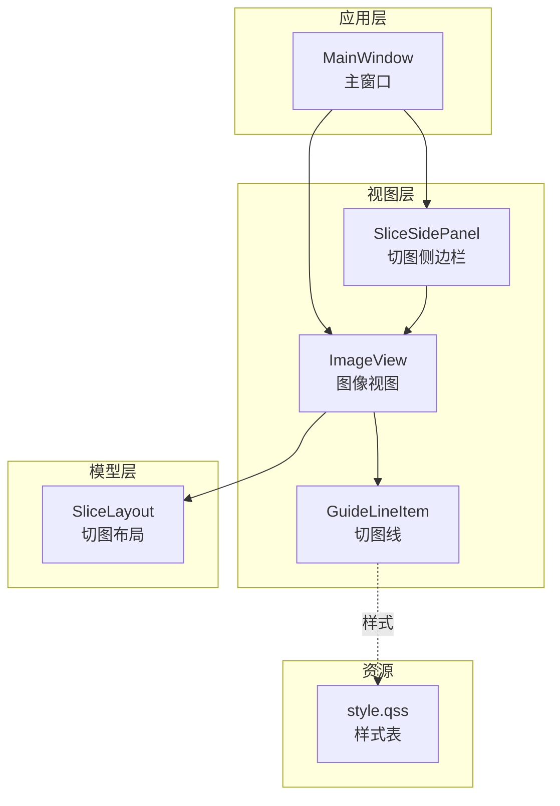
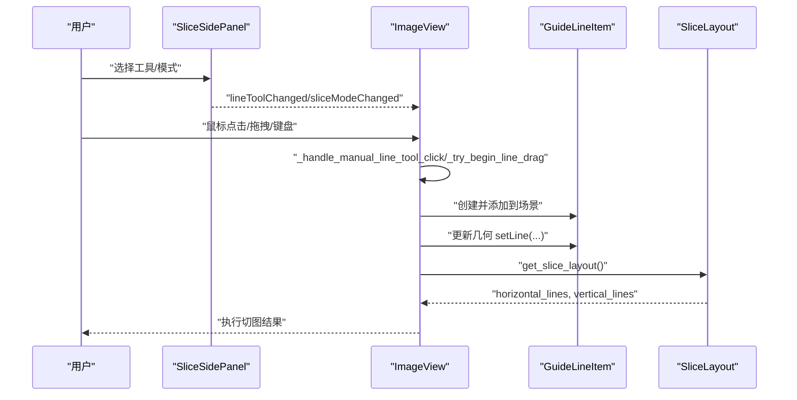
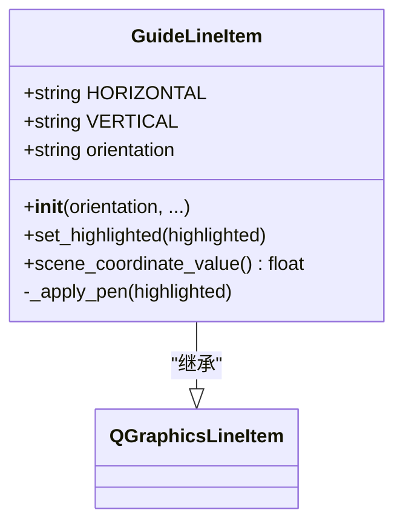
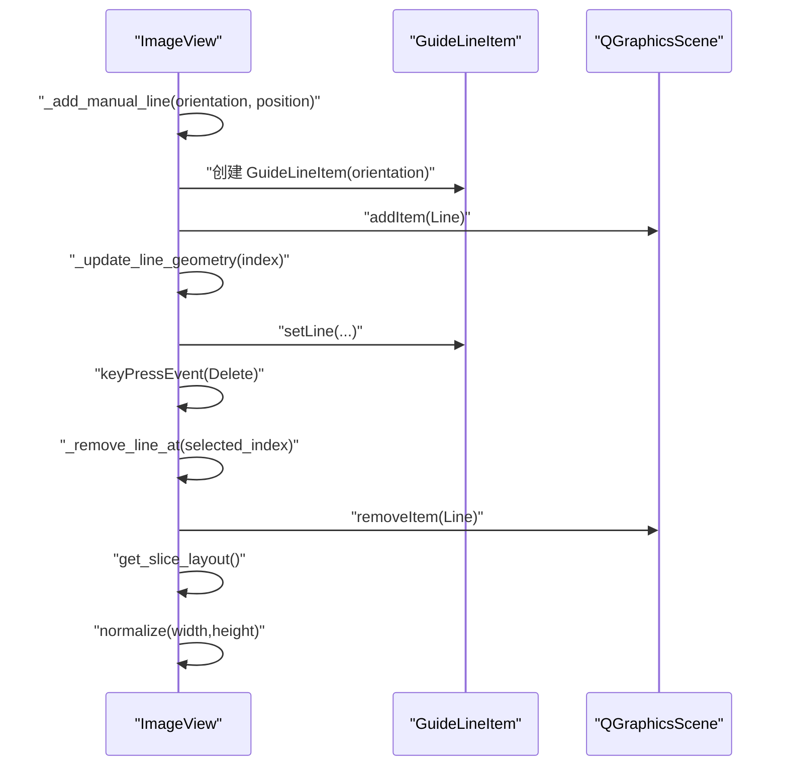
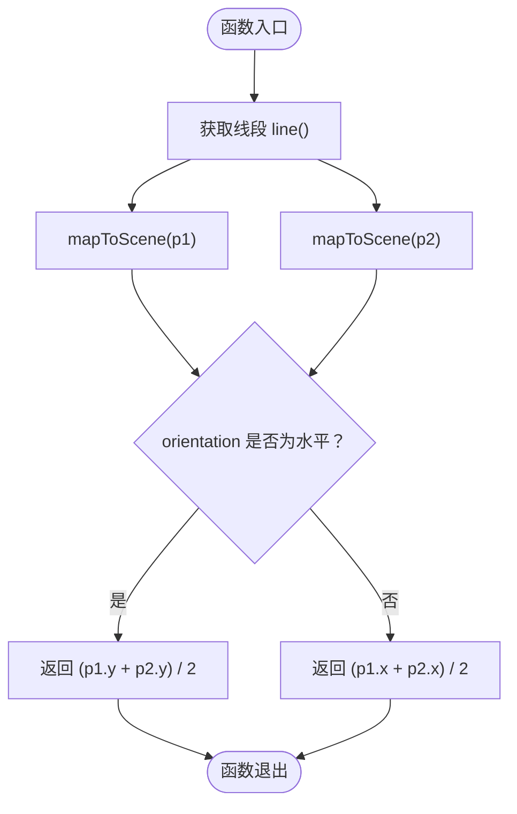
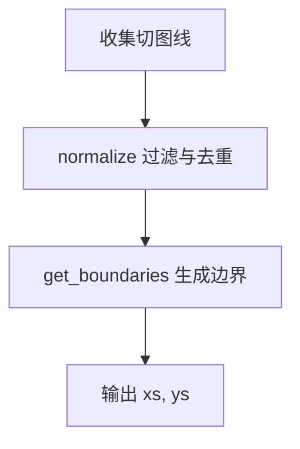
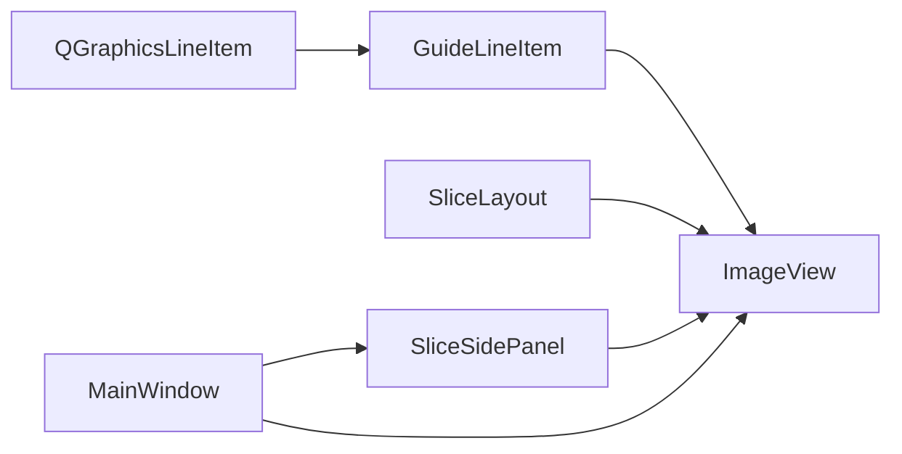

# 切图线组件

<cite>
**本文引用的文件**
- [overlay_items.py](file://img_slicer_tool/views/overlay_items.py)
- [image_view.py](file://img_slicer_tool/views/image_view.py)
- [slice_layout.py](file://img_slicer_tool/models/slice_layout.py)
- [main_window.py](file://img_slicer_tool/app/main_window.py)
- [slice_side_panel.py](file://img_slicer_tool/views/slice_side_panel.py)
- [style.qss](file://img_slicer_tool/resources/qss/style.qss)
</cite>

## 目录
1. [简介](#简介)
2. [项目结构](#项目结构)
3. [核心组件](#核心组件)
4. [架构总览](#架构总览)
5. [详细组件分析](#详细组件分析)
6. [依赖关系分析](#依赖关系分析)
7. [性能考量](#性能考量)
8. [故障排查指南](#故障排查指南)
9. [结论](#结论)
10. [附录](#附录)

## 简介
本文件系统性文档化“切图线组件”（GuideLineItem）的设计与实现，说明其继承自 QGraphicsLineItem，通过构造函数参数 orientation（取值为“horizontal”或“vertical”）定义方向，并在非法值时抛出异常。其视觉样式为红色虚线边框，z 值设置为 9，使其位于图像之上、裁剪框之下。重点解析 scene_coordinate_value() 方法：通过 mapToScene 将线段端点映射到场景坐标，再依据 orientation 返回 Y 轴均值（水平线）或 X 轴均值（垂直线），该值用于 ImageView 收集所有切图线位置并构建 SliceLayout。说明用户交互：当启用了 ItemIsMovable 和 ItemIsSelectable 标志时，用户可直接拖动切图线调整位置，并可通过 Delete 键删除。提供使用示例：创建水平切图线并加入场景。常见问题包括坐标映射错误或方向不一致导致的切图错位，以及 orientation 设置不当导致归一化失败。建议通过 QSS 文件扩展样式，实现主题化定制。

## 项目结构
本项目采用视图-模型-服务分层组织，切图线组件位于视图层，与图像视图、布局模型协同工作：
- 视图层：overlay_items.py（切图线）、image_view.py（图像视图）、slice_side_panel.py（切图侧边栏）
- 模型层：slice_layout.py（切图布局数据结构）
- 应用入口：main_window.py（主窗口，连接视图与服务）

图表来源
- [image_view.py](file://img_slicer_tool/views/image_view.py#L1-L120)
- [overlay_items.py](file://img_slicer_tool/views/overlay_items.py#L27-L64)
- [slice_layout.py](file://img_slicer_tool/models/slice_layout.py#L1-L30)
- [main_window.py](file://img_slicer_tool/app/main_window.py#L1-L120)
- [slice_side_panel.py](file://img_slicer_tool/views/slice_side_panel.py#L1-L60)
- [style.qss](file://img_slicer_tool/resources/qss/style.qss#L1-L2)

章节来源
- [overlay_items.py](file://img_slicer_tool/views/overlay_items.py#L27-L64)
- [image_view.py](file://img_slicer_tool/views/image_view.py#L1-L120)
- [slice_layout.py](file://img_slicer_tool/models/slice_layout.py#L1-L30)
- [main_window.py](file://img_slicer_tool/app/main_window.py#L1-L120)
- [slice_side_panel.py](file://img_slicer_tool/views/slice_side_panel.py#L1-L60)
- [style.qss](file://img_slicer_tool/resources/qss/style.qss#L1-L2)

## 核心组件
- GuideLineItem：继承 QGraphicsLineItem，负责渲染切图线、高亮、坐标值计算与层级控制。
- ImageView：承载切图线集合，处理用户交互（拖拽、删除、热键）、几何更新与布局归一化。
- SliceLayout：保存预览坐标系下的水平/垂直切图线，提供去重、过滤与边界生成。
- SliceSidePanel：提供切图模式切换、网格行列设置与手动工具选择。
- MainWindow：连接视图与服务，触发切图执行与结果展示。

章节来源
- [overlay_items.py](file://img_slicer_tool/views/overlay_items.py#L27-L64)
- [image_view.py](file://img_slicer_tool/views/image_view.py#L236-L254)
- [slice_layout.py](file://img_slicer_tool/models/slice_layout.py#L1-L30)
- [slice_side_panel.py](file://img_slicer_tool/views/slice_side_panel.py#L1-L120)
- [main_window.py](file://img_slicer_tool/app/main_window.py#L230-L260)

## 架构总览
切图线组件在视图层中作为 QGraphicsLineItem 的子类存在，由 ImageView 统一管理其生命周期与几何更新。用户通过侧边栏选择切图模式与工具，ImageView 在场景中动态创建或更新 GuideLineItem，并通过 scene_coordinate_value() 提供场景坐标值，最终由 ImageView 的 get_slice_layout() 汇聚为 SliceLayout，供服务层进行切图输出。

图表来源
- [image_view.py](file://img_slicer_tool/views/image_view.py#L319-L383)
- [overlay_items.py](file://img_slicer_tool/views/overlay_items.py#L27-L64)
- [slice_layout.py](file://img_slicer_tool/models/slice_layout.py#L1-L30)
- [slice_side_panel.py](file://img_slicer_tool/views/slice_side_panel.py#L120-L174)
- [main_window.py](file://img_slicer_tool/app/main_window.py#L230-L260)

## 详细组件分析

### GuideLineItem 类分析
- 继承关系：继承 QGraphicsLineItem，具备图形项的基本能力。
- 方向参数：orientation 必须为“horizontal”或“vertical”，否则抛出异常。
- 视觉样式：默认红色虚线，宽度随高亮状态变化；z 值设为 9，确保位于图像之上、裁剪框之下。
- 高亮控制：通过 set_highlighted() 切换高亮，内部调用 _apply_pen() 应用画笔。
- 场景坐标值：scene_coordinate_value() 使用 mapToScene 将线段端点映射到场景坐标，再根据 orientation 返回 Y 轴均值（水平线）或 X 轴均值（垂直线），用于 ImageView 收集切图线位置并构建 SliceLayout。

图表来源
- [overlay_items.py](file://img_slicer_tool/views/overlay_items.py#L27-L64)

章节来源
- [overlay_items.py](file://img_slicer_tool/views/overlay_items.py#L27-L64)

### ImageView 与切图线交互流程
- 添加切图线：_add_manual_line() 接收 orientation 与 position，创建 GuideLineItem 并加入场景，随后调用 _update_line_geometry() 更新几何。
- 几何更新：_update_line_geometry() 根据 orientation 设置水平或垂直线，确保线段两端落在图像边界内。
- 拖拽与删除：keyPressEvent() 处理 Delete 键删除选中线；_try_begin_line_drag() 与 _drag_selected_line() 实现拖拽逻辑。
- 选择与高亮：_select_line_near() 与 _set_selected_line() 管理选中状态，_update_line_highlight() 同步高亮。
- 坐标归一化：get_slice_layout() 收集切图线，过滤超出图像范围的线，调用 SliceLayout.normalize() 进行去重与边界生成。

图表来源
- [image_view.py](file://img_slicer_tool/views/image_view.py#L343-L383)
- [image_view.py](file://img_slicer_tool/views/image_view.py#L94-L109)
- [image_view.py](file://img_slicer_tool/views/image_view.py#L358-L366)
- [image_view.py](file://img_slicer_tool/views/image_view.py#L236-L254)

章节来源
- [image_view.py](file://img_slicer_tool/views/image_view.py#L94-L109)
- [image_view.py](file://img_slicer_tool/views/image_view.py#L343-L383)
- [image_view.py](file://img_slicer_tool/views/image_view.py#L358-L366)
- [image_view.py](file://img_slicer_tool/views/image_view.py#L236-L254)

### scene_coordinate_value() 工作机制
- 输入：GuideLineItem 的线段（line()）及其两个端点。
- 步骤：使用 mapToScene 将端点从本地坐标转换到场景坐标；根据 orientation 返回 Y 轴均值（水平线）或 X 轴均值（垂直线）。
- 输出：单个浮点数值，表示该切图线在场景中的关键坐标，用于后续布局归一化。

图表来源
- [overlay_items.py](file://img_slicer_tool/views/overlay_items.py#L55-L64)

章节来源
- [overlay_items.py](file://img_slicer_tool/views/overlay_items.py#L55-L64)

### SliceLayout 归一化与边界生成
- 收集：ImageView.get_slice_layout() 将切图线收集到 SliceLayout 的 horizontal_lines 与 vertical_lines。
- 过滤：normalize() 去除超出图像范围的线，并对列表去重与排序。
- 边界：get_boundaries() 返回包含图像左右边界的坐标列表，供切图服务生成切片。

图表来源
- [slice_layout.py](file://img_slicer_tool/models/slice_layout.py#L1-L30)
- [image_view.py](file://img_slicer_tool/views/image_view.py#L236-L254)

章节来源
- [slice_layout.py](file://img_slicer_tool/models/slice_layout.py#L1-L30)
- [image_view.py](file://img_slicer_tool/views/image_view.py#L236-L254)

### 用户交互与快捷键
- 手动模式：通过 SliceSidePanel 的工具按钮选择“水平线”“垂直线”“十字线”，ImageView 根据鼠标点击位置生成相应方向的切图线。
- 热键：H/V 键分别插入水平/垂直线；Delete 键删除选中线。
- 拖拽：鼠标点击并拖动切图线，实时更新其位置，保持在线条范围内。

章节来源
- [slice_side_panel.py](file://img_slicer_tool/views/slice_side_panel.py#L87-L121)
- [image_view.py](file://img_slicer_tool/views/image_view.py#L94-L109)
- [image_view.py](file://img_slicer_tool/views/image_view.py#L319-L342)
- [image_view.py](file://img_slicer_tool/views/image_view.py#L467-L487)

## 依赖关系分析
- GuideLineItem 依赖 QGraphicsLineItem 提供图形绘制与坐标变换能力。
- ImageView 依赖 GuideLineItem 管理切图线集合，依赖 SliceLayout 存储与归一化布局。
- SliceSidePanel 通过信号驱动 ImageView 的模式与工具切换。
- MainWindow 作为协调者，触发切图执行并将结果反馈给用户。

图表来源
- [overlay_items.py](file://img_slicer_tool/views/overlay_items.py#L27-L64)
- [image_view.py](file://img_slicer_tool/views/image_view.py#L1-L120)
- [slice_layout.py](file://img_slicer_tool/models/slice_layout.py#L1-L30)
- [slice_side_panel.py](file://img_slicer_tool/views/slice_side_panel.py#L1-L60)
- [main_window.py](file://img_slicer_tool/app/main_window.py#L1-L120)

章节来源
- [overlay_items.py](file://img_slicer_tool/views/overlay_items.py#L27-L64)
- [image_view.py](file://img_slicer_tool/views/image_view.py#L1-L120)
- [slice_layout.py](file://img_slicer_tool/models/slice_layout.py#L1-L30)
- [slice_side_panel.py](file://img_slicer_tool/views/slice_side_panel.py#L1-L60)
- [main_window.py](file://img_slicer_tool/app/main_window.py#L1-L120)

## 性能考量
- 几何更新：_update_line_geometry() 仅在必要时更新线段几何，避免频繁重绘。
- 选择与拖拽：_select_line_near() 与 _find_line_index_near() 使用阈值判断，减少不必要的遍历开销。
- 坐标映射：scene_coordinate_value() 仅做一次 mapToScene 调用，复杂度低。
- 归一化：normalize() 对列表去重与排序，建议在大量切图线时注意输入规模。

[本节为通用性能讨论，不直接分析具体文件]

## 故障排查指南
- 切图错位：检查 scene_coordinate_value() 的坐标映射是否正确，确保线段方向与 orientation 一致；确认线段端点在图像边界内。
- orientation 设置错误：当 orientation 不是“horizontal”或“vertical”时会抛出异常；请核对传入值。
- 删除无效：Delete 键仅在切图模式且选中线时生效；确认当前模式与选中状态。
- 样式不生效：QSS 文件为空，建议在 style.qss 中添加样式规则以定制虚线密度、颜色等。

章节来源
- [overlay_items.py](file://img_slicer_tool/views/overlay_items.py#L33-L44)
- [image_view.py](file://img_slicer_tool/views/image_view.py#L94-L109)
- [style.qss](file://img_slicer_tool/resources/qss/style.qss#L1-L2)

## 结论
GuideLineItem 通过清晰的方向约束与稳定的坐标计算，为 ImageView 提供可靠的切图线抽象。结合 ImageView 的交互与 SliceLayout 的归一化，实现了从手动绘制到自动切图的完整闭环。建议在实际使用中严格校验 orientation 与坐标映射，必要时通过 QSS 进行主题化定制，提升用户体验。

[本节为总结性内容，不直接分析具体文件]

## 附录

### 使用示例
- 创建水平切图线并加入场景：参考以下路径定位创建与添加流程
  - [image_view.py](file://img_slicer_tool/views/image_view.py#L343-L357)
  - [overlay_items.py](file://img_slicer_tool/views/overlay_items.py#L27-L64)

### 主题化样式建议
- 当前样式文件为空，可在 style.qss 中添加样式规则，例如：
  - 修改虚线密度与颜色
  - 调整线条宽度与高亮样式
- 参考路径：
  - [style.qss](file://img_slicer_tool/resources/qss/style.qss#L1-L2)