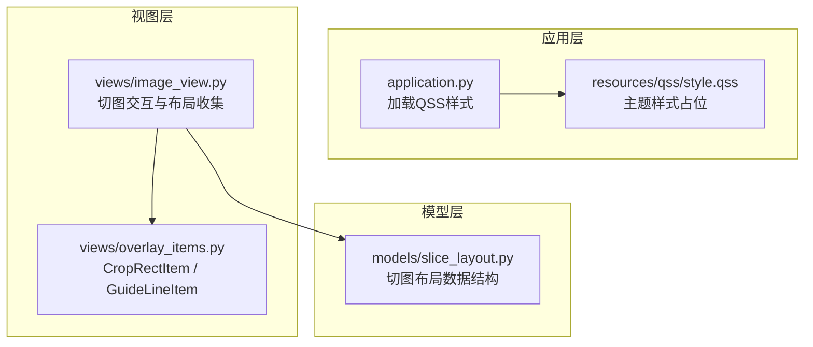
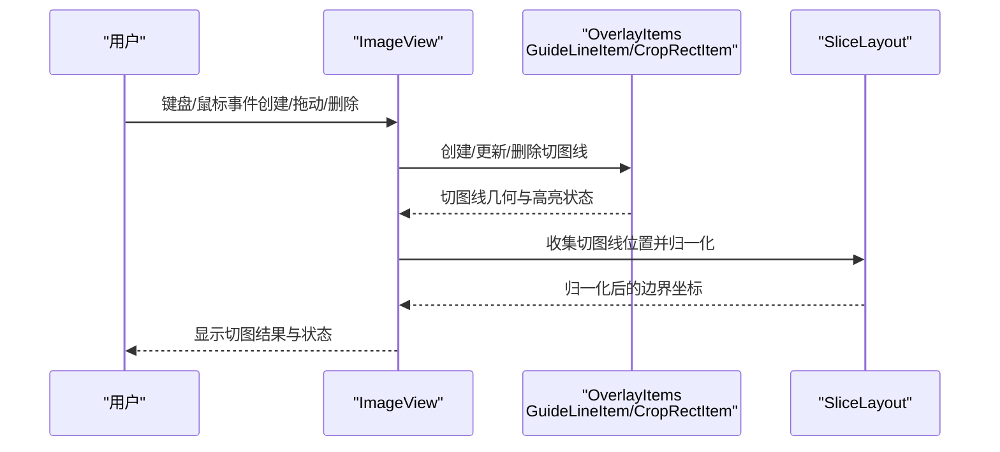
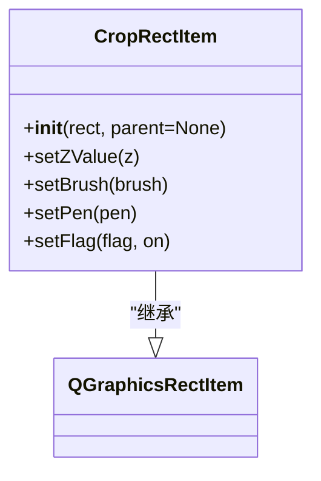
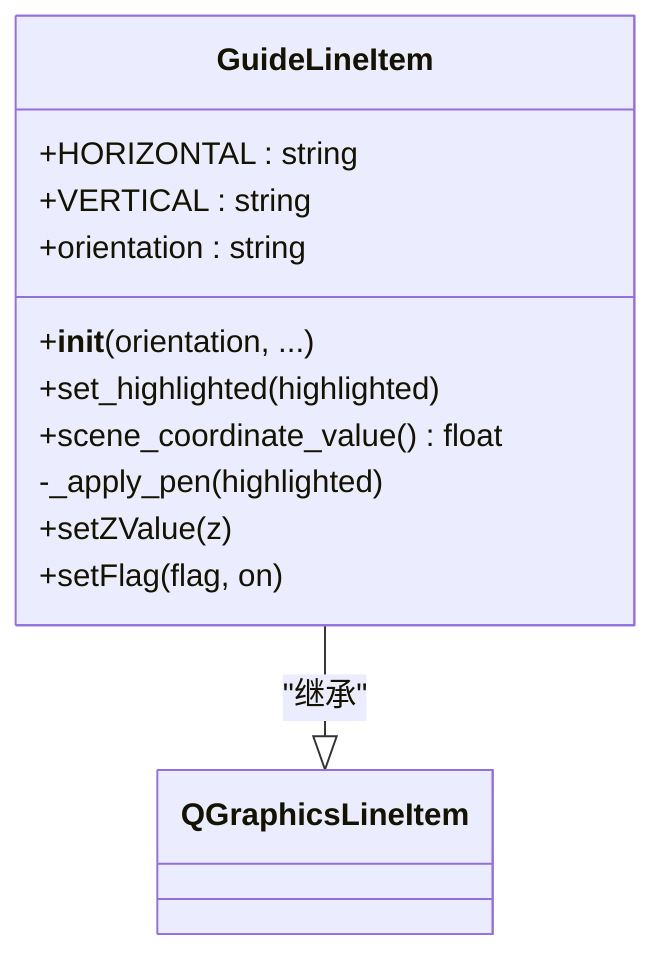
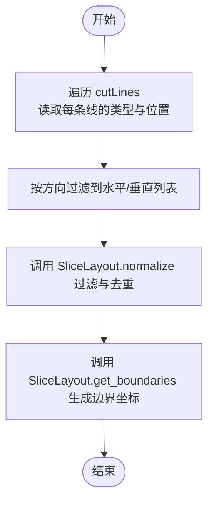
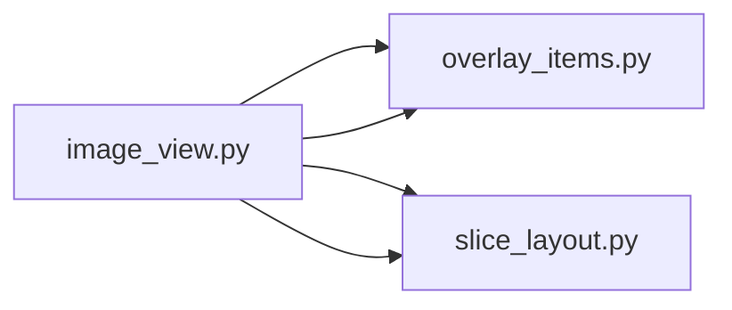

# 叠加图元组件

<cite>
**本文引用的文件**
- [overlay_items.py](file://img_slicer_tool/views/overlay_items.py)
- [image_view.py](file://img_slicer_tool/views/image_view.py)
- [slice_layout.py](file://img_slicer_tool/models/slice_layout.py)
- [application.py](file://img_slicer_tool/app/application.py)
- [style.qss](file://img_slicer_tool/resources/qss/style.qss)
</cite>

## 目录
1. [简介](#简介)
2. [项目结构](#项目结构)
3. [核心组件](#核心组件)
4. [架构总览](#架构总览)
5. [详细组件分析](#详细组件分析)
6. [依赖关系分析](#依赖关系分析)
7. [性能考量](#性能考量)
8. [故障排查指南](#故障排查指南)
9. [结论](#结论)
10. [附录](#附录)

## 简介
本文件聚焦于两个叠加图元组件：CropRectItem 与 GuideLineItem。前者用于在图像预览视图中绘制半透明蓝色填充的裁剪矩形，后者用于绘制可交互的切图辅助线（水平或垂直）。二者共同支撑“切图模式”的可视化与交互体验，其中：
- CropRectItem 继承自 QGraphicsRectItem，通过设置半透明蓝色填充与白色虚线边框，并将层级置于最上层，且禁用选择与移动，确保裁剪框行为稳定可控。
- GuideLineItem 继承自 QGraphicsLineItem，提供红/橙色高亮切换、虚线样式、层级设置，以及 scene_coordinate_value 方法将线段的场景坐标映射为单个浮点值（水平线取 Y 均值，垂直线取 X 均值），供 ImageView 收集切图线位置与归一化使用。同时，用户可在手动模式下通过键盘快捷键创建、拖动与删除切图线。

## 项目结构
与本主题直接相关的模块分布如下：
- 视图层 Overlay Items：定义 CropRectItem 与 GuideLineItem
- 视图层 ImageView：负责切图模式的交互逻辑、切图线管理、布局归一化与执行切图
- 模型层 SliceLayout：保存与归一化切图线，生成边界坐标
- 应用层 Application：加载样式表 style.qss，统一主题风格

图表来源
- [application.py](file://img_slicer_tool/app/application.py#L23-L31)
- [style.qss](file://img_slicer_tool/resources/qss/style.qss#L1-L2)
- [overlay_items.py](file://img_slicer_tool/views/overlay_items.py#L8-L64)
- [image_view.py](file://img_slicer_tool/views/image_view.py#L1-L120)
- [slice_layout.py](file://img_slicer_tool/models/slice_layout.py#L1-L30)

章节来源
- [application.py](file://img_slicer_tool/app/application.py#L23-L31)
- [overlay_items.py](file://img_slicer_tool/views/overlay_items.py#L8-L64)
- [image_view.py](file://img_slicer_tool/views/image_view.py#L1-L120)
- [slice_layout.py](file://img_slicer_tool/models/slice_layout.py#L1-L30)

## 核心组件
- CropRectItem
  - 继承自 QGraphicsRectItem
  - 设置半透明蓝色填充（RGBA: 0,120,215,60）
  - 白色虚线边框
  - 层级 z=10，确保位于最上层
  - 禁用 ItemIsSelectable 与 ItemIsMovable，避免误操作导致裁剪框被用户拖动或选中
- GuideLineItem
  - 继承自 QGraphicsLineItem
  - 提供 HORIZONTAL/VERTICAL 两种方向常量
  - 红色虚线样式，支持高亮（橙色实线加粗）
  - 层级 z=9，位于裁剪框之下、图像之上
  - 提供 scene_coordinate_value 方法：将线段两端的场景坐标映射为单个浮点值（水平线取 Y 均值，垂直线取 X 均值）

章节来源
- [overlay_items.py](file://img_slicer_tool/views/overlay_items.py#L8-L64)

## 架构总览
下图展示从用户交互到切图布局归一化的端到端流程，包括切图线的创建、拖动、删除与最终布局生成。

图表来源
- [image_view.py](file://img_slicer_tool/views/image_view.py#L94-L109)
- [image_view.py](file://img_slicer_tool/views/image_view.py#L236-L254)
- [overlay_items.py](file://img_slicer_tool/views/overlay_items.py#L27-L64)
- [slice_layout.py](file://img_slicer_tool/models/slice_layout.py#L14-L30)

## 详细组件分析

### CropRectItem 分析
- 设计要点
  - 半透明蓝色填充：提升视觉层次的同时不遮挡图像
  - 白色虚线边框：清晰勾勒裁剪范围
  - setZValue(10)：确保裁剪框始终位于最上层
  - 禁用选择与移动：避免用户误操作改变裁剪框，保证裁剪行为符合预期
- 使用场景
  - 在裁剪模式下，用户拖动鼠标生成矩形，CropRectItem 实时跟随更新，释放鼠标后触发裁剪请求信号

图表来源
- [overlay_items.py](file://img_slicer_tool/views/overlay_items.py#L8-L25)
- [image_view.py](file://img_slicer_tool/views/image_view.py#L176-L177)

章节来源
- [overlay_items.py](file://img_slicer_tool/views/overlay_items.py#L8-L25)
- [image_view.py](file://img_slicer_tool/views/image_view.py#L176-L177)

### GuideLineItem 分析
- 设计要点
  - 方向属性 orientation：仅允许 HORIZONTAL 或 VERTICAL
  - 高亮机制：set_highlighted 切换橙色实线加粗与红色虚线
  - 层级设置：z=9，位于裁剪框之下、图像之上
  - scene_coordinate_value：将线段两端场景坐标映射为单个浮点值（水平线取 Y 均值，垂直线取 X 均值）
  - 禁用 ItemIsSelectable 与 ItemIsMovable：避免场景级的自动选中/拖动，改由 ImageView 手动管理
- 交互与删除
  - 手动模式下，用户可通过 Delete 键删除选中的切图线（由 ImageView.keyPressEvent 处理）
  - 通过热键 H/V 快速生成水平/垂直切图线
- 使用示例
  - guide_line = GuideLineItem(GuideLineItem.HORIZONTAL); scene.addItem(guide_line)

图表来源
- [overlay_items.py](file://img_slicer_tool/views/overlay_items.py#L27-L64)

章节来源
- [overlay_items.py](file://img_slicer_tool/views/overlay_items.py#L27-L64)
- [image_view.py](file://img_slicer_tool/views/image_view.py#L94-L109)
- [image_view.py](file://img_slicer_tool/views/image_view.py#L333-L342)

### 切图线位置收集与归一化流程
- ImageView 收集切图线
  - 通过 cutLines 列表与 _line_items 对应存储每条切图线的方向与位置
  - 在 get_slice_layout 中读取每条线的 scene_coordinate_value，并根据方向过滤到对应列表
- SliceLayout 归一化
  - normalize 去重并过滤无效值（仅保留位于图像范围内的线）
  - get_boundaries 返回包含边界的坐标列表，便于后续切片计算

图表来源
- [image_view.py](file://img_slicer_tool/views/image_view.py#L236-L254)
- [slice_layout.py](file://img_slicer_tool/models/slice_layout.py#L14-L30)

章节来源
- [image_view.py](file://img_slicer_tool/views/image_view.py#L236-L254)
- [slice_layout.py](file://img_slicer_tool/models/slice_layout.py#L14-L30)

## 依赖关系分析
- OverlayItems 与 ImageView 的耦合
  - ImageView 直接导入并实例化 CropRectItem 与 GuideLineItem
  - ImageView 负责切图线的创建、更新、删除与高亮状态同步
- 切图线几何与数据的绑定
  - _line_items 存放 GuideLineItem 实例，cutLines 存放与之对应的字典数据（type/pos/selected）
  - _update_line_geometry 根据数据更新线段几何，_update_line_highlight 同步高亮状态
- 删除与选择
  - keyPressEvent 处理 Delete 键删除选中线
  - _select_line_near 与 _find_line_index_near 实现近似命中选择

图表来源
- [image_view.py](file://img_slicer_tool/views/image_view.py#L16-L23)
- [overlay_items.py](file://img_slicer_tool/views/overlay_items.py#L8-L25)
- [slice_layout.py](file://img_slicer_tool/models/slice_layout.py#L1-L30)

章节来源
- [image_view.py](file://img_slicer_tool/views/image_view.py#L16-L23)
- [overlay_items.py](file://img_slicer_tool/views/overlay_items.py#L8-L25)
- [slice_layout.py](file://img_slicer_tool/models/slice_layout.py#L1-L30)

## 性能考量
- 几何更新成本
  - 手动模式下频繁拖动切图线会触发 _update_line_geometry，建议在大量线段时减少不必要的重绘
- 选择命中阈值
  - LINE_SELECTION_TOLERANCE 控制点击选择的容差，过小影响交互体验，过大可能误选
- 归一化开销
  - normalize 与 get_boundaries 为线性复杂度，通常可忽略；但在极大量线段时仍需关注

[本节为通用性能讨论，无需特定文件引用]

## 故障排查指南
- 切图位置偏差
  - 现象：导出切片与预期不符
  - 排查：检查 scene_coordinate_value 的方向判断是否与 orientation 一致；确认线段两端场景坐标映射逻辑
  - 关联文件
    - [overlay_items.py](file://img_slicer_tool/views/overlay_items.py#L55-L64)
    - [image_view.py](file://img_slicer_tool/views/image_view.py#L236-L254)
- 归一化失败或越界
  - 现象：切图线未生效或报错
  - 排查：确认 _update_line_geometry 中 clamp 逻辑与 _clamp_position 是否正确限制了位置范围；检查 normalize 过滤条件
  - 关联文件
    - [image_view.py](file://img_slicer_tool/views/image_view.py#L376-L381)
    - [image_view.py](file://img_slicer_tool/views/image_view.py#L433-L440)
    - [slice_layout.py](file://img_slicer_tool/models/slice_layout.py#L14-L18)
- 无法删除切图线
  - 现象：Delete 键无效
  - 排查：确认当前处于切图模式且为手动模式；检查 keyPressEvent 的分支逻辑
  - 关联文件
    - [image_view.py](file://img_slicer_tool/views/image_view.py#L94-L109)
- 样式不符合预期
  - 现象：颜色、线型与期望不一致
  - 排查：通过 QSS 扩展样式（resources/qss/style.qss）进行主题化定制
  - 关联文件
    - [application.py](file://img_slicer_tool/app/application.py#L23-L31)
    - [style.qss](file://img_slicer_tool/resources/qss/style.qss#L1-L2)

章节来源
- [overlay_items.py](file://img_slicer_tool/views/overlay_items.py#L55-L64)
- [image_view.py](file://img_slicer_tool/views/image_view.py#L94-L109)
- [image_view.py](file://img_slicer_tool/views/image_view.py#L376-L381)
- [image_view.py](file://img_slicer_tool/views/image_view.py#L433-L440)
- [slice_layout.py](file://img_slicer_tool/models/slice_layout.py#L14-L18)
- [application.py](file://img_slicer_tool/app/application.py#L23-L31)
- [style.qss](file://img_slicer_tool/resources/qss/style.qss#L1-L2)

## 结论
- CropRectItem 与 GuideLineItem 通过明确的视觉样式与层级控制，为切图模式提供了清晰、稳定的交互基础
- GuideLineItem 的 scene_coordinate_value 是切图线位置收集的核心，必须与 orientation 保持一致
- ImageView 负责切图线的生命周期管理与布局归一化，确保最终切片边界准确
- 建议通过 QSS 进行主题化定制，以满足不同界面风格需求

[本节为总结性内容，无需特定文件引用]

## 附录
- 使用示例（文字描述）
  - 创建水平切图线：guide_line = GuideLineItem(GuideLineItem.HORIZONTAL); scene.addItem(guide_line)
  - 创建垂直切图线：guide_line = GuideLineItem(GuideLineItem.VERTICAL); scene.addItem(guide_line)
- 常见问题清单
  - scene_coordinate_value 计算错误导致切图位置偏差
  - orientation 设置不正确导致归一化失败
  - Delete 键无效或未处于正确模式
  - 样式不符合预期（建议通过 QSS 扩展）

[本节为补充信息，无需特定文件引用]