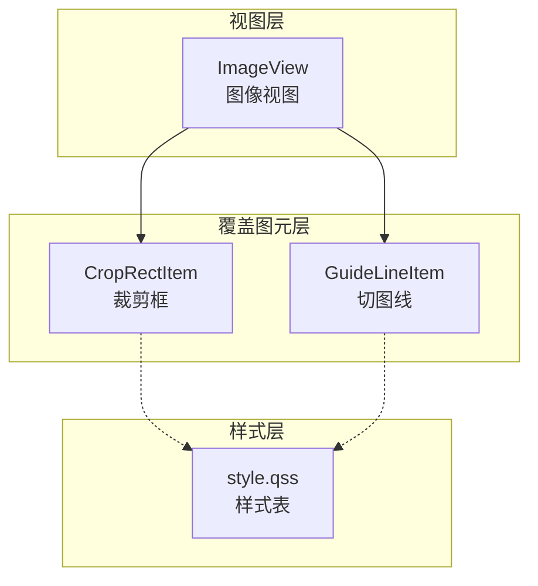
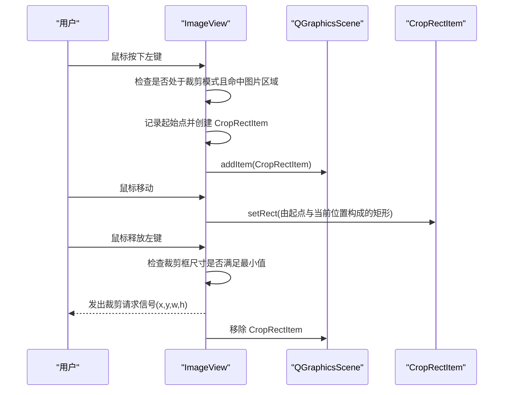
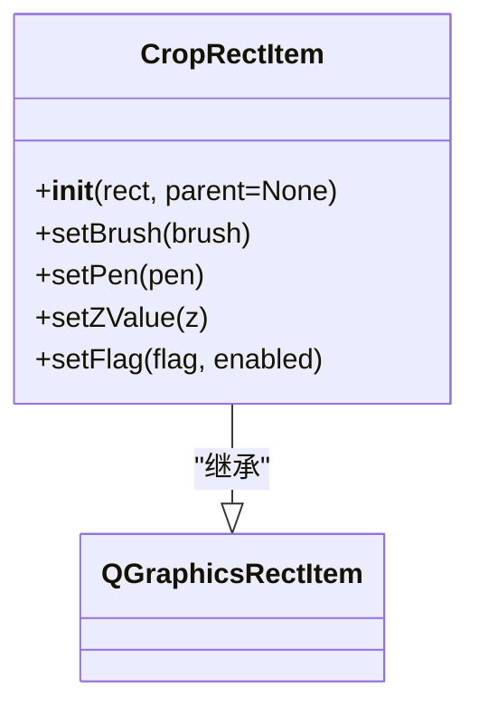
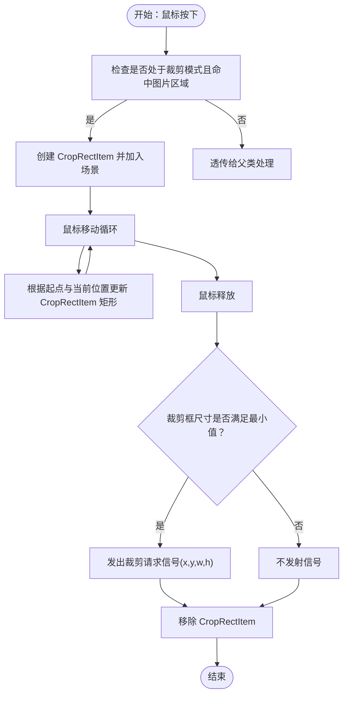
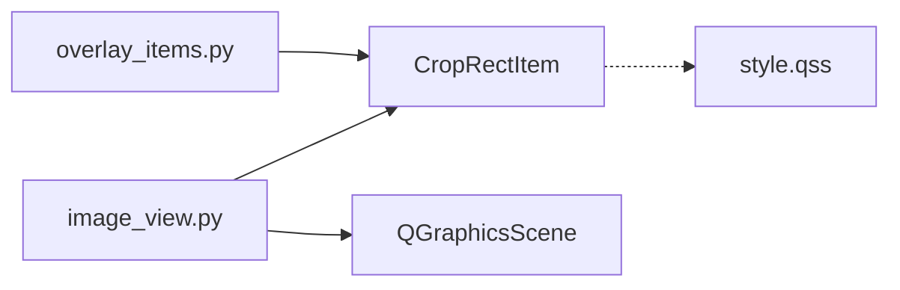

# 裁剪框组件

<cite>
**本文引用的文件列表**
- [img_slicer_tool/views/overlay_items.py](file://img_slicer_tool/views/overlay_items.py)
- [img_slicer_tool/views/image_view.py](file://img_slicer_tool/views/image_view.py)
- [img_slicer_tool/resources/qss/style.qss](file://img_slicer_tool/resources/qss/style.qss)
- [task/piccutting_task_card.md](file://task/piccutting_task_card.md)
</cite>

## 目录
1. [简介](#简介)
2. [项目结构](#项目结构)
3. [核心组件](#核心组件)
4. [架构总览](#架构总览)
5. [组件详细分析](#组件详细分析)
6. [依赖关系分析](#依赖关系分析)
7. [性能考量](#性能考量)
8. [故障排查指南](#故障排查指南)
9. [结论](#结论)
10. [附录](#附录)

## 简介
本文件系统化地文档化了裁剪框组件 CropRectItem 的实现与使用方式。该组件继承自 QGraphicsRectItem，用于在图像预览视图中直观地指示用户选择的裁剪区域。其默认外观为半透明蓝色填充（RGBA: 0,120,215,60）与白色虚线边框，并通过设置 Z 值确保始终位于最上层，避免被其他图元遮挡。同时，通过禁用 ItemIsSelectable 和 ItemIsMovable 标志，保证裁剪行为的稳定性与可预测性，防止用户误操作导致裁剪框被意外移动或选择。

此外，文档还提供了创建与添加到场景的示例路径、常见问题定位方法（如样式被 QSS 覆盖），以及扩展建议（通过重写样式或扩展构造函数参数来自定义外观）。

## 项目结构
- CropRectItem 定义于 views/overlay_items.py，负责裁剪框的绘制与交互属性控制。
- 图像视图 ImageView 在鼠标事件中动态创建并管理 CropRectItem，完成拖拽绘制与裁剪区域发射。
- 样式资源位于 resources/qss/style.qss，若出现外观异常，应优先检查该文件中的相关选择器。
- 任务卡片文档中记录了 CropRectItem 的初始实现与使用方式，便于对照参考。

图表来源
- [img_slicer_tool/views/image_view.py](file://img_slicer_tool/views/image_view.py#L153-L235)
- [img_slicer_tool/views/overlay_items.py](file://img_slicer_tool/views/overlay_items.py#L8-L25)
- [img_slicer_tool/resources/qss/style.qss](file://img_slicer_tool/resources/qss/style.qss#L1-L2)

章节来源
- [img_slicer_tool/views/overlay_items.py](file://img_slicer_tool/views/overlay_items.py#L8-L25)
- [img_slicer_tool/views/image_view.py](file://img_slicer_tool/views/image_view.py#L153-L235)
- [img_slicer_tool/resources/qss/style.qss](file://img_slicer_tool/resources/qss/style.qss#L1-L2)

## 核心组件
- CropRectItem：继承自 QGraphicsRectItem，负责渲染半透明蓝色填充与白色虚线边框，设置 Z 值使其始终在最上层，并禁用选择与移动标志位，确保裁剪过程稳定可控。
- ImageView：在裁剪模式下响应鼠标事件，动态创建 CropRectItem 并随鼠标拖拽更新其矩形范围；当释放鼠标时，若满足最小尺寸要求则发出裁剪请求信号，并清理裁剪框。

章节来源
- [img_slicer_tool/views/overlay_items.py](file://img_slicer_tool/views/overlay_items.py#L8-L25)
- [img_slicer_tool/views/image_view.py](file://img_slicer_tool/views/image_view.py#L153-L235)

## 架构总览
下图展示了裁剪流程的关键调用序列：从 ImageView 接收鼠标事件，到创建 CropRectItem，再到拖拽更新与最终裁剪请求的发射。

图表来源
- [img_slicer_tool/views/image_view.py](file://img_slicer_tool/views/image_view.py#L153-L235)
- [img_slicer_tool/views/overlay_items.py](file://img_slicer_tool/views/overlay_items.py#L8-L25)

## 组件详细分析

### CropRectItem 类分析
- 继承关系：CropRectItem 继承自 QGraphicsRectItem，复用其矩形绘制能力。
- 初始化逻辑：
  - 设置半透明蓝色填充（RGBA: 0,120,215,60）。
  - 设置白色虚线边框，宽度为 1。
  - 设置 Z 值为 10，确保始终位于最上层。
  - 显式禁用 ItemIsSelectable 与 ItemIsMovable 标志，防止用户误操作导致裁剪框被移动或选择。
- 外观定制建议：
  - 若需调整颜色或边框样式，可在构造函数中传入自定义参数，或通过重写样式表（注意 QSS 可能覆盖默认绘制）。
  - 如需进一步扩展，可考虑增加构造函数参数以支持自定义颜色、线型、宽度等。

图表来源
- [img_slicer_tool/views/overlay_items.py](file://img_slicer_tool/views/overlay_items.py#L8-L25)

章节来源
- [img_slicer_tool/views/overlay_items.py](file://img_slicer_tool/views/overlay_items.py#L8-L25)

### ImageView 与 CropRectItem 的协作
- 创建与添加：
  - 在裁剪模式下，鼠标按下时创建 CropRectItem 并加入场景。
  - 鼠标移动时，根据起点与当前位置更新 CropRectItem 的矩形范围。
  - 鼠标释放时，若裁剪框尺寸满足最小阈值，则发出裁剪请求信号，并移除 CropRectItem。
- 设计要点：
  - 通过禁用 ItemIsSelectable 与 ItemIsMovable，确保裁剪框仅由程序逻辑控制，避免用户误触导致状态混乱。
  - 将 CropRectItem 的 Z 值设为 10，使其始终覆盖在图片与其它图元之上，提升可视性与交互一致性。

图表来源
- [img_slicer_tool/views/image_view.py](file://img_slicer_tool/views/image_view.py#L153-L235)

章节来源
- [img_slicer_tool/views/image_view.py](file://img_slicer_tool/views/image_view.py#L153-L235)

## 依赖关系分析
- CropRectItem 依赖 Qt 的图形框架（QBrush、QPen、QColor、QGraphicsRectItem）。
- ImageView 依赖 CropRectItem 与 QGraphicsScene，负责事件分发与裁剪区域的生命周期管理。
- 样式资源 style.qss 可能影响裁剪框的最终呈现，若出现外观异常，应检查该文件中的相关选择器。

图表来源
- [img_slicer_tool/views/overlay_items.py](file://img_slicer_tool/views/overlay_items.py#L8-L25)
- [img_slicer_tool/views/image_view.py](file://img_slicer_tool/views/image_view.py#L153-L235)
- [img_slicer_tool/resources/qss/style.qss](file://img_slicer_tool/resources/qss/style.qss#L1-L2)

章节来源
- [img_slicer_tool/views/overlay_items.py](file://img_slicer_tool/views/overlay_items.py#L8-L25)
- [img_slicer_tool/views/image_view.py](file://img_slicer_tool/views/image_view.py#L153-L235)
- [img_slicer_tool/resources/qss/style.qss](file://img_slicer_tool/resources/qss/style.qss#L1-L2)

## 性能考量
- CropRectItem 仅包含简单的矩形绘制与固定样式，开销极低，适合频繁创建与销毁。
- 在拖拽过程中，仅更新 CropRectItem 的矩形范围，避免不必要的重绘与布局计算。
- 若需进一步优化，可在高频拖拽场景中减少无效的 setRect 调用或合并更新批次。

## 故障排查指南
- 现象：裁剪框填充颜色或边框样式未按预期显示。
  - 可能原因：样式表（QSS）覆盖了默认绘制。
  - 排查步骤：
    - 检查 resources/qss/style.qss 文件中是否存在针对图形项的选择器，尤其是与颜色、笔刷、边框相关的规则。
    - 若存在冲突，可临时注释相关规则以验证问题来源，或通过提高选择器优先级、使用更精确的选择器来解决。
- 现象：裁剪框可被用户拖动或选择。
  - 可能原因：未正确禁用 ItemIsSelectable 与 ItemIsMovable。
  - 排查步骤：
    - 确认 CropRectItem 构造函数中已显式禁用上述标志位。
    - 确认 ImageView 的事件处理逻辑未对 CropRectItem 进行额外的标志修改。
- 现象：裁剪框未显示在最上层。
  - 可能原因：Z 值设置不当或与其他图元冲突。
  - 排查步骤：
    - 确认 CropRectItem 的 Z 值设置为 10。
    - 检查场景中其他图元的 Z 值，确保 CropRectItem 的层级最高。

章节来源
- [img_slicer_tool/resources/qss/style.qss](file://img_slicer_tool/resources/qss/style.qss#L1-L2)
- [img_slicer_tool/views/overlay_items.py](file://img_slicer_tool/views/overlay_items.py#L8-L25)
- [img_slicer_tool/views/image_view.py](file://img_slicer_tool/views/image_view.py#L153-L235)

## 结论
CropRectItem 通过简洁明确的初始化逻辑与严格的交互约束，为图像裁剪提供了稳定、可预测的可视化反馈。其半透明填充与白色虚线边框在视觉上清晰易辨，配合 Z 值与标志位控制，有效避免了用户误操作带来的不确定性。若需进一步定制外观，建议通过扩展构造函数参数或重写样式表的方式实现，同时注意与全局样式表的兼容性。

## 附录
- 使用示例（创建并添加到场景）：
  - 示例路径：在裁剪模式下，鼠标按下时创建 CropRectItem 并加入场景；随后在鼠标移动时更新其矩形范围；释放时若满足最小尺寸则发出裁剪请求并移除裁剪框。
  - 参考路径：
    - [img_slicer_tool/views/image_view.py](file://img_slicer_tool/views/image_view.py#L153-L235)
    - [img_slicer_tool/views/overlay_items.py](file://img_slicer_tool/views/overlay_items.py#L8-L25)
- 任务卡片参考：
  - CropRectItem 的初始实现与使用方式可参考任务卡片文档中的对应章节。
  - 参考路径：
    - [task/piccutting_task_card.md](file://task/piccutting_task_card.md#L37-L70)
    - [task/piccutting_task_card.md](file://task/piccutting_task_card.md#L103-L156)