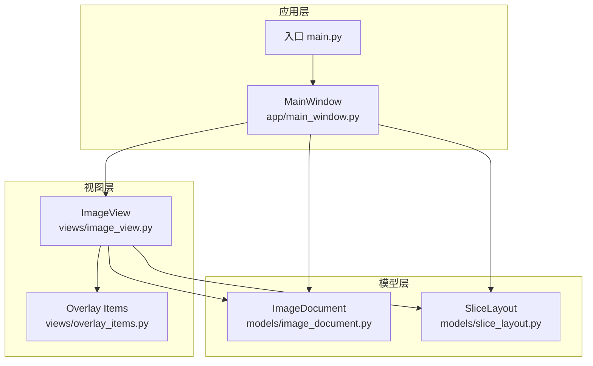
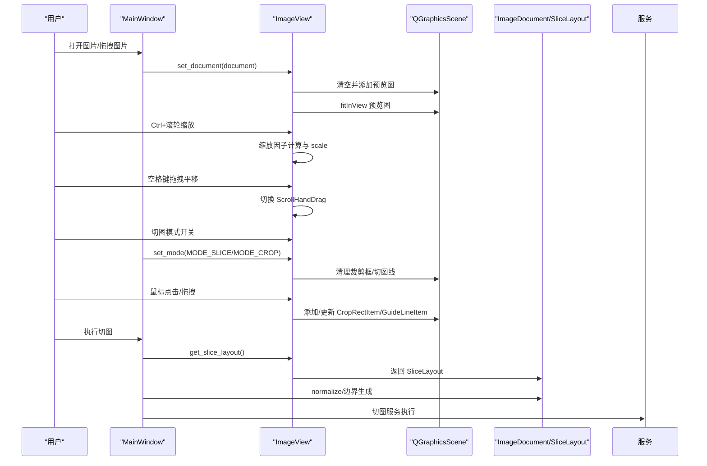
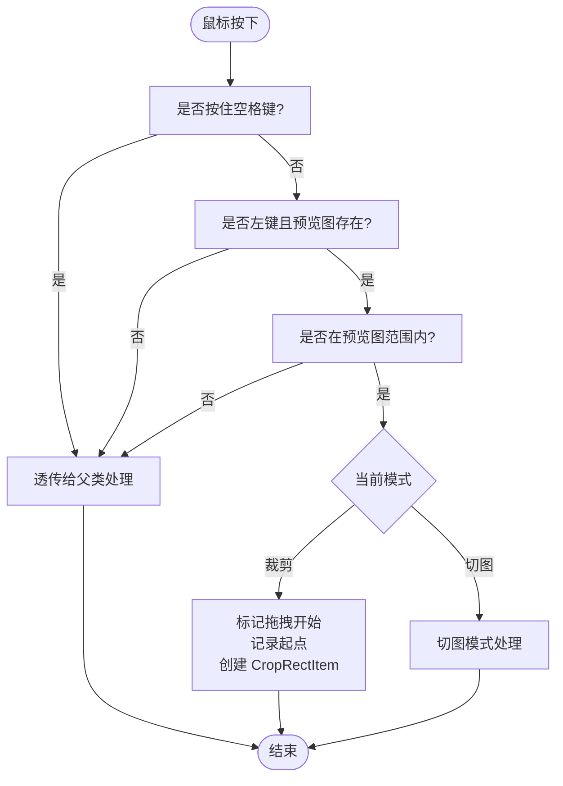
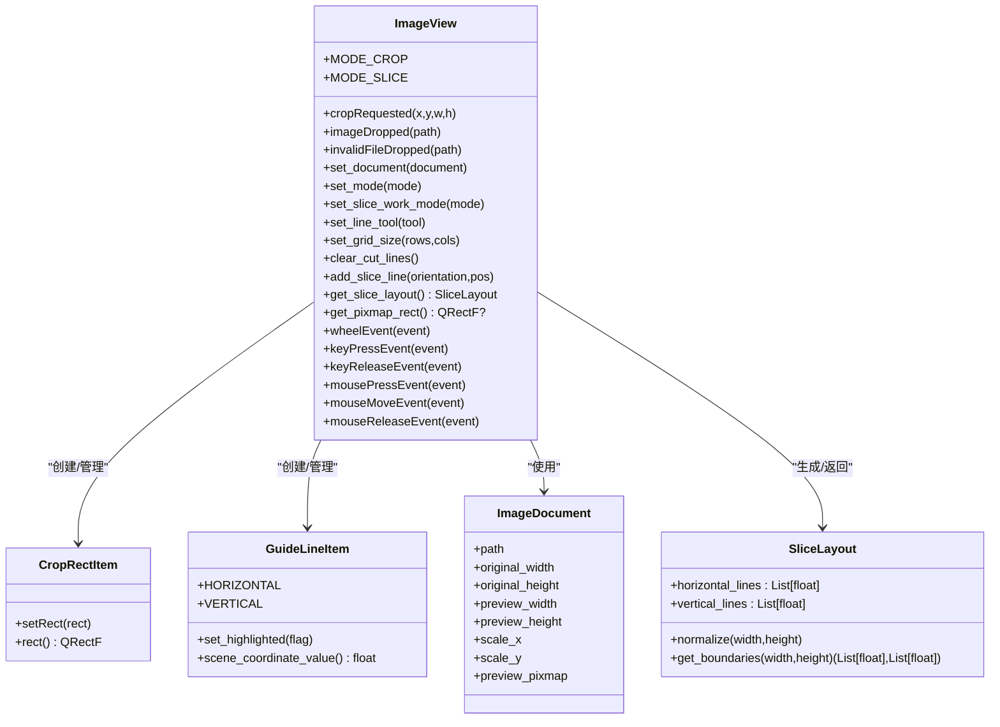

# 核心视图类

<cite>
**本文引用的文件**
- [img_slicer_tool/views/image_view.py](file://img_slicer_tool/views/image_view.py)
- [img_slicer_tool/views/overlay_items.py](file://img_slicer_tool/views/overlay_items.py)
- [img_slicer_tool/models/image_document.py](file://img_slicer_tool/models/image_document.py)
- [img_slicer_tool/models/slice_layout.py](file://img_slicer_tool/models/slice_layout.py)
- [img_slicer_tool/app/main_window.py](file://img_slicer_tool/app/main_window.py)
- [img_slicer_tool/main.py](file://img_slicer_tool/main.py)
</cite>

## 目录
1. [简介](#简介)
2. [项目结构](#项目结构)
3. [核心组件](#核心组件)
4. [架构总览](#架构总览)
5. [详细组件分析](#详细组件分析)
6. [依赖关系分析](#依赖关系分析)
7. [性能考量](#性能考量)
8. [故障排查指南](#故障排查指南)
9. [结论](#结论)

## 简介
本文件系统性地文档化 ImageView 类的实现原理。该类继承自 QGraphicsView，承担图像渲染、用户交互处理与模式管理职责。它通过内部的 QGraphicsScene 管理图像显示，使用 set_document 加载 ImageDocument 并设置预览图；通过 wheelEvent 实现 Ctrl+滚轮缩放，通过空格键切换 ScrollHandDrag 模式实现平移；通过 set_mode 在裁剪模式与切图模式间切换，并清理相关状态；在鼠标事件中分别实现裁剪框绘制与切图线的增删改查；通过 get_slice_layout 将 GuideLineItem 聚合为 SliceLayout 并进行归一化处理。本文还提供信号连接示例与常见问题排查建议，并强调性能优化点。

## 项目结构
- 视图层
  - views/image_view.py：核心视图类 ImageView 及其事件处理逻辑
  - views/overlay_items.py：覆盖层图形项，包括 CropRectItem 与 GuideLineItem
- 模型层
  - models/image_document.py：图像文档数据模型
  - models/slice_layout.py：切图布局数据模型
- 应用层
  - app/main_window.py：主窗口，负责信号连接与业务流程编排
  - main.py：应用入口

图表来源
- [img_slicer_tool/views/image_view.py](file://img_slicer_tool/views/image_view.py#L1-L120)
- [img_slicer_tool/views/overlay_items.py](file://img_slicer_tool/views/overlay_items.py#L1-L64)
- [img_slicer_tool/models/image_document.py](file://img_slicer_tool/models/image_document.py#L1-L18)
- [img_slicer_tool/models/slice_layout.py](file://img_slicer_tool/models/slice_layout.py#L1-L30)
- [img_slicer_tool/app/main_window.py](file://img_slicer_tool/app/main_window.py#L1-L120)
- [img_slicer_tool/main.py](file://img_slicer_tool/main.py#L1-L13)

章节来源
- [img_slicer_tool/views/image_view.py](file://img_slicer_tool/views/image_view.py#L1-L120)
- [img_slicer_tool/app/main_window.py](file://img_slicer_tool/app/main_window.py#L1-L120)

## 核心组件
- ImageView：继承 QGraphicsView，负责图像渲染、缩放、平移、裁剪与切图交互、模式切换与状态管理。
- Overlay Items：
  - CropRectItem：半透明填充、虚线边框的裁剪矩形覆盖层。
  - GuideLineItem：红色/高亮橙色的水平/垂直切图线，支持高亮与场景坐标读取。
- ImageDocument：包含预览图与缩放信息的数据模型。
- SliceLayout：保存预览坐标系下的切图线集合，并提供归一化与边界生成能力。

章节来源
- [img_slicer_tool/views/image_view.py](file://img_slicer_tool/views/image_view.py#L24-L82)
- [img_slicer_tool/views/overlay_items.py](file://img_slicer_tool/views/overlay_items.py#L8-L64)
- [img_slicer_tool/models/image_document.py](file://img_slicer_tool/models/image_document.py#L8-L18)
- [img_slicer_tool/models/slice_layout.py](file://img_slicer_tool/models/slice_layout.py#L7-L30)

## 架构总览
ImageView 作为视图核心，持有 QGraphicsScene 并在其中放置预览图与覆盖层图形项。MainWindow 通过信号连接驱动 ImageView 的模式切换、切图执行与裁剪请求。ImageDocument 提供预览图与缩放参数，SliceLayout 用于表达切图布局并在执行前进行归一化。

图表来源
- [img_slicer_tool/app/main_window.py](file://img_slicer_tool/app/main_window.py#L87-L101)
- [img_slicer_tool/views/image_view.py](file://img_slicer_tool/views/image_view.py#L65-L85)
- [img_slicer_tool/views/image_view.py](file://img_slicer_tool/views/image_view.py#L86-L116)
- [img_slicer_tool/views/image_view.py](file://img_slicer_tool/views/image_view.py#L154-L235)
- [img_slicer_tool/views/image_view.py](file://img_slicer_tool/views/image_view.py#L236-L253)
- [img_slicer_tool/models/slice_layout.py](file://img_slicer_tool/models/slice_layout.py#L14-L30)

## 详细组件分析

### ImageView 类与 QGraphicsScene 管理
- 场景初始化：构造函数创建 QGraphicsScene 并设置到视图，启用拖拽接受以支持图片拖放。
- 图像显示：set_document 清空场景、重置变换、重置缩放、清理裁剪框与拖拽状态；从 ImageDocument 获取预览图并添加到场景，设置场景矩形为预览图矩形，使用 fitInView 适配显示；若当前处于切图网格模式则重新生成网格线。
- 性能优化：启用 SmartViewportUpdate，减少不必要的重绘。

章节来源
- [img_slicer_tool/views/image_view.py](file://img_slicer_tool/views/image_view.py#L32-L82)
- [img_slicer_tool/views/image_view.py](file://img_slicer_tool/views/image_view.py#L65-L85)

### 缩放与平移
- 缩放：wheelEvent 检测 Ctrl 修饰键，根据滚轮方向计算缩放因子，更新当前缩放值并调用 scale 进行缩放。
- 平移：keyPressEvent 捕获空格键按下，切换为 ScrollHandDrag 模式；释放空格键恢复 NoDrag 模式。

章节来源
- [img_slicer_tool/views/image_view.py](file://img_slicer_tool/views/image_view.py#L86-L116)

### 模式管理与状态清理
- set_mode：在 MODE_CROP 与 MODE_SLICE 之间切换；当切换时清理裁剪框、拖拽状态、起始位置、被拖拽的切图线索引，并更新光标样式。

章节来源
- [img_slicer_tool/views/image_view.py](file://img_slicer_tool/views/image_view.py#L117-L128)

### 鼠标交互：裁剪模式
- mousePressEvent：左键按下且位于预览图范围内时，开始裁剪拖拽，创建 CropRectItem 并加入场景。
- mouseMoveEvent：在裁剪拖拽状态下，将场景坐标限制在预览图边界内，更新裁剪矩形。
- mouseReleaseEvent：裁剪完成后，若矩形宽高均达到最小尺寸，则发射 cropRequested 信号；随后移除裁剪框并复位状态。

图表来源
- [img_slicer_tool/views/image_view.py](file://img_slicer_tool/views/image_view.py#L154-L184)

章节来源
- [img_slicer_tool/views/image_view.py](file://img_slicer_tool/views/image_view.py#L154-L235)

### 鼠标交互：切图模式
- mousePressEvent：优先尝试开始拖拽选中切图线；若为网格模式则忽略；否则根据 lineTool 处理：select 模式下尝试选中附近切图线；否则按工具类型添加水平/垂直/十字切图线。
- mouseMoveEvent：若正在拖拽某条切图线，则更新该线位置并限制在预览图边界内。
- mouseReleaseEvent：释放左键时结束拖拽并更新光标。

章节来源
- [img_slicer_tool/views/image_view.py](file://img_slicer_tool/views/image_view.py#L185-L235)
- [img_slicer_tool/views/image_view.py](file://img_slicer_tool/views/image_view.py#L319-L332)
- [img_slicer_tool/views/image_view.py](file://img_slicer_tool/views/image_view.py#L333-L342)
- [img_slicer_tool/views/image_view.py](file://img_slicer_tool/views/image_view.py#L467-L487)

### 切图线管理与网格生成
- add_slice_line：手动模式下添加一条切图线（保留旧接口）。
- set_slice_work_mode：在 grid/manual 两种工作模式间切换；切换到 grid 时清空切图线并生成网格线；切换到 manual 时重置选中状态。
- set_line_tool：切换切图工具（horizontal/vertical/cross/select），并更新光标。
- set_grid_size：设置网格行列数，触发网格线重生成。
- clear_cut_lines：清空所有切图线及其对应的图形项。
- _add_manual_line/_update_line_geometry/_update_line_highlight/_set_selected_line/_select_line_near/_find_line_index_near：辅助实现切图线的增删改查与高亮。
- _regenerate_grid_lines：根据当前预览图尺寸与行列数生成网格线。
- _clamp_position：将切图线位置钳制在预览图边界内。

章节来源
- [img_slicer_tool/views/image_view.py](file://img_slicer_tool/views/image_view.py#L261-L305)
- [img_slicer_tool/views/image_view.py](file://img_slicer_tool/views/image_view.py#L306-L366)
- [img_slicer_tool/views/image_view.py](file://img_slicer_tool/views/image_view.py#L367-L418)
- [img_slicer_tool/views/image_view.py](file://img_slicer_tool/views/image_view.py#L419-L440)
- [img_slicer_tool/views/image_view.py](file://img_slicer_tool/views/image_view.py#L441-L466)
- [img_slicer_tool/views/image_view.py](file://img_slicer_tool/views/image_view.py#L467-L508)

### 切图布局生成与归一化
- get_slice_layout：遍历 cutLines，将水平/垂直线收集到 SliceLayout 中；对超出预览图范围的线进行过滤；最后调用 normalize 对坐标进行去重、排序与范围校验。
- SliceLayout.normalize/get_boundaries：对水平/垂直线进行去重与范围过滤，并生成带边界的坐标序列，便于后续切图服务使用。

章节来源
- [img_slicer_tool/views/image_view.py](file://img_slicer_tool/views/image_view.py#L236-L253)
- [img_slicer_tool/models/slice_layout.py](file://img_slicer_tool/models/slice_layout.py#L14-L30)

### 覆盖层图形项
- CropRectItem：半透明填充、虚线边框，设置 Z 值高于切图线，确保裁剪框可见。
- GuideLineItem：支持高亮与场景坐标读取，设置 Z 值略低于裁剪框，避免遮挡。

章节来源
- [img_slicer_tool/views/overlay_items.py](file://img_slicer_tool/views/overlay_items.py#L8-L26)
- [img_slicer_tool/views/overlay_items.py](file://img_slicer_tool/views/overlay_items.py#L27-L64)

### 信号与连接示例
- MainWindow 中连接了 cropRequested、imageDropped、invalidFileDropped 等信号，演示了典型的信号连接方式与业务处理流程。
- 示例路径参考：
  - [连接 cropRequested 的位置](file://img_slicer_tool/app/main_window.py#L87-L101)
  - [连接 imageDropped 的位置](file://img_slicer_tool/app/main_window.py#L87-L101)
  - [连接 invalidFileDropped 的位置](file://img_slicer_tool/app/main_window.py#L87-L101)

章节来源
- [img_slicer_tool/app/main_window.py](file://img_slicer_tool/app/main_window.py#L87-L101)

## 依赖关系分析
- ImageView 依赖：
  - QGraphicsScene/QGraphicsView：图像渲染与交互基础
  - ImageDocument：提供预览图与缩放信息
  - SliceLayout：切图布局数据模型
  - CropRectItem/GuideLineItem：覆盖层图形项
- MainWindow 依赖：
  - ImageView：承载图像与交互
  - ImageDocument/SliceLayout：切图与裁剪的数据模型
  - 各服务模块：裁剪与切图的实际执行

图表来源
- [img_slicer_tool/views/image_view.py](file://img_slicer_tool/views/image_view.py#L24-L120)
- [img_slicer_tool/views/overlay_items.py](file://img_slicer_tool/views/overlay_items.py#L8-L64)
- [img_slicer_tool/models/image_document.py](file://img_slicer_tool/models/image_document.py#L8-L18)
- [img_slicer_tool/models/slice_layout.py](file://img_slicer_tool/models/slice_layout.py#L7-L30)

## 性能考量
- 使用 SmartViewportUpdate：在视图构造初始化中启用，有助于减少不必要的重绘，提升滚动与缩放时的流畅度。
- 图层叠加顺序：通过 setZValue 控制覆盖层图形项的绘制顺序，确保裁剪框始终可见，避免因层级不当导致的遮挡或闪烁。
- 事件处理短路：在多个分支中尽早返回，避免无谓的父类调用与场景更新。
- 边界钳制：在裁剪与切图线拖拽时对坐标进行边界钳制，减少越界带来的无效重绘。

章节来源
- [img_slicer_tool/views/image_view.py](file://img_slicer_tool/views/image_view.py#L58-L66)
- [img_slicer_tool/views/overlay_items.py](file://img_slicer_tool/views/overlay_items.py#L20-L25)
- [img_slicer_tool/views/overlay_items.py](file://img_slicer_tool/views/overlay_items.py#L39-L44)

## 故障排查指南
- 功能失效：若裁剪或切图操作无效，请检查是否正确连接了 cropRequested、imageDropped、invalidFileDropped 等信号。参考 MainWindow 中的信号连接示例路径。
  - 参考路径：[信号连接示例](file://img_slicer_tool/app/main_window.py#L87-L101)
- 坐标系理解错误：裁剪区域偏移或切图线位置异常，通常与预览图场景矩形、fitInView 适配、缩放因子与 mapToScene 的使用有关。请确认 set_document 已正确设置场景矩形并调用 fitInView；在事件中使用 mapToScene 获取场景坐标。
  - 参考路径：[设置场景矩形与适配](file://img_slicer_tool/views/image_view.py#L76-L82)
  - 参考路径：[mapToScene 使用](file://img_slicer_tool/views/image_view.py#L159-L165)
- 最小尺寸限制：裁剪完成后会验证最小尺寸，若小于阈值不会发射 cropRequested。请适当增大拖拽范围或降低最小尺寸阈值。
  - 参考路径：[最小尺寸验证](file://img_slicer_tool/views/image_view.py#L223-L229)
- 切图线未生效：检查是否处于切图模式且工作模式为 manual/grid；确认 lineTool 设置正确；网格模式下需先生成网格线。
  - 参考路径：[模式切换与网格生成](file://img_slicer_tool/views/image_view.py#L117-L128)
  - 参考路径：[网格生成](file://img_slicer_tool/views/image_view.py#L441-L466)
- 光标与拖拽：若拖拽无效或光标不正确，检查 set_line_tool 与 _update_cursor 的调用链。
  - 参考路径：[光标更新](file://img_slicer_tool/views/image_view.py#L530-L542)

章节来源
- [img_slicer_tool/app/main_window.py](file://img_slicer_tool/app/main_window.py#L87-L101)
- [img_slicer_tool/views/image_view.py](file://img_slicer_tool/views/image_view.py#L76-L82)
- [img_slicer_tool/views/image_view.py](file://img_slicer_tool/views/image_view.py#L159-L165)
- [img_slicer_tool/views/image_view.py](file://img_slicer_tool/views/image_view.py#L223-L229)
- [img_slicer_tool/views/image_view.py](file://img_slicer_tool/views/image_view.py#L441-L466)
- [img_slicer_tool/views/image_view.py](file://img_slicer_tool/views/image_view.py#L530-L542)

## 结论
ImageView 通过 QGraphicsScene 实现高效的图像渲染与覆盖层交互，借助清晰的模式管理与完善的鼠标事件处理，实现了直观的裁剪与切图体验。配合 SliceLayout 的归一化处理与 MainWindow 的信号编排，形成从交互到执行的完整闭环。遵循本文提供的性能优化建议与故障排查要点，可进一步提升稳定性与用户体验。