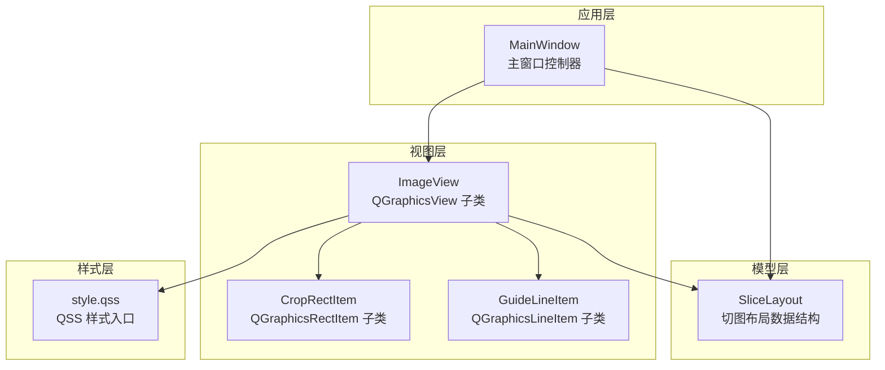
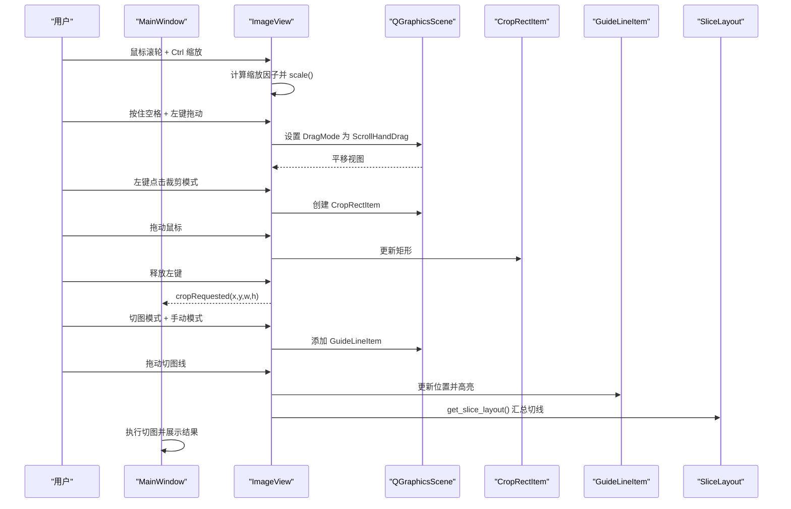
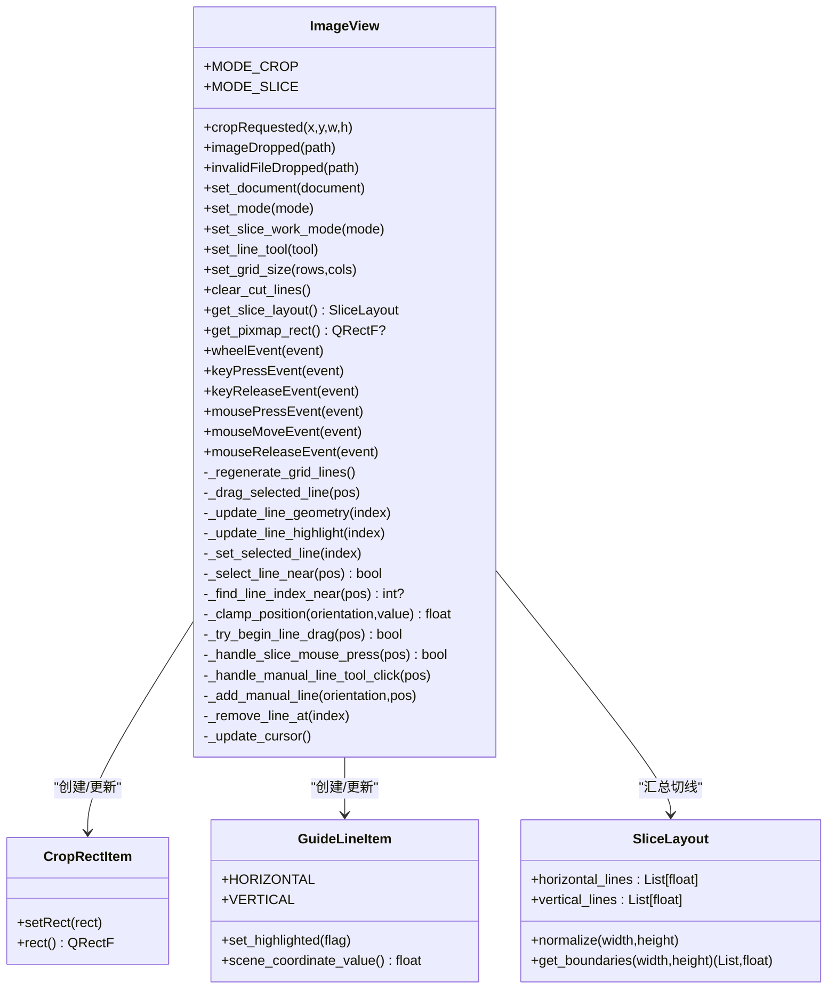
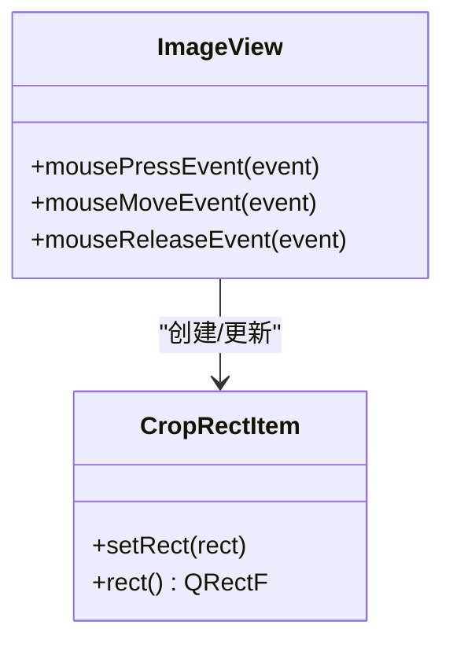
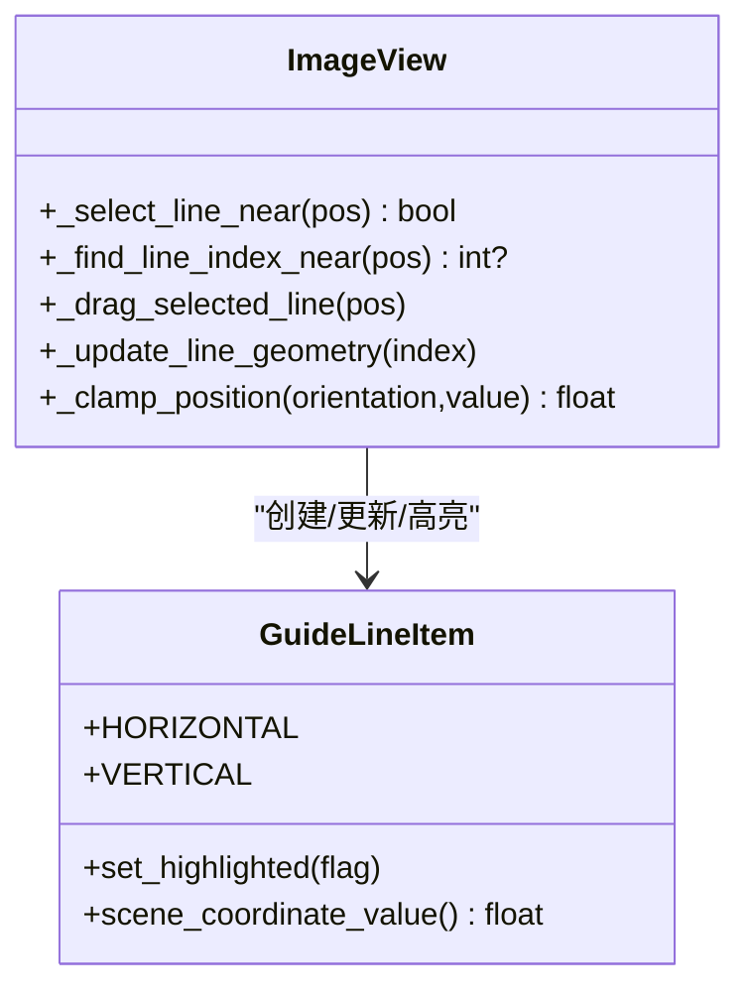
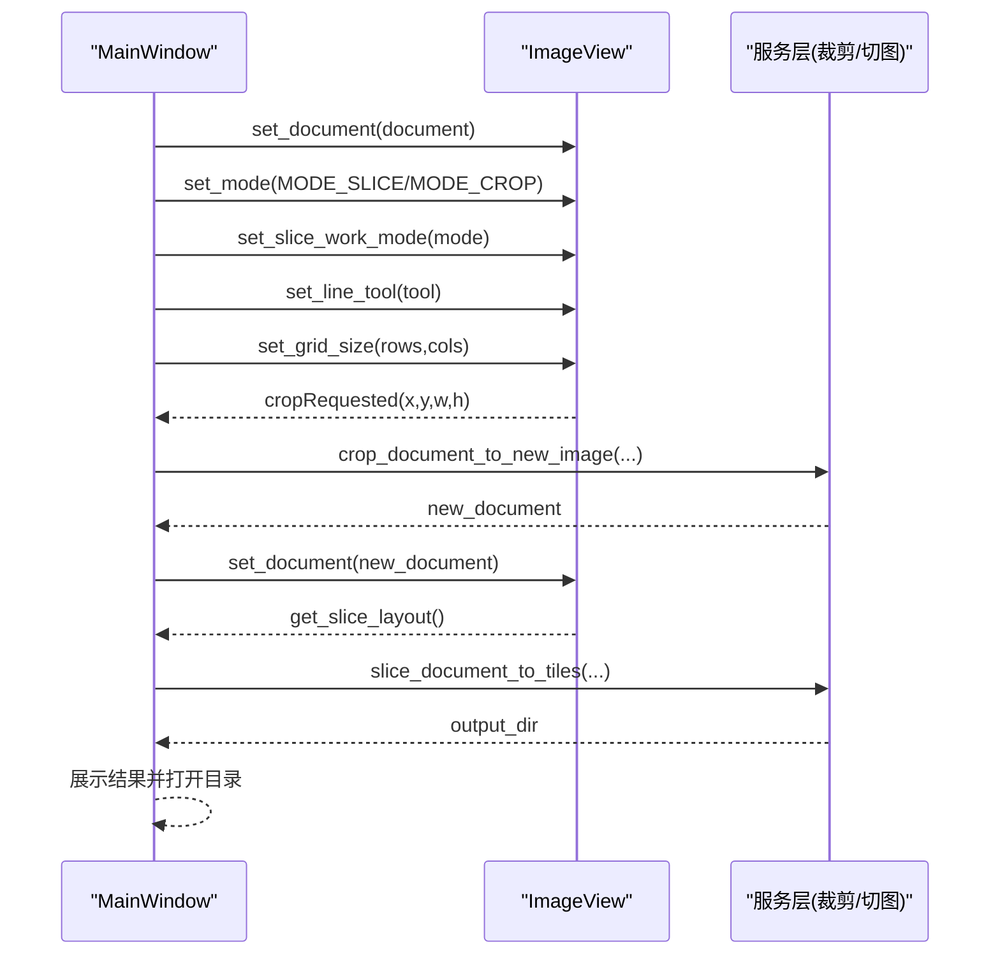
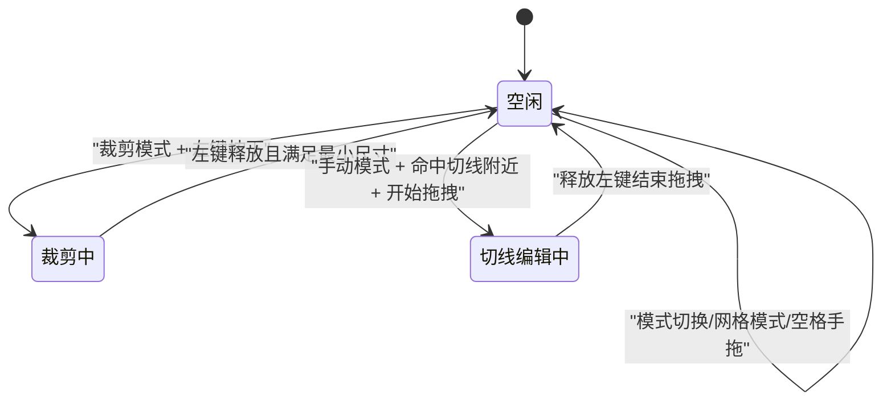
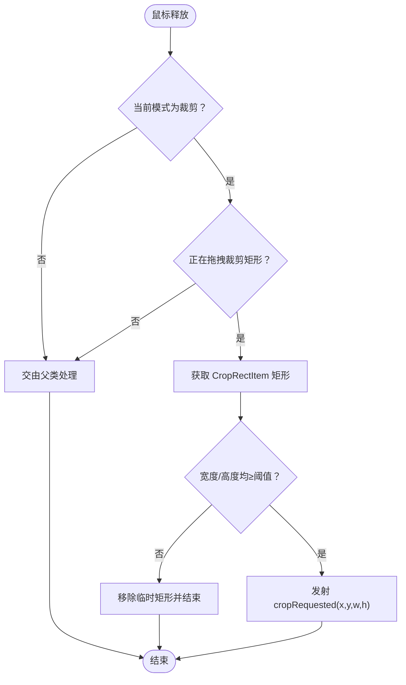
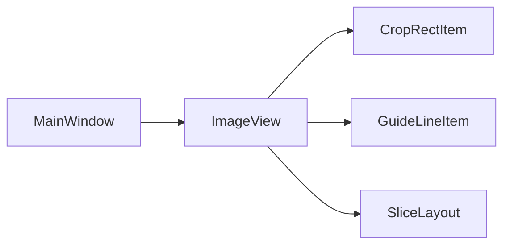

# 视图组件设计

<cite>
**本文引用的文件**
- [img_slicer_tool/views/image_view.py](file://img_slicer_tool/views/image_view.py)
- [img_slicer_tool/views/overlay_items.py](file://img_slicer_tool/views/overlay_items.py)
- [img_slicer_tool/app/main_window.py](file://img_slicer_tool/app/main_window.py)
- [img_slicer_tool/models/slice_layout.py](file://img_slicer_tool/models/slice_layout.py)
- [img_slicer_tool/resources/qss/style.qss](file://img_slicer_tool/resources/qss/style.qss)
</cite>

## 目录
1. [简介](#简介)
2. [项目结构](#项目结构)
3. [核心组件](#核心组件)
4. [架构总览](#架构总览)
5. [详细组件分析](#详细组件分析)
6. [依赖关系分析](#依赖关系分析)
7. [性能考量](#性能考量)
8. [故障排查指南](#故障排查指南)
9. [结论](#结论)
10. [附录](#附录)

## 简介
本文件系统性地文档化核心视图组件 ImageView 与其自定义图形项 CropRectItem、GuideLineItem 的实现原理与交互流程。重点说明：
- ImageView 如何继承 QGraphicsView 实现图像渲染、鼠标事件捕获（缩放、平移、裁剪框绘制）、以及与主窗口的信号通信；
- CropRectItem 如何响应鼠标拖拽绘制矩形选择框并在释放时发射 cropRequested 信号；
- GuideLineItem 如何表示可拖动的切图线，支持十字吸附与动态重绘；
- 提供 UI 组件状态机图，说明“空闲”“裁剪中”“切线编辑中”的切换逻辑；
- 给出基于 QSS 的样式定制建议。

## 项目结构
- views 层包含视图与图形项：
  - image_view.py：核心视图 ImageView，承载场景、图像、裁剪与切图交互；
  - overlay_items.py：自定义图形项 CropRectItem（裁剪矩形）与 GuideLineItem（切图线）。
- app 层包含主窗口 MainWindow，负责与 ImageView 的信号连接、业务流程编排；
- models 层包含 SliceLayout，用于保存与归一化切图线布局；
- resources/qss/style.qss：样式资源入口（当前为空，便于后续扩展）。

图表来源
- [img_slicer_tool/app/main_window.py](file://img_slicer_tool/app/main_window.py#L26-L101)
- [img_slicer_tool/views/image_view.py](file://img_slicer_tool/views/image_view.py#L24-L542)
- [img_slicer_tool/views/overlay_items.py](file://img_slicer_tool/views/overlay_items.py#L8-L64)
- [img_slicer_tool/models/slice_layout.py](file://img_slicer_tool/models/slice_layout.py#L7-L30)
- [img_slicer_tool/resources/qss/style.qss](file://img_slicer_tool/resources/qss/style.qss#L1-L2)

章节来源
- [img_slicer_tool/views/image_view.py](file://img_slicer_tool/views/image_view.py#L24-L120)
- [img_slicer_tool/views/overlay_items.py](file://img_slicer_tool/views/overlay_items.py#L8-L64)
- [img_slicer_tool/app/main_window.py](file://img_slicer_tool/app/main_window.py#L26-L101)
- [img_slicer_tool/models/slice_layout.py](file://img_slicer_tool/models/slice_layout.py#L7-L30)
- [img_slicer_tool/resources/qss/style.qss](file://img_slicer_tool/resources/qss/style.qss#L1-L2)

## 核心组件
- ImageView（QGraphicsView 子类）
  - 场景管理：持有 QGraphicsScene，添加预览图 pixmap 并设置场景矩形；
  - 缩放与平移：滚轮 + Ctrl 缩放，空格按下切换手拖模式；
  - 裁剪模式：鼠标左键拖拽绘制 CropRectItem，释放后发射 cropRequested；
  - 切图模式：支持手动模式与网格模式，支持十字吸附、删除、热键生成；
  - 信号通信：向主窗口发出 imageDropped、invalidFileDropped、cropRequested。
- CropRectItem（QGraphicsRectItem 子类）
  - 半透明填充 + 白色虚线边框，Z 值高于图像，不可选中/不可拖动；
  - 由 ImageView 在裁剪模式下动态创建与更新。
- GuideLineItem（QGraphicsLineItem 子类）
  - 红色/橙色高亮虚线，支持高亮切换；
  - 不启用 ItemIsMovable/ItemIsSelectable，交由 ImageView 统一拖拽与选择逻辑；
  - 提供 scene_coordinate_value 获取场景坐标值。

章节来源
- [img_slicer_tool/views/image_view.py](file://img_slicer_tool/views/image_view.py#L24-L120)
- [img_slicer_tool/views/overlay_items.py](file://img_slicer_tool/views/overlay_items.py#L8-L64)

## 架构总览
ImageView 作为视图中心，统一管理场景、图像、裁剪与切图交互，并通过信号与主窗口解耦。主窗口负责业务流程（打开图片、执行切图、设置输出目录等），并将用户操作转化为对 ImageView 的调用或对服务层的调用。

图表来源
- [img_slicer_tool/views/image_view.py](file://img_slicer_tool/views/image_view.py#L86-L235)
- [img_slicer_tool/views/overlay_items.py](file://img_slicer_tool/views/overlay_items.py#L8-L64)
- [img_slicer_tool/app/main_window.py](file://img_slicer_tool/app/main_window.py#L88-L101)
- [img_slicer_tool/models/slice_layout.py](file://img_slicer_tool/models/slice_layout.py#L7-L30)

## 详细组件分析

### ImageView 组件分析
- 初始化与场景
  - 初始化 QGraphicsScene，设置渲染提示、拖拽模式、锚点与视口更新策略；
  - set_document 将 ImageDocument 绑定到视图，清空切图线，添加预览图 pixmap，适配视图并重置缩放。
- 缩放与平移
  - wheelEvent：当按住 Ctrl 时，根据滚轮方向计算缩放因子并 scale；
  - keyPressEvent/keyReleaseEvent：空格按下切换手拖模式，释放恢复默认。
- 裁剪交互
  - mousePressEvent：在裁剪模式下，记录起始点并创建 CropRectItem；
  - mouseMoveEvent：限制在图片范围内，动态更新矩形；
  - mouseReleaseEvent：若矩形满足最小尺寸，发射 cropRequested，并清理临时矩形。
- 切图交互
  - set_mode：切换裁剪/切图模式，清理裁剪矩形与拖拽状态；
  - set_slice_work_mode：切换 grid/manual 模式，manual 下支持十字吸附与删除；
  - set_line_tool：切换十字吸附工具（horizontal/vertical/cross/select）；
  - set_grid_size：设置网格行列数并重新生成网格线；
  - clear_cut_lines：清空所有切图线；
  - get_slice_layout：将切图线汇总为 SliceLayout；
  - 键盘快捷键：Delete 删除选中线；H/V 快速生成水平/垂直线。
- 拖拽与吸附
  - _handle_slice_mouse_press：根据工具与模式决定是开始拖拽、选中还是生成新线；
  - _try_begin_line_drag/_drag_selected_line：命中切图线附近则开始拖拽；
  - _select_line_near/_find_line_index_near：基于容差进行线段选择；
  - _update_line_geometry/_clamp_position：确保线在图片范围内并更新几何；
  - _regenerate_grid_lines：按行列生成网格线并加入场景。
- 拖拽图片文件
  - 支持拖拽本地图片文件，校验扩展名，触发 imageDropped 或 invalidFileDropped。

图表来源
- [img_slicer_tool/views/image_view.py](file://img_slicer_tool/views/image_view.py#L24-L542)
- [img_slicer_tool/views/overlay_items.py](file://img_slicer_tool/views/overlay_items.py#L8-L64)
- [img_slicer_tool/models/slice_layout.py](file://img_slicer_tool/models/slice_layout.py#L7-L30)

章节来源
- [img_slicer_tool/views/image_view.py](file://img_slicer_tool/views/image_view.py#L65-L120)
- [img_slicer_tool/views/image_view.py](file://img_slicer_tool/views/image_view.py#L86-L235)
- [img_slicer_tool/views/image_view.py](file://img_slicer_tool/views/image_view.py#L236-L308)
- [img_slicer_tool/views/image_view.py](file://img_slicer_tool/views/image_view.py#L309-L542)

### CropRectItem 组件分析
- 外观与层级
  - 半透明填充（蓝色，带 alpha），白色虚线边框，Z 值高于图像，避免被遮挡；
  - 禁用可选中与可拖动标志，交由 ImageView 控制其生命周期与更新。
- 交互职责
  - 由 ImageView 在裁剪模式下创建与更新，鼠标拖拽时动态调整矩形；
  - 释放时由 ImageView 判断最小尺寸并发射 cropRequested。

图表来源
- [img_slicer_tool/views/overlay_items.py](file://img_slicer_tool/views/overlay_items.py#L8-L26)
- [img_slicer_tool/views/image_view.py](file://img_slicer_tool/views/image_view.py#L154-L235)

章节来源
- [img_slicer_tool/views/overlay_items.py](file://img_slicer_tool/views/overlay_items.py#L8-L26)
- [img_slicer_tool/views/image_view.py](file://img_slicer_tool/views/image_view.py#L154-L235)

### GuideLineItem 组件分析
- 类型与外观
  - HORIZONTAL/VERTICAL 两种方向，支持高亮切换（橙色粗实线 vs 红色细虚线）；
  - 禁用 ItemIsMovable/ItemIsSelectable，交由 ImageView 统一拖拽与选择。
- 坐标与吸附
  - scene_coordinate_value 返回场景中线的关键坐标（水平取 y，竖直取 x）；
  - ImageView 使用容差（常量）进行线段命中检测与选择。

图表来源
- [img_slicer_tool/views/overlay_items.py](file://img_slicer_tool/views/overlay_items.py#L27-L64)
- [img_slicer_tool/views/image_view.py](file://img_slicer_tool/views/image_view.py#L397-L508)

章节来源
- [img_slicer_tool/views/overlay_items.py](file://img_slicer_tool/views/overlay_items.py#L27-L64)
- [img_slicer_tool/views/image_view.py](file://img_slicer_tool/views/image_view.py#L397-L508)

### 主窗口与信号通信
- MainWindow 与 ImageView 的连接
  - 连接 cropRequested、imageDropped、invalidFileDropped、切图面板变更信号；
  - 响应裁剪请求：弹窗确认，调用裁剪服务，更新视图；
  - 响应切图请求：从 ImageView 获取 SliceLayout，调用切图服务，展示结果。
- 业务流程
  - 打开图片：加载 ImageDocument，绑定到 ImageView；
  - 切图模式切换：显示/隐藏切图侧栏，同步工具与模式；
  - 网格生成：弹窗输入行列数，生成网格线；
  - 执行切图：检查切线有效性，导出切片并打开输出目录。

图表来源
- [img_slicer_tool/app/main_window.py](file://img_slicer_tool/app/main_window.py#L88-L101)
- [img_slicer_tool/app/main_window.py](file://img_slicer_tool/app/main_window.py#L136-L193)
- [img_slicer_tool/app/main_window.py](file://img_slicer_tool/app/main_window.py#L230-L262)
- [img_slicer_tool/views/image_view.py](file://img_slicer_tool/views/image_view.py#L236-L254)

章节来源
- [img_slicer_tool/app/main_window.py](file://img_slicer_tool/app/main_window.py#L88-L101)
- [img_slicer_tool/app/main_window.py](file://img_slicer_tool/app/main_window.py#L136-L193)
- [img_slicer_tool/app/main_window.py](file://img_slicer_tool/app/main_window.py#L230-L262)
- [img_slicer_tool/views/image_view.py](file://img_slicer_tool/views/image_view.py#L236-L254)

### UI 组件状态机图
- 状态
  - 空闲：无交互进行，等待用户输入；
  - 裁剪中：鼠标左键拖拽绘制 CropRectItem；
  - 切线编辑中：拖动已选中的 GuideLineItem。
- 切换逻辑
  - 空闲 → 裁剪中：裁剪模式下左键按下；
  - 裁剪中 → 空闲：释放左键且满足最小尺寸，发射 cropRequested；
  - 空闲 → 切线编辑中：手动模式下命中切图线附近并开始拖拽；
  - 切线编辑中 → 空闲：释放左键结束拖拽。
- 其他影响因素
  - 模式切换（裁剪/切图）会清理裁剪矩形与拖拽状态；
  - 网格模式下不启用手拖，仅允许选择与拖拽；
  - 空格键切换手拖模式，影响平移行为。

图表来源
- [img_slicer_tool/views/image_view.py](file://img_slicer_tool/views/image_view.py#L94-L116)
- [img_slicer_tool/views/image_view.py](file://img_slicer_tool/views/image_view.py#L154-L235)
- [img_slicer_tool/views/image_view.py](file://img_slicer_tool/views/image_view.py#L397-L508)

章节来源
- [img_slicer_tool/views/image_view.py](file://img_slicer_tool/views/image_view.py#L94-L116)
- [img_slicer_tool/views/image_view.py](file://img_slicer_tool/views/image_view.py#L154-L235)
- [img_slicer_tool/views/image_view.py](file://img_slicer_tool/views/image_view.py#L397-L508)

### 复杂逻辑流程图：裁剪释放与最小尺寸判定

图表来源
- [img_slicer_tool/views/image_view.py](file://img_slicer_tool/views/image_view.py#L216-L235)

章节来源
- [img_slicer_tool/views/image_view.py](file://img_slicer_tool/views/image_view.py#L216-L235)

## 依赖关系分析
- 组件耦合
  - ImageView 与 OverlayItems：强耦合（直接创建/更新 CropRectItem/GuideLineItem）；
  - ImageView 与 MainWindow：弱耦合（通过信号/槽通信）；
  - ImageView 与 SliceLayout：数据传递（汇总切线）。
- 外部依赖
  - PySide6 的 QGraphicsView/QGraphicsScene/QGraphicsRectItem/QGraphicsLineItem；
  - 服务层（裁剪/切图）与模型层（ImageDocument/SliceLayout）。

图表来源
- [img_slicer_tool/app/main_window.py](file://img_slicer_tool/app/main_window.py#L88-L101)
- [img_slicer_tool/views/image_view.py](file://img_slicer_tool/views/image_view.py#L24-L120)
- [img_slicer_tool/views/overlay_items.py](file://img_slicer_tool/views/overlay_items.py#L8-L64)
- [img_slicer_tool/models/slice_layout.py](file://img_slicer_tool/models/slice_layout.py#L7-L30)

章节来源
- [img_slicer_tool/app/main_window.py](file://img_slicer_tool/app/main_window.py#L88-L101)
- [img_slicer_tool/views/image_view.py](file://img_slicer_tool/views/image_view.py#L24-L120)
- [img_slicer_tool/views/overlay_items.py](file://img_slicer_tool/views/overlay_items.py#L8-L64)
- [img_slicer_tool/models/slice_layout.py](file://img_slicer_tool/models/slice_layout.py#L7-L30)

## 性能考量
- 视口更新：启用 SmartViewportUpdate，减少不必要的重绘；
- 场景清理：set_document 时清空场景与切图线，避免累积；
- 几何更新：仅在需要时更新 GuideLineItem 的几何与高亮；
- 缩放：按需 scale，避免频繁变换导致的抖动；
- 网格生成：grid 模式下按行列步进生成，避免过多线段造成渲染压力。

[本节为通用指导，无需列出具体文件来源]

## 故障排查指南
- 无法拖拽裁剪矩形
  - 检查是否处于裁剪模式；
  - 确认左键按下时鼠标位于图片范围内；
  - 检查最小尺寸阈值是否满足。
- 切图线无法拖动
  - 确认处于手动模式且未处于网格模式；
  - 检查是否命中线附近（容差范围）；
  - 确认未处于空格手拖模式。
- 缩放无效
  - 确认按住 Ctrl 再滚动滚轮；
  - 检查 wheelEvent 是否被其他控件拦截。
- 切图结果异常
  - 检查 SliceLayout 的 normalize 是否过滤了越界线；
  - 确认输出目录设置正确。

章节来源
- [img_slicer_tool/views/image_view.py](file://img_slicer_tool/views/image_view.py#L86-L116)
- [img_slicer_tool/views/image_view.py](file://img_slicer_tool/views/image_view.py#L154-L235)
- [img_slicer_tool/views/image_view.py](file://img_slicer_tool/views/image_view.py#L397-L508)
- [img_slicer_tool/models/slice_layout.py](file://img_slicer_tool/models/slice_layout.py#L14-L30)

## 结论
ImageView 通过 QGraphicsView/QGraphicsScene 提供了高效的图像渲染与交互能力，结合 CropRectItem 与 GuideLineItem 实现了直观的裁剪与切图体验。主窗口通过信号/槽与视图解耦，聚焦业务流程编排。整体架构清晰、职责明确，具备良好的扩展性与可维护性。

[本节为总结性内容，无需列出具体文件来源]

## 附录

### 样式定制（QSS）建议
- 当前样式入口文件为空，建议在 style.qss 中增加如下规则：
  - 为裁剪矩形设置更明显的视觉反馈（如描边宽度、颜色）；
  - 为切图线设置高亮态样式（颜色、线宽、虚线样式）；
  - 为视图光标样式提供主题化支持（箭头、十字、手型）；
  - 为切图面板与按钮提供统一风格。
- 应用方式
  - 在应用启动时加载 QSS 文件并设置到主窗口或视图；
  - 通过对象名或样式类名选择器进行精确控制。

章节来源
- [img_slicer_tool/resources/qss/style.qss](file://img_slicer_tool/resources/qss/style.qss#L1-L2)