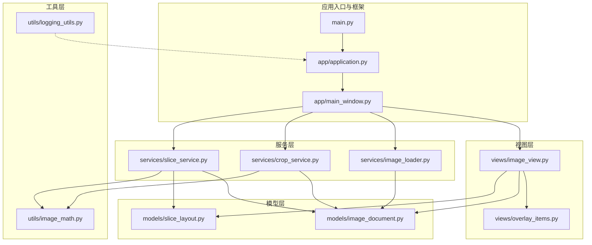
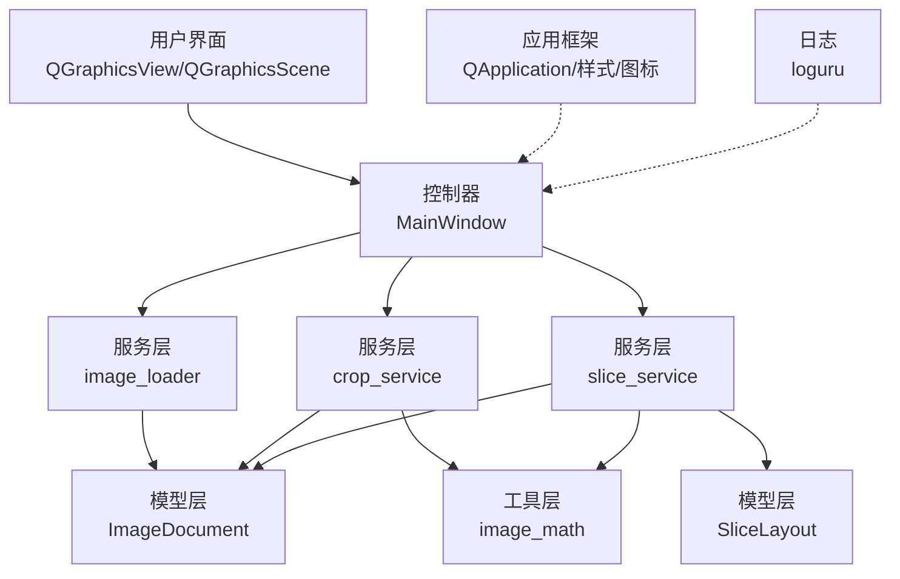
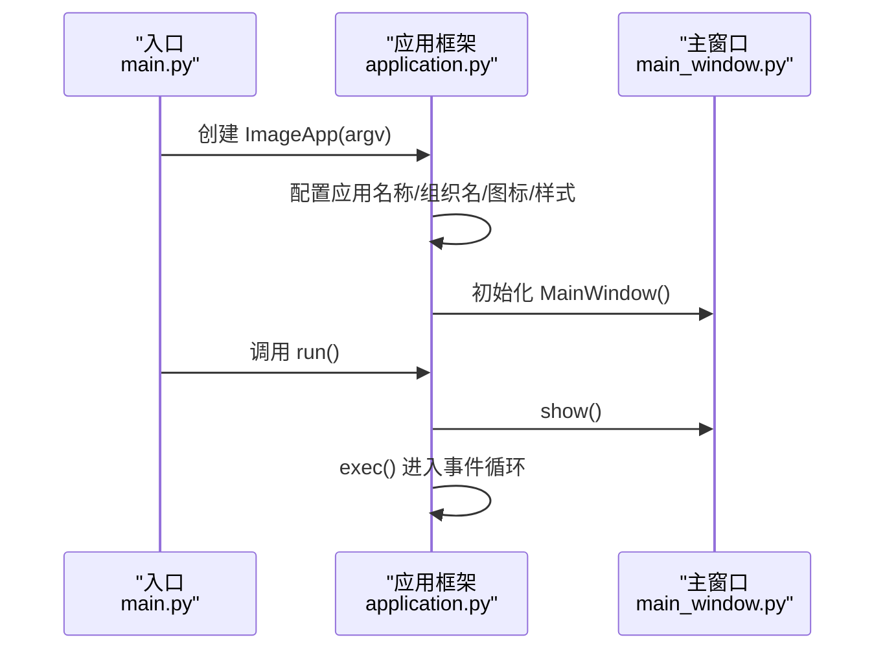
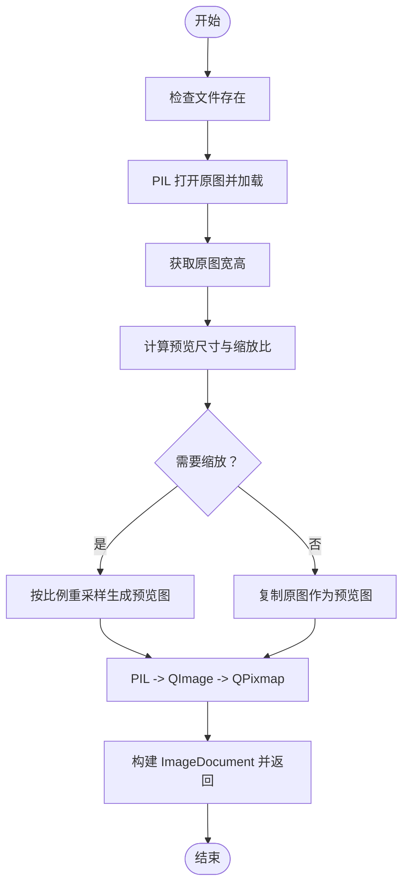
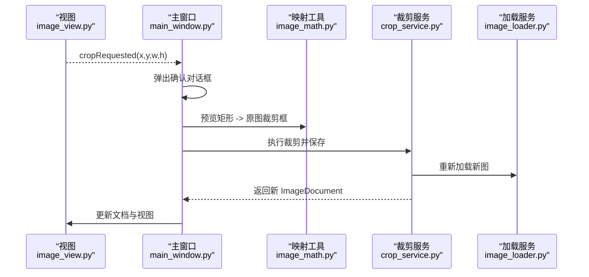
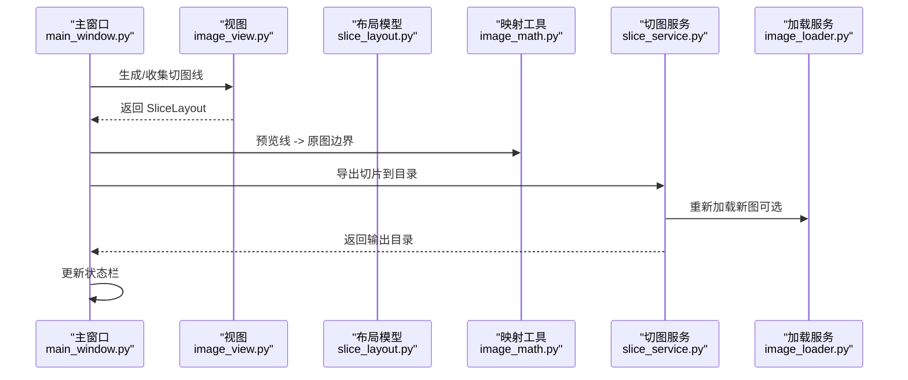
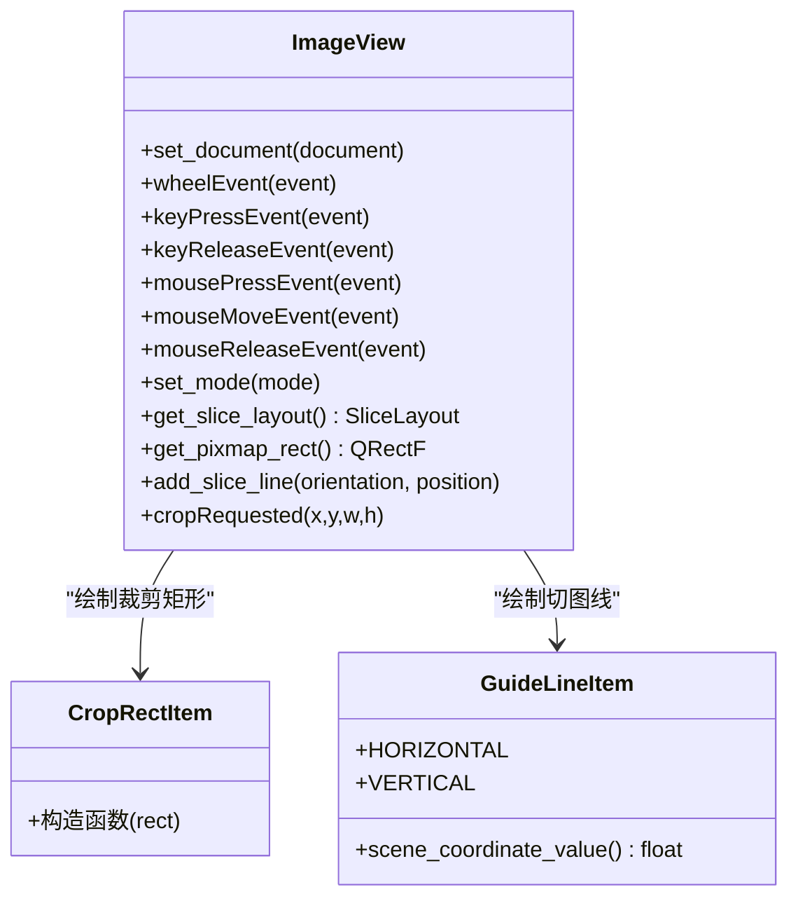
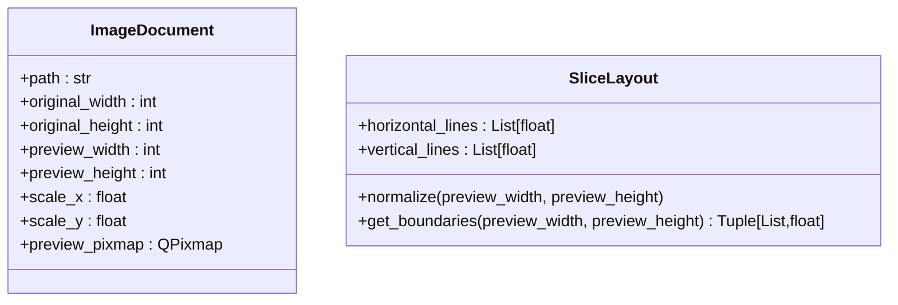
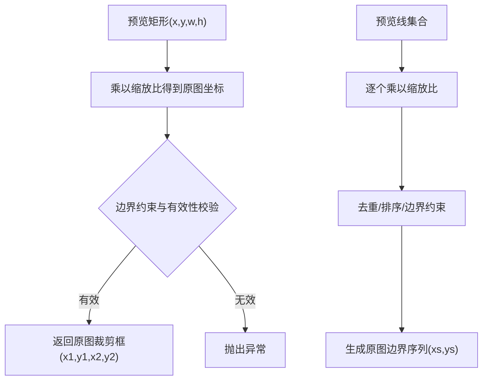
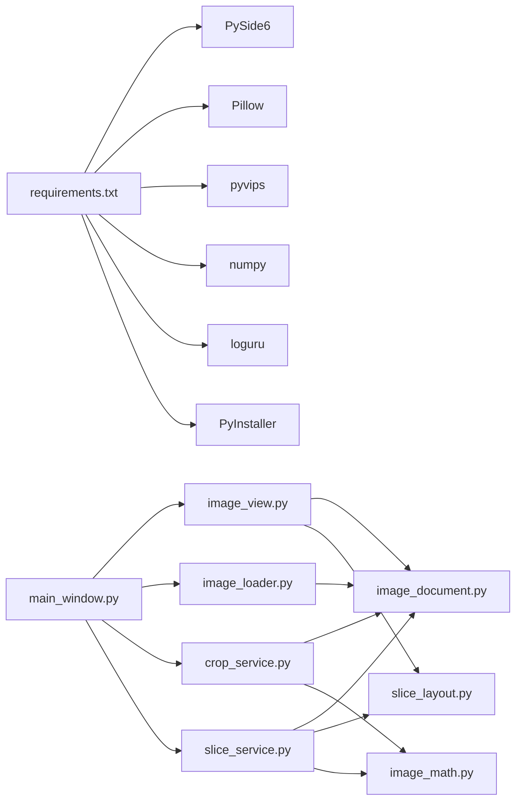

# 项目概述

<cite>
**本文引用的文件**
- [main.py](file://img_slicer_tool/main.py)
- [application.py](file://img_slicer_tool/app/application.py)
- [main_window.py](file://img_slicer_tool/app/main_window.py)
- [image_view.py](file://img_slicer_tool/views/image_view.py)
- [overlay_items.py](file://img_slicer_tool/views/overlay_items.py)
- [image_document.py](file://img_slicer_tool/models/image_document.py)
- [slice_layout.py](file://img_slicer_tool/models/slice_layout.py)
- [image_loader.py](file://img_slicer_tool/services/image_loader.py)
- [crop_service.py](file://img_slicer_tool/services/crop_service.py)
- [slice_service.py](file://img_slicer_tool/services/slice_service.py)
- [image_math.py](file://img_slicer_tool/utils/image_math.py)
- [logging_utils.py](file://img_slicer_tool/utils/logging_utils.py)
- [requirements.txt](file://img_slicer_tool/requirements.txt)
- [README.md](file://img_slicer_tool/README.md)
</cite>

## 目录
1. [引言](#引言)
2. [项目结构](#项目结构)
3. [核心组件](#核心组件)
4. [架构总览](#架构总览)
5. [详细组件分析](#详细组件分析)
6. [依赖关系分析](#依赖关系分析)
7. [性能考量](#性能考量)
8. [故障排查指南](#故障排查指南)
9. [结论](#结论)
10. [附录](#附录)

## 引言
PictureMaster 是一款基于 PySide6 的桌面图像处理工具，专注于满足 UI 设计师与开发者在大图浏览、区域裁剪与宫格切图方面的高频需求。其核心定位是：
- 大尺寸图像加载与预览：通过预览图策略降低内存占用，同时保留原图尺寸信息，支持缩放与平移浏览。
- 区域裁剪：在预览坐标系中进行拖拽选择，自动换算到原图像素坐标，支持覆盖原图或另存为。
- 宫格切图：在预览图上绘制水平/垂直辅助线，自动生成规则网格，导出为多块切片。
- 可扩展性：底层采用模块化设计，便于引入 pyvips 等高性能图像库以进一步优化大图性能。

本项目面向以下用户场景：
- UI 设计师：快速浏览与裁剪大图素材，生成切图资源。
- 前端/游戏美术：批量导出宫格切片，适配动画帧或 UI 组件。
- 开发者：自动化处理流程，统一导出规范。

## 项目结构
项目采用“分层+功能模块”相结合的组织方式：
- 应用入口与框架层：main.py、app/application.py、app/main_window.py
- 视图层：views/image_view.py、views/overlay_items.py
- 模型层：models/image_document.py、models/slice_layout.py
- 服务层：services/image_loader.py、services/crop_service.py、services/slice_service.py
- 工具层：utils/image_math.py、utils/logging_utils.py
- 依赖与说明：requirements.txt、README.md

图表来源
- [main.py](file://img_slicer_tool/main.py#L1-L13)
- [application.py](file://img_slicer_tool/app/application.py#L1-L35)
- [main_window.py](file://img_slicer_tool/app/main_window.py#L1-L262)
- [image_view.py](file://img_slicer_tool/views/image_view.py#L1-L218)
- [overlay_items.py](file://img_slicer_tool/views/overlay_items.py#L1-L57)
- [image_document.py](file://img_slicer_tool/models/image_document.py#L1-L18)
- [slice_layout.py](file://img_slicer_tool/models/slice_layout.py#L1-L30)
- [image_loader.py](file://img_slicer_tool/services/image_loader.py#L1-L68)
- [crop_service.py](file://img_slicer_tool/services/crop_service.py#L1-L38)
- [slice_service.py](file://img_slicer_tool/services/slice_service.py#L1-L62)
- [image_math.py](file://img_slicer_tool/utils/image_math.py#L1-L76)
- [logging_utils.py](file://img_slicer_tool/utils/logging_utils.py#L1-L6)

章节来源
- [README.md](file://img_slicer_tool/README.md#L1-L10)
- [requirements.txt](file://img_slicer_tool/requirements.txt#L1-L14)

## 核心组件
- 应用入口与启动流程：main.py 调用 app/application.py 中的 ImageApp，初始化 QApplication、主窗口与样式/图标配置，最终进入事件循环。
- 主窗口与交互：app/main_window.py 提供菜单、动作与状态栏，负责打开图片、切换裁剪/切图模式、生成宫格线、执行切图与裁剪。
- 图像视图与交互：views/image_view.py 基于 QGraphicsView/QGraphicsScene 承载预览图，实现缩放（Ctrl+滚轮）、平移（空格+拖拽）、裁剪矩形绘制与切图线管理。
- 数据模型：models/image_document.py 描述图像元数据与预览图；models/slice_layout.py 管理预览坐标系下的切图线集合。
- 图像加载与转换：services/image_loader.py 将原图转为预览图，计算缩放比例，封装为 ImageDocument。
- 裁剪与切图服务：services/crop_service.py 将预览矩形映射到原图像素并保存新图；services/slice_service.py 将预览线转换为原图边界并导出切片。
- 数学映射工具：utils/image_math.py 提供预览坐标到原图坐标的换算，保证裁剪与切图的精度。
- 日志：utils/logging_utils.py 使用 loguru 输出日志到本地文件。

章节来源
- [main.py](file://img_slicer_tool/main.py#L1-L13)
- [application.py](file://img_slicer_tool/app/application.py#L1-L35)
- [main_window.py](file://img_slicer_tool/app/main_window.py#L1-L262)
- [image_view.py](file://img_slicer_tool/views/image_view.py#L1-L218)
- [overlay_items.py](file://img_slicer_tool/views/overlay_items.py#L1-L57)
- [image_document.py](file://img_slicer_tool/models/image_document.py#L1-L18)
- [slice_layout.py](file://img_slicer_tool/models/slice_layout.py#L1-L30)
- [image_loader.py](file://img_slicer_tool/services/image_loader.py#L1-L68)
- [crop_service.py](file://img_slicer_tool/services/crop_service.py#L1-L38)
- [slice_service.py](file://img_slicer_tool/services/slice_service.py#L1-L62)
- [image_math.py](file://img_slicer_tool/utils/image_math.py#L1-L76)
- [logging_utils.py](file://img_slicer_tool/utils/logging_utils.py#L1-L6)

## 架构总览
系统采用典型的 MVC 分层与事件驱动交互：
- 视图层（QGraphicsView/QGraphicsScene）承载图像与交互元素（裁剪矩形、宫格线）。
- 控制器（MainWindow）协调视图与服务层，处理用户操作与业务流程。
- 模型层（ImageDocument、SliceLayout）存储数据与状态。
- 服务层（image_loader、crop_service、slice_service）封装具体图像处理逻辑。
- 工具层（image_math、logging_utils）提供坐标换算与日志记录。

图表来源
- [main_window.py](file://img_slicer_tool/app/main_window.py#L1-L262)
- [image_view.py](file://img_slicer_tool/views/image_view.py#L1-L218)
- [image_loader.py](file://img_slicer_tool/services/image_loader.py#L1-L68)
- [crop_service.py](file://img_slicer_tool/services/crop_service.py#L1-L38)
- [slice_service.py](file://img_slicer_tool/services/slice_service.py#L1-L62)
- [image_document.py](file://img_slicer_tool/models/image_document.py#L1-L18)
- [slice_layout.py](file://img_slicer_tool/models/slice_layout.py#L1-L30)
- [image_math.py](file://img_slicer_tool/utils/image_math.py#L1-L76)
- [application.py](file://img_slicer_tool/app/application.py#L1-L35)
- [logging_utils.py](file://img_slicer_tool/utils/logging_utils.py#L1-L6)

## 详细组件分析

### 应用启动流程（main.py → application.py → main_window.py）
- 入口函数创建 ImageApp 实例，传入命令行参数。
- ImageApp 初始化 QApplication、主窗口，并配置应用名称、组织名、图标与样式表。
- 运行时显示主窗口并进入事件循环，等待用户交互。

图表来源
- [main.py](file://img_slicer_tool/main.py#L1-L13)
- [application.py](file://img_slicer_tool/app/application.py#L1-L35)
- [main_window.py](file://img_slicer_tool/app/main_window.py#L1-L262)

章节来源
- [main.py](file://img_slicer_tool/main.py#L1-L13)
- [application.py](file://img_slicer_tool/app/application.py#L1-L35)

### 图像加载与预览（image_loader.py）
- 读取原图尺寸，计算预览尺寸与缩放比，避免超大图像直接渲染。
- 将 PIL 图像转换为 QImage/QPixmap，封装为 ImageDocument 返回。
- 预览尺寸上限常量控制内存占用与渲染性能。

图表来源
- [image_loader.py](file://img_slicer_tool/services/image_loader.py#L1-L68)
- [image_document.py](file://img_slicer_tool/models/image_document.py#L1-L18)

章节来源
- [image_loader.py](file://img_slicer_tool/services/image_loader.py#L1-L68)
- [image_document.py](file://img_slicer_tool/models/image_document.py#L1-L18)

### 裁剪流程（main_window.py → crop_service.py → image_loader.py）
- 在 ImageView 上绘制裁剪矩形，触发 cropRequested 信号。
- MainWindow 接收信号，弹出确认对话框，选择覆盖原图或另存为。
- 通过 image_math 将预览矩形映射到原图像素坐标，调用 crop_service 保存新图。
- 成功后重新加载新图并更新视图。

图表来源
- [main_window.py](file://img_slicer_tool/app/main_window.py#L1-L262)
- [image_view.py](file://img_slicer_tool/views/image_view.py#L1-L218)
- [image_math.py](file://img_slicer_tool/utils/image_math.py#L1-L76)
- [crop_service.py](file://img_slicer_tool/services/crop_service.py#L1-L38)
- [image_loader.py](file://img_slicer_tool/services/image_loader.py#L1-L68)

章节来源
- [main_window.py](file://img_slicer_tool/app/main_window.py#L1-L262)
- [crop_service.py](file://img_slicer_tool/services/crop_service.py#L1-L38)
- [image_math.py](file://img_slicer_tool/utils/image_math.py#L1-L76)

### 宫格切图流程（main_window.py → slice_service.py → image_loader.py）
- 切图模式下，用户在预览图上绘制水平/垂直辅助线，或通过行列数生成网格。
- MainWindow 收集切图线，转换为 SliceLayout，再由 slice_service 计算原图边界并导出切片。
- 输出目录按原图名建立子目录，按行列编号命名切片文件。

图表来源
- [main_window.py](file://img_slicer_tool/app/main_window.py#L1-L262)
- [image_view.py](file://img_slicer_tool/views/image_view.py#L1-L218)
- [slice_layout.py](file://img_slicer_tool/models/slice_layout.py#L1-L30)
- [image_math.py](file://img_slicer_tool/utils/image_math.py#L1-L76)
- [slice_service.py](file://img_slicer_tool/services/slice_service.py#L1-L62)
- [image_loader.py](file://img_slicer_tool/services/image_loader.py#L1-L68)

章节来源
- [main_window.py](file://img_slicer_tool/app/main_window.py#L1-L262)
- [slice_service.py](file://img_slicer_tool/services/slice_service.py#L1-L62)
- [slice_layout.py](file://img_slicer_tool/models/slice_layout.py#L1-L30)
- [image_math.py](file://img_slicer_tool/utils/image_math.py#L1-L76)

### 视图与交互（image_view.py + overlay_items.py）
- ImageView 基于 QGraphicsView/QGraphicsScene，支持：
  - 缩放：Ctrl+滚轮改变缩放倍率。
  - 平移：空格键按下后可拖拽平移。
  - 裁剪：左键拖拽绘制半透明矩形，释放后触发裁剪请求。
  - 切图：在预览图上点击生成水平/垂直辅助线，支持 Shift/Ctrl 组合控制方向。
- OverlayItems 提供裁剪矩形与红色虚线辅助线，支持移动与删除。

图表来源
- [image_view.py](file://img_slicer_tool/views/image_view.py#L1-L218)
- [overlay_items.py](file://img_slicer_tool/views/overlay_items.py#L1-L57)

章节来源
- [image_view.py](file://img_slicer_tool/views/image_view.py#L1-L218)
- [overlay_items.py](file://img_slicer_tool/views/overlay_items.py#L1-L57)

### 数据模型（image_document.py + slice_layout.py）
- ImageDocument：封装原图路径、尺寸、预览尺寸、缩放比与预览图对象。
- SliceLayout：维护预览坐标系下的水平/垂直辅助线，提供归一化与边界生成方法。

图表来源
- [image_document.py](file://img_slicer_tool/models/image_document.py#L1-L18)
- [slice_layout.py](file://img_slicer_tool/models/slice_layout.py#L1-L30)

章节来源
- [image_document.py](file://img_slicer_tool/models/image_document.py#L1-L18)
- [slice_layout.py](file://img_slicer_tool/models/slice_layout.py#L1-L30)

### 数学映射与坐标换算（image_math.py）
- 预览矩形到原图裁剪框：根据 scale_x/scale_y 将预览坐标换算为原图像素坐标，并做边界约束。
- 预览线到原图边界：将水平/垂直辅助线转换为原图边界坐标序列，生成二维网格。

图表来源
- [image_math.py](file://img_slicer_tool/utils/image_math.py#L1-L76)
- [image_document.py](file://img_slicer_tool/models/image_document.py#L1-L18)

章节来源
- [image_math.py](file://img_slicer_tool/utils/image_math.py#L1-L76)

## 依赖关系分析
- 关键外部依赖：
  - PySide6：GUI 框架与图形视图。
  - Pillow：图像读取、重采样与保存。
  - pyvips：未来用于大图高性能处理（当前已安装，未在核心流程中直接使用）。
  - numpy：与 pyvips 配合使用。
  - loguru：日志记录。
  - PyInstaller：打包工具。
- 内部模块耦合：
  - main_window.py 依赖视图、服务与模型模块，承担业务编排职责。
  - image_view.py 仅依赖模型与视图覆盖项，保持较低耦合。
  - image_loader/crop_service/slice_service 依赖 PIL 与模型，职责清晰。
  - image_math 仅依赖模型，提供纯函数式映射。

图表来源
- [requirements.txt](file://img_slicer_tool/requirements.txt#L1-L14)
- [main_window.py](file://img_slicer_tool/app/main_window.py#L1-L262)
- [image_view.py](file://img_slicer_tool/views/image_view.py#L1-L218)
- [image_loader.py](file://img_slicer_tool/services/image_loader.py#L1-L68)
- [crop_service.py](file://img_slicer_tool/services/crop_service.py#L1-L38)
- [slice_service.py](file://img_slicer_tool/services/slice_service.py#L1-L62)
- [image_document.py](file://img_slicer_tool/models/image_document.py#L1-L18)
- [slice_layout.py](file://img_slicer_tool/models/slice_layout.py#L1-L30)
- [image_math.py](file://img_slicer_tool/utils/image_math.py#L1-L76)

章节来源
- [requirements.txt](file://img_slicer_tool/requirements.txt#L1-L14)

## 性能考量
- 预览图策略：通过限制最大预览尺寸，显著降低内存占用与渲染压力，适用于大图浏览。
- 缩放与平移：基于 QGraphicsView 的变换锚点与智能视口更新，保证交互流畅。
- 裁剪与切图：基于 PIL 的像素级操作，导出时针对 JPEG 设置质量参数以平衡体积与质量。
- 未来优化方向：
  - 引入 pyvips：利用其内存映射与高效滤波能力，进一步提升大图加载与处理性能。
  - 多线程异步：将耗时的图像处理放入后台线程，避免阻塞 UI。
  - 渐进式渲染：对超大图采用分块渲染与缓存策略。

[本节为通用性能建议，不直接分析具体文件]

## 故障排查指南
- 图像加载失败
  - 现象：打开图片时报错或无响应。
  - 排查：确认文件存在与格式受支持；查看状态栏错误提示；检查 Pillow 安装。
  - 相关实现参考：[main_window.py](file://img_slicer_tool/app/main_window.py#L88-L109)、[image_loader.py](file://img_slicer_tool/services/image_loader.py#L24-L54)
- 裁剪失败
  - 现象：裁剪后保存失败或新图无法加载。
  - 排查：确认目标路径可写；检查裁剪框有效性；查看异常信息。
  - 相关实现参考：[main_window.py](file://img_slicer_tool/app/main_window.py#L110-L167)、[crop_service.py](file://img_slicer_tool/services/crop_service.py#L13-L38)
- 切图失败
  - 现象：导出切片报错或输出目录为空。
  - 排查：确认已设置切图输出根目录；检查辅助线数量与有效性；查看异常信息。
  - 相关实现参考：[main_window.py](file://img_slicer_tool/app/main_window.py#L230-L262)、[slice_service.py](file://img_slicer_tool/services/slice_service.py#L12-L62)
- 日志定位问题
  - 使用 loguru 输出本地日志文件，便于追踪异常与性能瓶颈。
  - 相关实现参考：[logging_utils.py](file://img_slicer_tool/utils/logging_utils.py#L1-L6)

章节来源
- [main_window.py](file://img_slicer_tool/app/main_window.py#L88-L167)
- [main_window.py](file://img_slicer_tool/app/main_window.py#L230-L262)
- [image_loader.py](file://img_slicer_tool/services/image_loader.py#L24-L54)
- [crop_service.py](file://img_slicer_tool/services/crop_service.py#L13-L38)
- [slice_service.py](file://img_slicer_tool/services/slice_service.py#L12-L62)
- [logging_utils.py](file://img_slicer_tool/utils/logging_utils.py#L1-L6)

## 结论
PictureMaster 以清晰的分层架构与模块化设计，实现了大图预览、缩放平移、区域裁剪与宫格切图等核心功能。通过预览图策略与 Qt 图形视图体系，兼顾了易用性与性能。未来可在现有基础上引入 pyvips 等高性能库，进一步优化大图处理体验。对于 UI 设计师与开发者而言，该项目提供了稳定、可扩展的图像处理工具基础。

[本节为总结性内容，不直接分析具体文件]

## 附录
- 快速上手
  - 安装依赖：参见 requirements.txt。
  - 运行应用：执行入口脚本，打开图片后即可使用裁剪与切图功能。
- 设计目标与扩展方向
  - 目标：提供轻量、直观的大图处理工具，满足 UI/前端日常需求。
  - 扩展：引入 pyvips、多线程处理、渐进式渲染、更多导出格式与批处理能力。

章节来源
- [requirements.txt](file://img_slicer_tool/requirements.txt#L1-L14)
- [README.md](file://img_slicer_tool/README.md#L1-L10)